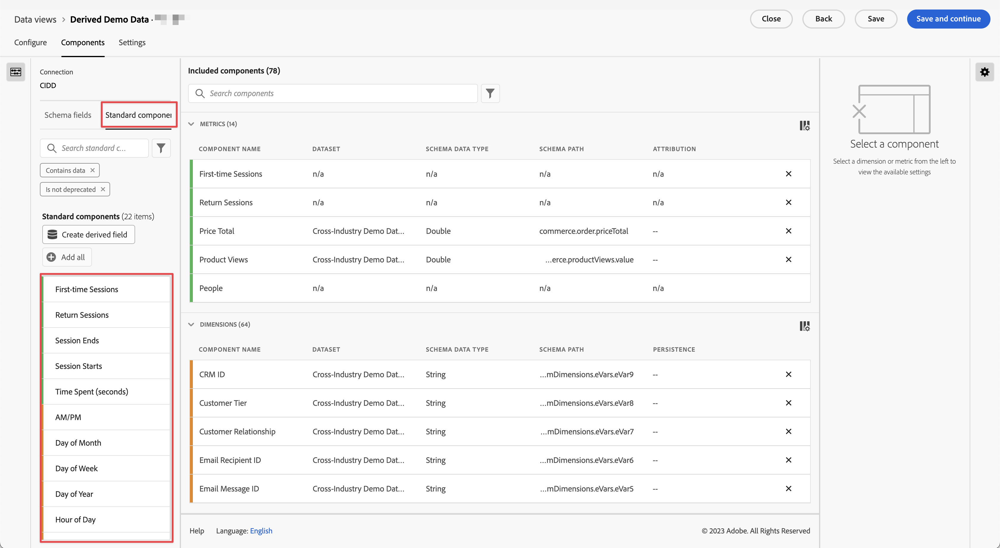

# Standaardcomponentverwijzing

De meeste dimensies en metriek in Customer Journey Analytics zijn gebaseerd op schema-elementen uit uw dataset van Adobe Experience Platform. Er zijn echter verschillende componenten beschikbaar om aan een gegevensweergave toe te voegen, ongeacht de verbinding die u gebruikt.

[!UICONTROL Standard components] zijn componenten die niet uit de gebieden van het datasetschema worden geproduceerd maar in plaats daarvan systeem geproduceerd. Sommige systeemonderdelen zijn vereist om de rapportagemogelijkheden in Analysis Workspace te vergemakkelijken, terwijl andere systeemonderdelen optioneel zijn.

## Vereiste standaardonderdelen {#required}

Deze vereiste standaardcomponenten worden standaard toegevoegd aan elke gegevensweergave. Ze zijn essentieel voor de rapportagemogelijkheden die Customer Journey Analytics biedt.

| Componentnaam | Dimension of Metric | Notities |
| --- | --- | --- |
| [!UICONTROL People] | Metrisch | Gebaseerd op de persoon-id die is opgegeven in een [!UICONTROL Connection] . |
| [!UICONTROL Accounts] | Metrisch | Gebaseerd op de account-id die is opgegeven in een [!UICONTROL Connection] . |
| [!UICONTROL Global Accounts] | Metrisch | Gebaseerd op de globale die Rekeningen ID in [!UICONTROL Connection] wordt gespecificeerd. |
| [!UICONTROL Opportunity] | Metrisch | De mogelijkheden, die op identiteitskaart van de Kanans worden gebaseerd die in [!UICONTROL Connection] wordt gespecificeerd. |
| [!UICONTROL Buying Group] | Metrisch | De inkoopgroepen, op basis van de groep-id voor kopen die is opgegeven in de [!UICONTROL Connection] . |
| [!UICONTROL Sessions] | Metrisch | Gebaseerd op de de zittingsmontages van de gegevensmening. |
| [!UICONTROL Events] | Metrisch | Het aantal rijen van alle gebeurtenisdatasets in a [!UICONTROL Connection]. |
| [!UICONTROL Seconds] | Dimension | Het tweede dat een bepaalde gebeurtenis plaatsvond (naar beneden afgerond). Het eerste dimensie-item is de eerste seconde in het datumbereik en het laatste dimensie-item is de laatste seconde in het datumbereik. |
| [!UICONTROL Minute] | Dimension | De minuut dat een bepaalde gebeurtenis heeft plaatsgevonden (naar beneden afgerond). Het eerste afmetingspunt is de eerste minuut in de datumwaaier, en het laatste afmetingspunt is de laatste minuut in de datumwaaier. |
| [!UICONTROL Hour] | Dimension | Het uur dat een bepaalde gebeurtenis heeft plaatsgevonden (naar beneden afgerond). Het eerste afmetingspunt is het eerste uur in de datumwaaier, en het laatste afmetingspunt is het laatste uur in de datumwaaier. |
| [!UICONTROL Day] | Dimension | De dag waarop een bepaalde gebeurtenis plaatsvond. Het eerste afmetingspunt is de eerste dag in de datumwaaier, en het laatste afmetingspunt is de laatste dag in de datumwaaier. |
| [!UICONTROL Week] | Dimension | De week waarin een bepaalde gebeurtenis plaatsvond. Het eerste dimensie-item is de eerste week in het datumbereik en het laatste dimensie-item is de laatste week in het datumbereik. |
| [!UICONTROL Month] | Dimension | De maand waarin een bepaalde gebeurtenis heeft plaatsgevonden. Het eerste afmetingspunt is de eerste maand in de datumwaaier, en het laatste afmetingspunt is de laatste maand in de datumwaaier. |
| [!UICONTROL Quarter] | Dimension | Het kwart dat een bepaalde gebeurtenis heeft plaatsgevonden. De post van de eerste dimensie is het eerste kwartaal in het datumbereik, en de laatste dimensie is het laatste kwartaal in het datumbereik. |
| [!UICONTROL Year] | Dimension | Het jaar waarin een bepaalde gebeurtenis plaatsvond. De eerste dimensie-post is het eerste jaar in het datumbereik, en de laatste dimensie-post is het meest recente jaar in het datumbereik. |
| [!UICONTROL Session Starts] | Metrisch | Het aantal gebeurtenissen dat de eerste gebeurtenis van een sessie was. Wanneer gebruikt in een segmentdefinitie (bijvoorbeeld, &quot;[!UICONTROL Session Starts] bestaat&quot;), segmenteert het neer aan enkel de eerste gebeurtenis van elke zitting.
Deze component moet in uw gegevensmening voor het volgende [ berekende metrisch ](/help/components/calc-metrics/default-calcmetrics.md) worden omvat om in Workspace beschikbaar te zijn: <ul><li>Beginsnelheid van sessie</li>
 |
| [!UICONTROL Session Ends] | Metrisch | Het aantal gebeurtenissen dat de laatste gebeurtenis van een sessie was. Net als [!UICONTROL Session Starts] kan de klasse ook worden gebruikt in een segmentdefinitie om items tot aan de laatste gebeurtenis van elke sessie te segmenteren.
Deze component moet in uw gegevensmening voor het volgende [ berekende metrisch ](/help/components/calc-metrics/default-calcmetrics.md) worden omvat om in Workspace beschikbaar te zijn: <ul><li>Eindfrequentie sessie</li>
 |
| [!UICONTROL Time Spent (seconds)] | Metrisch | Hiermee wordt de tijd tussen twee verschillende waarden voor een dimensie samengevat.
Deze component moet in uw gegevensmening voor de volgende [ berekende metriek ](/help/components/calc-metrics/default-calcmetrics.md) worden omvat om in Workspace beschikbaar te zijn: <ul><li>Tijd besteed per persoon</li><li>Tijd besteed per sessie</li>
 |

{style="table-layout:auto"}

## Optionele standaardonderdelen {#optional}

Optionele standaardcomponenten zijn beschikbaar via **[!UICONTROL Data views]** > **[!UICONTROL Edit data view]** > **[!UICONTROL Components]** tab > **[!UICONTROL Standard Components]** tab.

| Componentnaam | Dimension of Metric | Notities en waarden |
| --- | --- | --- |
| [!UICONTROL AM/PM] | Afmeting van tijd-paring | AM of PM |
| [!UICONTROL Batch ID] | Dimension | Vertegenwoordigt de Experience Platform-batch waarvan een [!UICONTROL Event] deel uitmaakte. |
| [!UICONTROL Dataset ID] | Dimension | Vertegenwoordigt de Experience Platform-gegevensset waarvan een [!UICONTROL Event] deel uitmaakte. |
| [!UICONTROL Day of Month] | Afmeting van tijd-paring | 1-31 |
| [!UICONTROL Day of Week] | Afmeting van tijd-paring | Maandag, dinsdag, woensdag, donderdag, vrijdag, zaterdag, zondag |
| [!UICONTROL Day of Year] | Afmeting van tijd-paring | 1-366 |
| [!UICONTROL Hour of Day] | Afmeting van tijd-paring | 0-23 |
| [!UICONTROL  Month of Year] | Afmeting van tijd-paring | Januari - december |
| [!UICONTROL First-time Sessions] | Metrisch | De eerste sessie van een persoon is gedefinieerd in het rapportagevenster. [Meer informatie](https://experienceleague.adobe.com/docs/analytics-platform/using/cja-dataviews/data-views-usecases.html#new-repeat) |
| [!UICONTROL Return Sessions] | Metrisch | Het aantal sessies dat niet de eerste sessie van een persoon was. [Meer informatie](https://experienceleague.adobe.com/docs/analytics-platform/using/cja-dataviews/data-views-usecases.html#new-repeat) |
| [!UICONTROL Person ID] | Dimension | Voor elk gegevenssetschema dat in de Experience Platform is gedefinieerd, kan een eigen set met een of meer identiteiten zijn gedefinieerd en gekoppeld aan een naamruimte. Elk van deze identiteiten kan worden gebruikt als de persoon-id. Voorbeelden zijn Cookie-id, Stitched ID, Gebruikersnaam, Trackingcode enzovoort. De [!UICONTROL Person ID] -dimensie is de basis voor het combineren van gegevenssets en het identificeren van unieke personen in Customer Journey Analytics.
Mogelijke gebruiksgevallen zijn:<ul><li>Creërend een segment op een specifieke waarde van persoonidentiteitskaart om alles neer aan het gedrag van die gebruiker te segmenteren.</li><li>Foutopsporing: zorg dat de gegevens voor een specifieke cookie-id (of een specifieke klant-id) aanwezig zijn.</li><li>Het identificeren van de gebruikers die binnen aan een vraagcentrum riepen.</li></ul> |
| [!UICONTROL Person ID namespace] | Dimension | Welk type id de [!UICONTROL Person ID] bevat. Voorbeelden zijn: `email address` , `cookie ID` , `Analytics ID` |
| [!BADGE  B2B edition ]{type=Informative url="https://experienceleague.adobe.com/en/docs/analytics-platform/using/cja-overview/cja-b2b/cja-b2b-edition" newtab=true tooltip="Customer Journey Analytics B2B edition"}  [!UICONTROL Global Account ID] | Dimension | De lus [!UICONTROL Global Account ID] wanneer u de globale-accountcontainer in uw verbinding gebruikt. |
| [!BADGE  B2B edition ]{type=Informative url="https://experienceleague.adobe.com/en/docs/analytics-platform/using/cja-overview/cja-b2b/cja-b2b-edition" newtab=true tooltip="Customer Journey Analytics B2B edition"}  [!UICONTROL Account ID] | Dimension | De lus [!UICONTROL Account ID] wanneer u de container Account in uw verbinding gebruikt. |
| [!BADGE  B2B edition ]{type=Informative url="https://experienceleague.adobe.com/en/docs/analytics-platform/using/cja-overview/cja-b2b/cja-b2b-edition" newtab=true tooltip="Customer Journey Analytics B2B edition"}  [!UICONTROL Opportunity ID] | Dimension | De lus [!UICONTROL Opportunity ID] wanneer u de container Opportunity in uw verbinding gebruikt. |
| [!BADGE  B2B edition ]{type=Informative url="https://experienceleague.adobe.com/en/docs/analytics-platform/using/cja-overview/cja-b2b/cja-b2b-edition" newtab=true tooltip="Customer Journey Analytics B2B edition"}  [!UICONTROL Buying Group ID] | Dimension | De lus [!UICONTROL Buying Group ID] wanneer u de container voor de koopgroep gebruikt in de verbinding. |
| [!UICONTROL Quarter of Year] | Afmeting van tijd-paring | Q1, Q2, Q3, Q4 |
| [!UICONTROL Repeat session] | Metrisch | Het aantal sessies dat niet de eerste sessie van een persoon was. [Meer informatie](https://experienceleague.adobe.com/docs/analytics-platform/using/cja-dataviews/data-views-usecases.html#new-repeat) |
| [!UICONTROL Session Type] | Dimension | Deze dimensie heeft twee waarden: 1. [!UICONTROL First-Time] en 2. Terugsturen. Het [!UICONTROL First-time] lijn punt omvat al gedrag (metriek tegen deze dimensie) van een zitting die als bepaalde eerste zitting van een persoon is bepaald. Alle andere elementen worden opgenomen in het regelitem [!UICONTROL Returning] (ervan uitgaande dat alles tot een sessie behoort). Wanneer metriek geen deel uitmaken van een sessie, vallen ze voor deze dimensie in het emmertje &quot;Niet van toepassing&quot;. [Meer informatie](https://experienceleague.adobe.com/docs/analytics-platform/using/cja-dataviews/data-views-usecases.html#new-repeat) |
| [!UICONTROL Time Spent per Event] | Dimension | Sluit de metrische waarde [!UICONTROL Time Spent] in [!UICONTROL Event] emmers. |
| [!UICONTROL Time Spent per Session] | Dimension | Sluit de metrische waarde [!UICONTROL Time Spent] in [!UICONTROL Session] emmers. |
| [!UICONTROL Time Spent per Person] | Dimension | Sluit de metrische waarde [!UICONTROL Time Spent] in [!UICONTROL Person] emmers. |
| [!UICONTROL Weekend]/[!UICONTROL Weekday] | Afmeting van tijd-paring | Weekend of Weekdag |

{style="table-layout:auto"}
