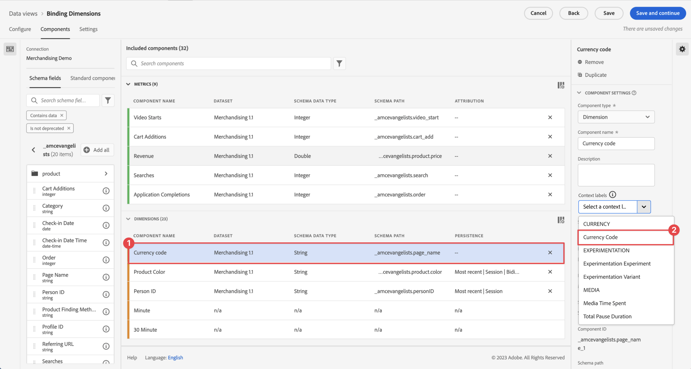

# Componentinstellingen opmaken

Met de indeling kunt u bepalen hoe een bepaalde metrische waarde wordt weergegeven.

| Instelling | Beschrijving |
| --- | --- |
| **[!UICONTROL Format]** | Hier kunt u de opmaak van een metrische waarde opgeven als Decimaal, Tijd, Percentage of Valuta. |
| **[!UICONTROL Decimal Places]** | Niet zichtbaar op de gegevenstypen van het schema van het Geheel. Hier kunt u het aantal decimalen opgeven dat metrisch wordt weergegeven. |
| **[!UICONTROL Date]** | Hiermee kunt u bepalen hoe het datum-tijdveld moet worden weergegeven wanneer dit als een dimensie in de rapportage wordt gebruikt. [Meer informatie](../../use-cases/data-views/data-views-usecases.md#date-and-date-time-use-cases) |
| **[!UICONTROL Date-Time]** | Hiermee kunt u bepalen hoe het datum-tijdveld moet worden weergegeven wanneer dit als een dimensie in de rapportage wordt gebruikt. [Meer informatie](../../use-cases/data-views/data-views-usecases.md#date-and-date-time-use-cases) |
| **[!UICONTROL Currency]** | Hiermee kunt u bepalen in welke valuta de metrische waarde moet worden weergegeven. Zie [Valuta](#currency) meer details . |
| **[!UICONTROL Show upward trend as]** | Hier kunt u opgeven of een opwaartse trend in deze metrische waarde goed (groen) of slecht (rood) is. |
| **[!UICONTROL True value]** en **[!UICONTROL False value]** | Alleen zichtbaar op gegevenstypen van een Booleaans schema. Hiermee kunt u het label van het dimensie-item aanpassen voor `true` en `false` waarden. |

{style="table-layout:auto"}

## Valuta

Wanneer u **[!UICONTROL Currency]** als de [!UICONTROL Format] voor metrisch, kunt u bepalen hoe te om valuta&#39;s te tonen en om te zetten.

### Valuta weergeven

Een valuta voor een metrisch object weergeven:

1. Voer het aantal **[!UICONTROL Decimal places]**.

2. Selecteer een valuta in het menu **[!UICONTROL Display currency in]** lijst.

### Valuta converteren en weergeven

[!BADGE Nieuwe functie]{type=Positive}

{{release-limited-testing-section}}

Om de omrekening van een valuta voor metrisch toe te laten:

- Opstelling uw verbinding van de Customer Journey Analytics om minstens één gebeurtenisdataset te bevatten die een dimensie van de muntcode voor elke gebeurtenis bevat die een valuta metrisch bevat. Voor deze dimensie van de valutacode wordt een alfabetische valutacode gebruikt die voldoet aan de [ISO 4217](https://www.iso.org/iso-4217-currency-codes.html) standaard voor de weergave van valuta&#39;s. Bijvoorbeeld USD voor $, EUR voor €, GBP voor £.

- U hebt (optioneel) het [!UICONTROL Currency Code] context label aan één of meerdere afmetingen die muntcodes bepalen beschikbaar in uw dataset.

  Als u de opdracht [!UICONTROL Currency Code] contextlabel, in de [!UICONTROL Components] tabblad van de gegevensweergave:

  <!---->

   1. Selecteer de dimensie in een van uw gegevenssets die de valutacodes bevat. Bijvoorbeeld, [!UICONTROL Currency code].

   2. Selecteren **[!UICONTROL Currency Code]** van de [!UICONTROL Context labels] lijst.

  Herhaal deze stappen als u meer dimensies met valutacodes hebt die u wilt gebruiken voor valutaconversie.

>[!NOTE]
>
>De metrische waarde die u selecteert voor valutaomzetting, moet een numeriek type hebben (Dubbel, Lang, Geheel getal, Kort, Byte).

U definieert als volgt hoe een valuta voor een metrische waarde moet worden omgezet en weergegeven:

1. Voer het aantal **[!UICONTROL Decimal places]**.

2. Selecteren **[!UICONTROL Convert Concurrency]**.

3. Op basis van het toegepaste contextlabel, de juiste afmeting van de **[!UICONTROL Currency code dimension]** lijst wordt automatisch geselecteerd. U kunt elke andere dimensie selecteren, inclusief de afmetingen waarop u het contextlabel voor de valutacode hebt toegepast.

4. Selecteer een valuta in het menu **[!UICONTROL Convert and display currency in]** lijst.

### Veelgestelde vragen

+++ Hoe wordt valutaomrekening uitgevoerd?

Op rapporttijd, wordt de waarde van de metrische en originele muntcode omgezet in USD en dan omgezet in de valuta die voor vertoning wordt gevormd. Voor deze omrekening worden de dagelijkse wisselkoersen gebruikt die op het tijdstip van de gebeurtenis van toepassing zijn.

+++

