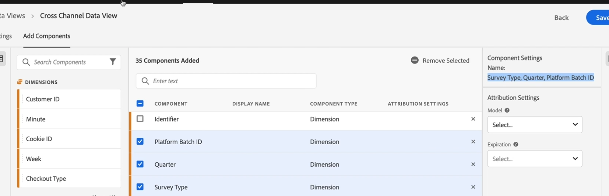

# Component- en attributie-instellingen

Vars, props en gebeurtenissen in de traditionele betekenis van Adobe Analytics bestaan niet meer in de Analyse van de Reis van de Klant. In plaats daarvan hebt u onbeperkte schema-elementen (afmetingen, metriek, lijstvelden). Alle attributie montages die u gebruikte om op eVars en steunen tijdens het proces van de gegevensinzameling van toepassing te zijn worden nu toegepast bij vraagtijd - die ook als rapport-tijd verwerking wordt bekend.

Klik [hier](https://docs.adobe.com/content/help/en/platform-learn/tutorials/cja/attribution-settings-in-data-views.html) voor een video-overzicht.

Houd dit in gedachten voordat u attributie-instellingen toepast:

* In de gebruikersinterface van gegevensweergaven geeft u de standaardtoewijzing op. **Opmerking**: Op een latere datum kunt u deze instellingen overschrijven in Workspace-projecten. Deze functionaliteit is momenteel echter niet beschikbaar.

* De montages van de attributie in de Analyse van de Reis van de Klant zijn niet-destructief en retroactief. Met andere woorden, u kunt geen onherstelbare schade aan uw datasets in de Analyse van de Reis van de Klant doen. Zelfs als u per ongeluk iets schrapt, kunt u altijd teruggaan naar het Platform van de Ervaring en de dataset terugbrengen binnen. (Houd er echter rekening mee dat extra kosten ontstaan wanneer de gegevensset weer wordt ingevoerd.)

* Als u een afmeting &quot;gedraagt&quot;als traditionele eVar (omzettingsvariabele) wilt hebben, zou u het met &quot;Last Touch Visit&quot;attributie door gebrek moeten vormen.

* Als u een dimensie &quot;gedraagt zich&quot;als traditionele (verkeersvariabele) wilt hebben, zou u het met &quot;Zelfde Aanraking&quot;attributie door gebrek moeten vormen.

* Als u wenst om metrisch &quot;gedrag&quot;als standaard metrisch te hebben, zou u niets moeten veranderen.

* Attributie-instellingen voor metriek overschrijven attributie-instellingen voor afmetingen.

## Componentinstellingen en attribuutinstellingen opgeven

Nadat u de instellingen [voor de gegevensweergave en toegevoegde componenten hebt](/help/data-views/create-dataview.md) ingesteld en opgeslagen, kunt u desgewenst toewijzingsinstellingen opgeven. U kunt de instellingen voor kenmerk/vervaldatum/terugzoekfunctie opgeven voor afmetingen en metriek. Als u bijvoorbeeld wilt dat een dimensie blijft bestaan, wilt u waarschijnlijk een aangepaste vervaltijd instellen. Als u bijvoorbeeld wilt dat de afmeting &#39;Tracking code&#39; (een campagnevariabele) wordt ingesteld op de kenmerk &#39;Last Touch&#39; voor een week behouden blijft, voegt u een aangepaste vervaldatum van 1 week toe.

>[!IMPORTANT]
>U kunt de toewijzing/vervaldatum niet instellen. In dat geval zullen de afmetingen zich gedragen als de punten (het &quot;Zelfde aanraakattributiemodel&quot;). Metriek zonder ingestelde attributie-instellingen nemen de instellingen over voor de dimensie waarop deze metrische waarde wordt toegepast.

1. Geef de component- en attributie-instellingen op voor afmetingen en metriek. Zie hieronder voor informatie over afzonderlijke instellingen.

1. Klik **[!UICONTROL Save]** om de gegevensweergave op te slaan.

### Componentinstelling

U kunt de naam van metrisch of afmeting veranderen in iets gebruikersvriendelijker. De onderliggende naam verandert niet, alleen de weergavenaam.

### Attributiemodel

Het model beschrijft de distributie van omzettingen in de gebeurtenissen in een groep. Bijvoorbeeld, eerste aanraking of laatste aanraking. Bepaalt hoe de Analyse van de Reis van de Klant krediet voor een succesgebeurtenis toewijst als een variabele veelvoudige waarden vóór de gebeurtenis ontvangt.

| UI-pictogram | Attributiemodel | Definitie | Wanneer gebruiken |
| --- | --- | --- | --- |
|  | Laatste aanraking | Geeft 100% krediet aan het aanraakpunt dat het laatst voor de conversie optrad. | Het eenvoudigste en meest gangbare attributiemodel. Het wordt vaak gebruikt voor omzettingen met een korte bezinningscyclus. Last Touch wordt vaak gebruikt door teams die marketingacties voor zoekopdrachten beheren of interne zoektrefwoorden analyseren. |
|  | Eerste aanraking | Biedt 100% krediet aan het aanraakpunt dat het eerst in het terugkijkvenster van de attributie wordt gezien. | Een ander algemeen attributiemodel dat nuttig is voor het analyseren van marketingkanalen die bedoeld zijn om merkbekendheid te geven of klanten aan te trekken. Het wordt vaak gebruikt door display- of sociale marketingteams, maar is ook ideaal voor het beoordelen van de doeltreffendheid van on-site productaanbevelingen. |
|  | Zelfde aanraking | Verleent 100% krediet aan de klap waar de omzetting plaatsvond. Als een aanraakpunt niet optreedt bij dezelfde druk als bij een conversie, wordt het item ingesloten onder &quot;Geen&quot;. | Een handig model bij het evalueren van de inhoud of gebruikerservaring die direct op het moment van de conversie werd gepresenteerd. Product- of ontwerpteams gebruiken dit model vaak om de doeltreffendheid van een pagina te beoordelen waar conversie plaatsvindt. |
|  | Lineair | Biedt hetzelfde krediet aan elk aanraakpunt dat wordt weergegeven voor een conversie. | Nuttig voor conversies met langere omrekeningscycli of gebruikerservaring die frequentere betrokkenheid van klanten vereisen. Het wordt vaak gebruikt door teams die de doeltreffendheid van meldingen voor mobiele apps meten of met producten op basis van abonnementen. |
|  | U-vorm | Biedt 40% krediet aan de eerste interactie, 40% aan de laatste interactie, en verdeelt de resterende 20% aan om het even welke aanraakpunten tussenin. Voor conversies met één aanraakpunt wordt 100% krediet gegeven. Voor conversies met twee aanraakpunten wordt aan beide een krediet van 50% toegekend. | Een goed model voor degenen die interacties waarderen die een omzetting introduceerden of gesloten, maar nog steeds hulpinteractie willen erkennen. De U-Vormen attributie wordt algemeen gebruikt door teams die een evenwichtigere benadering kiezen maar meer krediet aan kanalen willen geven die gevonden of gesloten een omzetting. |
|  | J-Shaped | Geeft 60% krediet aan de laatste interactie, 20% krediet aan de eerste interactie, en verdeelt de resterende 20% aan om het even welke aanraakpunten tussenin. Voor conversies met één aanraakpunt wordt 100% krediet gegeven. Voor conversies met twee aanraakpunten wordt 75% aan de laatste interactie besteed en wordt 25% aan de eerste. | Dit model is ideaal voor diegenen die aan vinders en sluiters voorrang geven, maar zich willen concentreren op het sluiten van interacties. De J-Vormen attributie wordt vaak gebruikt door teams die een evenwichtigere benadering kiezen en meer krediet aan kanalen willen geven die een omzetting sluiten. |
|  | Omgekeerd J | Biedt 60% krediet aan het eerste aanraakpunt, 20% aan het laatste aanraakpunt en verdeelt de resterende 20% aan de tussenliggende aanraakpunten. Voor conversies met één aanraakpunt wordt 100% krediet gegeven. Voor conversies met twee aanraakpunten wordt 75% aan de eerste interactie toegekend en wordt 25% aan de laatste toegekend. | Dit model is ideaal voor diegenen die prioriteit geven aan vinders en sluiters, maar zich willen richten op het zoeken naar interacties. De attributie Inverse J wordt gebruikt door teams die een evenwichtigere benadering kiezen en meer krediet willen geven aan kanalen die een omzetting in gang hebben gezet. |
|  | Aangepast | Hiermee kunt u de gewichten opgeven die u wilt geven aan de eerste aanraakpunten, de laatste aanraakpunten en de tussenliggende aanraakpunten. De opgegeven waarden worden genormaliseerd naar 100%, zelfs als de ingevoerde aangepaste getallen niet bij 100 komen te liggen. Voor conversies met één aanraakpunt wordt 100% krediet gegeven. Voor interactie met twee aanraakpunten wordt de middelste parameter genegeerd. De eerste en laatste aanraakpunten worden vervolgens genormaliseerd tot 100% en de kredieten worden dienovereenkomstig toegewezen. | Dit model is ideaal voor diegenen die volledige controle over hun attributiemodel willen en specifieke behoeften hebben die andere attributiemodellen niet vervullen. |
|  | Verval | Volgt en exponentieel verval met een aangepaste parameter voor de halfwaardetijd, waarbij de standaardwaarde 7 dagen is. Het gewicht van elk kanaal is afhankelijk van de hoeveelheid tijd die is verstreken tussen het starten van het aanraakpunt en de uiteindelijke conversie. De formule die wordt gebruikt om krediet te bepalen is `2``(-t/halflife)`, waarbij `t` de hoeveelheid tijd tussen een aanraakpunt en een conversie is. Alle aanraakpunten worden vervolgens genormaliseerd tot 100%. | Ideaal voor teams die regelmatig videoreclame of -markten uitvoeren tegen evenementen met een vooraf bepaalde datum. Hoe langer een conversie plaatsvindt na een marketinggebeurtenis, hoe minder krediet wordt gegeven. |
|  | Deelname | Biedt 100% krediet aan alle unieke aanraakpunten. Het totale aantal omzettingen wordt opgevoerd in vergelijking met andere attributiemodellen. De participatie dedupliceert kanalen die veelvoudige tijden worden gezien. | Uitstekend om te begrijpen wie vaak klanten worden blootgesteld aan een bepaalde interactie. Mediaorganisaties gebruiken dit model vaak om de snelheid van de inhoud te berekenen. De detailhandelorganisaties gebruiken vaak dit model om te begrijpen welke delen van hun plaats aan omzetting kritiek zijn. |

### Verlopen

Geeft een tijdsperiode op, of gebeurtenis, waarna de waarde van de dimensie vervalt (ontvangt geen krediet meer voor succesgebeurtenissen). U kunt het aflopen van de toewijzing instellen op de sessie, persoon of aangepast niveau.

| Instelling | Definitie |
|---|---|
| Sessie | Vroeger bekend als het &quot;Bezoek&quot;-niveau. Conversiegebeurtenissen buiten de paginaweergave of sessie worden niet gekoppeld aan de dimensie of de metrische waarde. |
| Persoon (rapportagevenster) | Vroeger bekend als het niveau van de &#39;bezoeker&#39;. Conversiegebeurtenissen die niet aan deze persoon zijn gekoppeld, worden niet aan de dimensie of metrisch gekoppeld. |
| Aangepaste tijd | Geef de aangepaste minuten, uren, dagen, maanden of kwartalen op. Conversiegebeurtenissen na de opgegeven tijdsperiode worden niet aan de dimensie of metrisch gekoppeld. |

Zie het [Attribution IQ-document](https://docs.adobe.com/content/help/en/analytics/analyze/analysis-workspace/panels/attribution/attribution.html)voor meer informatie.

### Venster Opzoeken

Een terugzoekvenster is de hoeveelheid tijd die een conversie moet terugkijken om aanraakpunten op te nemen. Attributiemodellen die meer krediet geven aan de eerste interacties zien grotere verschillen bij het weergeven van verschillende terugkijkvensters.

* **Sessie:** Zoekt terug naar het begin van een sessie waarbij een conversie plaatsvond. De terugkijkervensters van het bezoek zijn smal, aangezien zij niet voorbij de zitting kijken. De raadplegingsvensters van de zitting respecteren de gewijzigde bezoekdefinitie in gegevensmeningen.
* **Persoon (rapportagevenster):** In deze modus wordt tijdens alle sessies een back-up gemaakt tot de eerste van de maand van het huidige datumbereik. De kijkvensters van de persoon zijn breed, aangezien zij vele zittingen kunnen overspannen. Als het bereik van de rapportdatum bijvoorbeeld 15 september tot en met 30 september is, omvat het bereik van de persoonlijke terugzoekdatum 1 september tot en met 30 september.
