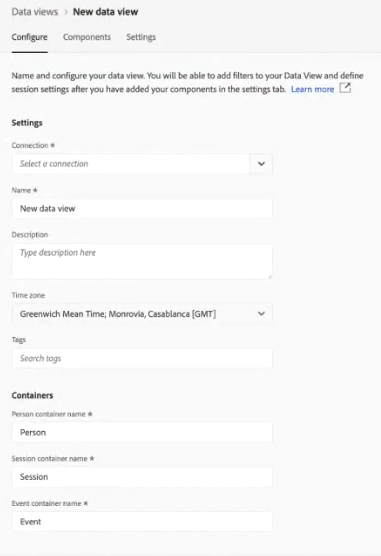
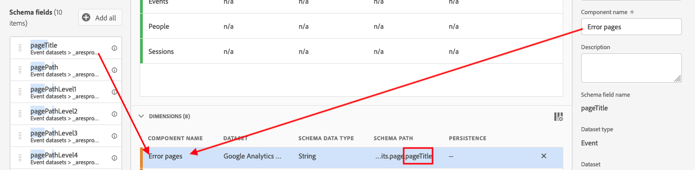
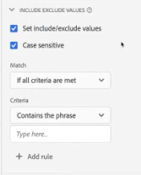
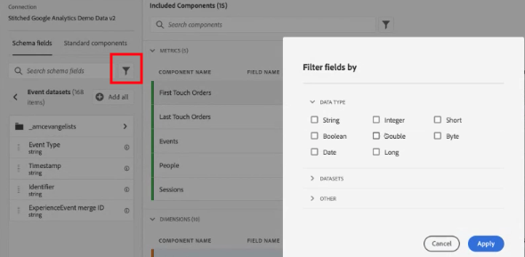

# Een nieuwe gegevensweergave maken

Het creëren van een gegevensmening impliceert of het creëren van metriek en dimensies van schemaelementen of het gebruiken van standaardcomponenten. Het creëren van metriek of dimensies geeft u een enorme hoeveelheid flexibiliteit. Eerder, was de veronderstelling dat als u datasets in Adobe Experience Platform had, de koordgebieden als afmetingen werden gebruikt en de numerieke gebieden als metriek werden gebruikt. Als u een van deze velden wilt wijzigen, moet u het schema in het Platform bewerken. De interface voor gegevensweergaven biedt nu een meer vrije definitie van metriek en dimensies](/help/data-views/data-views.md). [ Voor meer gebruiksgevallen, zie [De meningen van gegevens gebruiken gevallen](/help/data-views/data-views-usecases.md).

## 1. Instellingen en containers voor gegevensweergaven configureren

1. Ga in Customer Journey Analytics naar het tabblad **[!UICONTROL Data Views]**.
2. Klik **[!UICONTROL Add]** om een nieuwe gegevensmening tot stand te brengen en zijn montages te vormen.

| Instelling | Beschrijving/Hoofdletters gebruiken |
| --- | --- |
| [!UICONTROL Connection] | Dit veld koppelt de gegevensweergave aan de verbinding die u eerder hebt gemaakt en die een of meer Adobe Experience Platform-gegevenssets bevat. |
| [!UICONTROL Name] | Het is verplicht de gegevensweergave een naam te geven. |
| [!UICONTROL Description] | Een gedetailleerde beschrijving is niet verplicht, maar wordt aanbevolen. |
| [!UICONTROL Time zone] | Kies in welke tijdzone de gegevens moeten worden weergegeven. |
| [!UICONTROL Tags] | Met tags kunt u de gegevensweergaven indelen in categorieën. |
| [!UICONTROL Containers] | U kunt de naam van uw containers hier wijzigen. Dit is hoe deze worden weergegeven in elk Workspace-project dat is gebaseerd op deze gegevensweergave. Containers worden gebruikt in filters en fallout/flow, enz. om te bepalen hoe breed of smaller het bereik of de context is. [Meer informatie](https://experienceleague.adobe.com/docs/analytics-platform/using/cja-components/cja-filters/filters-overview.html?lang=en#filter-containers) |
| [!UICONTROL Person container name is…] | [!UICONTROL Person] (standaard). De container [!UICONTROL Person] bevat elk bezoek en elke paginaweergave voor bezoekers binnen een opgegeven tijdsperiode. U kunt de naam van dit item wijzigen in &#39;Gebruiker&#39; of elke andere gewenste term. |
| [!UICONTROL Session container name is…] | [!UICONTROL Session] (standaard). Met de container [!UICONTROL Session] kunt u paginainteracties, campagnes of conversies voor een specifieke sessie identificeren. U kunt de naam van dit bestand wijzigen in &#39;Visit&#39; of in een andere gewenste term. |
| [!UICONTROL Event container name is…] | [!UICONTROL Event] (standaard). De container [!UICONTROL Event] bepaalt welke paginagebeurtenissen u van een filter zou willen omvatten of uitsluiten. |

Vervolgens kunt u metriek en dimensies maken op basis van schema-elementen. U kunt ook Standaardcomponenten gebruiken.

## 2. Metriek en afmetingen maken op basis van schema-elementen

1. Klik in [!UICONTROL Customer Journey Analytics] > [!UICONTROL Data Views] op het tabblad [!UICONTROL Components].

U kunt [!UICONTROL Connection] bij de hoogste linkerzijde zien, die de datasets, en zijn [!UICONTROL Schema fields] hieronder bevat. Houd er rekening mee dat:

* De reeds inbegrepen componenten zijn de standaard vereiste componenten (systeem geproduceerd.)
* Ook past u het filter **[!UICONTROL Contains data]** standaard toe, zodat alleen Schema-velden met gegevens worden weergegeven. Als u een veld zoekt dat geen gegevens bevat, verwijdert u gewoon het filter.

1. Sleep nu een schemaveld, zoals [!UICONTROL pageTitle], van de linkerspoor naar de sectie Metriek of Dimension.

   U kunt het zelfde schemagebied in de dimensies of metrieksecties veelvoudige tijden slepen en de zelfde afmeting of metrisch op verschillende manieren vormen.
U kunt bijvoorbeeld in het veld **[!UICONTROL pageTitle]** een dimensie met de naam &quot;Productpagina&#39;s&quot; maken en een andere dimensie met de naam &quot;Foutpagina&#39;s&quot;, enzovoort, door de naam van de **[!UICONTROL Component Name]** aan de rechterkant te wijzigen. Vanaf **[!UICONTROL pageTitle]**; kunt u ook metriek maken op basis van een tekenreekswaarde. U kunt bijvoorbeeld een of meer **[!UICONTROL Orders]** metriek met verschillende attributie-instellingen en verschillende include/exclude-waarden maken.

   

   >[!NOTE]
   >
   >U kunt de mappen met schemavelden slepen vanuit de linkerrails en deze worden automatisch gesorteerd in traditionele secties. Tekenreeksvelden worden weergegeven in de sectie [!UICONTROL Dimensions] en cijfers in de sectie [!UICONTROL Metrics]. U kunt ook op **[!UICONTROL Add all]** klikken en alle schemavelden worden toegevoegd.

1. Als u de component hebt geselecteerd, ziet u rechts een aantal instellingen. Configureer de component met behulp van de hieronder beschreven instellingen.

### Componentinstellingen configureren

| Instelling | Beschrijving/Hoofdletters gebruiken |
| --- | --- |
| [!UICONTROL Component type] | Vereist. Hiermee kunt u een component wijzigen van Metrisch in Dimension of andersom. |
| [!UICONTROL Component Name] | Vereist. Hier geeft u de vriendschappelijke naam op die in Analysis Workspace wordt weergegeven. U kunt de naam van een component wijzigen en deze een naam geven die specifiek is voor de gegevensweergave. |
| [!UICONTROL Description] | Optioneel, maar aanbevolen, om informatie over de component aan andere gebruikers te verstrekken. |
| [!UICONTROL Tags] | Optioneel. Hiermee kunt u de component labelen met aangepaste of kant-en-klare tags, zodat u gemakkelijker kunt zoeken en filteren in de gebruikersinterface van Analysis Workspace. |
| [!UICONTROL Field Name] | De naam van het schemaveld. |
| [!UICONTROL Dataset type] | Vereist. Een niet-bewerkbaar veld dat aangeeft uit welk gegevenstype de component afkomstig is (gebeurtenis, zoekopdracht of profiel). |
| [!UICONTROL Dataset] | Vereist. Een niet-bewerkbaar veld dat aangeeft uit welk type veld de component afkomstig is (bijvoorbeeld String, Geheel getal, enz.). Dit veld kan meerdere gegevenssets bevatten. |
| [!UICONTROL Schema type] | Geeft aan of de component een tekenreeks, geheel getal, enzovoort is. |
| [!UICONTROL Component ID] | Vereist. De [CJA API](https://adobe.io/cja-apis/docs) gebruikt dit veld om naar de component te verwijzen. U kunt op het bewerkingspictogram klikken en deze component-id wijzigen. Als u deze component-id wijzigt, worden alle bestaande Workspace-projecten met deze component verbroken. Als u ooit een andere gegevensmening creeert die een verschillend gebied voor een pageTitle afmeting gebruikt, kunt u het anders noemen en de afmeting geschikt maken dwars-gegevensmening. |
| [!UICONTROL Path] | Vereist. Een niet-bewerkbaar veld met het schemapad waaruit de component afkomstig is. |
| [!UICONTROL Hide component in reporting] | Standaard = uit. Hiermee kunt u de component uit de gegevensweergave buigen wanneer deze wordt gebruikt bij rapportage. Dit beïnvloedt geen toestemmingen, enkel componentencuratie. Met andere woorden, u kunt de component voor niet-beheerders verbergen in de rapportage. Beheerders hebben er nog steeds toegang toe door in een Analysis Workspace-project op [!UICONTROL Show All Components] te klikken. |

### Indelingsinstellingen configureren

Indelingsinstellingen zijn alleen voor metriek.

| Instelling | Beschrijving/Hoofdletters gebruiken |
| --- | --- |
| [!UICONTROL Format] | Hier kunt u de opmaak van metrische waarden opgeven, zoals Decimaal, Tijd, Percentage of Valuta. |
| [!UICONTROL Decimal Places] | Hier geeft u het aantal decimalen op dat metrisch moet worden weergegeven. |
| [!UICONTROL Show upward trend as] | Hier kunt u opgeven of een opwaartse trend voor deze metrische waarde als goed (groen) of slecht (rood) moet worden beschouwd. |
| [!UICONTROL Currency] | Deze instelling wordt alleen weergegeven als de geselecteerde metrische indeling [!UICONTROL Currency] is. Er is een lijst met valutaopties beschikbaar. De standaardwaarde is geen valuta. Op deze manier kunt u inkomsten in de valuta van uw keuze voor rapportage weergeven. Dit is geen valutaconversie, alleen een opmaakoptie voor de gebruikersinterface. |

### Attributie-instellingen configureren

| Instelling | Beschrijving/Hoofdletters gebruiken |
| --- | --- |
| [!UICONTROL Set attribution] | Hier kunt u de toewijzingsinstellingen opgeven die u standaard op deze metrische waarde wilt toepassen wanneer deze wordt gebruikt. Dit gebrek kan in een Lijst worden met vrije vorm of in Berekend Metrisch met voeten getreden. |
| [!UICONTROL Attribution model] | Hier kunt u een standaard toewijzingsmodel opgeven. Dit is alleen actief wanneer u de instelling [!UICONTROL Use Non-default attribution model] inschakelt. Wordt standaard ingesteld op [!UICONTROL Last Touch]. De opties zijn: Laatste aanraking, Eerste aanraking, Lineair, Deelname, Zelfde aanraking, U-Vormen, J Curve, Omgekeerde J, Tijdvermindering, Douane, Algorithmic. Sommige van deze opties maken extra velden die moeten worden ingevuld, zoals Aangepast of Tijdverlies. U kunt veelvoudige metriek tot stand brengen gebruikend het zelfde gebied - dit betekent u één [!UICONTROL Last touch] omzet metrisch en één [!UICONTROL First Touch] opbrengst metrisch kunt hebben, maar gebaseerd op het zelfde opbrengstgebied in het schema. |
| [!UICONTROL Lookback window] | Hier kunt u een standaardterugzoekvenster opgeven dat metrisch is - alleen actief wanneer u de instelling [!UICONTROL Use Non-default attribution model] inschakelt. De opties zijn: Persoon (Meldend Venster), Zitting, Douane. Als Aangepast is geselecteerd, kunnen we ook een willekeurig aantal dagen/weken/maanden/enzovoort selecteren. (tot 90 dagen), net als Attribution IQ. U kunt veelvoudige metriek hebben gebruikend het zelfde schemagebied, maar elk met een afzonderlijk raadplegingsvenster. |

### Instellingen voor waarden opnemen/uitsluiten configureren

Met deze instelling kunt u de onderliggende gegevens wijzigen waarop u rapporteert, tijdens de query. Het is niet hetzelfde als een filter. Maar filters respecteren deze nieuwe dimensie, net als tekenen en attributie.

U kunt bijvoorbeeld een afmeting maken van het veld pageTitle, maar deze ook &#39;foutpagina&#39;s&#39; noemen en elke pagina opnemen die [!UICONTROL contains the phrase] &#39;error&#39; is.

| Instelling | Beschrijving/Hoofdletters gebruiken |
| --- | --- |
| [!UICONTROL Case sensitive] | Standaard = Aan. Deze instelling is alleen van toepassing op de sectie [!UICONTROL Include/Exclude Values]. Het staat u toe om te zeggen of omvat/sluit regel u toepast zou geval gevoelig moeten zijn. |
| [!UICONTROL Match] | Hier kunt u opgeven welke waarden u wilt gebruiken voor de rapportage voorafgaand aan de toewijzing en filters (bijvoorbeeld alleen waarden gebruiken die de uitdrukking &quot;fout&quot; bevatten). U kunt het volgende opgeven: **[!UICONTROL If all criteria are met]** of **[!UICONTROL If any criteria are met]**. |
| [!UICONTROL Criteria] | Hier geeft u de logica op die moet worden toegepast op een bepaalde filterregel.<ul><li>**Tekenreeks**: Bevat de uitdrukking, Bevat om het even welke termijn, Bevat alle termijnen, bevat geen termijn, bevat niet de uitdrukking, Gelijk, is niet gelijk, Begint met, Eind met</li><li>**Dubbel/geheel getal**: gelijk aan, niet gelijk aan, groter dan, kleiner dan, groter dan of gelijk aan, kleiner dan of gelijk aan</li><li>**Datum**: is gelijk aan, niet gelijk aan, is later dan, is eerder, komt voor binnen</li></ul> |
| [!UICONTROL Match operand] | Hier geeft u de overeenkomende operand op waarop de overeenkomende operator moet worden toegepast.<ul><li>**Tekenreeks**: Tekstveld</li><li>**Dubbel/geheel getal**: Tekstveld met pijl-omhoog/pijl-omlaag voor numerieke waarden</li><li>**Datum**: Selector voor daggranulariteit (kalender)</li><li>**Datum en tijd**: Selector voor granulariteit voor datum en tijd</li></ul> |
| [!UICONTROL Add rule] | Hier kunt u een extra match-operator en -operand opgeven. |

### Gedragsinstellingen configureren

| Instelling | Beschrijving/Hoofdletters gebruiken |
| --- | --- |
| [!UICONTROL Count instances] | Hier kunt u opgeven of een numeriek veld of een datumtekstveld dat als metrisch wordt gebruikt, de tijd moet tellen waarop het is ingesteld in plaats van de waarde zelf.  Als u de instanties van een numeriek veld wilt optellen en eenvoudig het aantal keren wilt optellen dat een veld is  ** ingesteld in plaats van de werkelijke binnenste waarde. Dit is bijvoorbeeld handig als u een  [!UICONTROL Orders] metrische waarde wilt maken op basis van een  [!UICONTROL Revenue] veld. Als de ontvangsten werden vastgesteld, dan willen wij één enkele orde eerder dan het numerieke opbrengstbedrag tellen. |

### [!UICONTROL No Value Options]-instellingen configureren

[!UICONTROL No Value Options] de instellingen zijn gelijk aan  [!UICONTROL Unspecified] of  [!UICONTROL None] waarden in de rapportage. In de interface van gegevensmeningen, op een component-door-component basis, kunt u beslissen hoe u deze waarden in rapportering wilt worden behandeld. U kunt de naam van [!UICONTROL No value] ook wijzigen in iets dat beter aansluit bij uw omgeving, zoals [!UICONTROL Null], [!UICONTROL Not set] of andere.

Merk ook op dat wat u op dit gebied specificeert voor speciale behandeling UI van [!UICONTROL No Value] lijnpunt in rapportering zoals vermeld in [!UICONTROL No Value Options] het plaatsen kan worden gebruikt.

| Instelling | Beschrijving/Hoofdletters gebruiken |
| --- | --- |
| [!UICONTROL If shown, call No value...] | Hier kunt u de naam van **[!UICONTROL No value]** wijzigen in iets anders. |
| [!UICONTROL Don't show No value by default] | Deze waarde wordt niet weergegeven in de rapportage. |
| [!UICONTROL Show No value by default] | Deze waarde wordt niet weergegeven in de rapportage. |
| [!UICONTROL Treat No value as a value] | Met deze instelling worden lege waarden in de gegevens vervangen door de tekst die u onder [!UICONTROL If shown, call No value ...] hebt opgegeven. Als u bijvoorbeeld mobiele apparaattypen als de dimensie had, kunt u de naam van het **[!UICONTROL No value]**-item wijzigen in &quot;Computer&quot;. Wanneer u dit veld wijzigt in een aangepaste waarde, wordt de aangepaste waarde beschouwd als een geldige tekenreekswaarde. Als u de waarde &quot;Red&quot; in dit veld invoert, worden alle instanties van de tekenreeks &quot;Red&quot; die in de gegevens zelf worden weergegeven, dus ook onder hetzelfde lijstitem als u hebt opgegeven. |

### Persistinstellingen configureren

Voor meer informatie, zie het onderwerp op [Persistence](/help/data-views/persistence.md).

| Instelling | Beschrijving/Hoofdletters gebruiken |
| --- | --- |
| [!UICONTROL Set persistence] | Schakelen tussen toetsen |
| [!UICONTROL Allocation] | Hier kunt u het toewijzingsmodel opgeven dat wordt gebruikt voor een dimensie voor persistentie. De opties zijn: [!UICONTROL Most recent], [!UICONTROL Original], [!UICONTROL Instance], [!UICONTROL All]. Als u een waarde wilt behouden (vergelijkbaar met eVars in traditionele Analytics), stelt u deze hier in. Het enige belangrijke verschil is dat de maximale persistentie die u kunt instellen 90 dagen is. [!UICONTROL Never expire] is ook geen optie. |
| [!UICONTROL Expiration] | Hier geeft u het venster voor persistentie voor een dimensie op. De opties zijn: [!UICONTROL Session] (standaardwaarde), [!UICONTROL Person], [!UICONTROL Time], [!UICONTROL Metric]. Mogelijk moet u de afmeting van een aankoop kunnen verlopen (zoals interne zoektermen of andere gevallen waarin u zaken voor koopwaar gebruikt). [!UICONTROL Metric] Hiermee kunt u een van de gedefinieerde metriek opgeven als de vervaldatum voor deze dimensie (bijvoorbeeld een  [!UICONTROL Purchase] metrische waarde). **Opmerking**: U kunt geen aangepaste vervaldatum instellen voor een dimensie wanneer u een toewijzing van  [!UICONTROL All]. |

### Instellingen voor waardetabels configureren

Een emmertje van &quot;tussen 5 en maximaal 10&quot; wordt bijvoorbeeld weergegeven als een regelitem &quot;5 tot en met 10&quot; in Workspace-rapportage.

| Instelling | Beschrijving/Hoofdletters gebruiken |
| --- | --- |
| [!UICONTROL Bucket value] | Hiermee kunt u een gekorte versie van een numerieke dimensie maken. Dit laat u over emmers van opbrengst of andere numerieke waarden als dimensie in rapportering rapporteren. |
| [!UICONTROL Up to] | Hier kunt u de grenzen van het eerste numerieke afmetingsemmertje opgeven. Dit geldt alleen voor numerieke afmetingen. |
| [!UICONTROL Between and up to] | Hier kunt u de grenzen van volgende numerieke afmetingsemmers opgeven. |
| [!UICONTROL Add bucket] | Hiermee kunt u nog een emmertje toevoegen aan een numerieke dimensie-emmer. |

### [!UICONTROL Standard components] gebruiken

Naast het creëren van metriek en dimensies van schemaelementen, kunt u standaardcomponenten in uw gegevensmeningen ook gebruiken.

[!UICONTROL Standard components] zijn componenten die niet van de gebieden van het datasetschema worden geproduceerd maar in plaats daarvan geproduceerd systeem. Sommige systeemcomponenten zijn vereist in elke gegevensweergave om rapportagemogelijkheden in Analysis Workspace te vergemakkelijken, terwijl andere systeemcomponenten optioneel zijn.

Deze vereiste standaardcomponenten worden standaard toegevoegd aan elke gegevensweergave.

| Componentnaam | Dimension of metrisch | Notities |
| --- | --- | --- |
| [!UICONTROL People] | Metrisch | Deze metrische waarde is gebaseerd op de persoon-id die is opgegeven in een [!UICONTROL Connection]. |
| [!UICONTROL Sessions] | Metrisch | Deze maatstaf is gebaseerd op de onderstaande sessionisatie-instellingen. |
| [!UICONTROL Events] | Metrisch | Deze metrische waarde vertegenwoordigt het aantal rijen van alle gebeurtenisdatasets in [!UICONTROL Connection]. |
| [!UICONTROL Day] | Dimension | De dimensie &quot;Dag&quot; rapporteert de dag waarop een bepaalde metrische waarde is opgetreden. Het eerste afmetingspunt is de eerste dag in de datumwaaier, en het laatste afmetingspunt is de laatste dag in de datumwaaier. |
| [!UICONTROL Week] | Dimension | De &quot;Week&quot;-dimensie meldt de week dat een bepaalde meting heeft plaatsgevonden. Het eerste dimensie-item is de eerste week in het datumbereik en het laatste dimensie-item is de laatste week in het datumbereik. |
| [!UICONTROL Month] | Dimension | De dimensie van de Maand meldt de maand dat bepaalde metrisch voorkwam. Het eerste afmetingspunt is de eerste maand in de datumwaaier, en het laatste afmetingspunt is de laatste maand in de datumwaaier. |
| [!UICONTROL Quarter] | Dimension | De &quot;Kwartdimensie&quot; rapporteert het kwartaal dat een bepaalde meting heeft plaatsgevonden. De post van de eerste dimensie is het eerste kwartaal in het datumbereik, en de laatste dimensie is het laatste kwartaal in het datumbereik. |
| [!UICONTROL Year] | Dimension | De dimensie &quot;Jaar&quot; geeft het jaar weer waarin een bepaalde meting heeft plaatsgevonden. De eerste dimensie-post is het eerste jaar in het datumbereik, en de laatste dimensie-post is het meest recente jaar in het datumbereik. |
| [!UICONTROL Hour] | Dimension | De dimensie &quot;Uur&quot; geeft het uur weer waarop een bepaalde metrische waarde heeft plaatsgevonden (naar beneden afgerond). Het eerste afmetingspunt is het eerste uur in de datumwaaier, en het laatste afmetingspunt is het laatste uur in de datumwaaier. |
| [!UICONTROL Minute] | Dimension | De dimensie &quot;Minuut&quot; rapporteert de minuut die een bepaalde metrische waarde heeft plaatsgevonden (naar beneden afgerond). Het eerste afmetingspunt is de eerste minuut in de datumwaaier, en het laatste afmetingspunt is de laatste minuut in de datumwaaier. |

### Optionele standaardonderdelen

Optionele standaardcomponenten zijn beschikbaar op het tabblad **[!UICONTROL Standard Components]**.

| Componentnaam | Dimension of metrisch | Notities |
| --- | --- | --- |
| [!UICONTROL Session Starts] | Metrisch | Deze metrische waarde telt het aantal gebeurtenissen die de eerste gebeurtenis van een zitting waren. Indien gebruikt in een filterdefinitie (bv. &#39;[!UICONTROL Session Starts] bestaat&#39;), het filters neer tot enkel de eerste gebeurtenis van elke zitting. |
| [!UICONTROL Session Ends] | Metrisch | Deze metrische waarde telt het aantal gebeurtenissen die de laatste gebeurtenis van een zitting waren. Net als [!UICONTROL Session Starts], kan deze ook worden gebruikt in een filterdefinitie om items tot aan de laatste gebeurtenis van elke sessie te filteren. |
| [!UICONTROL Time Spent (seconds)] | Metrisch | Met de metrische waarde [!UICONTROL Time Spent] wordt de tijd tussen twee verschillende waarden voor een dimensie opgeteld. |
| [!UICONTROL Time Spent per Event] | Dimension | [!UICONTROL Time Spent per Event] emmert  [!UICONTROL Time Spent] metrisch in  [!UICONTROL Event] emmers. |
| [!UICONTROL Time Spent per Session] | Dimension | [!UICONTROL Time Spent per Session] emmert  [!UICONTROL Time Spent] metrisch in  [!UICONTROL Session] emmers. |
| [!UICONTROL Time Spent per Person] | Dimension | [!UICONTROL Time Spent per Person] emmert  [!UICONTROL Time Spent] metrisch in  [!UICONTROL Person] emmers. |
| [!UICONTROL Batch ID] | Dimension | Vertegenwoordigt de partij van het Experience Platform dat een [!UICONTROL Event] deel van was. |
| [!UICONTROL Dataset ID] | Dimension | Vertegenwoordigt de dataset van het Experience Platform dat een [!UICONTROL Event] deel van was. |

### Filterschemavelden en afmetingen/metriek

U kunt schemagebieden in het linkerspoor door de volgende gegevenstypes filtreren:

U kunt ook filteren op gegevenssets en op het feit of een schemaveld gegevens bevat of dat het een identiteit is. Standaard passen we het filter **[!UICONTROL Contains data]** toe op alle gegevensweergaven.

## 3. Een algemeen filter toevoegen aan de gegevensweergave

U kunt filters toevoegen die op uw volledige gegevensmening van toepassing zijn. Dit filter wordt toegepast op elk rapport dat u in Workspace uitvoert.

1. Klik op het tabblad [!UICONTROL Settings] in [!UICONTROL Data views].
1. Sleep een filter van de lijst in de linkerspoorstaaf aan het [!UICONTROL Add filters] gebied.
