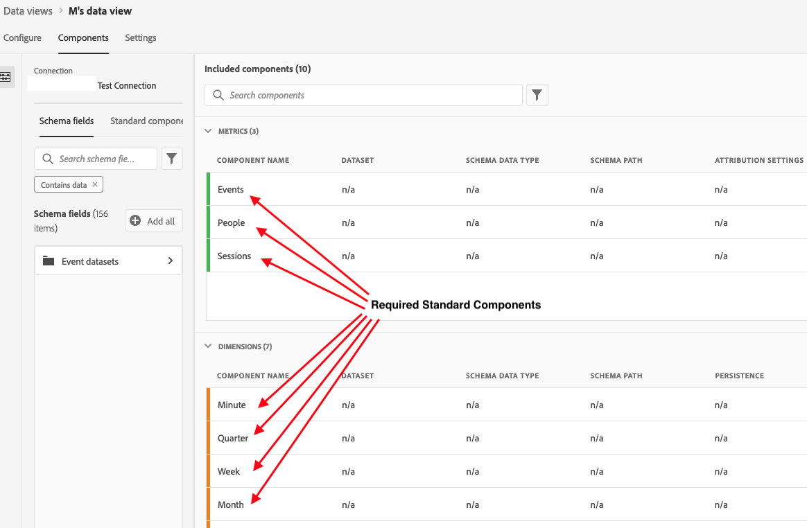

# Een gegevensweergave maken

Het creëren van een gegevensmening impliceert of het creëren van metriek en dimensies van schemaelementen of het gebruiken van standaardcomponenten. De meeste schemaelementen kunnen of een afmeting of metrisch afhankelijk van de vereisten van uw zaken zijn. Zodra u een schemaelement in een gegevensmening sleept, verschijnen de opties op het recht waar u kunt aanpassen hoe de afmeting of metrisch in CJA werkt.

## Instellingen en containers voor gegevensweergaven configureren

1. Ga in Customer Journey Analytics naar het tabblad **[!UICONTROL Data Views]**.
2. Klik **[!UICONTROL Add]** om een nieuwe gegevensmening tot stand te brengen en zijn montages te vormen.

| Instelling | Beschrijving/Hoofdletters gebruiken |
| --- | --- |
| [!UICONTROL Connection] | Dit veld koppelt de gegevensweergave aan de verbinding die u eerder hebt gemaakt en die een of meer Adobe Experience Platform-gegevenssets bevat. |
| [!UICONTROL Name] | Het is verplicht de gegevensweergave een naam te geven. |
| [!UICONTROL Description] | Een gedetailleerde beschrijving is niet verplicht, maar wordt aanbevolen. |
| [!UICONTROL Time zone] | Kies in welke tijdzone de gegevens moeten worden weergegeven. |
| [!UICONTROL Tags] | [!UICONTROL Tags] Hiermee kunt u de gegevensweergaven indelen in categorieën. |
| [!UICONTROL Containers] | U kunt hier de naam van uw containers wijzigen om te bepalen hoe deze worden weergegeven in een werkruimteproject dat is gebaseerd op deze gegevensweergave. [!UICONTROL Containers] worden gebruikt in filters en fallout/flow, enzovoort, om te definiëren hoe breed of smaller het bereik of de context is. [Meer informatie](https://experienceleague.adobe.com/docs/analytics-platform/using/cja-components/cja-filters/filters-overview.html?lang=en#filter-containers) |
| [!UICONTROL Person container name is…] | [!UICONTROL Person] (standaard). De container [!UICONTROL Person] bevat elk bezoek en elke paginaweergave voor bezoekers binnen een opgegeven tijdsperiode. U kunt de naam van deze container wijzigen in &#39;Gebruiker&#39; of elke andere gewenste term. |
| [!UICONTROL Session container name is…] | [!UICONTROL Session] (standaard). Met de container [!UICONTROL Session] kunt u paginainteracties, campagnes of conversies voor een specifieke sessie identificeren. U kunt de naam van deze container wijzigen in &#39;Visit&#39; of een andere term naar wens. |
| [!UICONTROL Event container name is…] | [!UICONTROL Event] (standaard). De container [!UICONTROL Event] bepaalt welke paginagebeurtenissen u van een filter zou willen omvatten of uitsluiten. |

Vervolgens kunt u metriek en dimensies maken op basis van schema-elementen. U kunt ook Standaardcomponenten gebruiken.

## Metriek en afmetingen maken op basis van schema-elementen

1. Klik in [!UICONTROL Customer Journey Analytics] > [!UICONTROL Data Views] op het tabblad [!UICONTROL Components].

U kunt [!UICONTROL Connection] bij de hoogste linkerzijde zien, die de datasets, en zijn [!UICONTROL Schema fields] hieronder bevat. Houd er rekening mee dat:

* De reeds inbegrepen componenten zijn de standaard vereiste componenten (systeem geproduceerd.)
* Adobe past standaard het filter **[!UICONTROL Contains data]** toe, zodat alleen Schema-velden met gegevens worden weergegeven. Als u een veld zoekt dat geen gegevens bevat, verwijdert u het filter.

1. Sleep nu een schemaveld, zoals [!UICONTROL pageTitle], van de linkerspoor naar de sectie Metriek of Dimension.

   U kunt het zelfde schemagebied in de dimensies of metrieksecties veelvoudige tijden slepen en de zelfde afmeting of metrisch op verschillende manieren vormen.
U kunt bijvoorbeeld in het veld **[!UICONTROL pageTitle]** een dimensie met de naam &quot;Productpagina&#39;s&quot; maken en een andere dimensie met de naam &quot;Foutpagina&#39;s&quot;, enzovoort, door de naam van de **[!UICONTROL Component Name]** aan de rechterkant te wijzigen. Vanaf **[!UICONTROL pageTitle]**; kunt u ook metriek maken op basis van een tekenreekswaarde. U kunt bijvoorbeeld een of meer **[!UICONTROL Orders]** metriek met verschillende attributie-instellingen en verschillende include/exclude-waarden maken.

   

   >[!NOTE]
   >
   >U kunt in de mappen met schemavelden slepen vanaf de linkerrails en deze worden automatisch gesorteerd in traditionele secties. Tekenreeksvelden worden afgesloten in de sectie [!UICONTROL Dimensions] en cijfers in de sectie [!UICONTROL Metrics]. U kunt ook op **[!UICONTROL Add all]** klikken en alle schemavelden worden toegevoegd.

1. Als u de component hebt geselecteerd, ziet u rechts een aantal instellingen. De component configureren met behulp van de instellingen die worden beschreven in

* [[!UICONTROL Component] instellingenoverzicht](/help/data-views/component-settings/overview.md)
* [[!UICONTROL Attribution] componentinstellingen](/help/data-views/component-settings/attribution.md)
* [[!UICONTROL Behavior] componentinstellingen](/help/data-views/component-settings/behavior.md)
* [[!UICONTROL Format] componentinstellingen](/help/data-views/component-settings/format.md)
* [[!UICONTROL Include|exclude] componentinstellingen](/help/data-views/component-settings/include-exclude-values.md)
* [[!UICONTROL Metric deduplication] componentinstellingen](/help/data-views/component-settings/metric-deduplication.md)
* [[!UICONTROL No value] componentinstellingen](/help/data-views/component-settings/no-value-options.md)
* [[!UICONTROL Persistence] componentinstellingen](/help/data-views/component-settings/persistence.md)
   [[!UICONTROL Value bucketing] componentinstellingen](/help/data-views/component-settings/value-bucketing.md)

## De functie [!UICONTROL Duplicate] gebruiken

Het dupliceren van metriek of afmetingen en het vervolgens wijzigen van specifieke montages is een gemakkelijke manier om veelvoudige metriek of afmetingen van één enkel schemagebied tot stand te brengen. Selecteer de instelling [!UICONTROL Duplicate] onder de naam van de metrische waarde of de afmetingen rechtsboven. Wijzig vervolgens de nieuwe metrische waarde of dimensie en sla deze onder een beschrijvende naam op.

## Filterschemavelden en afmetingen/metriek

U kunt schemagebieden in het linkerspoor door de volgende gegevenstypes filtreren:

U kunt ook filteren op gegevenssets en op het feit of een schemaveld gegevens bevat of dat het een identiteit is. Standaard passen we het filter **[!UICONTROL Contains data]** toe op alle gegevensweergaven.

## Een algemeen filter toevoegen aan de gegevensweergave

U kunt filters toevoegen die op een volledige gegevensmening van toepassing zijn. Dit filter wordt toegepast op elk rapport dat u uitvoert in Workspace.

1. Klik op het tabblad [!UICONTROL Settings] in [!UICONTROL Data views].
1. Sleep een filter van de lijst in de linkerspoorstaaf aan het [!UICONTROL Add filters] gebied.
