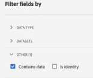

# Een gegevensweergave maken of bewerken

Het creëren van een gegevensmening impliceert of het creëren van metriek en dimensies van schemaelementen of het gebruiken van standaardcomponenten. De meeste schemaelementen kunnen of een afmeting of metrisch afhankelijk van de vereisten van uw zaken zijn. Zodra u een schemaelement in een gegevensmening sleept, verschijnen de opties op het recht waar u kunt aanpassen hoe de afmeting of metrisch in CJA werkt.

## Een gegevensweergave configureren

1. Meld u aan bij [Customer Journey Analytics](https://analytics.adobe.com) en ga naar het tabblad **[!UICONTROL Data Views]**.
2. Klik op **[!UICONTROL Add]** om een gegevensweergave te maken of klik op een bestaande gegevensweergave om deze te bewerken.

### Instellingen

Verstrekt overkoepelende montages voor de gegevensmening.

| Instelling | Beschrijving |
| --- | --- |
| [!UICONTROL Connection] | Dit gebied verbindt de gegevensmening met de verbinding die u vroeger vestigde, die één of meerdere datasets van Adobe Experience Platform bevat. |
| [!UICONTROL Name] | Vereist. De naam van de gegevensweergave. Deze waarde wordt weergegeven in het rechtsboven weergegeven vervolgkeuzemenu in Analysis Workspace. |
| [!UICONTROL Description] | Optioneel. Adobe raadt een gedetailleerde beschrijving aan, zodat gebruikers begrijpen waarom de gegevensweergave bestaat en voor wie deze is ontworpen. |

### Containers

Hiermee geeft u de naam van containers voor de gegevensweergave aan. Containernamen worden vaak gebruikt in [Filters](/help/components/filters/filters-overview.md#Filter-containers).

| Instelling | Beschrijving |
| --- | --- |
| [!UICONTROL Person container name] | [!UICONTROL Person] (standaard). De container [!UICONTROL Person] bevat elke sessie en gebeurtenis voor bezoekers binnen de opgegeven tijdsperiode. Als uw organisatie een andere term gebruikt (bijvoorbeeld &quot;Bezoeker&quot; of &quot;Gebruiker&quot;), kunt u de naam van de container hier wijzigen. |
| [!UICONTROL Session container name] | [!UICONTROL Session] (standaard). Met de container [!UICONTROL Session] kunt u paginainteracties, campagnes of conversies voor een specifieke sessie identificeren. U kunt de naam van deze container wijzigen in &#39;Visit&#39; of in een andere term die uw organisatie verkiest. |
| [!UICONTROL Event container name] | [!UICONTROL Event] (standaard). De container [!UICONTROL Event] bepaalt individuele gebeurtenissen in een dataset. Als uw organisatie een andere term gebruikt (bijvoorbeeld &quot;Hits&quot; of &quot;Paginaweergaven&quot;), kunt u de naam van de container hier wijzigen. |

### Kalender

Hiermee geeft u de kalender-indeling aan die moet worden gevolgd door de gegevensweergave. U kunt veelvoudige gegevensmeningen hebben die op het zelfde [Verbinding](/help/connections/create-connection.md) worden gebaseerd en hen verschillende kalendertypes of tijdstreken geven. Deze gegevensmeningen kunnen teams toestaan die verschillende kalendertypes gebruiken om hun respectieve behoeften met de zelfde onderliggende gegevens aan te passen.

| Instelling | Beschrijving |
| --- | --- |
| [!UICONTROL Time zone] | Kies in welke tijdzone de gegevens moeten worden weergegeven. Als u een tijdzone kiest die op de Tijd van de Besparing van het Daglicht werkt, worden de gegevens automatisch aangepast om dat te weerspiegelen. In de lente wanneer de klokken één uur vooruit aanpassen, is een gat van één uur aanwezig. In de val wanneer de klokken één uur achter aanpassen, wordt één uur herhaald tijdens de verschuiving van DST. |
| [!UICONTROL Calendar Type] | Bepaal hoe weken van de maand worden gegroepeerd. **Gregoriaans:** Standaard kalenderindeling. Kwarten worden gegroepeerd op maand. **4-5-4 Retail:** een gestandaardiseerde 4-5-4 retail kalender. De eerste en laatste maanden van het kwartaal bevatten vier weken, terwijl de tweede maand van het kwartaal uit vijf weken bestaat. **Aangepast (4-5-4):** Vergelijkbaar met de 4-5-4 kalender, behalve dat u de eerste dag van het jaar kunt kiezen en het jaar dat de &quot;extra&quot; week plaatsvindt. **Aangepast (4-4-5):** De eerste en tweede maanden van elk kwartaal bevatten vier weken, terwijl de laatste week van elk kwartaal uit vijf weken bestaat. **Aangepast (5-4-4):** De eerste maand van elk kwartaal bestaat uit vijf weken, terwijl de tweede en derde maand van elk kwartaal uit vier weken bestaan. |
| [!UICONTROL First month of the year] en [!UICONTROL First day of week] | Zichtbaar voor het Gregoriaanse kalendertype. Geef op op welke maand het kalenderjaar moet beginnen en op welke dag elke week moet beginnen. |
| [!UICONTROL First day of current year] | Zichtbaar voor aangepaste kalendertypen. Geef op welke dag van het jaar het huidige jaar moet beginnen. Op basis van deze waarde wordt de eerste dag van elke week automatisch opgemaakt in de kalender. |
| [!UICONTROL Year in which the "extra" week occurs] | Met de meeste kalenders van 364 dagen (52 weken van elk 7 dagen), accumuleert elk jaar leftoverdagen tot zij een extra week vormen. Deze extra week wordt dan toegevoegd aan de laatste maand van dat jaar. Geef op aan welk jaar u de extra week wilt toevoegen. |

## De componenten van een gegevensweergave instellen

Vervolgens kunt u metriek en dimensies maken op basis van schema-elementen. U kunt ook Standaardcomponenten gebruiken.

1. Meld u aan bij [Customer Journey Analytics](https://analytics.adobe.com) en ga naar het tabblad **[!UICONTROL Data Views]**.
1. Klik op **[!UICONTROL Add]** om een gegevensweergave te maken of klik op een bestaande gegevensweergave om deze te bewerken.
1. Klik op het tabblad **[!UICONTROL Components]**.

U kunt [!UICONTROL Connection] bij de hoogste linkerzijde zien, die de datasets, en zijn [!UICONTROL Schema fields] hieronder bevat. Houd er rekening mee dat:

    * De reeds inbegrepen componenten zijn de standaard vereiste componenten (geproduceerd systeem).
    * Adobe past standaard het filter **[!UICONTROL Contains data]** toe, zodat alleen Schema-velden met gegevens worden weergegeven. Als u een veld zoekt dat geen gegevens bevat, verwijdert u het filter.

1. Sleep een schemagebied, zoals `pageTitle`, van de linkerspoorstaaf in de sectie van Metriek of van Dimension.

   U kunt het zelfde schemagebied in de dimensies of metrieksecties veelvoudige tijden slepen en de zelfde afmeting of metrisch op verschillende manieren vormen. U kunt bijvoorbeeld in het veld `pageTitle` een dimensie met de naam &quot;Productpagina&#39;s&quot; maken en een andere dimensie met de naam &quot;Foutpagina&#39;s&quot; door verschillende [Componentinstellingen](component-settings/overview.md) aan de rechterkant te gebruiken.

   

   Als u een schemagebiedomslag van het linkerspoor sleept, worden zij automatisch gesorteerd in typische secties. Tekenreeksvelden worden in de sectie [!UICONTROL Dimensions] geplaatst en numerieke schematypen komen in de sectie [!UICONTROL Metrics] te staan. U kunt ook **[!UICONTROL Add all]** klikken en alle schemagebieden worden toegevoegd aan hun respectieve plaatsen.

1. Nadat u de component hebt geselecteerd, wordt rechts een aantal instellingen weergegeven. Configureer de component met [Componentinstellingen](component-settings/overview.md). Welke componentinstellingen beschikbaar zijn, hangt af van het feit of de component een dimensie/metrische component is en van het gegevenstype schema. Voorbeelden van instellingen:

   * [[!UICONTROL Attribution]](component-settings/attribution.md)
   * [[!UICONTROL Behavior]](component-settings/behavior.md)
   * [[!UICONTROL Format]](component-settings/format.md)
   * [[!UICONTROL Include exclude values]](component-settings/include-exclude-values.md)
   * [[!UICONTROL Metric deduplication]](component-settings/metric-deduplication.md)
   * [[!UICONTROL No value options]](component-settings/no-value-options.md)
   * [[!UICONTROL Persistence]](component-settings/persistence.md)
   * [[!UICONTROL Value bucketing]](component-settings/value-bucketing.md)

Indien nodig kunt u de volgende functies gebruiken:

* **[!UICONTROL Duplicate]**: Het dupliceren van metriek of afmetingen en het vervolgens wijzigen van specifieke montages is een gemakkelijke manier om veelvoudige metriek of afmetingen van één enkel schemagebied tot stand te brengen. Selecteer de instelling [!UICONTROL Duplicate] onder de naam van de metrische waarde of de afmetingen rechtsboven. Wijzig de nieuwe dimensie of metrische waarde en sla deze onder een beschrijvende naam op.

   

* **[!UICONTROL Filter]**: U kunt schemagebieden in het linkerspoor door de volgende gegevenstypes filtreren:

   

   U kunt ook filteren op gegevenssets en op het feit of een schemaveld gegevens bevat of dat het een identiteit is. Standaard past Adobe eerst het filter **[!UICONTROL Contains data]** toe op alle gegevensweergaven.

   

## Instellingen

1. Meld u aan bij [Customer Journey Analytics](https://analytics.adobe.com) en ga naar het tabblad **[!UICONTROL Data Views]**.
1. Klik op **[!UICONTROL Add]** om een gegevensweergave te maken of klik op een bestaande gegevensweergave om deze te bewerken.
1. Klik op het tabblad **[!UICONTROL Settings]**.

### Globaal, filter

U kunt filters toevoegen die op een volledige gegevensmening van toepassing zijn. Dit filter wordt toegepast op elk rapport dat u uitvoert in Workspace. Sleep een filter van de lijst in de linkerspoorstaaf aan het [!UICONTROL Add filters] gebied.

### Sessieinstellingen

Bepaal de periode van inactiviteit tussen gebeurtenissen alvorens een zitting verloopt en nieuwe wordt begonnen.

Een tijdsperiode is vereist. U kunt desgewenst ook een nieuwe sessie forceren om te starten wanneer een gebeurtenis een bepaalde metrische waarde bevat.

Wanneer alle gewenste instellingen zijn opgegeven, klikt u op **[!UICONTROL Save and finish]**.
