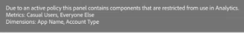

# Labels en beleid

>[!NOTE]
>
>Deze functionaliteit is momenteel in [beperkte tests](/help/release-notes/releases.md).

Wanneer u een dataset in Experience Platform creeert, kunt u tot stand brengen [gegevensgebruikslabels](https://experienceleague.adobe.com/docs/experience-platform/data-governance/labels/reference.html?lang=en) voor sommige of alle elementen in de gegevensset. Tot nu toe zijn deze labels niet beschikbaar gesteld in CJA. Met deze release kunt u deze labels weergeven in CJA. Voor CJA zijn de volgende labels van bijzonder belang:

* De `C8` label - **[!UICONTROL No measurement]**. Dit label geeft aan dat gegevens niet kunnen worden gebruikt voor analyses op de websites of apps van uw organisatie.

* De `C12` label - **[!UICONTROL No General Data Export]**. Schemavelden met het label this way kunnen niet worden geëxporteerd of gedownload van CJA (via rapportage, export, API, enzovoort)

De etikettering op zich betekent niet dat deze etiketten van het gegevensgebruik worden afgedwongen. Daar wordt beleid voor gebruikt. U kunt uw beleid maken via de [Beleidsservice-API](https://experienceleague.adobe.com/docs/experience-platform/data-governance/api/overview.html?lang=en) in Experience Platform.

In CJA worden twee door Adobe gedefinieerde beleidsregels weergegeven die van invloed zijn op rapportage en downloaden/delen:

* [!UICONTROL Enforce Analytics] beleid
* [!UICONTROL Enforce Download] beleid

## Gegevenslabels weergeven in CJA-gegevensweergaven

De etiketten van gegevens die in Experience Platform werden gecreeerd worden getoond in drie plaatsen in het gebruikersinterface van gegevensmeningen:

| Locatie | Beschrijving |
| --- | --- |
| De knop Info op een schemaveld | Klik op deze knop om aan te geven welke labels voor gegevensgebruik momenteel van toepassing zijn op een veld:
 |
| Rechterspoor onder [Componentinstellingen](/help/data-views/component-settings/overview.md) | Alle labels voor gegevensgebruik worden hier weergegeven:
 |
| Gegevenslabels toevoegen als kolom | U kunt de Etiketten van Gegevens als kolom aan de Opgenomen kolommen van Componenten in gegevensmeningen toevoegen. Klik enkel het pictogram van de kolomselecteur en selecteer de Etiketten van het Gebruik van Gegevens:
 |

## Filter op labels voor gegevensbeheer in gegevensweergaven

Klik in de editor voor gegevensweergaven op het pictogram Filter in het linkerspoor en filter de componenten van de gegevensweergaven op het label of de labels voor gegevensbeheer:

Klikken **[!UICONTROL Apply]** om te zien welke componenten etiketten hebben in bijlage aan hen.

## Filter op beleid voor gegevensbeheer in gegevensweergaven

U kunt controleren om te zien of wordt een beleid aangezet dat het gebruik van bepaalde elementen van de CJA- gegevensmening voor analytische of uitvoerdoel blokkeert.

Klik nogmaals op het pictogram Filter in de linkertrack en klik onder Gegevensbeheer op Beleid:

Klikken **[!UICONTROL Apply]** om te zien welk beleid wordt toegelaten _voor deze gegevensweergave?_

## Hoe [!UICONTROL Enforce Analytics] beleid beïnvloedt Werkruimteprojecten

Als dit beleid wordt aangezet, die schemagebieden die bepaalde gegevensetiketten (zoals C8) verbonden aan hen hebben niet voor analysedoeleinden binnen de Werkruimte CJA kunnen worden gebruikt.

Voor rapportage betekent dit dat

* U kunt deze velden niet toevoegen aan gegevensweergaven en ze worden grijs weergegeven in de linkertrack [!UICONTROL Schema fields] lijst.
* U kunt geen gegevensweergave opslaan waarin velden zijn geblokkeerd.

Als u probeert een Workspace-analyse uit te voeren op gegevensweergaven die items bevatten die niet zijn toegestaan voor analyses, krijgt u een bericht zoals dit:

Op individuele componenten zou het bericht gelijkaardig aan dit zijn:

## Hoe [!UICONTROL Enforce Download] beleid beïnvloedt Werkruimteprojecten

Als dit beleid wordt aangezet, zal om het even welke uitvoer of download (zoals het e-mailen of het delen van pdfs) van de projecten van de Werkruimte de gevoelige gebieden hakken. U kunt deze velden nog steeds analyseren in Workspace, maar als u een project probeert te e-mailen of anderszins te delen, worden de geblokkeerde velden weergegeven als gehashte items in het .pdf-bestand.

Voeg hier een schermafbeelding toe.

## Labels weergeven in Report Builder

Zie _deze sectie_ voor meer informatie . (link naar Christine&#39;s doc)
