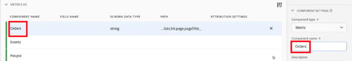
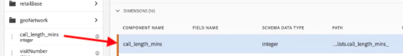
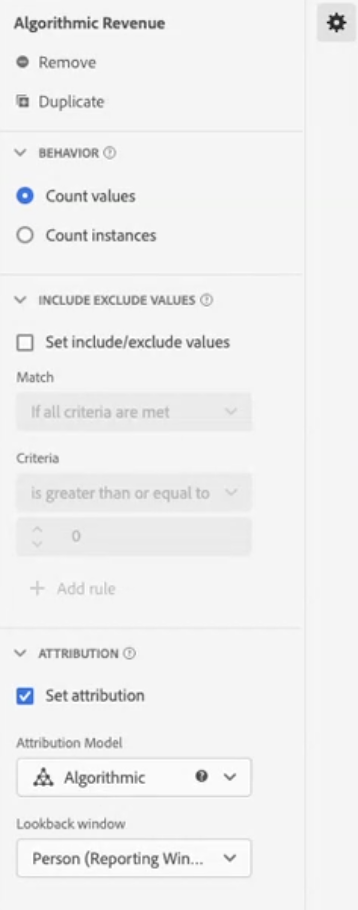

# Gebruiksscenario&#39;s voor gegevensweergaven

Deze gebruiksgevallen tonen de flexibiliteit en kracht van gegevensweergaven in Customer Journey Analytics.

## 1. Een metrische waarde maken op basis van een tekenreeksschemaveld {#string}

Wanneer u bijvoorbeeld een gegevensweergave maakt, kunt u een [!UICONTROL Orders] metrisch van een [!UICONTROL pageTitle] schemaveld dat een tekenreeks is. Hier volgen de volgende stappen:

1. Sleep op het tabblad Componenten de knop [!UICONTROL pageTitle] in de [!UICONTROL Metrics] deel onder [!UICONTROL Included Components].
   
1. Markeer nu de metrische waarde die u net hebt gesleept en wijzig de naam hiervan [!UICONTROL Component Settings] rechts:
   
1. Open de [!UICONTROL Include/Exclude Values] aan de rechterkant en geef het volgende op:
   

   De uitdrukking &quot;bevestiging&quot;wijst erop dat dit een orde is. Na het controleren van alle paginatitels waar aan die criteria wordt voldaan, zal &quot;1&quot;voor elke instantie worden geteld. Het resultaat is nieuw metrisch (niet berekend metrisch.) Een metrisch die inbegrepen/uitgesloten waarden heeft kan overal worden gebruikt andere metrisch. Het werkt met Attribution IQ, filters, en overal anders kunt u standaardmetriek gebruiken.
1. U kunt een attributiemodel voor deze metrische waarde verder opgeven, zoals [!UICONTROL Last Touch], met een [!UICONTROL Lookback window] van [!UICONTROL Session].
U kunt ook een andere [!UICONTROL Orders] metrisch van het zelfde gebied en specificeer een verschillend attributiemodel voor het, zoals [!UICONTROL First Touch]en een andere [!UICONTROL Lookback window], zoals [!UICONTROL 30 days].

Een ander voorbeeld zou de identiteitskaart van de Bezoeker, een afmeting, als metrisch moeten gebruiken om te bepalen hoeveel Bezoeker IDs uw bedrijf heeft.

## 2. Gehele getallen gebruiken als afmetingen {#integers}

Eerder, zouden gehelen automatisch als metriek in CJA worden behandeld. Cijfers (inclusief aangepaste gebeurtenissen uit Adobe Analytics) kunnen nu als afmetingen worden beschouwd. Hier volgt een voorbeeld:

1. Sleep de [!UICONTROL call_length_min] geheel in [!UICONTROL Dimensions] deel onder [!UICONTROL Included Components]:

   

1. U kunt nu toevoegen [!UICONTROL Value Bucketing] deze dimensie in de verslaglegging op een beknopte wijze te presenteren. (Zonder vastzetten, zou elk geval van deze dimensie als lijnpunt in Werkruimte rapporterend verschijnen.)

   

## 3. Numerieke afmetingen gebruiken als &#39;metriek&#39; in stroomdiagrammen {#numeric}

U kunt een numerieke dimensie gebruiken om &#39;metriek&#39; in uw [!UICONTROL  Flow] visualisatie.

1. In de gegevensweergaven [Componenten](https://experienceleague.adobe.com/docs/analytics-platform/using/cja-dataviews/create-dataview.html#configure-component-settings) tabblad, sleept u de [!UICONTROL Marketing Channels] schemaveld in [!UICONTROL Metrics] areaal [!UICONTROL Included components].
2. In Workspace-rapportage wordt deze stroom weergegeven [!UICONTROL Marketing Channels] stromen naar [!UICONTROL Orders]:

## 4. Filteren van subgebeurtenissen uitvoeren {#sub-event}

Deze mogelijkheid is specifiek van toepassing op arrayvelden. Met de functionaliteit include/exclude kunt u filteren op subgebeurtenisniveau, terwijl filters (segmenten) die in de filterbuilder zijn ingebouwd, u alleen filteren op gebeurtenisniveau geven. Zo kunt u sub-gebeurtenis het filtreren door te gebruiken omvat/sluit in de Mening van Gegevens, en dan die nieuwe metrische dimensie in een filter op het gebeurtenisniveau van verwijzingen.

Gebruik bijvoorbeeld de functie voor het opnemen/uitsluiten van gegevens in gegevensweergaven om alleen te verwijzen naar producten die een omzet van meer dan 50 dollar hebben gegenereerd. Dus als u een bestelling hebt die een product van 50 dollar en een product van 25 dollar bevat, verwijderen we alleen de aankoop van het product van 25 dollar, niet de volledige bestelling.

1. In de gegevensweergaven [Componenten](https://experienceleague.adobe.com/docs/analytics-platform/using/cja-dataviews/create-dataview.html#configure-component-settings) tabblad, sleept u de [!UICONTROL Revenue] schemaveld in [!UICONTROL Metrics] areaal [!UICONTROL Included components].
1. Selecteer metrisch en vorm het volgende op de rechterkant: a. Onder [!UICONTROL Format], selecteert u [!UICONTROL Currency].
b. Onder [!UICONTROL Currency]selecteert u USD.
c. Onder [!UICONTROL Include/Exclude Values]schakelt u het selectievakje naast [!UICONTROL Set include/exclude values].
d. Onder [!UICONTROL Match], selecteert u [!UICONTROL If all criteria are met].
e. Onder [!UICONTROL Criteria], selecteert u [!UICONTROL is greater than or equal].
f. Geef &quot;50&quot; op als waarde.

Met deze nieuwe instellingen kunt u alleen inkomsten met een hoge waarde bekijken en alles onder $50 filteren.

## 5. De opdracht [!UICONTROL No Value Options] instellen {#no-value}

Uw bedrijf heeft mogelijk tijd besteed aan het trainen van uw gebruikers om &quot;Niet gespecificeerd&quot;in rapporten te verwachten. De standaardwaarde in gegevensweergaven is &quot;Geen waarde&quot;. U kunt nu [naam van &quot;Geen waarde&quot; wijzigen in &quot;Niet opgegeven&quot;](https://experienceleague.adobe.com/docs/analytics-platform/using/cja-dataviews/create-dataview.html#configure-no-value-options-settings) in de interface voor gegevensweergaven.

Een ander voorbeeld zou een dimensie voor een registratie van het lidmaatschapsprogramma zijn. In dit geval kunt u de naam &quot;Geen waarde&quot; wijzigen in &quot;Registratie van geen lidmaatschapsprogramma&quot;.

## 6. Meerdere metriek maken met verschillende [!UICONTROL Attribution] instellingen {#attribution}

Met de [!UICONTROL Duplicate] aan de rechterbovenhoek een aantal maatstaven voor inkomsten maken met verschillende toewijzingsinstellingen, zoals [!UICONTROL First Touch], [!UICONTROL Last Touch], en [!UICONTROL Algorithmic].

Vergeet niet elke metrisch anders te noemen om op de verschillen, zoals &quot;Algorithmic Revenue&quot;te wijzen:

Zie voor meer informatie over andere instellingen van gegevensweergaven [Gegevensweergaven maken](/help/data-views/create-dataview.md).
Voor een conceptueel overzicht van gegevensweergaven raadpleegt u [Overzicht van gegevensweergaven](/help/data-views/data-views.md).

## 7. Nieuwe versus herhaalde sessierapportage {#new-repeat}

U kunt bepalen of een zitting inderdaad de eerste-ooit zitting voor een gebruiker of niet is, die op het rapporteringsvenster wordt gebaseerd dat u voor deze gegevensmening en een 13 maanden terugkijkvenster bepaalde. Met deze rapportage kunt u bijvoorbeeld bepalen:

* Welk percentage van uw bestellingen komt uit nieuwe versus herhaalde sessies?

* Voor een bepaald marketingkanaal, of een specifieke campagne, richt u zich op nieuwe gebruikers of terugkeergebruikers? Hoe beïnvloedden deze keuzes de omrekeningskoersen?

Drie componenten vergemakkelijken deze rapportage:

* 1 dimensie: [Sessietype](https://experienceleague.adobe.com/docs/analytics-platform/using/cja-dataviews/component-reference.html?lang=en#optional) - Deze dimensie heeft twee waarden: 1) [!UICONTROL New] en 2) [!UICONTROL Returning]. De [!UICONTROL New] Het lijstitem omvat al gedrag (d.w.z. metriek tegen deze dimensie) van een zitting die als bepaalde eerste zitting van een persoon is bepaald. Alle andere elementen zijn opgenomen in de [!UICONTROL Returning] lijstitem (ervan uitgaande dat alles tot een sessie behoort). Indien meeteenheden geen deel uitmaken van een sessie, vallen zij voor deze dimensie in het &quot;niet van toepassing&quot;-segment.

* 2 cijfers: [Nieuwe sessies, Return-sessies](https://experienceleague.adobe.com/docs/analytics-platform/using/cja-dataviews/component-reference.html?lang=en#optional). Een nieuwe sessie wordt gedefinieerd als een door een persoon gedefinieerde eerste sessie in het rapportagevenster. Retoursessies is het aantal sessies dat de eerste sessie van een persoon niet was.

Deze componenten openen:

1. Ga in de redacteur van de gegevensmening.
1. Klik op de knop **[!UICONTROL Components]** > **[!UICONTROL Optional Standard components]** -tab in linkerrails.
1. Sleep deze componenten naar de gegevensweergave.

95%-99% van de tijd, nieuwe zittingen worden correct gemeld. De enige uitzonderingen zijn:

* Wanneer een eerste zitting vóór het 13 maanden raadplegingsvenster voorkwam. Deze sessie wordt genegeerd.

* Wanneer een sessie zowel het terugzoekvenster als het rapportagevenster omvat. Stel dat u een rapport maakt van 1 juni tot 15 juni 2022. Het terugkijkvenster zou 1 mei 2021 tot 31 mei 2022 omvatten. Als een sessie zou beginnen op 30 mei 2022 en op 1 juni 2022 zou eindigen, omdat de sessie is opgenomen in het terugzoekvenster, worden alle sessies in het rapportagevenster geteld als retoursessies.

## De functionaliteit Datum en tijd gebruiken {#date}

Schemas in Adobe Experience Platform bevat [!UICONTROL Date] en [!UICONTROL Date-Time] velden. De CJA-gegevensweergaven ondersteunen deze velden nu. Wanneer u deze velden als een dimensie naar een gegevensweergave sleept, kunt u hun [format](/help/data-views/component-settings/format.md). Deze notatie bepaalt hoe de velden worden weergegeven in de rapportage. Bijvoorbeeld:

* Als u voor de datumnotatie **[!UICONTROL Day]** met de notatie **[!UICONTROL Month, Day, Year]** Een voorbeelduitvoer in de rapportage zou er als volgt kunnen uitzien: 23 augustus 2022.

* Als u voor de datum-tijd-indeling **[!UICONTROL Minute of Day]** met de notatie **[!UICONTROL Hour:Minute]**, zou uw output als kunnen kijken: 20:20.

### Gebruiksscenario&#39;s:

* Datum: Een reisbedrijf verzamelt de vertrekdatum voor reizen als een veld in de gegevens. Zij zouden graag een verslag hebben waarin de [!UICONTROL Day of Week] voor alle vertrekdata die worden verzameld om te begrijpen wat het populairst is . Ze willen hetzelfde doen voor [!UICONTROL Month of Year].

* Datum/tijd: Een detailhandelsonderneming verzamelt de tijd voor elk van hun aankopen in verkooppunten (verkooppunten). Meer dan een maand willen ze graag de drukste boodschapperiodes van [!UICONTROL Hour of Day].

>[!MORELIKETHIS]
>[Datum en datum-tijd in de instelling van de component Format](/help/data-views/component-settings/format.md)

