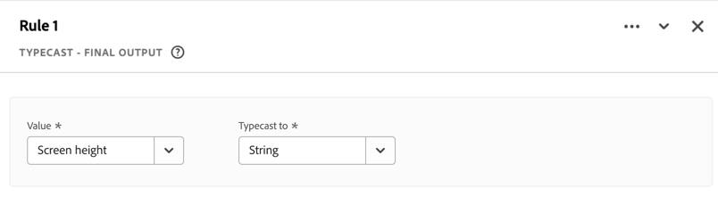

# Afgeleide velden (beperkt testen){#derived-fields}

{{release-limited-testing}}

>[!IMPORTANT]
>
>Dit is een voorlopige documentatie van nieuwe afgeleide veldfuncties die nog niet algemeen beschikbaar zijn. Gebruik deze informatie om over de nieuwe afgeleide gebiedsfuncties te leren. Deze documentatie kan nog worden gewijzigd en er kunnen geen wettelijke verplichtingen uit de huidige versie van dit artikel worden afgeleid.
>> Zie [ Voortgekomen gebieden ](derived-fields.md) voor informatie over de afgeleide functionaliteit van gebieden in het algemeen en de huidige beschikbare vrijgegeven functies en functiesjablonen.
>

## Functieverwijzing

{{select-package}}

Voor elke ondersteunde functie vindt u hieronder meer informatie over:

- specificaties:
   - invoergegevenstype: type ondersteunde gegevens;
   - invoer: mogelijke waarden voor invoer,
   - include-operatoren: operatoren die voor deze functie worden ondersteund (indien aanwezig),
   - beperkingen: beperkingen die gelden voor deze specifieke functie;
   - uitvoer.

- gebruiksgevallen, waaronder:
   - (facultatief) gegevens voordat het afgeleide veld wordt gedefinieerd;
   - hoe het afgeleide veld moet worden gedefinieerd,
   - (optioneel) gegevens na het definiëren van het afgeleide veld.

- beperkingen (indien van toepassing).

<!-- DATE MATH -->

### Datumwiskunde {#datemath}

>[!CONTEXTUALHELP]
>id="dataview_derivedfields_datemath"
>title="Datumwiskunde"
>abstract="Deze functie biedt de mogelijkheid om het verschil tussen twee datum- of datum-tijdvelden te retourneren."

Retourneert het verschil tussen twee datums of twee datum-tijdvelden.

+++ Details

## Specificaties {#datemath-io}

| Gegevenstype invoer | Invoer | Opgenomen operatoren | Beperkingen | Uitvoer |
|---|---|---|---|---|
| <ul><li>Datum</li><li>Datum/tijd</li></ul> | <ul><li>[!UICONTROL Scope]<ul><li>Gebeurtenis</li><li>Sessie</li><li>Persoon</li></ul></li><li>[!UICONTROL Value]:<ul><li>Datum</li><li>Datum/tijd</li><li>Statische datum (door gebruiker ingevoerd)</li><li>Statische datum-tijd (door gebruiker ingevoerd)</li><li>Dynamische datum<ul><li>Vandaag</li></ul></li><li>Dynamische datum-tijd<ul><li>Nu</li></ul></li></ul></li><li>[!UICONTROL Granularity]:<ul><li>Seconden</li><li>Minuten</li><li>Uren</li><li>Dagen</li><li>Weken</li><li>Maanden</li><li>Kwarten</li><li>Jaren</li></ul></li><li>Voor elke datum- of datum-tijdreturn:<ul><li>Eerste (binnen sessie of persoon)</li><li>Laatste (binnen sessie of persoon)</li></ul></li></ul> | 
N.v.t.
 | 
2 functies per afgeleid veld
 | 
Nieuw afgeleid veld
 |

{style="table-layout:auto"}

## Hoofdlettergebruik 1 {#datemath-uc1}

Als marketinganalist van een hotelbedrijf wilt u het verschil begrijpen tussen het aantal dagen tussen de data waarop klanten inchecken en boekingen in de afgelopen week.

### Afgeleid veld {#datemath-uc1-derivedfield}

U definieert een `Days between booking and check-in` afgeleid veld. U gebruikt de functie [!UICONTROL DATE MATH] om een regel te definiëren die de dagen voor [!UICONTROL Scope] [!DNL Person] tussen [!UICONTROL Booking Date] en [!UICONTROL Check-in Date] berekent. U selecteert [!UICONTROL Day] als [!UICONTROL Output granularity] . En u selecteert [!UICONTROL Return the last] voor zowel [!UICONTROL Booking Date] als [!UICONTROL Check-in Date] om ervoor te zorgen dat de waarde van het bereik van de laatste persoon wordt gebruikt in de berekening.

## Hoofdlettergebruik 2 {#datemath-uc2}

Als marketinganalist van een baksteen- en mortiershop wilt u begrijpen hoeveel dagen geleden het laatste bezoek van een klant aan de winkel was. U gebruikt de functie voor geolocatie in een mobiele app en bakens in de winkel om fysieke bezoeken van klanten vast te leggen.

### Afgeleid veld {#datemath-uc2-derivedfield}

U definieert een nieuw `Days Since Visit To Shop` afgeleid veld. U gebruikt de functie [!UICONTROL DATE MATH] om een regel te definiëren voor het berekenen van de dagen tussen een aangepaste datum-tijd (die u opgeeft in [!UICONTROL Date] ) en de [!UICONTROL Local Time] (vanuit de [!UICONTROL placeContext] veldgroep van uw gebeurtenisdataset) met een [!UICONTROL Deduplication scope] van [!UICONTROL Person] . U selecteert [!UICONTROL Return the last] om ervoor te zorgen dat de waarde van het bereik van de laatste persoon voor [!UICONTROL Local time] wordt gebruikt in de berekening. U selecteert Dag als [!UICONTROL Output granularity].

## Hoofdlettergebruik 3 {#datemath-uc3}

U wilt de onderzoekstijd in notulen begrijpen alvorens een klant binnen een zitting een orde plaatst.

U definieert een nieuw `Time Between Search And Order In Minutes` afgeleid veld dat het resultaat is van twee [[!UICONTROL CASE WHEN] functies ](#case-when) om [!UICONTROL Search Time] - en [!UICONTROL Order Time] -waarden te definiëren.
Vervolgens gebruikt u deze twee waarden om het verschil te berekenen met een functie [!UICONTROL DATE MATH] waarvoor [!UICONTROL Scope] is ingesteld op [!UICONTROL Session] , waarden die zijn ingesteld op [!UICONTROL Search Time] en [!UICONTROL Order Time] en [!UICONTROL Output granularity] op [!UICONTROL Minute] . Voor beide waarden selecteert u [!UICONTROL Return the first] om ervoor te zorgen dat de eerste [!UICONTROL Search Time] en [!UICONTROL Order Time] worden geretourneerd.

<!--
| Visitor ID | Marketing Channel | Events |
|----|---|---:|
| ABC123 | paid search | 1 |
| DEF123 | email | 1 |
| JKL123 | natural search | 1 |

{style="table-layout:auto"}

-->

+++

<!-- DEPTH -->

### Diepte {#depth}

>[!CONTEXTUALHELP]
>id="dataview_derivedfields_depth"
>title="Diepte"
>abstract="Deze functie biedt de mogelijkheid om de diepte van elk veld te retourneren, net als de functionaliteit van de standaardcomponent voor gebeurtenisdiepte."

Keert de diepte van een gebied terug, gelijkend op wat met de uit-van-de-doos [ standaardafmeting van de Diepte van de Gebeurtenis ](/help/components/dimensions/overview.md#standard-dimensions) mogelijk is.

+++ Details

## Specificaties {#depth-io}

| Gegevenstype invoer | Invoer | Opgenomen operatoren | Beperkingen | Uitvoer |
|---|---|---|---|---|
| Alle | Willekeurig veld | N.v.t. | 3 functies per afgeleid veld | Nieuw afgeleid veld |

{style="table-layout:auto"}

<!--
## Example Data {#depth-example}

| event# | page name | search | product view | cart add  | order |
|:---:|---|:---:|:---:|:---:|:---:|
| 1 |  home page        |  0  | 0  | 0  | 0 |
| 2 |  search page      |  1  | 0  | 0  | 0 |
| 3 |  product page     |  0  | 0  | 0  | 0 |
| 4 |  cart page        |  0  | 0  | 1  | 0 |
| 5 |  confirmation     |  0  | 0  | 0  | 1 |

-->

## Hoofdletters gebruiken {#depth-uc1}

U wilt de zoekdiepte begrijpen (die u ook kunt interpreteren als het aantal zoekopdrachten). Zo kunt u die onderzoeksdiepte later gebruiken om het onderzoekstermijn te zoeken verbonden aan een specifieke onderzoeksdiepte.

### Afgeleid veld {#depth-uc1-derivedfield}

U definieert een nieuw `Search Depth` afgeleid veld. U gebruikt de functie [!UICONTROL DEPTH] om een regel te bepalen om de diepte van [!UICONTROL Search] terug te winnen en dat op een nieuw afgeleid gebied op te slaan.

+++

<!-- TYPECASE -->

### Typecast {#typecast}

>[!CONTEXTUALHELP]
>id="dataview_derivedfields_typecast"
>title="Typecast"
>abstract="Met deze functie kunt u het veldtype tijdens de vlucht wijzigen en het veld beschikbaar maken voor extra transformaties in Customer Journey Analytics."

Wijzig het veldtype van een veld om het beschikbaar te maken voor extra transformaties in Customer Journey Analytics.

+++ Details

## Specificaties {#typecast-io}

| Gegevenstype invoer | Invoer | Opgenomen operatoren | Limiet | Uitvoer |
|---|---|---|---|---|
| <ul><li>Numeriek</li><li>Datum</li><li>Datum/tijd</li><li>String</li></ul> | <ul><li>[!UICONTROL Field] | 
<ul><li>Geheel<ul><li>Aan String <strong> (Must) </strong></li></ul></li><li>Dubbel<ul><li>Aan String <strong> (Must) </strong><ul><li>Inclusief aantal decimalen dat moet worden overgeërfd (max. 5?)</li></ul></li><li>Naar geheel getal <strong> (should) </strong></li></ul></li><li>Byte<ul><li>Aan String <strong> (Must) </strong></li></ul></li><li>Lang<ul><li>Aan String <strong> (Must) </strong></li></ul></li><li>Datum<ul><li>Aan String <strong> (Must) </strong><ul><li>Biedt de mogelijkheid om de uitvoerindeling te definiëren</li></ul></li><li>Voorbeelden<ul><li>Datum (voorbeeld 7 januari 2025)<ul><li data-stringify-indent="1" data-stringify-border="0">DD-MM-YY<ul><li data-stringify-indent="2" data-stringify-border="0">Voorbeeld. 01-07-25</li></ul></li><li data-stringify-indent="1" data-stringify-border="0">DD-MM-YYYY<ul><li data-stringify-indent="2" data-stringify-border="0">Voorbeeld. 01-07-2025</li></ul></li><li data-stringify-indent="1" data-stringify-border="0">DD-MM-YY<ul><li data-stringify-indent="2" data-stringify-border="0">Voorbeeld. 07-01-25</li></ul></li><li data-stringify-indent="1" data-stringify-border="0">DD-MM-YYYY<ul><li data-stringify-indent="2" data-stringify-border="0">Voorbeeld. 07-01-2025</li></ul></li><li data-stringify-indent="1" data-stringify-border="0">YY-MM-DD<ul><li data-stringify-indent="2" data-stringify-border="0">Voorbeeld. 25-01-07</li></ul></li><li data-stringify-indent="1" data-stringify-border="0">YYYY-MM-DD<ul><li data-stringify-indent="2" data-stringify-border="0">Voorbeeld. 2025-01-07</li></ul></li><li data-stringify-indent="1" data-stringify-border="0">MM/DD/YY<ul><li data-stringify-indent="2" data-stringify-border="0">Voorbeeld. 07-01-25</li></ul></li><li data-stringify-indent="1" data-stringify-border="0">MM/DD/YYYY<ul><li data-stringify-indent="2" data-stringify-border="0">Voorbeeld. 07-01-2025</li></ul></li><li data-stringify-indent="1" data-stringify-border="0">YYYY/MM/DD<ul><li data-stringify-indent="2" data-stringify-border="0">Voorbeeld. 01-2025-07</li></ul></li><li data-stringify-indent="1" data-stringify-border="0">YY/MM/DD<ul><li data-stringify-indent="2" data-stringify-border="0">Voorbeeld. 01-25-07</li></ul></li><li data-stringify-indent="1" data-stringify-border="0">DD MMM YYYY<ul><li data-stringify-indent="2" data-stringify-border="0">Voorbeeld. woensdag 7 januari 2025</li></ul></li></ul></li></ul></li></ul></li><li>Datum/tijd<ul><li>Aan String <strong> (Must) </strong><ul><li>Biedt de mogelijkheid om de uitvoerindeling te definiëren</li></ul></li><li>Voorbeelden<ul><li data-stringify-indent="0" data-stringify-border="0">Datum-tijd (Voorbeeld van 7 Januari, 2025 bij 1 :30pm, 52 seconden)<ul><li data-stringify-indent="2" data-stringify-border="0">DD-MM-YY hmss<ul><li data-stringify-indent="3" data-stringify-border="0">Voorbeeld. 01-07-25 13 :30: 52</li></ul></li><li data-stringify-indent="2" data-stringify-border="0">DD-MM-YYYY hmss<ul><li data-stringify-indent="3" data-stringify-border="0">Voorbeeld. 01-07-2025 13 :30: 52</li></ul></li><li data-stringify-indent="2" data-stringify-border="0">DD-MM-YY hmss<ul><li data-stringify-indent="3" data-stringify-border="0">Voorbeeld. 07-01-25 13 :30: 52</li></ul></li><li data-stringify-indent="2" data-stringify-border="0">DD-MM-YYYY hmss<ul><li data-stringify-indent="3" data-stringify-border="0">Voorbeeld. 07-01-2025 13 :30: 52</li></ul></li><li data-stringify-indent="2" data-stringify-border="0">YY-MM-DD hmss<ul><li data-stringify-indent="3" data-stringify-border="0">Voorbeeld. 25-01-07 13 :30: 52</li></ul></li><li data-stringify-indent="2" data-stringify-border="0">YYYY-MM-DD hmss<ul><li data-stringify-indent="3" data-stringify-border="0">Voorbeeld. 2025-01-07 13 :30: 52</li></ul></li><li data-stringify-indent="2" data-stringify-border="0">MM/DD/YY ummss<ul><li data-stringify-indent="3" data-stringify-border="0">Voorbeeld. 01/07/25 13 :30: 52</li></ul></li><li data-stringify-indent="2" data-stringify-border="0">DD-MM-YYYY ummss<ul><li data-stringify-indent="3" data-stringify-border="0">Voorbeeld. 01/07/2025 13 :30: 52</li></ul></li><li data-stringify-indent="2" data-stringify-border="0">YYYY/MM/DD uumss<ul><li data-stringify-indent="3" data-stringify-border="0">Voorbeeld. 2025/01/07 13 :30: 52</li></ul></li><li data-stringify-indent="2" data-stringify-border="0">YY/MM/DD hh:mm :ss<ul><li data-stringify-indent="3" data-stringify-border="0">Voorbeeld. 25/01/07 13 :30: 52</li></ul></li><li data-stringify-indent="2" data-stringify-border="0">MMM DD, YYYY hmss<ul><li data-stringify-indent="3" data-stringify-border="0">Voorbeeld. Januari 07, 2025 13 :30: 52</li></ul></li></ul></li></ul></li><li>String<ul><li>Aan numeriek <strong> (zou moeten) </strong><ul><li>Als we waarden hebben die niet numeriek van aard zijn, zullen ze null retourneren.</li><li>De gebruiker moet de precisie en de landinstelling invoeren die moet worden gebruikt. </li></ul></li></ul></li></ul></li></ul>
 | 
3 functies per afgeleid veld
 | 
Nieuw afgeleid veld
 |

{style="table-layout:auto"}

## Hoofdlettergebruik 1 {#typecast-uc1}

U hebt een geheelgebied, het schermhoogte (bijvoorbeeld device.screenHeight van uw gebeurtenisdataset), die u als op koord gebaseerde afmeting zou willen gebruiken.

### Afgeleid veld {#typecast-uc1-derivedfield}

U definieert een `Screen Height` afgeleid veld. U gebruikt de functie [!UICONTROL TYPECAST] om een regel te definiëren voor [!UICONTROL Typecast to] [!UICONTROL String] het veld [!UICONTROL Screen height] en deze op te slaan in het nieuwe afgeleide veld.

## Hoofdlettergebruik 2 {#typecast-uc2}

U wilt Opbrengst in een lijst van de Cohort gebruiken (die slechts gehelen steunt), maar het gebied van Inkomsten heeft een Dubbel type.

### Afgeleid veld {#typecast-uc2-derivedfield}

U definieert een `Revenue (integer)` afgeleid veld. U gebruikt de functie [!UICONTROL TYPECAST] om een regel te definiëren voor [!UICONTROL Typecast to] [!UICONTROL Integer] het veld [!UICONTROL Revenue] en deze op te slaan in het nieuwe afgeleide veld.

+++
