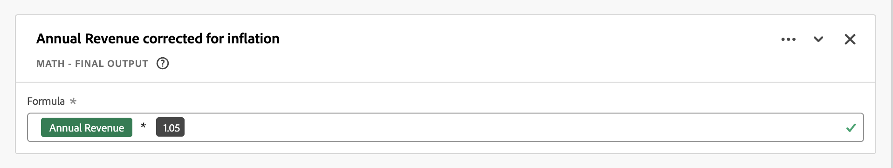
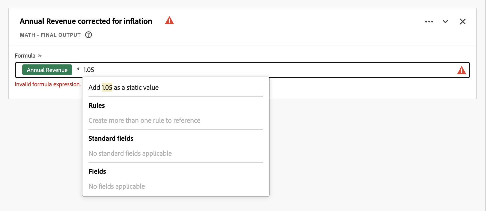
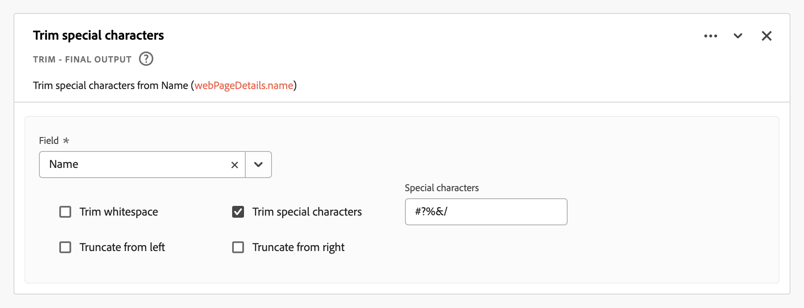

# Afgeleide velden

Afgeleide velden zijn een belangrijk aspect van de functionaliteit voor realtime rapportage in Adobe Customer Journey Analytics. Een afgeleid gebied staat u toe om (vaak complexe) gegevensmanipulaties op de vlucht, door een klantgerichte regelbouwer te bepalen. Vervolgens kunt u dat afgeleide veld als een component (metrisch of dimensionaal) gebruiken in [Werkruimte](../../analysis-workspace/home.md) of zelfs het afgeleide veld nader te definiëren als een component in [Gegevens, weergave](../data-views.md).

Afgeleide velden kunnen veel tijd en moeite besparen, in vergelijking met het transformeren of manipuleren van gegevens op andere locaties buiten de Customer Journey Analytics. zoals [Gegevensprep](https://experienceleague.adobe.com/docs/experience-platform/data-prep/home.html), [Data Distiller](https://experienceleague.adobe.com/docs/experience-platform/query/data-distiller/overview.html)of binnen uw eigen ETL-processen (Extract Transform Load) / Extract Load Transform (ELT-processen).

Afgeleide velden worden gedefinieerd binnen [Gegevensweergaven](../data-views.md), zijn gebaseerd op een set functies die als regels worden gedefinieerd en worden toegepast op beschikbare standaard- en/of schemavelden.

Voorbeelden van gebruiksgevallen zijn:

- Definieer een afgeleid veld Paginanaam dat onjuiste waarden voor de verzamelde paginanamen corrigeert om de waarden voor de paginanaam te corrigeren.

- Definieer een afgeleid veld Marketing Channel dat het juiste marketingkanaal bepaalt op basis van een of meer voorwaarden (bijvoorbeeld URL-parameter, pagina-URL, paginanaam).

## Afgeleide veldinterface

Wanneer u een afgeleid veld maakt of bewerkt, gebruikt u de afgeleide veldinterface.

|  | Naam | Beschrijving |
|---------|----------|--------|
| 1 | **Kiezer** | U gebruikt het selectiegebied om uw functie, functiesjabloon, schemaveld of standaardveld te selecteren en te slepen naar de regelbouwer.  Gebruik de vervolgkeuzelijst om te selecteren tussen:   [!UICONTROL Functions] - beschikbare lijsten [functies](#function-reference),   [!UICONTROL Function templates] - beschikbare lijsten [functiesjablonen](#function-templates),    [!UICONTROL Schema fields] - geeft een lijst weer van velden die beschikbaar zijn in categorieën gegevenssets (gebeurtenis, profiel, opvraging) en eerder gedefinieerde afgeleide velden, en   [!UICONTROL Standard fields] - standaard beschikbare velden (zoals Platform Dataset ID). Alleen standaardvelden met tekenreeksen en numerieke velden worden weergegeven in de kiezer. Als de functie andere gegevenstypen ondersteunt, kunnen standaardvelden met deze andere gegevenstypen worden geselecteerd voor waarden of velden binnen de regelinterface. Met de opdracht  Zoekvak.  U kunt de lijst met geselecteerde objecten filteren door  Filteren en filters opgeven in het dialoogvenster [!UICONTROL Filter fields by] in. U kunt filters eenvoudig verwijderen met  voor elk filter. |
| 2 | **Regelbouwer** | U bouwt uw afgeleid gebied opeenvolgend gebruikend één of meerdere regels. Een regel is een specifieke implementatie van een functie en wordt daarom altijd met slechts één functie geassocieerd. U maakt een regel door een functie naar de regelbouwer te slepen. Het functietype bepaalt de interface van de regel. Zie de [Regelinterface](#rule-interface) voor meer informatie .  U kunt een functie bij het begin, het eind, of binnen tussen regels opnemen reeds beschikbaar in de regelbouwer. De laatste regel in de regelbouwer bepaalt de definitieve output van het afgeleide gebied. |
| 3 | **[!UICONTROL ** Veldinstellingen **]** | U kunt het afgeleide veld een naam geven en beschrijven en het veldtype controleren. |
| 4 | **[!UICONTROL ** Uiteindelijke uitvoer **]** | In dit gebied wordt ter plekke een bijgewerkte voorvertoning van uitvoerwaarden weergegeven, gebaseerd op gegevens in de afgelopen 30 dagen en de wijzigingen die u aanbrengt in het afgeleide veld in de regelbuilder. |

{style="table-layout:auto"}

## Veldsjabloonwizard

Wanneer u voor het eerst toegang krijgt tot de afgeleide veldinzet, [!UICONTROL Start with a field template] wordt weergegeven.

1. Selecteer de sjabloon die het beste het type veld beschrijft dat u wilt maken.
2. Selecteer de **[!UICONTROL ** Selecteren **]** om door te gaan.

Het dialoogvenster met afgeleide velden wordt gevuld met regels (en functies) die vereist of handig zijn voor het type veld dat u hebt geselecteerd. Zie [Functiesjablonen](#function-templates) voor meer informatie over de beschikbare sjablonen.

## Regelinterface

Wanneer u een regel in de regelbouwer bepaalt, gebruikt u de regelinterface.

|  | Naam | Beschrijving |
|---------|----------|--------|
| A | **Naam van regel** | Standaard is de regelnaam **Regel X** (X verwijst naar een volgnummer). Als u de naam van een regel wilt bewerken, selecteert u de naam en typt u de nieuwe naam, bijvoorbeeld `Query Parameter`. |
| B | **Functienaam** | De geselecteerde functienaam voor de regel, bijvoorbeeld [!UICONTROL URL PARSE]. Wanneer de functie de laatste in de reeks functies is en de uiteindelijke uitvoerwaarden bepaalt, wordt de functienaam gevolgd door [!UICONTROL - FINAL OUTPUT]bijvoorbeeld [!UICONTROL URL PARSE - FINAL OUTPUT].  Als u een pop-up met meer informatie over de functie wilt weergeven, selecteert u . |
| C | **Beschrijving van regel** | U kunt desgewenst een beschrijving aan een regel toevoegen. Selecteren selecteert u vervolgens **[!UICONTROL ** Beschrijving toevoegen **]** een beschrijving toevoegen of **[!UICONTROL ** Beschrijving bewerken **]** om een bestaande beschrijving te bewerken. Gebruik de editor om een beschrijving in te voeren. U kunt de werkbalk gebruiken om de tekst op te maken (met de stijlkiezer, vet, cursief, onderstrepen, rechts, links, gecentreerd, kleur, nummerlijst, opsommingslijst) en om koppelingen toe te voegen aan externe informatie.  Klik buiten de editor om het bewerken van de beschrijving te voltooien. |
| D | **Functiegebied** | Definieert de logica van de functie. De interface is afhankelijk van het type functie. De vervolgkeuzelijst voor [!UICONTROL Field] of [!UICONTROL Value] geeft alle categorieën velden weer (regels, standaardvelden, velden) die beschikbaar zijn, op basis van het type invoer dat de functie verwacht. U kunt ook een veld van de kiezer voor schema- en standaardvelden naar een veld of waarde slepen. Wanneer dat gesleepte gebied van een dataset van de Opzoekmachine voortkomt, wordt een functie van de Opzoeken automatisch opgenomen vóór de functie u bepaalt.  Zie [Functieverwijzing](#function-reference) voor gedetailleerde informatie over elk van de ondersteunde functies. |

{style="table-layout:auto"}

## Een afgeleid veld maken

1. Selecteer een bestaande gegevensweergave of maak een gegevensweergave. Zie [Gegevensweergaven](../data-views.md) voor meer informatie .

2. Selecteer de **[!UICONTROL ** Componenten **]** van de weergave Gegevens.

3. Selecteren **[!UICONTROL ** Afafgeleid veld maken **]** van de linkerspoorstaaf.

4. Als u een afgeleid veld wilt definiëren, gebruikt u de [!UICONTROL Create derived field] interface. Zie [Afgeleide veldinterface](#derived-field-interface).

   Als u het nieuwe afgeleide veld wilt opslaan, selecteert u **[!UICONTROL ** Opslaan **]**.

5. Het nieuwe afgeleide veld wordt toegevoegd aan de [!UICONTROL Derived fields >] container, als onderdeel van **[!UICONTROL ** Schema-velden **]** in de linkertrack van de gegevensweergave.

## Een afgeleid veld bewerken

1. Selecteer een bestaande gegevensweergave. Zie [Gegevensweergaven](../data-views.md) voor meer informatie .

2. Selecteer de **[!UICONTROL ** Componenten **]** van de weergave Gegevens.

3. Selecteren **[!UICONTROL ** Schema-velden **]** in de [!UICONTROL Connection] aan de linkerkant.

4. Selecteren **[!UICONTROL ** Afgeleide velden >**]** container.

5. Houd de cursor boven het afgeleide veld dat u wilt bewerken en selecteer .

6. Als u het afgeleide veld wilt bewerken, gebruikt u de opdracht [!UICONTROL Edit derived field] interface. Zie [Afgeleide veldinterface](#derived-field-interface).

   - Selecteren **[!UICONTROL ** Opslaan **]** om het bijgewerkte afgeleide veld op te slaan.

   - Selecteren **[!UICONTROL ** Annuleren **]** om wijzigingen die u hebt aangebracht in het afgeleide veld te annuleren.

   - Selecteren **[!UICONTROL ** Opslaan als **]** om het afgeleide gebied als nieuw afgeleid gebied te bewaren. Het nieuwe afgeleide veld heeft dezelfde naam als het oorspronkelijke bewerkte afgeleide veld met `(copy)` toegevoegd.

U kunt ook een afgeleid veld gebruiken als component voor afmetingen of metriek in de gegevensweergave:

1. Selecteer de component. De component kan een andere naam hebben dan het afgeleide veld.

1. Selecteer in het deelvenster Component de optie  naast het afgeleide veld, onder de veldnaam Schema.

1. Als u het afgeleide veld wilt bewerken, gebruikt u de opdracht [!UICONTROL Edit derived field] interface. Zie [Afgeleide veldinterface](#derived-field-interface).

   - Selecteren **[!UICONTROL ** Opslaan **]** om het bijgewerkte afgeleide veld op te slaan.

   - Selecteren **[!UICONTROL ** Annuleren **]** om wijzigingen die u hebt aangebracht in het afgeleide veld te annuleren.

   - Selecteren **[!UICONTROL ** Opslaan als **]** om het afgeleide gebied als nieuw afgeleid gebied te bewaren. Het nieuwe afgeleide veld heeft dezelfde naam als het oorspronkelijke bewerkte afgeleide veld met `(copy)` toegevoegd.

## Een afgeleid veld verwijderen

1. Selecteer een bestaande gegevensweergave. Zie [Gegevensweergaven](../data-views.md) voor meer informatie .

2. Selecteer de **[!UICONTROL ** Componenten **]** van de weergave Gegevens.

3. Selecteren **[!UICONTROL ** Schema-velden **]** tab in [!UICONTROL Connection] venster.

4. Selecteren **[!UICONTROL ** Afgeleide velden >**]** container.

5. Houd de cursor boven het afgeleide veld dat u wilt verwijderen en selecteer .

6. In de [!UICONTROL Edit derived field] interface, selecteren **[!UICONTROL Delete]**.

   A [!UICONTROL Delete component] wordt u gevraagd de verwijdering te bevestigen. Overweeg om het even welke externe verwijzingen er aan het afgeleide gebied buiten de mening van Gegevens zouden kunnen bestaan.

   - Selecteren **[!UICONTROL ** Doorgaan **]** om het afgeleide veld te verwijderen.

U kunt ook een afgeleid veld gebruiken als component voor afmetingen of metriek in de gegevensweergave:

1. Selecteer de component. De component kan een andere naam hebben dan het afgeleide veld.

1. Selecteer in het deelvenster Component de optie  naast het afgeleide veld, onder de veldnaam Schema.

1. In de [!UICONTROL Edit derived field] interface, selecteren **[!UICONTROL Delete]**.

   A [!UICONTROL Delete component] wordt u gevraagd de verwijdering te bevestigen. Overweeg om het even welke externe verwijzingen er aan het afgeleide gebied buiten de mening van Gegevens zouden kunnen bestaan.

   - Selecteren **[!UICONTROL ** Doorgaan **]** om het afgeleide veld te verwijderen.

>[!NOTE]
>
>Afgeleide gebieden worden beheerd op het niveau van de Verbinding in Customer Journey Analytics. Om het even welke die verandering in een afgeleid gebied in om het even welke meningen van Gegevens verbonden aan die Verbinding wordt aangebracht is op al deze bijbehorende meningen van Gegevens van toepassing.

## Functiesjablonen

Om snel een afgeleid gebied voor specifieke gebruiksgevallen tot stand te brengen, zijn de functiesjablonen beschikbaar. Deze functiesjablonen zijn toegankelijk vanuit het selectiegebied in de afgeleide veldinterface of worden weergegeven bij het eerste gebruik in het dialoogvenster [!UICONTROL Start with a field template] wizard.

### Marketingkanalen

Deze functiesjabloon gebruikt een verzameling regels om marketingkanalen te maken.

+++ Details

Als u de sjabloon wilt gebruiken, moet u de juiste parameters opgeven voor elke functie die wordt vermeld als onderdeel van de regels in de sjabloon. Zie [Functieverwijzing](#function-reference) voor meer informatie .

+++

### Bounces

Deze functiemalplaatje gebruikt een inzameling van regels om plaatsgrenzen te identificeren.

+++ Details

Als u de sjabloon wilt gebruiken, moet u de juiste parameters opgeven voor elke functie die wordt vermeld als onderdeel van de regels in de sjabloon. Zie [Functieverwijzing](#function-reference) voor meer informatie .

+++

### Combineren met meerdere Dimensionen

Deze functiesjabloon combineert twee waarden in één.

+++ Details

Als u de sjabloon wilt gebruiken, moet u de juiste parameters opgeven voor elke functie die wordt vermeld als onderdeel van de regels in de sjabloon. Zie [Functieverwijzing](#function-reference) voor meer informatie .

+++

### Vriendelijke naam gegevensset

Deze functiesjabloon bevat een leesbare naam voor de gegevensset.

+++ Details

Als u de sjabloon wilt gebruiken, moet u de juiste parameters opgeven voor elke functie die wordt vermeld als onderdeel van de regels in de sjabloon. Zie [Functieverwijzing](#function-reference) voor meer informatie .

+++

### Paginanaam van URL

Deze functiesjabloon maakt een eenvoudige paginanaam.

+++ Details

Als u de sjabloon wilt gebruiken, moet u de juiste parameters opgeven voor elke functie die wordt vermeld als onderdeel van de regels in de sjabloon. Zie [Functieverwijzing](#function-reference) voor meer informatie .

+++

### Seizoen vakantie

Deze functiesjabloon classificeert belangrijke tijden van het jaar.

+++ Details

Als u de sjabloon wilt gebruiken, moet u de juiste parameters opgeven voor elke functie die wordt vermeld als onderdeel van de regels in de sjabloon. Zie [Functieverwijzing](#function-reference) voor meer informatie .

+++

### Maandelijkse doelstellingen

Deze functiesjabloon stelt aangepaste maandelijkse doelen in.

+++ Details

Als u de sjabloon wilt gebruiken, moet u de juiste parameters opgeven voor elke functie die wordt vermeld als onderdeel van de regels in de sjabloon. Zie [Functieverwijzing](#function-reference) voor meer informatie .

+++

### Alle waarden ophalen in de lijst met gescheiden waarden

Deze functiesjabloon zet een beperkte lijst om in een array.

+++ Details

Als u de sjabloon wilt gebruiken, moet u de juiste parameters opgeven voor elke functie die wordt vermeld als onderdeel van de regels in de sjabloon. Zie [Functieverwijzing](#function-reference) voor meer informatie .

+++

### Eerste waarde ophalen in lijst met scheidingstekens

Deze functiesjabloon haalt de eerste waarde op in een lijst met scheidingstekens.

+++ Details

Als u de sjabloon wilt gebruiken, moet u de juiste parameters opgeven voor elke functie die wordt vermeld als onderdeel van de regels in de sjabloon. Zie [Functieverwijzing](#function-reference) voor meer informatie .

+++

### Laatste waarde ophalen in lijst met scheidingstekens

Deze functiesjabloon haalt de laatste waarde in een lijst met scheidingstekens op.

+++ Details

Als u de sjabloon wilt gebruiken, moet u de juiste parameters opgeven voor elke functie die wordt vermeld als onderdeel van de regels in de sjabloon. Zie [Functieverwijzing](#function-reference) voor meer informatie .

+++

### Domeinnaam

Deze functiesjabloon extraheert de domeinnaam met behulp van een reguliere expressie.

+++ Details

Als u de sjabloon wilt gebruiken, moet u de juiste parameters opgeven voor elke functie die wordt vermeld als onderdeel van de regels in de sjabloon. Zie [Functieverwijzing](#function-reference) voor meer informatie .

+++

### Parameter querytekenreeks ophalen

Deze functiesjabloon extraheert querytekenreekswaarden.

+++ Details

Als u de sjabloon wilt gebruiken, moet u de juiste parameters opgeven voor elke functie die wordt vermeld als onderdeel van de regels in de sjabloon. Zie [Functieverwijzing](#function-reference) voor meer informatie .

+++

### Overgangsveld

Deze functiesjabloon gaat van het ene veld naar het andere.

+++ Details

Als u de sjabloon wilt gebruiken, moet u de juiste parameters opgeven voor elke functie die wordt vermeld als onderdeel van de regels in de sjabloon. Zie [Functieverwijzing](#function-reference) voor meer informatie .

+++

### Eenvoudige botdetectie

Deze functiesjabloon implementeert de identificatie van lichtbot.

+++ Details

Als u de sjabloon wilt gebruiken, moet u de juiste parameters opgeven voor elke functie die wordt vermeld als onderdeel van de regels in de sjabloon. Zie [Functieverwijzing](#function-reference) voor meer informatie .

+++

### Koppeling afsluiten

Deze functiesjabloon identificeert de laatste koppeling waarop in een sessie is geklikt.

+++ Details

Als u de sjabloon wilt gebruiken, moet u de juiste parameters opgeven voor elke functie die wordt vermeld als onderdeel van de regels in de sjabloon. Zie [Functieverwijzing](#function-reference) voor meer informatie .

+++

### Koppeling downloaden

Deze functiesjabloon markeert algemene downloadkoppelingen.

+++ Details

Als u de sjabloon wilt gebruiken, moet u de juiste parameters opgeven voor elke functie die wordt vermeld als onderdeel van de regels in de sjabloon. Zie [Functieverwijzing](#function-reference) voor meer informatie .

+++

<!--

+++ Data clean up template

>[!WARNING]
>
>Could not find any information on this template.
+++

-->

## Functieverwijzing

{{select-package}}

Voor elke ondersteunde functie vindt u hieronder meer informatie over:

- specificaties:
   - invoergegevenstype: type ondersteunde gegevens;
   - invoer: mogelijke waarden voor invoer,
   - include-operatoren: operatoren die voor deze functie worden ondersteund (indien aanwezig),
   - beperkingen: beperkingen die gelden voor deze specifieke functie;
   - uitvoer.

- gebruiksgevallen, waaronder:
   - gegevens voordat het afgeleide veld wordt gedefinieerd;
   - hoe het afgeleide veld moet worden gedefinieerd,
   - gegevens na het definiëren van het afgeleide veld.

- beperkingen (indien van toepassing).

>[!NOTE]
>
>De naam van de opzoekfunctie is gewijzigd in [Classificeren](#classify). Zie de [Classificeren](#classify) voor meer informatie.

<!-- CASE WHEN -->

### Hoofdletter als

Hiermee past u voorwaarden toe op basis van gedefinieerde criteria in een of meer velden. Deze criteria worden vervolgens gebruikt om de waarden in een nieuw afgeleid veld te definiëren op basis van de volgorde van de voorwaarden.

+++ Details

## Specificaties {#casewhen-io}

| Gegevenstype invoer | Invoer | Opgenomen operatoren | Beperkingen | Uitvoer |
|---|---|---|---|---|
| <ul><li>String</li><li>Numeriek</li><li>Datum</li></ul> | <ul><li>[!UICONTROL If], [!UICONTROL Else If] container:
<ul><li>[!UICONTROL Value]</li><ul><li>Regels</li><li>Standaardvelden</li><li>Velden</li></ul><li>[!UICONTROL Criterion] (zie opgenomen operatoren, gebaseerd op geselecteerde waardetype)</li></ul></li><li>[!UICONTROL Then set value to], [!UICONTROL Otherwise set value to]:
<ul><li>[!UICONTROL Value]</li><ul><li>Regels</li><li>Standaardvelden</li><li>Velden</li></ul></ul></li></ul> | 
Tekenreeksen
<ul><li>Equals (Is gelijk aan)</li><li>Gelijk aan elke term</li><li>Contains the phrase (Bevat de woordgroep)</li><li>Contains any term (Bevat een term)</li><li>Contains all terms (Bevat alle termen)</li><li>Starts with (Begint met)</li><li>Begint met elke term</li><li>Ends with (Eindigt met)</li><li>Eindigt met om het even welke termijn</li><li>Does not equal (Is niet gelijk aan)</li><li>Is niet gelijk aan een term</li><li>Does not contain the phrase (Bevat niet de woordgroep)</li><li>Does not contain any term (Bevat geen enkele term)</li><li>Bevat niet alle termen</li><li>Begint niet met</li><li>Begint niet met enige termijn</li><li>Eindigt niet met</li><li>Beëindigt geen term</li><li>Is ingesteld</li><li>Is niet ingesteld</li></ul>
Numeriek
<ul><li>Equals (Is gelijk aan)</li><li>Does not equal (Is niet gelijk aan)</li><li>Is groter dan</li><li>Is groter dan of gelijk aan</li><li>Is kleiner dan</li><li>Is kleiner dan of gelijk aan</li><li>Is ingesteld</li><li>Is niet ingesteld</li></ul>
Datums
<ul><li>Equals (Is gelijk aan)</li><li>Does not equal (Is niet gelijk aan)</li><li>Is later dan</li><li>Is hoger dan of gelijk aan</li><li>Is voor</li><li>Is voor of gelijk aan</li><li>Is ingesteld</li><li>Is niet ingesteld</li></ul> | <ul><li>5 functies per afgeleid veld</li><li>200 [operatoren](#operators) per afgeleid veld. Een voorbeeld van één enkele operator is &#39;Refering Domain contains google&#39;. </li></ul> | 
Nieuw afgeleid veld
 |

{style="table-layout:auto"}

## Hoofdlettergebruik 1 {#casewhen-uc1}

U wilt regels definiëren om verschillende marketingkanalen te identificeren door trapsgewijze logica toe te passen om een marketingkanaalveld in te stellen op de juiste waarde:

- Als de verwijzer afkomstig is van een zoekmachine en de pagina een querytekenreekswaarde heeft waar `cid` contains `ps_`, dient het afzetkanaal te worden geïdentificeerd als een [!DNL *Betaalde zoekopdracht*].
- Als de verwijzer afkomstig is van een zoekmachine en de pagina niet de queryreeks heeft `cid`, dient het afzetkanaal te worden geïdentificeerd als een [!DNL *Natuurlijk zoeken*].
- Als een pagina een waarde van het vraagkoord heeft waar `cid` contains `em_`, dient het afzetkanaal te worden geïdentificeerd als een [!DNL *E-mail*].
- Als een pagina een waarde van het vraagkoord heeft waar `cid` contains `ds_`, dient het afzetkanaal te worden geïdentificeerd als een [!DNL *Advertentie weergeven*].
- Als een pagina een waarde van het vraagkoord heeft waar `cid` contains `so_`, dient het afzetkanaal te worden geïdentificeerd als een [!DNL *Betaald sociaal*].
- Als de referentie afkomstig is van een verwijzend domein van [!DNL twitter.com], [!DNL facebook.com], [!DNL linkedin.com], of [!DNL tiktok.com], dient het afzetkanaal te worden geïdentificeerd als een [!DNL *Natuurlijk sociaal*].
- Indien aan geen van de bovenstaande voorschriften wordt voldaan, moet het afzetkanaal worden geïdentificeerd als [!DNL *Andere referentie*].

Als uw site de volgende voorbeeldgebeurtenissen ontvangt, bevat [!UICONTROL Referrer] en [!UICONTROL Page URL]Deze gebeurtenissen moeten als volgt worden omschreven:

| [!DNL Event] | [!DNL Referrer] | [!DNL Page URL] | [!DNL Marketing Channel] |
|:--:|----|----|----|
| 1 | `https://facebook.com` | `https://site.com/home` | [!DNL Natural Social] |
| 2 | `https://abc.com` | `https://site.com/?cid=ds_12345678` | [!DNL Display] |
| 3 | | `https://site.com/?cid=em_12345678` | [!DNL Email] |
| 4 | `https://google.com` | `https://site.com/?cid=ps_abc098765` | [!DNL Paid Search] |
| 5 | `https://google.com` | `https://site.com/?cid=em_765544332` | [!DNL Email] |
| 6 | `https://google.com` |  | [!DNL Natural Search] |

{style="table-layout:auto"}

### Gegevens voor {#casewhen-uc1-databefore}

| [!DNL Referrer] | [!DNL Page URL] |
|----|----|
| `https://facebook.com` | `https://site.com/home` |
| `https://abc.com` | `https://site.com/?cid=ds_12345678` |
|  | `https://site.com/?cid=em_12345678` |
| `https://google.com` | `https://site.com/?cid=ps_abc098765` |
| `https://google.com` | `https://site.com/?cid=em_765544332` |
| `https://google.com` | |

{style="table-layout:auto"}

### Afgeleid veld {#casewhen-uc1-derivedfield}

U definieert een `Marketing Channel` afgeleid veld. U gebruikt de [!UICONTROL CASE WHEN] functies voor het definiëren van regels die waarden maken voor het object op basis van bestaande waarden voor beide `Page URL` en `Referring URL` veld.

Let op het gebruik van de functie [!UICONTROL URL PARSE] regels definiëren om de waarden op te halen voor `Page Url` en `Referring Url` vóór de [!UICONTROL CASE WHEN] worden toegepast.

### Gegevens na {#casewhen-uc1-dataafter}

| [!DNL Marketing Channel] |
|----|
| [!DNL Natural Social] |
| [!DNL Display] |
| [!DNL Email] |
| [!DNL Paid Search] |
| [!DNL Email] |
| [!DNL Natural Search] |

{style="table-layout:auto"}

## Hoofdlettergebruik 2 {#casewhen-uc2}

U hebt verschillende verschillende zoekvariaties verzameld in uw [!DNL Product Finding Methods] dimensie. Om de algemene prestaties van onderzoek te begrijpen versus doorbladeren, moet u heel wat tijd doorbrengen die de resultaten manueel combineert.

Uw site verzamelt de volgende waarden voor uw [!DNL Product Finding Methods] dimensie. Uiteindelijk geven al deze waarden een zoekopdracht aan.

| Verzamelde waarde | Werkelijke waarde |
|---|---|
| [!DNL search p13n_no] | [!DNL search] |
| [!DNL search p13n_yes] | [!DNL search] |
| [!DNL search refine p13n_no] | [!DNL search] |
| [!DNL search refine p13n_yes] | [!DNL search] |
| [!DNL search redirect p13n_yes] | [!DNL search] |
| [!DNL search-redirect] | [!DNL search] |

{style="table-layout:auto"}

### Gegevens voor {#casewhen-uc2-databefore}

| [!DNL Product Finding Methods] |
|----|
| [!DNL search p13_no] |
| [!DNL search p13_yes] |
| [!DNL browse] |
| [!DNL search refine p13_no] |
| [!DNL search refine p13_yes] |
| [!DNL browse] |
| [!DNL search redirect p13_yes] |
| [!DNL search-redirect] |
| [!DNL browse] |

{style="table-layout:auto"}

### Afgeleid veld {#casewhen-uc2-derivedfield}

U definieert een `Product Finding Methods (new)` afgeleid veld. U maakt de volgende [!UICONTROL CASE WHEN] regels in regelbuilder. Deze regels passen logica op alle mogelijke variaties van oude toe [!UICONTROL Product Finding Methods] veldwaarden voor `search` en `browse` met de [!UICONTROL Contains the phrase] criterium.

### Gegevens na {#casewhen-uc2-dataafter}

| [!DNL Product Finding Methods (new)] |
|----|
| [!DNL search] |
| [!DNL search] |
| [!DNL browse] |
| [!DNL search] |
| [!DNL search] |
| [!DNL browse] |
| [!DNL search] |
| [!DNL search] |
| [!DNL browse] |

{style="table-layout:auto"}

## Hoofdlettergebruik 3 {#casewhen-uc3}

Als reisbedrijf, zou u reisduur voor boekte reizen willen opzeggen zodat kunt u op opgemaakte lengten van reizen melden.

Veronderstellingen:

- De organisatie verzamelt reisduur naar een numeriek veld.
- Ze willen de duur van 1 tot 3 dagen in een emmer met de naam &#39;[!DNL short trip]&#39;
- Ze willen de duur van 4 tot 7 dagen in een emmer met de naam &#39;[!DNL medium trip]&#39;
- Ze willen de tijdsduur van 8+ dagen in een emmer met de naam &#39;[!DNL long trip]&#39;
- 132 reizen werden geboekt voor een duur van 1 dag
- 110 reizen werden geboekt voor een duur van 2 dagen
- 105 reizen werden geboekt voor een duur van 3 dagen
- 99 reizen werden geboekt voor een duur van 4 dagen
- 92 reizen werden geboekt voor een duur van 5 dagen
- 85 reizen werden geboekt voor een duur van 6 dagen
- 82 reizen werden geboekt voor een duur van 7 dagen
- 78 reizen werden geboekt voor een duur van 8 dagen
- 50 reizen werden geboekt voor een duur van 9 dagen
- 44 reizen werden geboekt voor een duur van tien dagen
- 38 reizen werden geboekt voor een duur van 11 dagen
- 31 reizen werden geboekt voor een duur van twaalf dagen

Uw gewenste rapport zou als moeten kijken:

| [!DNL Trip Duration Type] | [!DNL Bookings] |
|----|---:|
| [!DNL medium trip] | 358 |
| [!DNL short trip] | 347 |
| [!DNL long trip] | 241 |

{style="table-layout:auto"}

### Gegevens voor {#casewhen-uc3-databefore}

| [!DNL Trip Duration] |
|---:|
| 1 |
| 12 |
| 3 |
| 6 |
| 4 |
| 8 |
| 6 |
| 2 |
| 1 |
| 2 |
| 21 |
| 8 |

### Afgeleid veld {#casewhen-uc3-derivedfield}

U definieert een `Trip Duration (bucketed)` afgeleid veld. U maakt de volgende [!UICONTROL CASE WHEN] regel in regelbouwer. Deze regel past logica toe om de oude [!UICONTROL Trip Duration] veldwaarden in drie waarden: `short trip`, `medium  trip`, en `long trip`.

### Gegevens na {#casewhen-uc3-dataafter}

| [!DNL Trip Duration (bucketed)] |
|---|
| [!DNL short trip] |
| [!DNL long trip] |
| [!DNL short trip] |
| [!DNL medium trip] |
| [!DNL medium trip] |
| [!DNL long trip] |
| [!DNL medium trip] |
| [!DNL short trip] |
| [!DNL short trip] |
| [!DNL short trip] |
| [!DNL long trip] |
| [!DNL long trip] |

## Meer informatie {#casewhen-more-info}

Customer Journey Analytics gebruikt een geneste containerstructuur, gemodelleerd na Adobe Experience Platform [XDM](https://experienceleague.adobe.com/docs/experience-platform/xdm/home.html?lang=nl) (Experience Data Model). Zie [Containers](../create-dataview.md#containers) en [Filtercontainers](../../components/filters/filters-overview.md#filter-containers) voor meer achtergrondinformatie. Dit containermodel, zij het flexibel door aard, legt sommige beperkingen op wanneer het gebruiken van de regelbouwer.

Customer Journey Analytics gebruikt het volgende standaardcontainermodel:

De volgende beperkingen zijn van toepassing en worden afgedwongen wanneer *selecteren* en *instellen* waarden.

|  | Restricties |
|:---:|----|
| **A** | Waarden *selecteren* binnen dezelfde [!UICONTROL If], [!UICONTROL Else If] construct (gebruiken [!UICONTROL And] of [!UICONTROL Or]) in een regel moet afkomstig zijn van dezelfde container en kan van elk type zijn (tekenreeks , numeriek , enzovoort).   |
| **B** | Alle waarden die u *set* over een regel moet van de zelfde container zijn en het zelfde type of een afgeleide waarde van het zelfde type hebben.    |
| **C** | De waarden die u *selecteren* dwars [!UICONTROL If], [!UICONTROL Else If] constructies in de regel do *niet* moeten afkomstig zijn uit dezelfde container en moet *niet* moeten van hetzelfde type zijn.    |

{style="table-layout:auto"}

+++

<!-- CLASSIFY -->

### Classificeren

Definieert een set waarden die worden vervangen door corresponderende waarden in een nieuw afgeleid veld.

+++ Details

>[!NOTE]
>
>Deze functie heette oorspronkelijk Opzoeken, maar is hernoemd naar Classificeren om plaats te maken voor de opzoekfunctie met andere functionaliteit.

## Specificaties {#classify-io}

| Gegevenstype invoer | Invoer | Opgenomen operatoren | Beperkingen | Uitvoer |
|---|---|---|---|---|
| <ul><li>String</li><li>Numeriek</li><li>Datum</li></ul> | <ul><li>[!UICONTROL Field to classify]:<ul><li>Regels</li><li>Standaardvelden</li><li>Velden</li></ul></li><li>[!UICONTROL When value equals] en [!UICONTROL Replace values with]:
<ul><li>String</li></ul><li>Oorspronkelijke waarden tonen<ul><li>Boolean</li></ul></li></ul> | 
N.v.t.
 | <ul><li>5 functies per afgeleid veld</li><li>200 [operatoren](#operators) per afgeleid veld. Elke vermelding voor [!UICONTROL When value equals original value] [!UICONTROL Replace value with New value] wordt beschouwd als een verrichting.</li></ul> | 
Nieuw afgeleid veld
 |

{style="table-layout:auto"}

## Hoofdlettergebruik 1 {#classify-uc1}

U hebt een CSV-bestand met een sleutelkolom voor `hotelID` en een of meer aanvullende kolommen met de `hotelID`: `city`, `rooms`, `hotel name`.
U verzamelt [!DNL Hotel ID] in een dimensie, maar wil een [!DNL Hotel Name] van de `hotelID` in het CSV-bestand.

**CSV-bestandsstructuur en -inhoud**

| [!DNL hotelID] | [!DNL city] | [!DNL rooms] | [!DNL hotel name] |
|---|---|---:|---|
| [!DNL SLC123] | [!DNL Salt Lake City] | 40 | [!DNL SLC Downtown] |
| [!DNL LAX342] | [!DNL Los Angeles] | 60 | [!DNL LA Airport] |
| [!DNL SFO456] | [!DNL San Francisco] | 75 | [!DNL Market Street] |
| [!DNL AMS789] | [!DNL Amsterdam] | 50 | [!DNL Okura] |

{style="table-layout:auto"}

**Huidig rapport**

| [!DNL Hotel ID] | Productweergaven |
|---|---:|
| [!DNL SLC123] | 200 |
| [!DNL LX342] | 198 |
| [!DNL SFO456] | 190 |
| [!DNL AMS789] | 150 |

{style="table-layout:auto"}

**Gewenst rapport**

| [!DNL Hotel Name] | Productweergaven |
|----|----:|
| [!DNL SLC Downtown] | 200 |
| [!DNL LA Airport] | 198 |
| [!DNL Market Street] | 190 |

{style="table-layout:auto"}

### Gegevens voor {#classify-uc1-databefore}

| [!DNL Hotel ID] |
|----|
| [!DNL SLC123] |
| [!DNL LAX342] |
| [!DNL SFO456] |
| [!DNL AMS789] |

{style="table-layout:auto"}

### Afgeleid veld {#classify-uc1-derivedfield}

U definieert een `Hotel Name` afgeleid veld. U gebruikt de [!UICONTROL CLASSIFY] functie om een regel te definiëren waarin u waarden van de [!UICONTROL Hotel ID] veld en vervangen door nieuwe waarden.

Als u oorspronkelijke waarden wilt opnemen die u niet hebt gedefinieerd als onderdeel van de waarden die u wilt classificeren (bijvoorbeeld Hotel ID AMS789), selecteert u **[!UICONTROL Show original values]**. Dit zorgt ervoor dat AMS789 deel uitmaakt van de uitvoer voor het afgeleide veld, ondanks dat die waarde niet wordt geclassificeerd.

### Gegevens na {#classify-uc1-dataafter}

| [!DNL Hotel Name] |
|----|
| [!DNL SLC Downtown] |
| [!DNL LA Airport] |
| [!DNL Market Street] |

{style="table-layout:auto"}

## Hoofdlettergebruik 2 {#classify-uc2}

U hebt URL&#39;s verzameld in plaats van de vriendelijke paginanaam voor verschillende pagina&#39;s. Deze gemengde verzameling van waarden breekt de rapportage af.

### Gegevens voor {#classify-uc2-databefore}

| [!DNL Page Name] |
|---|
| [!DNL Home Page] |
| [!DNL Flight Search] |
| `http://www.adobetravel.ca/Hotel-Search` |
| `https://www.adobetravel.com/Package-Search` |
| [!DNL Deals & Offers] |
| `http://www.adobetravel.ca/user/reviews` |
| `https://www.adobetravel.com.br/Generate-Quote/preview` |

{style="table-layout:auto"}

### Afgeleid veld {#classify-uc2-derivedfield}

U definieert een `Page Name (updated)` afgeleid veld. U gebruikt de [!UICONTROL CLASSIFY] functie om een regel te definiëren waarin u waarden van uw bestaande [!UICONTROL Page Name] veld en vervangen door bijgewerkte correcte waarden.

### Gegevens na {#classify-uc2-dataafter}

| [!DNL Page Name (updated)] |
|---|
| [!DNL Home Page] |
| [!DNL Flight Search] |
| [!DNL Hotel Search] |
| [!DNL Package Search] |
| [!DNL Deals & Offers] |
| [!DNL Reviews] |
| [!DNL Generate Quote] |

## Meer informatie {#classify-moreinfo}

De volgende aanvullende functionaliteit is beschikbaar in de interface van de regel Classificeren:

- Als u snel alle tabelwaarden wilt wissen, selecteert u  **[!UICONTROL Clear all table values]**.
- Als u een CSV-bestand wilt uploaden dat de oorspronkelijke waarden bevat voor Als waarden gelijk zijn en nieuwe waarden voor Vervangen door, selecteert u  **[!UICONTROL Upload CSV]**.
- Selecteer  **[!UICONTROL Download CSV template]**.
- Als u een CSV-bestand met alle oorspronkelijke en nieuwe waarden in de regelinterface wilt downloaden, selecteert u  **[!UICONTROL Download CSV values]**.

+++

<!-- CONCATENATE -->

### Samenvoegen

Hiermee voegt u veldwaarden samen tot één nieuw afgeleid veld met gedefinieerde scheidingstekens.

+++ Details

## Specificaties {#concatenate-io}

| Gegevenstype invoer | Invoer | Opgenomen operatoren | Beperkingen | Uitvoer |
|---|---|---|---|---|
| <ul><li>String</li></ul> | <ul><li>[!UICONTROL Value]:<ul><li>Regels</li><li>Standaardvelden</li><li>Velden</li><li>String</li></ul></li><li>[!UICONTROL Delimiter]:<ul><li>String</li></ul></li> </ul> | 
N.v.t.
 | 
2 functies per afgeleid veld
 | 
Nieuw afgeleid veld
 |

{style="table-layout:auto"}

## Hoofdletters gebruiken {#concatenate-uc}

U verzamelt momenteel de codes van de luchthaven van herkomst en de luchthaven van bestemming als afzonderlijke velden. U wilt de twee velden samenvoegen tot één afmeting, gescheiden door een afbreekstreepje (-). Zo kunt u de combinatie oorsprong en bestemming analyseren om hoogste geboekte routes te identificeren.

Veronderstellingen:

- Oorsprong en doelwaarden worden verzameld in afzonderlijke velden in dezelfde tabel.
- De gebruiker bepaalt of het scheidingsteken &#39;-&#39; tussen de waarden moet worden gebruikt.

Stel dat de volgende boekingen plaatsvinden:

- De klant ABC123 boekt een vlucht tussen Salt Lake City (SLC) en Orlando (MCO)
- De klant ABC456 boekt een vlucht tussen Salt Lake City (SLC) en Los Angeles (LAX)
- De klant ABC789 boekt een vlucht tussen Salt Lake City (SLC) en Seattle (SEA)
- Klant ABC987 boekt een vlucht tussen Salt Lake City (SLC) en San Jose (SJO)
- De klant ABC654 boekt een vlucht tussen Salt Lake City (SLC) en Orlando (MCO)

Het gewenste verslag moet er als volgt uitzien:

| Oorsprong/bestemming | Bladwijzers |
|----|---:|
| SLC-MCO | 2 |
| SLC-LAX | 1 |
| SLC-SEA | 1 |
| SLC-SJO | 1 |

{style="table-layout:auto"}

### Gegevens voor {#concatenate-uc-databefore}

| Oorsprong | Doel |
|----|---:|
| SLC | MCO |
| SLC | LAX |
| SLC | ZEE |
| SLC | SJO |
| SLC | MCO |

{style="table-layout:auto"}

### Afgeleid veld {#concatenate-derivedfield}

U definieert een `Origin - Destination` afgeleid veld. U gebruikt de [!UICONTROL CONCATENATE] functie om een regel te definiëren die de [!UICONTROL Original] en [!UICONTROL Destination] velden die de `-` [!UICONTROL Delimiter].

### Gegevens na {#concatenate-dataafter}

| Oorsprong - Bestemming (afgeleid veld) |
|---|
| SLC-MCO |
| SLC-LAX |
| SLC-SEA |
| SLC-SJO |
| SLC-MCO |

{style="table-layout:auto"}

+++

<!-- DEDUPLICATE -->

### Dedupliceren

Hiermee wordt voorkomen dat een waarde meerdere keren wordt geteld.

+++ Details

{{release-limited-testing-section}}

## Specificaties {#deduplicate-io}

| Gegevenstype invoer | Invoer | Opgenomen operatoren | Beperkingen | Uitvoer |
|---|---|---|---|---|
| <ul><li>String</li><li>Numeriek</li></ul> | <ul><li>[!UICONTROL Value]:<ul><li>Regels</li><li>Standaardvelden</li><li>Velden</li><li>String</li></ul></li><li>[!UICONTROL Scope]:<ul><li>Persoon</li><li>Sessie</li></ul></li><li>[!UICONTROL Deduplication ID]:<ul><li>Regels</li><li>Standaardvelden</li><li>Velden</li><li>String</li></ul><li>[!UICONTROL Value to keep]:<ul><li>Eerste instantie behouden</li><li>Laatste instantie behouden</li></ul></li></ul> | 
N.v.t.
 | 
5 functies per afgeleid veld
 | 
Nieuw afgeleid veld
 |

{style="table-layout:auto"}

## Hoofdlettergebruik 1 {#deduplicate-uc1}

U wilt voorkomen dat dubbele inkomsten worden geteld wanneer een gebruiker de bevestigingspagina voor het boeken opnieuw laadt. U gebruikt de reserveringsbevestigings-id bij de id om de inkomsten niet meer te tellen wanneer u deze op dezelfde gebeurtenis ontvangt.

### Gegevens voor {#deduplicate-uc1-databefore}

| Bevestigings-id voor boek | Ontvangsten |
|----|---:|
| ABC123456789 | 359 |
| ABC123456789 | 359 |
| ABC123456789 | 359 |

{style="table-layout:auto"}

### Afgeleid veld {#deduplicate-uc1-derivedfield}

U definieert een `Booking Confirmation` afgeleid veld. U gebruikt de [!UICONTROL DEDUPLICATE] functie voor het definiëren van een regel voor het dedupliceren van de [!UICONTROL Value] [!DNL Booking] for [!UICONTROL Scope] [!DNL Person] gebruiken [!UICONTROL Deduplication ID] [!UICONTROL Booking Confirmation ID]. U selecteert [!UICONTROL Keep first instance] als [!UICONTROL Value to keep].

### Gegevens na {#deduplicate-uc1-dataafter}

| Bevestigings-id voor boek | Ontvangsten |
|----|---:|
| ABC123456789 | 359 |
| ABC123456789 | 0 |
| ABC123456789 | 0 |

{style="table-layout:auto"}

## Hoofdlettergebruik 2 {#deduplicate-uc2}

U gebruikt gebeurtenissen als een proxy voor doorklikacties voor campagnes met externe marketingcampagnes. Bij opnieuw laden en omleiden wordt de metrische waarde van de gebeurtenis opgepompt. U wilt de dimensie van de trackingcode dedupliceren, zodat alleen de eerste code wordt verzameld en de overtelling van de gebeurtenis tot een minimum wordt beperkt.

### Gegevens voor {#deduplicate-uc2-databefore}

| Bezoekers-id | Marketingkanaal | Gebeurtenissen |
|----|---|---:|
| ABC123 | betaalde zoekopdracht | 1 |
| ABC123 | betaalde zoekopdracht | 1 |
| ABC123 | betaalde zoekopdracht | 1 |
| DEF123 | email | 1 |
| DEF123 | email | 1 |
| JKL123 | natuurlijk zoeken | 1 |
| JKL123 | natuurlijk zoeken | 1 |

{style="table-layout:auto"}

### Afgeleid veld {#deduplicate-uc2-derivedfield}

U definieert een nieuwe `Tracking Code (deduplicated)` afgeleid veld. U gebruikt de [!UICONTROL DEDUPLICATE] functie voor het definiëren van een regel voor het dedupliceren van de [!UICONTROL Tracking Code] met een [!UICONTROL Deduplication scope] van [!UICONTROL Session] en [!UICONTROL Keep first instance] als de [!UICONTROL Value to keep].

### Gegevens na {#deduplicate-uc2-dataafter}

| Bezoekers-id | Marketingkanaal | Gebeurtenissen |
|----|---|---:|
| ABC123 | betaalde zoekopdracht | 1 |
| DEF123 | email | 1 |
| JKL123 | natuurlijk zoeken | 1 |

{style="table-layout:auto"}

+++

<!-- FIND AND REPLACE -->

### Zoeken en vervangen

Hiermee zoekt u alle waarden in een geselecteerd veld en vervangt u deze waarden door een andere waarde in een nieuw afgeleid veld.

+++ Details

## Specificaties {#findreplace-io}

| Gegevenstype invoer | Invoer | Opgenomen operatoren | Beperkingen | Uitvoer |
|---|---|---|---|---|
| <ul><li>String</li></ul> | <ul><li>[!UICONTROL Value]<ul><li>Regels</li><li>Standaardvelden</li><li>Velden</li></ul></li><li>[!UICONTROL Find all], [!UICONTROL and replace all with]:<ul><li>String</li></ul></li></ul></ul> | 
Tekenreeksen
<ul><li>[!UICONTROL Find all], [!UICONTROL and replace all with]</li></ul> | 
5 functies per afgeleid veld
 | 
Nieuw afgeleid veld
 |

{style="table-layout:auto"}

## Hoofdletters gebruiken {#findreplace-uc}

U hebt een aantal misvormde waarden ontvangen voor uw externe marketingkanaalrapport, bijvoorbeeld `email%20 marketing` in plaats van `email marketing`. Deze misvormde waarden breken uw rapportering en maken het moeilijker te zien hoe e-mail presteert. U wilt vervangen `email%20marketing` with `email marketing`.

**Oorspronkelijk rapport**

| [!DNL External Marketing Channels] | [!DNL Sessions] |
|---|--:|
| [!DNL email marketing] | 500 |
| [!DNL email %20marketing] | 24 |

{style="table-layout:auto"}

**Voorkeursrapport**

| [!DNL External Marketing Channels] | [!DNL Sessions] |
|---|--:|
| [!DNL email marketing] | 524 |

### Gegevens voor {#findreplace-uc-databefore}

| [!DNL External Marketing] |
|----|
| [!DNL email marketing] |
| [!DNL email%20marketing] |
| [!DNL email marketing] |
| [!DNL email marketing] |
| [!DNL email%20marketing] |

{style="table-layout:auto"}

### Afgeleid veld {#findreplace-uc-derivedfield}

U definieert een `Email Marketing (updated)` afgeleid veld. U gebruikt de [!UICONTROL FIND AND REPLACE] functie om een regel te definiëren om alle instanties van `email%20marketing` with `email marketing`.

### Gegevens na {#findreplace-uc-dataafter}

| [!DNL External Marketing (updated)] |
|----|
| [!DNL email marketing] |
| [!DNL email marketing] |
| [!DNL email marketing] |
| [!DNL email marketing] |
| [!DNL email marketing] |

{style="table-layout:auto"}

+++

<!-- LOOKUP -->

### Opzoeken

De waarden van de opzoekopdracht die een gebied van een raadplegingsdataset gebruiken en keert een waarde op een nieuw afgeleid gebied of voor verdere regelverwerking terug.

+++ Details

## Specificatie {#lookup-io}

| Gegevenstype invoer | Invoer | Opgenomen operatoren | Limiet | Uitvoer |
|---|---|---|---|---|
| <ul><li>String</li><li>Numeriek</li><li>Datum</li></ul> | <ul><li>[!UICONTROL Field to apply lookup]:</li><ul><li>Regels</li><li>Standaardvelden</li><li>Velden</li></ul><li>[!UICONTROL Lookup dataset]</li><ul><li>Gegevensset</li></ul><li>[!UICONTROL Matching key]<ul><li>Regels</li><li>Velden</li></ul></li><li>Te retourneren waarden<ul><li>Regels</li><li>Velden</li></ul></li></ul> | 
N.v.t.
 | 
3 functies per afgeleid veld
 | 
Nieuw afgeleid veld of nieuwe waarde voor verdere verwerking in volgende regel
 |

{style="table-layout:auto"}

## Hoofdletters gebruiken {#lookup-uc}

U wilt de naam van de activiteit opzoeken met de activiteit-id die wordt verzameld wanneer uw klanten op een gepersonaliseerde banner klikken die via Adobe Target wordt weergegeven. U wilt een raadplegingsdataset met Analytics voor de activiteiten van het Doel (A4T) gebruiken die activiteitenids en activiteitennamen bevatten.

### Gegevensset voor opzoeken van A4T {#lookup-uc-lookup}

| Activiteits-id | Naam activiteit |
|---|---|
| 415851 | MVT-testcategoriepagina&#39;s |
| 415852 | Luma - Campagne Max. 2022 |
| 402922 | Banners startpagina |

{style="table-layout:auto"}

### Afgeleid veld {#lookup-uc-derivedfield}

U definieert een `Activity Name` afgeleid veld. U gebruikt de [!UICONTROL LOOKUP] functie om een regel te definiëren voor het opzoeken van de waarde van de verzamelde gegevens, opgegeven in het dialoogvenster [!UICONTROL Field to apply lookup] field (bijvoorbeeld **[!DNL ActivityIdentifier]**). U selecteert de opzoekgegevensset in het menu [!UICONTROL Lookup dataset] list (bijvoorbeeld **[!DNL New CJA4T Activities]**). Vervolgens selecteert u het id-veld (bijvoorbeeld **[!DNL ActivityIdentifier]**) van de [!UICONTROL Matching key] en het veld dat moet worden geretourneerd uit de [!UICONTROL Values to return] list (bijvoorbeeld **[!DNL ActivityName]**).

## Meer informatie {#lookup-more-info}

U kunt snel een [!UICONTROL Lookup] functie in de regelbouwer, die reeds één of meerdere andere functies bevat.

1. Selecteren **[!UICONTROL Schema fields]** van kiezer.
1. Selecteren  **[!UICONTROL Lookup datasets]**.
1. Selecteer uw raadplegingsdataset en vind het gebied u voor raadpleging wilt gebruiken.
1. Sleep het opzoekveld naar een van de beschikbare invoervelden voor een functie (bijvoorbeeld Als). Indien geldig, een blauw vakje, geëtiketteerd **[!UICONTROL + Add]**kunt u het veld neerzetten en automatisch een opzoekfunctie invoegen vóór de functie waarop u het opzoekveld hebt neergezet. De ingevoegde opzoekfunctie wordt automatisch gevuld met relevante waarden voor alle velden.
   

+++

<!-- LOWERCASE -->

### Kleine letters

Hiermee zet u waarden van een veld om in kleine letters en slaat u deze op in een nieuw afgeleid veld.

+++ Details

## Specificatie {#lowercase-io}

| Gegevenstype invoer | Invoer | Opgenomen operatoren | Limiet | Uitvoer |
|---|---|---|---|---|
| <ul><li>String</li><li>Numeriek</li><li>Datum</li></ul> | <ul><li>[!UICONTROL Field]:</li><ul><li>Regels</li><li>Standaardvelden</li><li>Velden</li></ul> | 
N.v.t.
 | 
2 functies per afgeleid veld
 | 
Nieuw afgeleid veld
 |

{style="table-layout:auto"}

## Hoofdletters gebruiken {#lowercase-uc}

U wilt alle verzamelde productnamen naar kleine letters converteren voor een juiste rapportage.

### Gegevens voor {#lowercase-uc-databefore}

| Verzamelde productnamen | Productweergaven |
|---|---:|
| Tennis racket | 35 |
| Tennis Racket | 33 |
| tennisracket | 21 |
| Baseball | 15 |
| Baseball Bat | 12 |
| honkbal | 10 |

{style="table-layout:auto"}

### Afgeleid veld {#lowercase-uc-derivedfield}

U definieert een `Product Names` afgeleid veld. U gebruikt de [!UICONTROL LOWERCASE] functie om een regel te definiëren die de waarde van de [!UICONTROL Collected Product Names] in het veld naar kleine letters en sla dat op in het nieuwe afgeleide veld.

### Gegevens na {#lowercase-uc-dataafter}

| Productnamen | Productweergaven |
|---|---|
| tennisracket | 89 |
| honkbal | 37 |

{style="table-layout:auto"}

+++

<!-- MATH -->

### Math

Gebruik wiskundige basisoperatoren (toevoegen, verwijderen, vermenigvuldigen, verdelen en verhogen tot een macht) op numerieke velden.

+++ Details

## Specificatie {#math-io}

| Gegevenstype invoer | Invoer | Opgenomen operatoren | Limiet | Uitvoer |
|---|---|---|---|---|
| <ul><li>Numeriek</li></ul> | <ul><li>Een of meerdere numerieke velden</li><li>Een of meer operatoren (toevoegen, verwijderen, vermenigvuldigen, verdelen, verhogen tot een macht)</li><li>Invoerwaarde gebruiker</li></ul> | <ul><li>`+` (toevoegen)</li><li>`-` (verwijderen)</li><li>`*` (vermenigvuldigen)</li><li>`/` (delen)</li><li>`^` (aan macht brengen)</li></ul> | <ul><li>25 bewerkingen per afgeleid veld</li><li>5 Math-functies per afgeleid veld</li></ul> | 
Nieuw afgeleid veld
 |

{style="table-layout:auto"}

## Hoofdletters gebruiken {#math-uc}

Door de inflatie wilt u de inkomstenaantallen van ingeslikte CRM-gegevens corrigeren met een inflatie van 5%.

### Gegevens voor {#math-uc-databefore}

| CRM-id | Jaarlijkse inkomsten |
|---|---:|
| 1234 | 35.070.000 |
| 4133 | 7.500.000 |
| 8110 | 10.980 |
| 2201 | 42.620 |

{style="table-layout:auto"}

### Afgeleid veld {#math-uc-derivedfield}

U definieert een `Corrected Annual Revenue` afgeleid veld. U gebruikt de [!UICONTROL MATH] om een regel te definiëren die het oorspronkelijke jaarlijkse inkomstennummer vermenigvuldigt met 1,05.

### Gegevens na {#math-uc-dataafter}

| CRM-id | Gecorrigeerde jaarinkomsten |
|---|---:|
| 1234 | 36.823.500 |
| 4133 | 7.875.000 |
| 8110 | 11 529 00 |
| 2201 | 44.751 |

{style="table-layout:auto"}

## Meer informatie {#math-more-info}

Een formule maken:

1. U begint gewoon te typen in het veld Formule en in numerieke velden die overeenkomen met wat u typt, worden weergegeven in een pop-upmenu. U kunt ook een numeriek veld slepen en neerzetten vanuit de beschikbare velden in het linkerdeelvenster.
   

1. De operand toevoegen (bijvoorbeeld `*` om te vermenigvuldigen) gevolgd door een ander veld of een statische waarde. U kunt haakjes gebruiken om complexere formules te definiëren.

1. Een statische waarde invoegen (bijvoorbeeld `1.05`), typt u de waarde en selecteert u **[!UICONTROL Add *x *als een statische waarde]**of **[!UICONTROL Add -*x* als een negatieve statische waarde]** in het pop-upmenu.
   

1. Een groen vinkje  geeft aan of je wiskundige formule geldig is, anders wordt er een waarschuwing weergegeven  en het bericht [!UICONTROL Invalid formula expression].
   

Er zijn enkele belangrijke overwegingen wanneer u werkt met statische getallen in het dialoogvenster [!UICONTROL MATH] functie:

- Statische waarden moeten aan een veld worden gekoppeld. Als u bijvoorbeeld de [!UICONTROL MATH] functie met alleen statische velden wordt niet ondersteund.
- U kunt de operator voor verhogen tot maximaal energieverbruik (`ˆ`) op een statische waarde.
- Als u meerdere statische waarden gebruikt in een formule, moeten deze statische waarden met haakjes worden gegroepeerd, anders is de formule niet geldig. Bijvoorbeeld:

   - Deze formule retourneert een fout.
     

   - Deze formule is geldig.
     

Gebruik de functie Math voor op raakniveau gebaseerde berekeningen. Gebruik de [Samenvatten](#summarize) functie voor op gebeurtenissen, sessies of personen gebaseerde berekeningen.

+++

<!-- MERGE FIELDS -->

### Velden samenvoegen

Hiermee voegt u waarden uit twee verschillende velden samen tot een nieuw afgeleid veld.

+++ Details

## Specificatie {#merge-fields-io}

| Gegevenstype invoer | Invoer | Opgenomen operatoren | Limiet | Uitvoer |
|---|---|---|---|---|
| <ul><li>String</li><li>Numeriek</li><li>Datum</li></ul> | <ul><li>[!UICONTROL Field]:</li><ul><li>Regels</li><li>Standaardvelden</li><li>Velden</li></ul> | 
N.v.t.
 | 
5 functies per afgeleid veld
 | 
Nieuw afgeleid veld
 |

{style="table-layout:auto"}

## Hoofdletters gebruiken {#merge-fields-uc}

U zou een afmeting tot stand willen brengen die uit het gebied van de paginanaam en het gebied van de vraagreden met de bedoeling wordt gemaakt om de reis over kanalen te analyseren.

### Gegevens voor {#merge-fields-uc-databefore}

| Paginanaam | Sessie | Bezoekers |
|---|--:|--:|
| Help-pagina | 250 | 200 |
| homepage | 500 | 250 |
| productdetailpagina | 300 | 200 |

{style="table-layout:auto"}

| Reden van oproep | Sessie | Bezoekers |
|---|--:|--:|
| vragen over mijn bestelling | 275 | 250 |
| een wijziging in mijn bestelling aanbrengen | 150 | 145 |
| probleem met bestellen | 100 | 95 |

{style="table-layout:auto"}

### Afgeleid veld {#merge-fields-uc-derivedfield}

U definieert een `Cross Channel Interactions` afgeleid veld. U gebruikt de [!UICONTROL MERGE FIELDS] functie voor het definiëren van een regel voor het samenvoegen van de waarden uit de [!UICONTROL Page Name] veld en [!UICONTROL Call Reason] en sla dat op in het nieuwe afgeleide veld.

### Gegevens na {#merge-fields-uc-dataafter}

| Interacties tussen kanalen | Sessies | Bezoekers |
|---|--:|--:|
| homepage | 500 | 250 |
| productdetailpagina | 300 | 200 |
| vragen over mijn bestelling | 275 | 250 |
| Help-pagina | 250 | 200 |
| een wijziging in mijn bestelling aanbrengen | 150 | 145 |
| probleem met bestellen | 100 | 95 |

{style="table-layout:auto"}

## Meer informatie {#merge-fields-moreinfo}

U moet hetzelfde type velden selecteren in een regel voor het samenvoegen van velden. Als u bijvoorbeeld een datumveld selecteert, moeten alle andere velden die u wilt samenvoegen, datumvelden zijn.

+++

<!-- NEXT OR PREVIOUS -->

### Volgende of Vorige

Neemt een gebied als input en lost de volgende of vorige waarde voor dat gebied binnen het werkingsgebied van de zitting of het gebruik op. Dit geldt alleen voor de velden Bezoek en Gebeurtenis.

+++ Details

## Specificatie {#prevornext-io}

| Gegevenstype invoer | Invoer | Opgenomen operatoren | Limiet | Uitvoer |
|---|---|---|---|---|
| <ul><li>String</li><li>Numeriek</li><li>Datum</li></ul> | <ul><li>[!UICONTROL Field]:</li><ul><li>Regels</li><li>Standaardvelden</li><li>Velden</li></ul><li>[!UICONTROL Method]:<ul><li>Vorige waarde</li><li>Volgende waarde</li></ul></li><li>[!UICONTROL Scope]:<ul><li>Persoon</li><li>Sessie</li></ul></li><li>[!UICONTROL Index]:<ul><li>Numeriek</li></ul><li>[!UICONTROL Include repeats]:<ul><li>Boolean</li></ul></li></ul> | 
N.v.t.
 | 
3 functies per afgeleid veld
 | 
Nieuw afgeleid veld
 |

{style="table-layout:auto"}

## Hoofdletters gebruiken {#prevornext-uc1}

U wilt begrijpen wat de **next** of **vorige** De waarde is van de gegevens die u ontvangt, rekening houdend met herhaalde waarden.

### Gegevens {#prevornext-uc1-databefore}

**Voorbeeld 1 - Afhandeling omvat herhalingen**

| Ontvangen gegevens | Volgende waarde Sessie Index = 1 Inclusief herhalingen | Volgende waarde Sessie Index = 1 Geen herhalingen opnemen | Vorige waarde Sessie Index = 1 Inclusief herhalingen | Vorige waarde Sessie Index = 1 Geen herhalingen opnemen |
|---|---|---|---|---|
| thuis | thuis | zoeken | *Geen waarde* | *Geen waarde* |
| thuis | zoeken | zoeken | thuis | *Geen waarde* |
| zoeken | zoeken | productdetails | thuis | thuis |
| zoeken | productdetails | productdetails | zoeken | thuis |
| productdetails | zoeken | zoeken | zoeken | zoeken |
| zoeken | productdetails | productdetails | productdetails | productdetails |
| productdetails | zoeken | zoeken | zoeken | zoeken |
| zoeken | zoeken | *Geen waarde* | productdetails | productdetails |
| zoeken | *Geen waarde* | *Geen waarde* | zoeken | productdetails |

{style="table-layout:auto"}

**Voorbeeld 2 - De behandeling omvat herhalingen met lege waarden in ontvangen gegevens**

| Ontvangen gegevens | Volgende waarde Sessie Index = 1 Inclusief herhalingen | Volgende waarde Sessie Index = 1 Geen herhalingen opnemen | Vorige waarde Sessie Index = 1 Inclusief herhalingen | Vorige waarde Sessie Index = 1 Geen herhalingen opnemen |
|---|---|---|---|---|
| thuis | thuis | zoeken | *Geen waarde* | *Geen waarde* |
| thuis | thuis | zoeken | thuis | *Geen waarde* |
| thuis | zoeken | zoeken | thuis | *Geen waarde* |
| zoeken | zoeken | productdetails | thuis | thuis |
|   |   |   |   |   |
| zoeken | zoeken | productdetails | zoeken | thuis |
| zoeken | productdetails | productdetails | zoeken | thuis |
| productdetails | *Geen waarde* | *Geen waarde* | zoeken | zoeken |
|   |   |   |   |   |

{style="table-layout:auto"}

### Afgeleid veld {#prevnext-uc1-derivedfield}

U definieert een `Next Value` of `Previous value` afgeleid veld. U gebruikt de [!UICONTROL NEXT OR PREVIOUS] functie om een regel te definiëren die de [!UICONTROL Data received] veld, selecteren [!UICONTROL Next value] of [!UICONTROL Previous value] als [!UICONTROL Method], [!UICONTROL Session] als Bereik en stel de waarde van [!UICONTROL Index] tot `1`.

## Meer informatie {#prevnext-moreinfo}

U kunt alleen velden selecteren die behoren tot de tabel Visit of Event.

[!UICONTROL Include repeats] bepaalt hoe herhalende waarden voor de [!UICONTROL NEXT OR PREVIOUS] functie.

- Neem herhalingen van het uiterlijk en de volgende of vorige waarden op. Indien [!UICONTROL Include Repeats] wordt geselecteerd, zal het om het even welke opeenvolgende herhalingen van volgende of vorige waarden van de huidige slag negeren.

- Rijen zonder (lege) waarden voor een geselecteerd veld hebben geen volgende of vorige waarden die zijn geretourneerd als onderdeel van het dialoogvenster [!UICONTROL NEXT OR PREVIOUS] functie-uitvoer.

+++

<!-- REGEX REPLACE -->

### Regex Replace

Hiermee vervangt u een waarde uit een veld met een reguliere expressie in een nieuw afgeleid veld.

+++ Details

## Specificatie {#regex-replace-io}

| Gegevenstype invoer | Invoer | Opgenomen operatoren | Limiet | Uitvoer |
|---|---|---|---|---|
| <ul><li>String</li><li>Numeriek</li></ul> | <ul><li>[!UICONTROL Field]:</li><ul><li>Regels</li><li>Standaardvelden</li><li>Velden</li></ul></ul><ul><li>[!UICONTROL Regex]:</li><ul><li>String</li></ul></li><li>[!UICONTROL Output Format]:<ul><li>String</li></ul></ul><ul><li>Hoofdlettergevoelig</li><ul><li>Boolean</li></ul></li></ul></li> | 
N.v.t.
 | 
1 functie per afgeleid veld
 | 
Nieuw afgeleid veld
 |

{style="table-layout:auto"}

## Hoofdletters gebruiken {#regex-replace-uc}

U wilt een gedeelte van een URL vastleggen en dat gebruiken als unieke pagina-id om het verkeer te analyseren. U gebruikt `[^/]+(?=/$|$)` voor de reguliere expressie om het einde van de URL vast te leggen en `$1` als het uitvoerpatroon.

### Gegevens voor {#regex-replace-uc-databefore}

| Pagina-URL |
|---|
| `https://business.adobe.com/products/analytics/adobe-analytics-benefits.html` |
| `https://business.adobe.com/products/analytics/adobe-analytics.html` |
| `https://business.adobe.com/products/experience-platform/customer-journey-analytics.html` |
| `https://business.adobe.com/products/experience-platform/adobe-experience-platform.html` |

{style="table-layout:auto"}

### Afgeleid veld {#regex-replace-uc-derivedfield}

U maakt een `Page Identifier` afgeleid veld. U gebruikt de [!UICONTROL REGEX REPLACE] functie om een regel te definiëren die de waarde van de [!UICONTROL Referring URL] veld met een [!UICONTROL Regex] van `[^/]+(?=/$|$)` en [!UICONTROL Output format] van `$1`.

### Gegevens na {#regex-replace-uc-dataafter}

| Pagina-id |
|---|
| adobe-analytics-benefits.html |
| adobe-analytics.html |
| customer-journey-analytics.html |
| adobe-experience-platform.html |

## Meer informatie {#regex-replace-more-info}

Customer Journey Analytics gebruikt een subset van de Perl regex syntaxis. De volgende expressies worden ondersteund:

| Uitdrukking | Beschrijving |
| --- | --- |
| `a` | Eén teken `a`. |
| `a\|b` | Eén teken `a` of `b`. |
| `[abc]` | Eén teken `a`, `b`, of `c`. |
| `[^abc]` | Elk enkel teken behalve `a`, `b`, of `c`. |
| `[a-z]` | Eén teken in het bereik van `a`-`z`. |
| `[a-zA-Z0-9]` | Eén teken in het bereik van `a`-`z`, `A`-`Z`, of cijfers `0`-`9`. |
| `^` | Komt overeen met het begin van de regel. |
| `$` | Komt overeen met het einde van de regel. |
| `\A` | Begin van tekenreeks. |
| `\z` | Einde van tekenreeks. |
| `.` | Komt overeen met elk willekeurig teken. |
| `\s` | Willekeurig teken voor witruimte. |
| `\S` | Willekeurig teken zonder spatie. |
| `\d` | Willekeurig cijfer. |
| `\D` | Willekeurig niet-cijfer. |
| `\w` | Een letter, cijfer of onderstrepingsteken. |
| `\W` | Willekeurig niet-woordteken. |
| `\b` | Elke woordgrens. |
| `\B` | Willekeurig teken dat geen woordgrens is. |
| `\<` | Begin van woord. |
| `\>` | Einde van woord. |
| `(...)` | Leg alles vast. |
| `(?:...)` | Niet-markeren vastleggen. Voorkomt dat in de uitvoertekenreeks naar de overeenkomst wordt verwezen. |
| `a?` | Nul of één van `a`. |
| `a*` | Nul of meer van `a`. |
| `a+` | Eén of meer van `a`. |
| `a{3}` | Precies 3 van `a`. |
| `a{3,}` | 3 of meer van `a`. |
| `a{3,6}` | Tussen 3 en 6 van `a`. |

U kunt deze reeksen gebruiken in het dialoogvenster [!UICONTROL Output format] om het even welk aantal tijden en in om het even welke orde om de gewenste koordoutput te bereiken.

| Tijdelijke plaatsaanduidingsreeks uitvoeren | Beschrijving |
| --- | --- |
| `$&` | Hiermee wordt uitgevoerd wat overeenkomt met de gehele expressie. |
| `$n` | Hiermee wordt uitgevoerd wat overeenkomt met de nde subexpressie. Bijvoorbeeld: `$1` Hiermee wordt de eerste subexpressie uitgevoerd. |
| ``$` `` | Hiermee wordt de tekst uitgevoerd tussen het einde van de laatste gevonden overeenkomst (of het begin van de tekst als er geen vorige overeenkomst is gevonden) en het begin van de huidige overeenkomst. |
| `$+` | Hiermee wordt uitgevoerd wat overeenkomt met de laatst gemarkeerde subexpressie in de reguliere expressie. |
| `$$` | Hiermee wordt het teken van de tekenreeks uitgevoerd `"$"`. |

{style="table-layout:auto"}

+++

<!-- SPLIT -->

### Splitsen

Splitst een waarde van een veld in een nieuw afgeleid veld.

+++ Details

## Specificatie {#split-io}

| Gegevenstype invoer | Invoer | Opgenomen operatoren | Limiet | Uitvoer |
|---|---|---|---|---|
| <ul><li>String</li><li>Numeriek</li></ul> | <ul><li>[!UICONTROL Field]:</li><ul><li>Regels</li><li>Standaardvelden</li><li>Velden</li></ul></ul><ul><li>[!UICONTROL Method]:</li><ul><li>Van links</li><li>Van rechts</li><li>Omzetten in array</li></ul></li><li>Voor scheidingsteken:<ul><li>String</li></ul><li>Voor index:<ul><li>Numeriek</li></ul></li> | 
N.v.t.
 | 
5 functies per afgeleid veld
 | 
Nieuw afgeleid veld
 |

{style="table-layout:auto"}

## Hoofdlettergebruik 1 {#split-uc1}

U verzamelt reacties op spraak-apps in een gescheiden lijst in één dimensie. U wilt dat elke waarde in de lijst een unieke waarde is in het reactierapport.

### Gegevens voor {#split-uc1-databefore}

| Reacties van Voice-app | Gebeurtenissen |
|---|--:|
| het was geweldig, perfect logisch, zal anderen aanbevelen | 1 |
| het was groot, wat verwarrend, zal anderen adviseren | 1 |
| het was niet geweldig, erg verwarrend, zal anderen niet adviseren | 1 |

{style="table-layout:auto"}

### Afgeleid veld {#split-u1-derivedfield}

U maakt een `Responses` afgeleid veld. U gebruikt de [!UICONTROL SPLIT] functie om een regel te bepalen die  [!UICONTROL Convert to array] methode om de waarden om te zetten op basis van de [!UICONTROL Voice App Response] veld gebruiken `,` als de [!UICONTROL Delimiter].

### Gegevens na {#split-uc1-dataafter}

| Reacties | Gebeurtenissen |
|---|--:|
| het was geweldig | 2 |
| zal anderen aanbevelen | 2 |
| het was niet geweldig | 1 |
| perfect | 1 |
| enigszins verwarrend | 1 |
| zeer verwarrend | 1 |
| zal anderen niet adviseren | 1 |

{style="table-layout:auto"}

## Hoofdlettergebruik 2 {#split-uc2}

U verzamelt reacties op spraak-apps in een gescheiden lijst in één dimensie. U wilt de reacties van de eerste waarde in de lijst in een eigen dimensie plaatsen. U wilt de laatste waarde in de lijst in zijn eigen dimensie plaatsen.

### Gegevens voor {#split-uc2-databefore}

| Reacties | Gebeurtenissen |
|---|--:|
| het was fantastisch , perfect logisch , zal anderen aanraden | 1 |
| het was groot, wat verwarrend, zal anderen adviseren | 1 |
| het was niet geweldig, erg verwarrend, zal anderen niet adviseren | 1 |

{style="table-layout:auto"}

### Afgeleid veld {#split-u2-derivedfield}

U maakt een  `First Response` afgeleid veld. U gebruikt de [!UICONTROL SPLIT] functie om een regel te definiëren die de eerste waarde van de [!UICONTROL Responses] veld links van de reactie `,` als scheidingsteken.

U maakt een `Second Response` afgeleid veld om de laatste waarde te nemen van het veld [!UICONTROL Responses] door Aan de rechterkant 1 als Scheidingsteken en 1 als Index te selecteren.

### Gegevens na {#split-uc2-dataafter}

| Eerste reactie | Gebeurtenissen |
|---|--:|
| het was geweldig | 2 |
| het was niet geweldig | 1 |

{style="table-layout:auto"}

| Tweede reactie | Gebeurtenissen |
|---|--:|
| zal anderen aanbevelen | 2 |
| zal anderen niet adviseren | 1 |

{style="table-layout:auto"}

+++

<!-- SUMMARIZE -->

### Samenvatten

Hiermee past u functies van het aggregatietype toe op metriek of dimensies op gebeurtenis-, sessie- en gebruikersniveau.

+++ Details

{{release-limited-testing-section}}

## Specificatie {#summarize-io}

| Gegevenstype invoer | Invoer | Opgenomen operatoren | Limiet | Uitvoer |
|---|---|---|---|---|
| <ul><li>String</li><li>Numeriek</li><li>Datum</li></ul> | <ul><li>Waarde<ul><li>Regels</li><li>Standaardvelden</li><li>Velden</li></ul></li><li>Methoden samenvatten</li><li>Toepassingsgebied<ul><li>Gebeurtenis</li><li>Sessie</li><li>Persoon</li></ul></li></ul> | <ul><li>Numeriek<ul><li>MAX - retourneer de hoogste waarde van een reeks waarden</li><li>MIN - retourneert de laagste waarde van een reeks waarden</li><li>MEDIAN - retourneert mediaan voor een reeks waarden</li><li>MEAN - Geeft het gemiddelde voor een reeks waarden</li><li>SUM - retourneert de som voor een reeks waarden</li><li>COUNT - retourneert het aantal ontvangen waarden</li><li>DISTINCT - retourneert een set verschillende waarden</li></ul></li><li>Tekenreeksen<ul><li>DISTINCT - retourneert een set verschillende waarden</li><li>AFSTAND VAN TELLING - retourneert het aantal verschillende waarden</li><li>MEST COMMON - retourneert de tekenreekswaarde die het vaakst wordt ontvangen</li><li>LEAST COMMON - retourneert de tekenreekswaarde die het minst vaak wordt ontvangen</li><li>EERSTE - De eerste ontvangen waarde; alleen van toepassing op de sessie- en gebeurtenistabellen</li><li>LAST - De laatste ontvangen waarde; slechts van toepassing voor de zitting &amp; gebeurtenissenlijsten</li></ul></li><li>Datums<ul><li>DISTINCT - retourneert een set verschillende waarden</li><li>AFSTAND VAN TELLING - retourneert het aantal verschillende waarden</li><li>MEST COMMON - retourneert de tekenreekswaarde die het vaakst wordt ontvangen</li><li>LEAST COMMON - retourneert de tekenreekswaarde die het minst vaak wordt ontvangen</li><li>EERSTE - De eerste ontvangen waarde; alleen van toepassing op de sessie- en gebeurtenistabellen</li><li>LAST - De laatste ontvangen waarde; slechts van toepassing voor de zitting &amp; gebeurtenissenlijsten</li><li>EARLIEST - De vroegste ontvangen waarde (bepaald door tijd); slechts van toepassing voor de zitting &amp; gebeurtenistabellen</li><li>LATEST - De laatste ontvangen waarde (bepaald op tijd); alleen van toepassing op de sessie- en gebeurtenistabellen</li></ul></li></ul> | 3 functie per afgeleid veld | Nieuw afgeleid veld |

{style="table-layout:auto"}

## Hoofdletters gebruiken {#summarize-uc}

U wilt Toevoegen aan winkelwagentje indelen in drie verschillende categorieën: Klein, Normaal en Groot. Dit staat u toe om de kenmerken van high-value klanten te analyseren en te identificeren.

### Gegevens voor {#summarize-uc-databefore}

Veronderstellingen:

- Toevoegen aan winkelwagentje wordt verzameld als een numeriek veld.

Scenario&#39;s:

- CustomerABC123 voegt $35 toe aan hun winkelwagentje voor ProductABC en voegt vervolgens ProductDEF voor $75 apart toe aan hun winkelwagentje.
- CustomerDEF456 voegt $50 toe aan hun winkelwagentje voor ProductGHI en voegt vervolgens ProductJKL voor $275 apart toe aan hun winkelwagentje.
- CustomerGHI789 voegt 500 dollar toe aan hun winkelwagentje voor ProductMNO.

Logica:

- Als Totaal toevoegen aan winkelwagentje voor een bezoeker minder dan $150 is, ingesteld op Klein.
- Als Totaal toevoegen aan winkelwagentje voor een bezoeker groter is dan $150, maar kleiner dan $500, ingesteld op Normaal.
- Als Totaal toevoegen aan winkelwagentje voor een bezoeker groter is dan of gelijk is aan $500, ingesteld op Groot.

Resultaten:

- Totale toevoeging aan winkelwagentje voor $110 voor CustomerABC123.
- Totale toevoeging aan winkelwagentje voor $ 325 voor CustomerDEF456.
- Totaal extra kosten voor 500 dollar voor CustomerGHI789.

### Afgeleid veld {#summarize-uc-derivedfield}

U maakt een `Add To Cart Revenue Size` afgeleid veld. U gebruikt de [!UICONTROL SUMMARIZE] en de [!UICONTROL Sum] [!UICONTROL Summarize method] with [!UICONTROL Scope] instellen op [!UICONTROL Person] om de waarden van de [!UICONTROL cart_add] veld. Vervolgens gebruikt u een tweede [!UICONTROL CASE WHEN] om het resultaat in de formaten van de boomcategorie te splitsen.

### Gegevens na {#summarize-uc-dataafter}

| Toevoegen aan grootte van winkelwagentje | Bezoekers |
|---|--:|
| Klein | 1 |
| Normaal | 1 |
| Groot | 1 |

{style="table-layout:auto"}

## Meer informatie {#summarize-more-info}

Gebruik de functie Samenvatten voor op gebeurtenissen, sessies of personebereik gebaseerde berekeningen. Gebruik de [Math](#math) functie voor op raakniveau gebaseerde berekeningen.

+++

<!-- TRIM -->

### Verkleinen

Hiermee wordt witruimte, speciale tekens of het aantal tekens vanaf het begin of het einde van veldwaarden bijgesneden in een nieuw afgeleid veld.

+++ Details

## Specificatie {#trim-io}

| Gegevenstype invoer | Invoer | Opgenomen operatoren | Limiet | Uitvoer |
|---|---|---|---|---|
| <ul><li>String</li></ul> | <ul><li>[!UICONTROL Field]<ul><li>Regels</li><li>Standaardvelden</li><li>Velden</li></ul></li><li>Witruimte bijsnijden</li><li>Speciale tekens bijsnijden<ul><li>Invoer van speciale tekens</li></ul></li><li>Verkleinen vanaf links<ul><li>Van <ul><li>Begin tekenreeks</li><li>Positie<ul><li>Positienummer</li></ul></li><li>String<ul><li>String, waarde</li><li>Index</li><li>Markering voor opnemen van tekenreeks</li></ul></li></ul></li><li>Naar<ul><li>Einde tekenreeks</li><li>Positie<ul><li>Positienummer</li></ul></li><li>String<ul><li>String, waarde</li><li>Index</li><li>Markering voor opnemen van tekenreeks</li></ul></li><li>Lengte</li></ul></li></ul></li><li>Bijsnijden vanaf rechts<ul><li>Van <ul><li>Einde tekenreeks</li><li>Positie<ul><li>Positienummer</li></ul></li><li>String<ul><li>String, waarde</li><li>Index</li><li>Markering voor opnemen van tekenreeks</li></ul></li></ul></li><li>Naar<ul><li>Begin tekenreeks</li><li>Positie<ul><li>Positienummer</li></ul></li><li>String<ul><li>String, waarde</li><li>Index</li><li>Markering voor opnemen van tekenreeks</li></ul></li><li>Lengte</li></ul></li></ul></li></ul> | 
N.v.t.
 | 
1 functie per afgeleid veld
 | 
Nieuw afgeleid veld
 |

## Hoofdlettergebruik 1 {#trim-uc1}

U verzamelt productgegevens, maar de gegevens bevatten verborgen spatietekens die fragmentrapporten bevatten. U wilt alle overtollige witruimte gemakkelijk bijsnijden

### Gegevens voor {#trim-uc1-databefore}

| Product-id | Gebeurtenissen |
|---|--:|
| `"prod12356 "` | 1 |
| `"prod12356"` | 1 |
| `" prod12356"` | 1 |

{style="table-layout:auto"}

### Afgeleid veld {#trim-u1-derivedfield}

U maakt een `Product Identifier` afgeleid veld. U gebruikt de [!UICONTROL TRIM] functie om een regel te bepalen aan **[!UICONTROL Trim whitespace]** van de **[!UICONTROL Product ID]** veld.

### Gegevens na {#trim-uc1-dataafter}

| Product-id | Gebeurtenissen |
|---|--:|
| `"prod12356"` | 3 |

{style="table-layout:auto"}

## Hoofdlettergebruik 2 {#trim-uc2}

Uw gegevens over verzamelde paginanamen bevatten enkele onjuiste speciale tekens aan het einde van de paginanaam die moeten worden verwijderd.

### Gegevens voor {#trim-uc2-databefore}

| Naam | Gebeurtenissen |
|---|--:|
| homepage# | 1 |
| homepage? | 1 |
| homepage% | 1 |
| homepage&amp; | 1 |
| homepage/ | 1 |

{style="table-layout:auto"}

### Afgeleid veld {#trim-u2-derivedfield}

U maakt een  `Page Name` afgeleid veld. U gebruikt de [!UICONTROL TRIM] functie om een regel te bepalen aan [!UICONTROL Trim special characters] van de [!UICONTROL Name] veld met de [!UICONTROL Special characters] `#?%&/`.

### Gegevens na {#trim-uc2-dataafter}

| Paginanaam | Gebeurtenissen |
|---|--:|
| homepage | 5 |

{style="table-layout:auto"}

## Hoofdlettergebruik 3 {#trim-uc3}

U verzamelt gegevens, waaronder een storeID. De storeID bevat de afgekorte Amerikaanse statuscode als de eerste twee tekens. U wilt die staatscode in uw rapportering slechts gebruiken.

### Gegevens voor {#trim-uc3-databefore}

| storeID | Gebeurtenissen |
|---|--:|
| CA293842 | 1 |
| CA423402 | 1 |
| UT123418 | 1 |
| UT189021 | 1 |
| ID028930 | 1 |
| OR234223 | 1 |
| NV22342 | 1 |

{style="table-layout:auto"}

### Afgeleid veld {#trim-u3-derivedfield}

U maakt een  `Store Identifier` afgeleid veld. U gebruikt de [!UICONTROL TRIM] functie om een regel te bepalen aan [!UICONTROL Truncate from right] de [!UICONTROL storeID] veld van einde tekenreeks naar positie `3`.

### Gegevens na {#trim-uc3-dataafter}

| Store Identifier | Gebeurtenissen |
|---|--:|
| CA | 2 |
| UT | 2 |
| ID | 1 |
| OF | 1 |
| NV | 1 |

{style="table-layout:auto"}
+++

<!-- URL PARSE -->

### URL-parsering

Hiermee worden verschillende delen van een URL uitgeparseerd, zoals protocol-, host-, pad- of queryparameters.

+++ Details

## Specificaties {#urlparse-io}

| Gegevenstype invoer | Invoer | Opgenomen operatoren | Limiet | Uitvoer |
|---|---|---|---|---|
| <ul><li>String</li></ul> | <ul><li>[!UICONTROL Field]:</li><ul><li>Regels</li><li>Standaardvelden</li><li>Velden</li></ul><li>[!UICONTROL Option]:<ul><li>[!UICONTROL Get protocol]</li><li>[!UICONTROL Get host]</li><li>[!UICONTROL Get path]</li><li>[!UICONTROL Get query string value]<ul><li>[!UICONTROL Query parameter]:<ul><li>String</li></ul></li></ul></li><li>[!UICONTROL Get hash value]</li></ul></li></ul></li></ul> | 
N.v.t.
 | 
5 functies per afgeleid veld
 | 
Nieuw afgeleid veld
 |

{style="table-layout:auto"}

## Hoofdlettergebruik 1 {#urlparse-uc1}

U wilt het verwijzende domein van verwijzende URL als deel van de reeks van regels van een marketingkanaal slechts gebruiken.

### Gegevens voor {#urlparse-uc1-databefore}

| [!DNL Referring URL] |
|----|
| `https://www.google.com/` |
| `https://duckduckgo.com/` |
| `https://t.co/` |
| `https://l.facebook.com/` |

{style="table-layout:auto"}

### Afgeleid veld {#urlparse-uc1-derivedfield}

U definieert een  `Referring Domain` afgeleid veld. U gebruikt de [!UICONTROL URL PARSE] functie om een regel te bepalen om de gastheer van te halen [!UICONTROL Referring URL] en sla dat op in het nieuwe afgeleide veld.

### Gegevens na {#urlparse-uc1-dataafter}

| [!DNL Referrer Domain] |
|----|
| [!DNL www.google.com] |
| [!DNL duckduckgo.com] |
| [!DNL t.co] |
| [!DNL l.facebook.com] |

{style="table-layout:auto"}

## Hoofdlettergebruik 2 {#urlparse-uc2}

U wilt de waarde van `cid` parameter van een queryreeks in een [!DNL Page URL] als deel van de output van een afgeleid het volgen coderapport.

### Gegevens voor {#urlparse-uc2-databefore}

| [!DNL Page URL] |
|----|
| `https://www.adobe.com/?cid=abc123` |
| `https://www.adobe.com/?em=email1234&cid=def123` |
| `https://www.adobe.com/landingpage?querystring1=test&test2=1234&cid=xyz123` |

{style="table-layout:auto"}

### Afgeleid veld {#urlparse-uc2-derivedfield}

U definieert een `Query String CID` afgeleid veld. U gebruikt de [!UICONTROL URL PARSE] functie om een regel te bepalen om de waarde van de parameter van het vraagkoord in te halen [!UICONTROL Page URL] veld, opgeven `cid` als de queryparameter. De outputwaarde wordt opgeslagen op het nieuwe afgeleide gebied.

### Gegevens na {#urlparse-uc2-dataafter}

| [!DNL Query String CID] |
|----|
| [!DNL abc123] |
| [!DNL def123] |
| [!DNL xyz123] |

{style="table-layout:auto"}

+++

## Beperkingen

De volgende beperkingen zijn van toepassing op de functionaliteit van het afgeleide veld in het algemeen:

- U kunt maximaal tien verschillende schemavelden gebruiken (zonder standaardvelden) bij het definiëren van regels voor een afgeleid veld.
   - Van dit maximum van tien verschillende schemagebieden, slechts worden een maximum van drie raadplegingsschema of profielschemagebieden toegestaan.
- U kunt maximaal 100 afgeleide velden per verbinding van de Customer Journey Analytics hebben.

### Overzicht van functiebeperkingen

| Functie | Beperkingen |
|---|---|
| 
Hoofdletter als
 | <ul><li>5 Geval wanneer functies per afgeleid gebied</li><li>200 [operatoren](#operators) per afgeleid veld</li></ul> |
| 
Classificeren
 | <ul><li>5 Classificeer functies per afgeleid gebied</li><li>200 [operatoren](#operators) per afgeleid veld</li></ul> |
| 
Samenvoegen
 | <ul><li>2 Samengevoegde functies per afgeleid veld</li></ul> |
| 
Dedupliceren
 | <ul><li>5 Deduplicatiefuncties per afgeleid veld</li></ul> |
| 
Zoeken en vervangen
 | <ul><li>2 Functies zoeken en vervangen per afgeleid veld</li></ul> |
| 
Opzoeken
 | <ul><li>5 Opzoekfuncties per afgeleid veld</li></ul> |
| 
Kleine letters
 | <ul><li>2 Kleine letters voor functies per afgeleid veld</li></ul> |
| 
Math
 | <ul><li>25 bewerkingen per afgeleid veld</li><li>5 Math-functies per afgeleid veld</li></ul> |
| 
Velden samenvoegen
 | <ul><li>2 Veldfuncties samenvoegen per afgeleid veld</li></ul> |
| 
Volgende of Vorige
 | <ul><li>3 Volgende of Vorige functies per afgeleid veld</li></ul> |
| 
Regex Replace
 | <ul><li>1 Regex-functie vervangen per afgeleid veld</li></ul> |
| 
Splitsen
 | <ul><li>5 Gesplitste functies per afgeleid veld</li></ul> |
| 
Samenvatten
 | <ul><li>3 Geef een overzicht van de functies per afgeleid veld</li></ul> |
| 
Verkleinen
 | <ul><li>1 Bijsnijdfunctie per afgeleid veld</li></ul> |
| 
URL-parsering
 | <ul><li>5 URL-parseerfuncties per afgeleid veld</li></ul> |

{style="table-layout:auto"}

### Operatoren

Een operator in een If of else If construct binnen een Case When functie is de combinatie van een criterium met **één** waarde. Elke extra waarde voor het criterium verhoogt het aantal operatoren.

De onderstaande voorwaarde gebruikt bijvoorbeeld 13 operatoren.

Een operator in de functie Classificeren is één item voor [!UICONTROL When value equal Original value] [!UICONTROL Replace value with New value].

De onderstaande regel voor classificeren gebruikt bijvoorbeeld 3 operatoren.

## Meer informatie {#trim-more-info}

[`Trim`](#trim) en [`Lowercase`](#lowercase) zijn functies die al beschikbaar zijn in de componentinstellingen in [Gegevensweergaven](../component-settings/overview.md). Door Afgeleide velden te gebruiken, kunt u deze functies combineren om complexe gegevenstransformatie rechtstreeks in Customer Journey Analytics uit te voeren. U kunt bijvoorbeeld `Lowercase` om hoofdlettergevoeligheid in een gebeurtenisveld te verwijderen en vervolgens te gebruiken [`Lookup`](#lookup) om het nieuwe in kleine letters gebied aan een raadplegingsdataset aan te passen die slechts raadplegingssleutels in kleine letters heeft. Of u kunt `Trim` om tekens te verwijderen voordat u deze instelt `Lookup` op het nieuwe veld.

De steun voor raadpleging en profielgebieden in Voortgekomen Gebieden laat u toe om gegevens om te zetten die op gebeurtenisraadplegingen en profielattributen worden gebaseerd. Dit kan vooral nuttig in scenario&#39;s B2B met rekening-vlakke gegevens in raadpleging of profieldatasets zijn. Daarnaast is deze ondersteuning handig voor het manipuleren van gegevens in veelvoorkomende velden van opzoekgegevens (zoals campagne-info en aanbiedingstype) of van profielgegevens (zoals ledenlijst en accounttype).

Zie voor meer achtergrondinformatie over Afgeleide Gebieden:

- [Maken van het grootste deel van Uw Gegevens: Een kader voor het Gebruiken van Afgeleide Gebieden in Customer Journey Analytics](https://experienceleaguecommunities.adobe.com/t5/adobe-analytics-blogs/making-the-most-of-your-data-a-framework-for-using-derived/ba-p/601670)

- [Afgeleide Gevallen van het Gebruik van Gebieden voor Customer Journey Analytics](https://experienceleaguecommunities.adobe.com/t5/adobe-analytics-blogs/derived-fields-use-cases-for-customer-journey-analytics/ba-p/601679)
