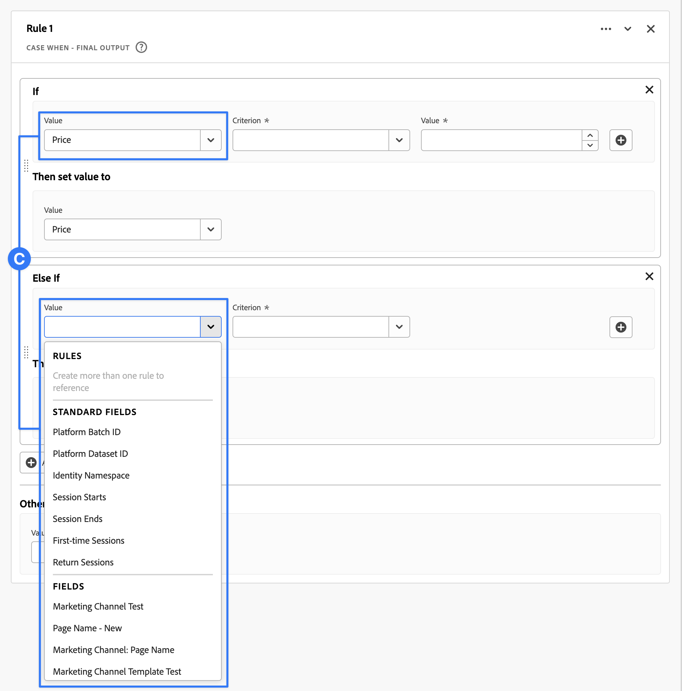

# Afgeleide velden {#derived-fields}

<!-- markdownlint-disable MD034 -->

>[!CONTEXTUALHELP]
>id="cja_dataview_derivedfields"
>title="Afgeleide velden"
>abstract="Een afgeleid gebied staat u toe om gegevensmanipulaties op de vlucht, door een klantgerichte regelbouwer te bepalen. Vervolgens kunt u dat afgeleide veld gebruiken als een component (metrisch of dimensionaal) in Workspace of zelfs verder definiëren als een component in de gegevensweergave."

<!-- markdownlint-enable MD034 -->

Afgeleide velden zijn een belangrijk aspect van de functionaliteit voor realtime rapportage in Adobe Customer Journey Analytics. Een afgeleid gebied staat u toe om (vaak complexe) gegevensmanipulaties op de vlucht, door een klantgerichte regelbouwer te bepalen. U kunt dat afgeleid gebied als component (metrisch of afmeting) in [ Workspace ](../../analysis-workspace/home.md) dan gebruiken of zelfs het afgeleide gebied als component in [ mening van Gegevens ](../data-views.md) verder bepalen.

Afgeleide velden kunnen veel tijd en moeite besparen, in vergelijking met het transformeren of manipuleren van gegevens op andere locaties buiten de Customer Journey Analytics. Zoals [ Prep van Gegevens ](https://experienceleague.adobe.com/docs/experience-platform/data-prep/home.html), [ Gegevens Distiller ](https://experienceleague.adobe.com/docs/experience-platform/query/data-distiller/overview.html), of binnen uw eigen processen van de Lading van de Transformatie van de Transformatie van het Uittreksel (ETL) / van de Transformatie van de Lading van het Uittreksel (ELT).

De afgeleide gebieden worden bepaald binnen [ meningen van Gegevens ](../data-views.md), zijn gebaseerd op een reeks die functies als regels worden bepaald, en op beschikbare standaard en/of schemagebieden worden toegepast.

Voorbeelden van gebruiksgevallen zijn:

- Definieer een afgeleid veld Paginanaam dat onjuiste waarden voor de verzamelde paginanamen corrigeert om de waarden voor de paginanaam te corrigeren.

- Definieer een afgeleid veld Marketing Channel dat het juiste marketingkanaal bepaalt op basis van een of meer voorwaarden (bijvoorbeeld URL-parameter, pagina-URL, paginanaam).

## Afgeleide veldinterface {#interface}

Wanneer u een afgeleid veld maakt of bewerkt, gebruikt u de afgeleide veldinterface.

|  | Naam | Beschrijving |
|---------|----------|--------|
| 1 | **Kiezer** | U gebruikt het selectiegebied om uw functie, functiesjabloon, schemaveld of standaardveld te selecteren en te slepen naar de regelbouwer.   gebruik drop-down om tussen te selecteren:   [!UICONTROL Functions] - lijsten beschikbare [ functies ](#function-reference),   [!UICONTROL Function templates] - lijsten beschikbare [ functiesjablonen ](#function-templates),   [!UICONTROL Schema fields] - maakt van gebieden beschikbaar van datasetcategorieën (gebeurtenis, profiel, raadpleging) en eerder afgeleide gebieden, en   [!UICONTROL Standard fields] - standaard beschikbare gebieden (zoals identiteitskaart van de Dataset van het Platform). Alleen standaardvelden met tekenreeksen en numerieke velden worden weergegeven in de kiezer. Als de functie andere gegevenstypen ondersteunt, kunnen standaardvelden met deze andere gegevenstypen worden geselecteerd voor waarden of velden binnen de regelinterface.  u kunt naar functie, functiesjablonen, schema, en standaardgebieden zoeken gebruikend het  vakje van het Onderzoek.   u kunt de geselecteerde objecten lijst filtreren door  Filter te selecteren en filters in de [!UICONTROL Filter fields by] dialoog te specificeren. U kunt filters gemakkelijk verwijderen gebruikend  voor elke filter. |
| 2 | **de bouwer van de Regel** | U bouwt uw afgeleid gebied opeenvolgend gebruikend één of meerdere regels. Een regel is een specifieke implementatie van een functie en wordt daarom altijd met slechts één functie geassocieerd. U maakt een regel door een functie naar de regelbouwer te slepen. Het functietype bepaalt de interface van de regel.  zie de [ interface van de Regel ](#rule-interface) voor meer informatie.   u kunt een functie bij het begin, het eind, of binnen tussen regels opnemen reeds beschikbaar in de regelbouwer. De laatste regel in de regelbouwer bepaalt de definitieve output van het afgeleide gebied. |
| 3 | **[!UICONTROL ** Montages van het Gebied **]** | U kunt het afgeleide veld een naam geven en beschrijven en het veldtype controleren. |
| 4 | **[!UICONTROL ** Definitieve Output **]** | In dit gebied wordt ter plekke een bijgewerkte voorvertoning van uitvoerwaarden weergegeven, gebaseerd op gegevens in de afgelopen 30 dagen en de wijzigingen die u aanbrengt in het afgeleide veld in de regelbuilder. |

{style="table-layout:auto"}

## Veldsjabloonwizard {#wizard}

Wanneer u voor het eerst toegang krijgt tot de afgeleide veldinterface, wordt de wizard [!UICONTROL Start with a field template] weergegeven.

1. Selecteer de sjabloon die het beste het type veld beschrijft dat u wilt maken.
2. Selecteer **[!UICONTROL ** Uitgezochte **]** knoop om verder te gaan.

Het dialoogvenster met afgeleide velden wordt gevuld met regels (en functies) die vereist of handig zijn voor het type veld dat u hebt geselecteerd. Zie {de malplaatjes van de Functie 0} ](#function-templates) voor meer informatie over de beschikbare malplaatjes.[

## Regelinterface {#rules}

Wanneer u een regel in de regelbouwer bepaalt, gebruikt u de regelinterface.

|  | Naam | Beschrijving |
|---------|----------|--------|
| A | **Naam van de Regel** | Door gebrek is de regelnaam **Regel X** (X die naar een opeenvolgingsaantal verwijst). Als u de naam van een regel wilt bewerken, selecteert u de naam en typt u de nieuwe naam, bijvoorbeeld `Query Parameter` . |
| B | **Naam van de Functie** | De geselecteerde functienaam voor de regel, bijvoorbeeld [!UICONTROL URL PARSE] . Wanneer de functie de laatste in de reeks functies is en de uiteindelijke uitvoerwaarden bepaalt, wordt de functienaam gevolgd door [!UICONTROL - FINAL OUTPUT], bijvoorbeeld [!UICONTROL URL PARSE - FINAL OUTPUT] .   om popup met meer informatie over de functie te tonen, selecteer . |
| C | **Beschrijving van de Regel** | U kunt desgewenst een beschrijving aan een regel toevoegen.  Uitgezochte , dan uitgezocht **[!UICONTROL ** voeg Beschrijving **]** toe om een beschrijving toe te voegen of **[!UICONTROL ** geef Beschrijving **]** uit om een bestaande beschrijving uit te geven.  gebruik de redacteur om een beschrijving in te gaan. U kunt de werkbalk gebruiken om de tekst op te maken (met de stijlkiezer, vet, cursief, onderstrepen, rechts, links, gecentreerd, kleur, nummerlijst, opsommingslijst) en om koppelingen toe te voegen aan externe informatie.   om het uitgeven van de beschrijving te beëindigen, klik buiten de redacteur. |
| D | **Gebied van de Functie** | Definieert de logica van de functie. De interface is afhankelijk van het type functie. In de vervolgkeuzelijst voor [!UICONTROL Field] of [!UICONTROL Value] worden alle categorieën velden (regels, standaardvelden, velden) weergegeven die beschikbaar zijn, op basis van het type invoer dat de functie verwacht. U kunt ook een veld van de kiezer voor schema- en standaardvelden naar een veld of waarde slepen. Wanneer dat gesleepte gebied van een dataset van de Opzoekmachine voortkomt, wordt een functie van de Opzoeken automatisch opgenomen vóór de functie u bepaalt.   zie [ Verwijzing van de Functie ](#function-reference) op gedetailleerde informatie voor elk van de gesteunde functies. |

{style="table-layout:auto"}

## Een afgeleid veld maken {#create}

1. Selecteer een bestaande gegevensweergave of maak een gegevensweergave. Zie [ meningen van Gegevens ](../data-views.md) voor meer informatie.

2. Selecteer het **[!UICONTROL ** lusje van Componenten **]** van de mening van Gegevens.

3. Selecteer **[!UICONTROL ** leidt tot afgeleid gebied **]** van het linkerspoor.

4. Gebruik de interface [!UICONTROL Create derived field] om het afgeleide veld te definiëren. Zie [ Voortgekomen gebiedsinterface ](#derived-field-interface).

   Om uw nieuw afgeleid gebied te bewaren, uitgezocht **[!UICONTROL ** sparen **]**.

5. Uw nieuw afgeleid gebied wordt toegevoegd aan de [!UICONTROL Derived fields >] container, als deel van **[!UICONTROL ** de gebieden van het Schema **]** in de linkerspoor van uw mening van Gegevens.

## Een afgeleid veld bewerken {#edit}

1. Selecteer een bestaande gegevensweergave. Zie [ meningen van Gegevens ](../data-views.md) voor meer informatie.

2. Selecteer het **[!UICONTROL ** lusje van Componenten **]** van de mening van Gegevens.

3. Selecteer **[!UICONTROL ** de gebieden van het Schema **]** lusje in de [!UICONTROL Connection] ruit op de linkerzijde.

4. Selecteer **[!UICONTROL ** Voortgekomen gebieden > **]** container.

5. Beweeg over het afgeleide gebied dat u wilt uitgeven, en  uit.

6. Gebruik de interface [!UICONTROL Edit derived field] om het afgeleide veld te bewerken. Zie [ Voortgekomen gebiedsinterface ](#derived-field-interface).

   - Selecteer **[!UICONTROL ** sparen **]** om uw bijgewerkt afgeleid gebied te bewaren.

   - Selecteer **[!UICONTROL ** annuleert **]** om het even welke veranderingen te annuleren u aan het afgeleide gebied aanbracht.

   - Selecteer **[!UICONTROL ** sparen als **]** om het afgeleide gebied als nieuw afgeleid gebied te bewaren. Het nieuwe afgeleide veld heeft dezelfde naam als het oorspronkelijke bewerkte afgeleide veld waaraan `(copy)` is toegevoegd.

U kunt ook een afgeleid veld gebruiken als component voor afmetingen of metriek in de gegevensweergave:

1. Selecteer de component. De component kan een andere naam hebben dan het afgeleide veld.

1. In het paneel van de Component, selecteer het  naast uw afgeleid gebied, onder de het gebiedsnaam van het Schema.

1. Gebruik de interface [!UICONTROL Edit derived field] om het afgeleide veld te bewerken. Zie [ Voortgekomen gebiedsinterface ](#derived-field-interface).

   - Selecteer **[!UICONTROL ** sparen **]** om uw bijgewerkt afgeleid gebied te bewaren.

   - Selecteer **[!UICONTROL ** annuleert **]** om het even welke veranderingen te annuleren u aan het afgeleide gebied aanbracht.

   - Selecteer **[!UICONTROL ** sparen als **]** om het afgeleide gebied als nieuw afgeleid gebied te bewaren. Het nieuwe afgeleide veld heeft dezelfde naam als het oorspronkelijke bewerkte afgeleide veld waaraan `(copy)` is toegevoegd.

## Een afgeleid veld verwijderen {#delete}

1. Selecteer een bestaande gegevensweergave. Zie [ meningen van Gegevens ](../data-views.md) voor meer informatie.

2. Selecteer het **[!UICONTROL ** lusje van Componenten **]** van de mening van Gegevens.

3. Selecteer **[!UICONTROL ** de gebieden van het Schema **]** lusje in [!UICONTROL Connection] ruit.

4. Selecteer **[!UICONTROL ** Voortgekomen gebieden > **]** container.

5. Beweeg over het afgeleide gebied dat u wilt schrappen, en  uit.

6. Selecteer **[!UICONTROL Delete]** in de interface van [!UICONTROL Edit derived field] .

   In een dialoogvenster [!UICONTROL Delete component] wordt u gevraagd de verwijdering te bevestigen. Overweeg om het even welke externe verwijzingen er aan het afgeleide gebied buiten de mening van Gegevens zouden kunnen bestaan.

   - Selecteer **[!UICONTROL ** ga **]** verder om het afgeleide gebied te schrappen.

U kunt ook een afgeleid veld gebruiken als component voor afmetingen of metriek in de gegevensweergave:

1. Selecteer de component. De component kan een andere naam hebben dan het afgeleide veld.

1. In het paneel van de Component, selecteer het  naast uw afgeleid gebied, onder de het gebiedsnaam van het Schema.

1. Selecteer **[!UICONTROL Delete]** in de interface van [!UICONTROL Edit derived field] .

   In een dialoogvenster [!UICONTROL Delete component] wordt u gevraagd de verwijdering te bevestigen. Overweeg om het even welke externe verwijzingen er aan het afgeleide gebied buiten de mening van Gegevens zouden kunnen bestaan.

   - Selecteer **[!UICONTROL ** ga **]** verder om het afgeleide gebied te schrappen.

>[!NOTE]
>
>Afgeleide gebieden worden beheerd op het niveau van de Verbinding in Customer Journey Analytics. Om het even welke die verandering in een afgeleid gebied in om het even welke meningen van Gegevens verbonden aan die Verbinding wordt aangebracht is op al deze bijbehorende meningen van Gegevens van toepassing.

## Functiesjablonen {#templates}

Om snel een afgeleid gebied voor specifieke gebruiksgevallen tot stand te brengen, zijn de functiesjablonen beschikbaar. Deze functiesjablonen zijn toegankelijk vanuit het selectiegebied in de afgeleide veldinterface of worden voor het eerst weergegeven in de wizard [!UICONTROL Start with a field template] .

### Marketingkanalen {#mchannel}

Deze functiesjabloon gebruikt een verzameling regels om marketingkanalen te maken.

+++ Details

Als u de sjabloon wilt gebruiken, moet u de juiste parameters opgeven voor elke functie die wordt vermeld als onderdeel van de regels in de sjabloon. Zie [ Verwijzing van de Functie ](#function-reference) voor meer informatie.

+++

### Bounces {#bounces}

Deze functiemalplaatje gebruikt een inzameling van regels om plaatsgrenzen te identificeren.

+++ Details

Als u de sjabloon wilt gebruiken, moet u de juiste parameters opgeven voor elke functie die wordt vermeld als onderdeel van de regels in de sjabloon. Zie [ Verwijzing van de Functie ](#function-reference) voor meer informatie.

+++

### Combineren met meerdere Dimensionen {#multi-dim}

Deze functiesjabloon combineert twee waarden in één.

+++ Details

Als u de sjabloon wilt gebruiken, moet u de juiste parameters opgeven voor elke functie die wordt vermeld als onderdeel van de regels in de sjabloon. Zie [ Verwijzing van de Functie ](#function-reference) voor meer informatie.

+++

### Vriendelijke naam gegevensset {#friendlyname}

Deze functiesjabloon bevat een leesbare naam voor de gegevensset.

+++ Details

Als u de sjabloon wilt gebruiken, moet u de juiste parameters opgeven voor elke functie die wordt vermeld als onderdeel van de regels in de sjabloon. Zie [ Verwijzing van de Functie ](#function-reference) voor meer informatie.

+++

### Paginanaam van URL {#pagename}

Deze functiesjabloon maakt een eenvoudige paginanaam.

+++ Details

Als u de sjabloon wilt gebruiken, moet u de juiste parameters opgeven voor elke functie die wordt vermeld als onderdeel van de regels in de sjabloon. Zie [ Verwijzing van de Functie ](#function-reference) voor meer informatie.

+++

### Seizoen vakantie {#holiday}

Deze functiesjabloon classificeert belangrijke tijden van het jaar.

+++ Details

Als u de sjabloon wilt gebruiken, moet u de juiste parameters opgeven voor elke functie die wordt vermeld als onderdeel van de regels in de sjabloon. Zie [ Verwijzing van de Functie ](#function-reference) voor meer informatie.

+++

### Maandelijkse doelstellingen {#goals}

Deze functiesjabloon stelt aangepaste maandelijkse doelen in.

+++ Details

Als u de sjabloon wilt gebruiken, moet u de juiste parameters opgeven voor elke functie die wordt vermeld als onderdeel van de regels in de sjabloon. Zie [ Verwijzing van de Functie ](#function-reference) voor meer informatie.

+++

### Alle waarden ophalen in de lijst met gescheiden waarden {#allvalues}

Deze functiesjabloon zet een beperkte lijst om in een array.

+++ Details

Als u de sjabloon wilt gebruiken, moet u de juiste parameters opgeven voor elke functie die wordt vermeld als onderdeel van de regels in de sjabloon. Zie [ Verwijzing van de Functie ](#function-reference) voor meer informatie.

+++

### Eerste waarde ophalen in lijst met scheidingstekens {#firstvalue}

Deze functiesjabloon haalt de eerste waarde op in een lijst met scheidingstekens.

+++ Details

Als u de sjabloon wilt gebruiken, moet u de juiste parameters opgeven voor elke functie die wordt vermeld als onderdeel van de regels in de sjabloon. Zie [ Verwijzing van de Functie ](#function-reference) voor meer informatie.

+++

### Laatste waarde ophalen in lijst met scheidingstekens {#lastvalue}

Deze functiesjabloon haalt de laatste waarde in een lijst met scheidingstekens op.

+++ Details

Als u de sjabloon wilt gebruiken, moet u de juiste parameters opgeven voor elke functie die wordt vermeld als onderdeel van de regels in de sjabloon. Zie [ Verwijzing van de Functie ](#function-reference) voor meer informatie.

+++

### Domeinnaam {#domain}

Deze functiesjabloon extraheert de domeinnaam met behulp van een reguliere expressie.

+++ Details

Als u de sjabloon wilt gebruiken, moet u de juiste parameters opgeven voor elke functie die wordt vermeld als onderdeel van de regels in de sjabloon. Zie [ Verwijzing van de Functie ](#function-reference) voor meer informatie.

+++

### Parameter querytekenreeks ophalen {#querystring}

Deze functiesjabloon extraheert querytekenreekswaarden.

+++ Details

Als u de sjabloon wilt gebruiken, moet u de juiste parameters opgeven voor elke functie die wordt vermeld als onderdeel van de regels in de sjabloon. Zie [ Verwijzing van de Functie ](#function-reference) voor meer informatie.

+++

### Overgangsveld {#transition}

Deze functiesjabloon gaat van het ene veld naar het andere.

+++ Details

Als u de sjabloon wilt gebruiken, moet u de juiste parameters opgeven voor elke functie die wordt vermeld als onderdeel van de regels in de sjabloon. Zie [ Verwijzing van de Functie ](#function-reference) voor meer informatie.

+++

### Eenvoudige botdetectie {#botdetection}

Deze functiesjabloon implementeert de identificatie van lichtbot.

+++ Details

Als u de sjabloon wilt gebruiken, moet u de juiste parameters opgeven voor elke functie die wordt vermeld als onderdeel van de regels in de sjabloon. Zie [ Verwijzing van de Functie ](#function-reference) voor meer informatie.

+++

### Koppeling afsluiten {#exit}

Deze functiesjabloon identificeert de laatste koppeling waarop in een sessie is geklikt.

+++ Details

Als u de sjabloon wilt gebruiken, moet u de juiste parameters opgeven voor elke functie die wordt vermeld als onderdeel van de regels in de sjabloon. Zie [ Verwijzing van de Functie ](#function-reference) voor meer informatie.

+++

### Koppeling downloaden {#download}

Deze functiesjabloon markeert algemene downloadkoppelingen.

+++ Details

Als u de sjabloon wilt gebruiken, moet u de juiste parameters opgeven voor elke functie die wordt vermeld als onderdeel van de regels in de sjabloon. Zie [ Verwijzing van de Functie ](#function-reference) voor meer informatie.

+++

<!--

+++ Data clean up template

>[!WARNING]
>
>Could not find any information on this template.
+++

-->

## Functieverwijzing {#functionref}

{{select-package}}

Voor elke ondersteunde functie vindt u hieronder meer informatie over:

- specificaties:
   - invoergegevenstype: type ondersteunde gegevens;
   - invoer: mogelijke waarden voor invoer,
   - include-operatoren: operatoren die voor deze functie worden ondersteund (indien aanwezig),
   - beperkingen: beperkingen die gelden voor deze specifieke functie;
   - uitvoer.

- gebruiksgevallen, waaronder:
   - gegevens voordat het afgeleide veld wordt gedefinieerd;
   - hoe het afgeleide veld moet worden gedefinieerd,
   - gegevens na het definiëren van het afgeleide veld.

- beperkingen (indien van toepassing).

<!-- CASE WHEN -->

### Hoofdletter als {#casewhen}

<!-- markdownlint-disable MD034 -->

>[!CONTEXTUALHELP]
>id="cja_dataview_derivedfields_casewhen"
>title="Hoofdletter als"
>abstract="Deze functie biedt de mogelijkheid om voorwaarden toe te passen op basis van gedefinieerde criteria in een of meer velden. Die criteria worden vervolgens gebruikt om de waarden in het nieuwe afgeleide veld te definiëren op basis van de volgorde van de voorwaarden."

<!-- markdownlint-enable MD034 -->

Hiermee past u voorwaarden toe op basis van gedefinieerde criteria in een of meer velden. Deze criteria worden vervolgens gebruikt om de waarden in een nieuw afgeleid veld te definiëren op basis van de volgorde van de voorwaarden.

+++ Details

## Specificaties {#casewhen-io}

| Gegevenstype invoer | Invoer | Opgenomen operatoren | Beperkingen | Uitvoer |
|---|---|---|---|---|
| <ul><li>String</li><li>Numeriek</li><li>Datum</li></ul> | <ul><li>[!UICONTROL If] , [!UICONTROL Else If] container:
<ul><li>[!UICONTROL Value]</li><ul><li>Regels</li><li>Standaardvelden</li><li>Velden</li></ul><li>[!UICONTROL Criterion] (zie opgenomen operatoren, gebaseerd op geselecteerde waardetype)</li></ul></li><li>[!UICONTROL Then set value to] , [!UICONTROL Otherwise set value to] :
<ul><li>[!UICONTROL Value]</li><ul><li>Regels</li><li>Standaardvelden</li><li>Velden</li></ul></ul></li></ul> | 
Tekenreeksen
<ul><li>Equals (Is gelijk aan)</li><li>Gelijk aan elke term</li><li>Contains the phrase (Bevat de woordgroep)</li><li>Contains any term (Bevat een term)</li><li>Contains all terms (Bevat alle termen)</li><li>Starts with (Begint met)</li><li>Begint met elke term</li><li>Ends with (Eindigt met)</li><li>Eindigt met om het even welke termijn</li><li>Does not equal (Is niet gelijk aan)</li><li>Is niet gelijk aan een term</li><li>Does not contain the phrase (Bevat niet de woordgroep)</li><li>Does not contain any term (Bevat geen enkele term)</li><li>Bevat niet alle termen</li><li>Begint niet met</li><li>Begint niet met enige termijn</li><li>Eindigt niet met</li><li>Beëindigt geen term</li><li>Is ingesteld</li><li>Is niet ingesteld</li></ul>
Numeriek
<ul><li>Equals (Is gelijk aan)</li><li>Does not equal (Is niet gelijk aan)</li><li>Is groter dan</li><li>Is groter dan of gelijk aan</li><li>Is kleiner dan</li><li>Is kleiner dan of gelijk aan</li><li>Is ingesteld</li><li>Is niet ingesteld</li></ul>
Datums
<ul><li>Equals (Is gelijk aan)</li><li>Does not equal (Is niet gelijk aan)</li><li>Is later dan</li><li>Is hoger dan of gelijk aan</li><li>Is voor</li><li>Is voor of gelijk aan</li><li>Is ingesteld</li><li>Is niet ingesteld</li></ul> | <ul><li>5 functies per afgeleid veld</li><li>200 [ exploitanten ](#operators) per afgeleid gebied. Een voorbeeld van één enkele operator is &#39;Refering Domain contains google&#39;. </li></ul> | 
Nieuw afgeleid veld
 |

{style="table-layout:auto"}

## Hoofdlettergebruik 1 {#casewhen-uc1}

U wilt regels definiëren om verschillende marketingkanalen te identificeren door trapsgewijze logica toe te passen om een marketingkanaalveld in te stellen op de juiste waarde:

- Als de verwijzer van een onderzoeksmotor is en de pagina een waarde van het vraagkoord heeft waar `cid` `ps_` bevat, zou het marketing kanaal als a [!DNL *Betaald Onderzoek*] moeten worden geïdentificeerd.
- Als de verwijzer van een onderzoeksmotor is en de pagina niet het vraagkoord `cid` heeft, zou het marketing kanaal als a [!DNL *Natuurlijk Onderzoek*] moeten worden geïdentificeerd.
- Als een pagina een waarde van het vraagkoord heeft waar `cid` `em_` bevat, zou het marketing kanaal als [!DNL *E-mail*] moeten worden geïdentificeerd.
- Als een pagina een waarde van het vraagkoord heeft waar `cid` `ds_` bevat, zou het marketing kanaal als a [!DNL *Ad van de Vertoning*] moeten worden geïdentificeerd.
- Als een pagina een waarde van het vraagkoord heeft waar `cid` `so_` bevat, zou het marketing kanaal als a [!DNL *Betaalde Sociale*] moeten worden geïdentificeerd.
- Als de verwijzer van een verwijzend domein van [!DNL twitter.com], [!DNL facebook.com], [!DNL linkedin.com], of [!DNL tiktok.com] is, zou het marketing kanaal als a [!DNL *Natuurlijk Sociale*] moeten worden geïdentificeerd.
- Als geen van de bovengenoemde regels worden aangepast, dan zou het marketing kanaal als [!DNL *Andere Referrer*] moeten worden geïdentificeerd.

Als uw site de volgende voorbeeldgebeurtenissen ontvangt, die [!UICONTROL Referrer] en [!UICONTROL Page URL] bevatten, moeten deze gebeurtenissen als volgt worden geïdentificeerd:

| [!DNL Event] | [!DNL Referrer] | [!DNL Page URL] | [!DNL Marketing Channel] |
|:--:|----|----|----|
| 1 | `https://facebook.com` | `https://site.com/home` | [!DNL Natural Social] |
| 2 | `https://abc.com` | `https://site.com/?cid=ds_12345678` | [!DNL Display] |
| 3 | | `https://site.com/?cid=em_12345678` | [!DNL Email] |
| 4 | `https://google.com` | `https://site.com/?cid=ps_abc098765` | [!DNL Paid Search] |
| 5 | `https://google.com` | `https://site.com/?cid=em_765544332` | [!DNL Email] |
| 6 | `https://google.com` |  | [!DNL Natural Search] |

{style="table-layout:auto"}

### Gegevens voor {#casewhen-uc1-databefore}

| [!DNL Referrer] | [!DNL Page URL] |
|----|----|
| `https://facebook.com` | `https://site.com/home` |
| `https://abc.com` | `https://site.com/?cid=ds_12345678` |
|  | `https://site.com/?cid=em_12345678` |
| `https://google.com` | `https://site.com/?cid=ps_abc098765` |
| `https://google.com` | `https://site.com/?cid=em_765544332` |
| `https://google.com` | |

{style="table-layout:auto"}

### Afgeleid veld {#casewhen-uc1-derivedfield}

U definieert een `Marketing Channel` afgeleid veld. U gebruikt de [!UICONTROL CASE WHEN] -functies om regels te definiëren die waarden maken voor het object op basis van bestaande waarden voor zowel het `Page URL` - als het `Referring URL` -veld.

Let op het gebruik van de functie [!UICONTROL URL PARSE] om regels te definiëren waarmee de waarden voor `Page Url` en `Referring Url` worden opgehaald voordat de [!UICONTROL CASE WHEN] -regels worden toegepast.

### Gegevens na {#casewhen-uc1-dataafter}

| [!DNL Marketing Channel] |
|----|
| [!DNL Natural Social] |
| [!DNL Display] |
| [!DNL Email] |
| [!DNL Paid Search] |
| [!DNL Email] |
| [!DNL Natural Search] |

{style="table-layout:auto"}

## Hoofdlettergebruik 2 {#casewhen-uc2}

U hebt verschillende verschillende variaties van de zoekopdracht verzameld binnen uw [!DNL Product Finding Methods] -dimensie. Om de algemene prestaties van onderzoek te begrijpen versus doorbladeren, moet u heel wat tijd doorbrengen die de resultaten manueel combineert.

Uw site verzamelt de volgende waarden voor uw [!DNL Product Finding Methods] -dimensie. Uiteindelijk geven al deze waarden een zoekopdracht aan.

| Verzamelde waarde | Werkelijke waarde |
|---|---|
| [!DNL search p13n_no] | [!DNL search] |
| [!DNL search p13n_yes] | [!DNL search] |
| [!DNL search refine p13n_no] | [!DNL search] |
| [!DNL search refine p13n_yes] | [!DNL search] |
| [!DNL search redirect p13n_yes] | [!DNL search] |
| [!DNL search-redirect] | [!DNL search] |

{style="table-layout:auto"}

### Gegevens voor {#casewhen-uc2-databefore}

| [!DNL Product Finding Methods] |
|----|
| [!DNL search p13_no] |
| [!DNL search p13_yes] |
| [!DNL browse] |
| [!DNL search refine p13_no] |
| [!DNL search refine p13_yes] |
| [!DNL browse] |
| [!DNL search redirect p13_yes] |
| [!DNL search-redirect] |
| [!DNL browse] |

{style="table-layout:auto"}

### Afgeleid veld {#casewhen-uc2-derivedfield}

U definieert een `Product Finding Methods (new)` afgeleid veld. U maakt de volgende [!UICONTROL CASE WHEN] -regels in de regelbuilder. Deze regels zijn van toepassing op alle mogelijke variaties van de oude [!UICONTROL Product Finding Methods] veldwaarden voor `search` en `browse` die het [!UICONTROL Contains the phrase] -criterium gebruiken.

### Gegevens na {#casewhen-uc2-dataafter}

| [!DNL Product Finding Methods (new)] |
|----|
| [!DNL search] |
| [!DNL search] |
| [!DNL browse] |
| [!DNL search] |
| [!DNL search] |
| [!DNL browse] |
| [!DNL search] |
| [!DNL search] |
| [!DNL browse] |

{style="table-layout:auto"}

## Hoofdlettergebruik 3 {#casewhen-uc3}

Als reisbedrijf, zou u reisduur voor boekte reizen willen opzeggen zodat kunt u op opgemaakte lengten van reizen melden.

Veronderstellingen:

- De organisatie verzamelt reisduur naar een numeriek veld.
- Zij zouden 1-3 dagduur in een emmer genoemd willen emmertjes &quot;[!DNL short trip]&quot;
- Zij zouden 4-7 dagduur in een emmer genoemd &quot;[!DNL medium trip]&quot;willen emmeren
- Zij zouden 8+ dagduur in een emmer genoemd &quot;[!DNL long trip]&quot;willen emmeren
- 132 reizen werden geboekt voor een duur van 1 dag
- 110 reizen werden geboekt voor een duur van 2 dagen
- 105 reizen werden geboekt voor een duur van 3 dagen
- 99 reizen werden geboekt voor een duur van 4 dagen
- 92 reizen werden geboekt voor een duur van 5 dagen
- 85 reizen werden geboekt voor een duur van 6 dagen
- 82 reizen werden geboekt voor een duur van 7 dagen
- 78 reizen werden geboekt voor een duur van 8 dagen
- 50 reizen werden geboekt voor een duur van 9 dagen
- 44 reizen werden geboekt voor een duur van tien dagen
- 38 reizen werden geboekt voor een duur van 11 dagen
- 31 reizen werden geboekt voor een duur van twaalf dagen

Uw gewenste rapport zou als moeten kijken:

| [!DNL Trip Duration Type] | [!DNL Bookings] |
|----|---:|
| [!DNL medium trip] | 358 |
| [!DNL short trip] | 347 |
| [!DNL long trip] | 241 |

{style="table-layout:auto"}

### Gegevens voor {#casewhen-uc3-databefore}

| [!DNL Trip Duration] |
|---:|
| 1 |
| 12 |
| 3 |
| 6 |
| 4 |
| 8 |
| 6 |
| 2 |
| 1 |
| 2 |
| 21 |
| 8 |

### Afgeleid veld {#casewhen-uc3-derivedfield}

U definieert een `Trip Duration (bucketed)` afgeleid veld. U maakt de volgende [!UICONTROL CASE WHEN] -regel in de regelbuilder. Met deze regel wordt logica toegepast om de oude [!UICONTROL Trip Duration] -veldwaarden in drie waarden te plaatsen: `short trip` , `medium  trip` en `long trip` .

### Gegevens na {#casewhen-uc3-dataafter}

| [!DNL Trip Duration (bucketed)] |
|---|
| [!DNL short trip] |
| [!DNL long trip] |
| [!DNL short trip] |
| [!DNL medium trip] |
| [!DNL medium trip] |
| [!DNL long trip] |
| [!DNL medium trip] |
| [!DNL short trip] |
| [!DNL short trip] |
| [!DNL short trip] |
| [!DNL long trip] |
| [!DNL long trip] |

## Meer informatie {#casewhen-more-info}

De Customer Journey Analytics gebruikt een genestelde containerstructuur, die na Adobe Experience Platform [ wordt gemodelleerd XDM ](https://experienceleague.adobe.com/docs/experience-platform/xdm/home.html?lang=nl) (het Model van Gegevens van de Ervaring). Zie [ Containers ](../create-dataview.md#containers) en [ containers van de Filter ](../../components/filters/filters-overview.md#filter-containers) voor meer achtergrondinformatie. Dit containermodel, zij het flexibel door aard, legt sommige beperkingen op wanneer het gebruiken van de regelbouwer.

Customer Journey Analytics gebruikt het volgende standaardcontainermodel:

De volgende beperkingen zijn van toepassing en worden afgedwongen wanneer *selecterend* en *plaatsend* waarden.

|  | Restricties |
|:---:|----|
| **A** | Waarden u *uitgezocht* binnen zelfde [!UICONTROL If], [!UICONTROL Else If] constructie (het gebruiken [!UICONTROL And] of [!UICONTROL Or]) in een regel moet uit de zelfde container voortkomen en kan van om het even welk type (koord , numerieke , etc.) zijn.   |
| **B** | Alle waarden u *plaatst* over een regel moet van de zelfde container zijn en het zelfde type of een afgeleide waarde van het zelfde type hebben.    |
| **C** | De waarden u *selecteert* over [!UICONTROL If], [!UICONTROL Else If] constructs in de regel ** moeten niet uit de zelfde container voortkomen en ** moeten niet van het zelfde type zijn.    |

{style="table-layout:auto"}

+++

<!-- CLASSIFY -->

### Classificeren {#classify}

<!-- markdownlint-disable MD034 -->

>[!CONTEXTUALHELP]
>id="cja_dataview_derivedfields_classify"
>title="Classificeren"
>abstract="Deze functie biedt de mogelijkheid een set waarden te definiëren die worden vervangen door corresponderende waarden door tekstinvoer."

<!-- markdownlint-enable MD034 -->

Definieert een set waarden die worden vervangen door corresponderende waarden in een nieuw afgeleid veld.

+++ Details

## Specificaties {#classify-io}

| Gegevenstype invoer | Invoer | Opgenomen operatoren | Beperkingen | Uitvoer |
|---|---|---|---|---|
| <ul><li>String</li><li>Numeriek</li><li>Datum</li></ul> | <ul><li>[!UICONTROL Field to classify]:<ul><li>Regels</li><li>Standaardvelden</li><li>Velden</li></ul></li><li>[!UICONTROL When value equals] en [!UICONTROL Replace values with] :
<ul><li>String</li></ul><li>Oorspronkelijke waarden tonen<ul><li>Boolean</li></ul></li></ul> | 
N.v.t.
 | <ul><li>5 functies per afgeleid veld</li><li>200 [ exploitanten ](#operators) per afgeleid gebied. Elke vermelding voor [!UICONTROL When value equals original value] [!UICONTROL Replace value with New value] wordt beschouwd als een bewerking.</li></ul> | 
Nieuw afgeleid veld
 |

{style="table-layout:auto"}

## Hoofdlettergebruik 1 {#classify-uc1}

U hebt wel een CSV-bestand met een sleutelkolom voor `hotelID` en een of meer extra kolommen die zijn gekoppeld aan de kolommen `hotelID`: `city`, `rooms`, `hotel name` .
U verzamelt [!DNL Hotel ID] in een dimensie, maar u wilt een [!DNL Hotel Name] -dimensie maken die is afgeleid van de `hotelID` in het CSV-bestand.

**CSV-dossier structuur en inhoud**

| [!DNL hotelID] | [!DNL city] | [!DNL rooms] | [!DNL hotel name] |
|---|---|---:|---|
| [!DNL SLC123] | [!DNL Salt Lake City] | 40 | [!DNL SLC Downtown] |
| [!DNL LAX342] | [!DNL Los Angeles] | 60 | [!DNL LA Airport] |
| [!DNL SFO456] | [!DNL San Francisco] | 75 | [!DNL Market Street] |
| [!DNL AMS789] | [!DNL Amsterdam] | 50 | [!DNL Okura] |

{style="table-layout:auto"}

**Huidige Rapport**

| [!DNL Hotel ID] | Productweergaven |
|---|---:|
| [!DNL SLC123] | 200 |
| [!DNL LX342] | 198 |
| [!DNL SFO456] | 190 |
| [!DNL AMS789] | 150 |

{style="table-layout:auto"}

**Gewenst Rapport**

| [!DNL Hotel Name] | Productweergaven |
|----|----:|
| [!DNL SLC Downtown] | 200 |
| [!DNL LA Airport] | 198 |
| [!DNL Market Street] | 190 |

{style="table-layout:auto"}

### Gegevens voor {#classify-uc1-databefore}

| [!DNL Hotel ID] |
|----|
| [!DNL SLC123] |
| [!DNL LAX342] |
| [!DNL SFO456] |
| [!DNL AMS789] |

{style="table-layout:auto"}

### Afgeleid veld {#classify-uc1-derivedfield}

U definieert een `Hotel Name` afgeleid veld. U gebruikt de functie [!UICONTROL CLASSIFY] om een regel te definiëren waarin u waarden van het veld [!UICONTROL Hotel ID] kunt classificeren en door nieuwe waarden kunt vervangen.

Selecteer **[!UICONTROL Show original values]** als u oorspronkelijke waarden wilt opnemen die u niet hebt gedefinieerd als onderdeel van de waarden die u wilt classificeren (bijvoorbeeld Hotel ID AMS789). Dit zorgt ervoor dat AMS789 deel uitmaakt van de uitvoer voor het afgeleide veld, ondanks dat die waarde niet wordt geclassificeerd.

### Gegevens na {#classify-uc1-dataafter}

| [!DNL Hotel Name] |
|----|
| [!DNL SLC Downtown] |
| [!DNL LA Airport] |
| [!DNL Market Street] |

{style="table-layout:auto"}

## Hoofdlettergebruik 2 {#classify-uc2}

U hebt URL&#39;s verzameld in plaats van de vriendelijke paginanaam voor verschillende pagina&#39;s. Deze gemengde verzameling van waarden breekt de rapportage af.

### Gegevens voor {#classify-uc2-databefore}

| [!DNL Page Name] |
|---|
| [!DNL Home Page] |
| [!DNL Flight Search] |
| `http://www.adobetravel.ca/Hotel-Search` |
| `https://www.adobetravel.com/Package-Search` |
| [!DNL Deals & Offers] |
| `http://www.adobetravel.ca/user/reviews` |
| `https://www.adobetravel.com.br/Generate-Quote/preview` |

{style="table-layout:auto"}

### Afgeleid veld {#classify-uc2-derivedfield}

U definieert een `Page Name (updated)` afgeleid veld. U gebruikt de functie [!UICONTROL CLASSIFY] om een regel te definiëren waarin u waarden van uw bestaande [!UICONTROL Page Name] -veld kunt classificeren en kunt vervangen door bijgewerkte correcte waarden.

### Gegevens na {#classify-uc2-dataafter}

| [!DNL Page Name (updated)] |
|---|
| [!DNL Home Page] |
| [!DNL Flight Search] |
| [!DNL Hotel Search] |
| [!DNL Package Search] |
| [!DNL Deals & Offers] |
| [!DNL Reviews] |
| [!DNL Generate Quote] |

## Meer informatie {#classify-moreinfo}

De volgende aanvullende functionaliteit is beschikbaar in de interface van de regel Classificeren:

- Om alle lijstwaarden snel te ontruimen, uitgezocht  **[!UICONTROL Clear all table values]**.
- Om een Csv- dossier te uploaden dat originele waarden voor bevat wanneer de waarden gelijk zijn en nieuwe waarden voor Vervangen waarden met, uitgezochte  **[!UICONTROL Upload CSV]**.
- Om een malplaatje voor het creëren van een Csv- dossier met originele en nieuwe te uploaden waarden te downloaden, selecteer  **[!UICONTROL Download CSV template]**.
- Om een Csv- dossier met alle originele en nieuwe waarden te downloaden die in de regelinterface worden bevolkt, uitgezochte  **[!UICONTROL Download CSV values]**.

+++

<!-- CONCATENATE -->

### Samenvoegen {#concatenate}

<!-- markdownlint-disable MD034 -->

>[!CONTEXTUALHELP]
>id="cja_dataview_derivedfields_concatenate"
>title="Samenvoegen"
>abstract="Met deze functie kunt u twee of meer velden, afgeleide velden of door de gebruiker ingevoerde tekenreekswaarden combineren tot één veld met gedefinieerde scheidingstekens"

<!-- markdownlint-enable MD034 -->

Hiermee voegt u veldwaarden samen tot één nieuw afgeleid veld met gedefinieerde scheidingstekens.

+++ Details

## Specificaties {#concatenate-io}

| Gegevenstype invoer | Invoer | Opgenomen operatoren | Beperkingen | Uitvoer |
|---|---|---|---|---|
| <ul><li>String</li></ul> | <ul><li>[!UICONTROL Value]:<ul><li>Regels</li><li>Standaardvelden</li><li>Velden</li><li>String</li></ul></li><li>[!UICONTROL Delimiter]:<ul><li>String</li></ul></li> </ul> | 
N.v.t.
 | 
2 functies per afgeleid veld
 | 
Nieuw afgeleid veld
 |

{style="table-layout:auto"}

## Hoofdletters gebruiken {#concatenate-uc}

U verzamelt momenteel de codes van de luchthaven van herkomst en de luchthaven van bestemming als afzonderlijke velden. U wilt de twee velden samenvoegen tot één afmeting, gescheiden door een afbreekstreepje (-). Zo kunt u de combinatie oorsprong en bestemming analyseren om hoogste geboekte routes te identificeren.

Veronderstellingen:

- Oorsprong en doelwaarden worden verzameld in afzonderlijke velden in dezelfde tabel.
- De gebruiker bepaalt of het scheidingsteken &#39;-&#39; tussen de waarden moet worden gebruikt.

Stel dat de volgende boekingen plaatsvinden:

- De klant ABC123 boekt een vlucht tussen Salt Lake City (SLC) en Orlando (MCO)
- De klant ABC456 boekt een vlucht tussen Salt Lake City (SLC) en Los Angeles (LAX)
- De klant ABC789 boekt een vlucht tussen Salt Lake City (SLC) en Seattle (SEA)
- Klant ABC987 boekt een vlucht tussen Salt Lake City (SLC) en San Jose (SJO)
- De klant ABC654 boekt een vlucht tussen Salt Lake City (SLC) en Orlando (MCO)

Het gewenste verslag moet er als volgt uitzien:

| Oorsprong/bestemming | Bladwijzers |
|----|---:|
| SLC-MCO | 2 |
| SLC-LAX | 1 |
| SLC-SEA | 1 |
| SLC-SJO | 1 |

{style="table-layout:auto"}

### Gegevens voor {#concatenate-uc-databefore}

| Oorsprong | Bestemming |
|----|---:|
| SLC | MCO |
| SLC | LAX |
| SLC | ZEE |
| SLC | SJO |
| SLC | MCO |

{style="table-layout:auto"}

### Afgeleid veld {#concatenate-derivedfield}

U definieert een `Origin - Destination` afgeleid veld. U gebruikt de functie [!UICONTROL CONCATENATE] om een regel te definiëren waarmee de velden [!UICONTROL Original] en [!UICONTROL Destination] worden samengevoegd met de velden `-` [!UICONTROL Delimiter] .

### Gegevens na {#concatenate-dataafter}

| Oorsprong - Doel   (afgeleid veld) |
|---|
| SLC-MCO |
| SLC-LAX |
| SLC-SEA |
| SLC-SJO |
| SLC-MCO |

{style="table-layout:auto"}

+++

### Dedupliceren {#dedup}

<!-- markdownlint-disable MD034 -->

>[!CONTEXTUALHELP]
>id="cja_dataview_derivedfields_deduplicate"
>title="Dedupliceren"
>abstract="Deze functie biedt de mogelijkheid om een veld te configureren zodat alleen waarden op sessieniveau of op persoonlijke niveau zonder herhaling worden geteld. Bovendien kan een deduplicatie-id worden gebruikt om ervoor te zorgen dat op basis van een bepaalde id (zoals een aankoop-id) slechts één waarde wordt gebruikt (de eerste of de laatste instantie)."

<!-- markdownlint-enable MD034 -->

Hiermee wordt voorkomen dat een waarde meerdere keren wordt geteld.

+++ Details

## Specificaties {#deduplicate-io}

| Gegevenstype invoer | Invoer | Opgenomen operatoren | Beperkingen | Uitvoer |
|---|---|---|---|---|
| <ul><li>String</li><li>Numeriek</li></ul> | <ul><li>[!UICONTROL Value]:<ul><li>Regels</li><li>Standaardvelden</li><li>Velden</li><li>String</li></ul></li><li>[!UICONTROL Scope]:<ul><li>Persoon</li><li>Sessie</li></ul></li><li>[!UICONTROL Deduplication ID]:<ul><li>Regels</li><li>Standaardvelden</li><li>Velden</li><li>String</li></ul><li>[!UICONTROL Value to keep]:<ul><li>Eerste instantie behouden</li><li>Laatste instantie behouden</li></ul></li></ul> | 
N.v.t.
 | 
5 functies per afgeleid veld
 | 
Nieuw afgeleid veld
 |

{style="table-layout:auto"}

## Hoofdlettergebruik 1 {#deduplicate-uc1}

U wilt voorkomen dat dubbele inkomsten worden geteld wanneer een gebruiker de bevestigingspagina voor het boeken opnieuw laadt. U gebruikt de reserveringsbevestigings-id bij de id om de inkomsten niet meer te tellen wanneer u deze op dezelfde gebeurtenis ontvangt.

### Gegevens voor {#deduplicate-uc1-databefore}

| Bevestigings-id voor boek | Ontvangsten |
|----|---:|
| ABC123456789 | 359 |
| ABC123456789 | 359 |
| ABC123456789 | 359 |

{style="table-layout:auto"}

### Afgeleid veld {#deduplicate-uc1-derivedfield}

U definieert een `Booking Confirmation` afgeleid veld. U gebruikt de functie [!UICONTROL DEDUPLICATE] om een regel te definiëren die de instructie [!UICONTROL Value] [!DNL Booking] for [!UICONTROL Scope] [!DNL Person] dedupliceert met [!UICONTROL Deduplication ID] [!UICONTROL Booking Confirmation ID] . U selecteert [!UICONTROL Keep first instance] als [!UICONTROL Value to keep] .

### Gegevens na {#deduplicate-uc1-dataafter}

| Bevestigings-id voor boek | Ontvangsten |
|----|---:|
| ABC123456789 | 359 |
| ABC123456789 | 0 |
| ABC123456789 | 0 |

{style="table-layout:auto"}

## Hoofdlettergebruik 2 {#deduplicate-uc2}

U gebruikt gebeurtenissen als een proxy voor doorklikacties voor campagnes met externe marketingcampagnes. Bij opnieuw laden en omleiden wordt de metrische waarde van de gebeurtenis opgepompt. U wilt de dimensie van de trackingcode dedupliceren, zodat alleen de eerste code wordt verzameld en de overtelling van de gebeurtenis tot een minimum wordt beperkt.

### Gegevens voor {#deduplicate-uc2-databefore}

| Bezoekers-id | Marketingkanaal | Gebeurtenissen |
|----|---|---:|
| ABC123 | betaalde zoekopdracht | 1 |
| ABC123 | betaalde zoekopdracht | 1 |
| ABC123 | betaalde zoekopdracht | 1 |
| DEF123 | email | 1 |
| DEF123 | email | 1 |
| JKL123 | natuurlijk zoeken | 1 |
| JKL123 | natuurlijk zoeken | 1 |

{style="table-layout:auto"}

### Afgeleid veld {#deduplicate-uc2-derivedfield}

U definieert een nieuw `Tracking Code (deduplicated)` afgeleid veld. U gebruikt de functie [!UICONTROL DEDUPLICATE] om een regel te definiëren waarmee de [!UICONTROL Tracking Code] wordt gededupliceerd met een [!UICONTROL Deduplication scope] van [!UICONTROL Session] en [!UICONTROL Keep first instance] als de [!UICONTROL Value to keep] .

### Gegevens na {#deduplicate-uc2-dataafter}

| Bezoekers-id | Marketingkanaal | Gebeurtenissen |
|----|---|---:|
| ABC123 | betaalde zoekopdracht | 1 |
| DEF123 | email | 1 |
| JKL123 | natuurlijk zoeken | 1 |

{style="table-layout:auto"}

+++

<!-- FIND AND REPLACE -->

### Zoeken en vervangen {#find-and-replace}

<!-- markdownlint-disable MD034 -->

>[!CONTEXTUALHELP]
>id="cja_dataview_derivedfields_findandreplace"
>title="Zoeken en vervangen"
>abstract="Met deze functie kunt u alle waarden in een geselecteerd veld vinden en deze waarden vervangen door een andere waarde in een nieuw afgeleid veld."

<!-- markdownlint-enable MD034 -->

Hiermee zoekt u alle waarden in een geselecteerd veld en vervangt u deze waarden door een andere waarde in een nieuw afgeleid veld.

+++ Details

## Specificaties {#findreplace-io}

| Gegevenstype invoer | Invoer | Opgenomen operatoren | Beperkingen | Uitvoer |
|---|---|---|---|---|
| <ul><li>String</li></ul> | <ul><li>[!UICONTROL Value]<ul><li>Regels</li><li>Standaardvelden</li><li>Velden</li></ul></li><li>[!UICONTROL Find all] , [!UICONTROL and replace all with] :<ul><li>String</li></ul></li></ul></ul> | 
Tekenreeksen
<ul><li>[!UICONTROL Find all], [!UICONTROL and replace all with]</li></ul> | 
5 functies per afgeleid veld
 | 
Nieuw afgeleid veld
 |

{style="table-layout:auto"}

## Hoofdletters gebruiken {#findreplace-uc}

U hebt enkele onjuist gevormde waarden ontvangen voor uw externe marketingkanaalrapport, bijvoorbeeld `email%20 marketing` in plaats van `email marketing` . Deze misvormde waarden breken uw rapportering en maken het moeilijker te zien hoe e-mail presteert. U wilt `email%20marketing` vervangen door `email marketing` .

**Origineel Rapport**

| [!DNL External Marketing Channels] | [!DNL Sessions] |
|---|--:|
| [!DNL email marketing] | 500 |
| [!DNL email %20marketing] | 24 |

{style="table-layout:auto"}

**Gewenste Rapport**

| [!DNL External Marketing Channels] | [!DNL Sessions] |
|---|--:|
| [!DNL email marketing] | 524 |

### Gegevens voor {#findreplace-uc-databefore}

| [!DNL External Marketing] |
|----|
| [!DNL email marketing] |
| [!DNL email%20marketing] |
| [!DNL email marketing] |
| [!DNL email marketing] |
| [!DNL email%20marketing] |

{style="table-layout:auto"}

### Afgeleid veld {#findreplace-uc-derivedfield}

U definieert een `Email Marketing (updated)` afgeleid veld. U gebruikt de functie [!UICONTROL FIND AND REPLACE] om een regel te definiëren waarmee alle instanties van `email%20marketing` met `email marketing` worden gevonden en vervangen.

### Gegevens na {#findreplace-uc-dataafter}

| [!DNL External Marketing (updated)] |
|----|
| [!DNL email marketing] |
| [!DNL email marketing] |
| [!DNL email marketing] |
| [!DNL email marketing] |
| [!DNL email marketing] |

{style="table-layout:auto"}

+++

<!-- LOOKUP -->

### Opzoeken {#lookup}

<!-- markdownlint-disable MD034 -->

>[!CONTEXTUALHELP]
>id="cja_dataview_derivedfields_lookup"
>title="Opzoeken"
>abstract="Deze functie verstrekt de capaciteit om gebieden van een raadplegingsdataset te gebruiken gebruikend een passende sleutel tussen datasets."

<!-- markdownlint-enable MD034 -->

De waarden van de opzoekopdracht die een gebied van een raadplegingsdataset gebruiken en keert een waarde op een nieuw afgeleid gebied of voor verdere regelverwerking terug.

+++ Details

## Specificatie {#lookup-io}

| Gegevenstype invoer | Invoer | Opgenomen operatoren | Limiet | Uitvoer |
|---|---|---|---|---|
| <ul><li>String</li><li>Numeriek</li><li>Datum</li></ul> | <ul><li>[!UICONTROL Field to apply lookup]:</li><ul><li>Regels</li><li>Standaardvelden</li><li>Velden</li></ul><li>[!UICONTROL Lookup dataset]</li><ul><li>Gegevensset</li></ul><li>[!UICONTROL Matching key]<ul><li>Regels</li><li>Velden</li></ul></li><li>Te retourneren waarden<ul><li>Regels</li><li>Velden</li></ul></li></ul> | 
N.v.t.
 | 
3 functies per afgeleid veld
 | 
Nieuw afgeleid veld of nieuwe waarde voor verdere verwerking in volgende regel
 |

{style="table-layout:auto"}

## Hoofdletters gebruiken {#lookup-uc}

U wilt de naam van de activiteit opzoeken met de activiteit-id die wordt verzameld wanneer uw klanten op een gepersonaliseerde banner klikken die via Adobe Target wordt weergegeven. U wilt een raadplegingsdataset met Analytics voor de activiteiten van het Doel (A4T) gebruiken die activiteitenids en activiteitennamen bevatten.

### Gegevensset voor opzoeken van A4T {#lookup-uc-lookup}

| Activiteits-id | Naam activiteit |
|---|---|
| 415851 | MVT-testcategoriepagina&#39;s |
| 415852 | Luma - Campagne Max. 2022 |
| 402922 | Banners startpagina |

{style="table-layout:auto"}

### Afgeleid veld {#lookup-uc-derivedfield}

U definieert een `Activity Name` afgeleid veld. U gebruikt de functie [!UICONTROL LOOKUP] om een regel te definiëren voor het opzoeken van de waarde van de verzamelde gegevens, opgegeven in het [!UICONTROL Field to apply lookup] -veld (bijvoorbeeld **[!DNL ActivityIdentifier]** ). U selecteert de opzoekgegevensset in de lijst [!UICONTROL Lookup dataset] (bijvoorbeeld **[!DNL New CJA4T Activities]** ). Vervolgens selecteert u het id-veld (bijvoorbeeld **[!DNL ActivityIdentifier]**) in de lijst [!UICONTROL Matching key] en het veld dat u wilt retourneren uit de lijst [!UICONTROL Values to return] (bijvoorbeeld **[!DNL ActivityName]** ).

## Meer informatie {#lookup-more-info}

De functie van de Opzoekopdracht wordt toegepast in rapporttijd aan de gegevens die door Customer Journey Analytics van de raadplegingsdataset worden teruggewonnen u als deel van uw verbinding hebt gevormd.

U kunt snel een [!UICONTROL Lookup] functie in de regelbouwer opnemen, die reeds één of meerdere andere functies bevat.

1. Selecteer **[!UICONTROL Schema fields]** in de kiezer.
1. Selecteer  **[!UICONTROL Lookup datasets]**.
1. Selecteer uw raadplegingsdataset en vind het gebied u voor raadpleging wilt gebruiken.
1. Sleep het opzoekveld naar een van de beschikbare invoervelden voor een functie (bijvoorbeeld Als). Wanneer geldig, een blauwe doos, geëtiketteerd **[!UICONTROL + Add]**, staat u toe om het gebied te laten vallen en automatisch een functie van de Opzoekopdracht op te nemen vóór de functie u het raadplegingsgebied op liet vallen. De ingevoegde opzoekfunctie wordt automatisch gevuld met relevante waarden voor alle velden.
   

+++

<!-- LOWERCASE -->

### Kleine letters {#lowercase}

<!-- markdownlint-disable MD034 -->

>[!CONTEXTUALHELP]
>id="cja_dataview_derivedfields_lowercase"
>title="Kleine letters"
>abstract="Deze functie converteert de volledige tekenreekstekst naar kleine letters."

<!-- markdownlint-enable MD034 -->

Hiermee zet u waarden van een veld om in kleine letters en slaat u deze op in een nieuw afgeleid veld.

+++ Details

## Specificatie {#lowercase-io}

| Gegevenstype invoer | Invoer | Opgenomen operatoren | Limiet | Uitvoer |
|---|---|---|---|---|
| <ul><li>String</li><li>Numeriek</li><li>Datum</li></ul> | <ul><li>[!UICONTROL Field]:</li><ul><li>Regels</li><li>Standaardvelden</li><li>Velden</li></ul> | 
N.v.t.
 | 
2 functies per afgeleid veld
 | 
Nieuw afgeleid veld
 |

{style="table-layout:auto"}

## Hoofdletters gebruiken {#lowercase-uc}

U wilt alle verzamelde productnamen naar kleine letters converteren voor een juiste rapportage.

### Gegevens voor {#lowercase-uc-databefore}

| Verzamelde productnamen | Productweergaven |
|---|---:|
| Tennis racket | 35 |
| Tennis Racket | 33 |
| tennisracket | 21 |
| Baseball | 15 |
| Baseball Bat | 12 |
| honkbal | 10 |

{style="table-layout:auto"}

### Afgeleid veld {#lowercase-uc-derivedfield}

U definieert een `Product Names` afgeleid veld. U gebruikt de functie [!UICONTROL LOWERCASE] om een regel te definiëren waarmee de waarde van het veld [!UICONTROL Collected Product Names] in kleine letters wordt omgezet en die waarde wordt opgeslagen in het nieuwe afgeleide veld.

### Gegevens na {#lowercase-uc-dataafter}

| Productnamen | Productweergaven |
|---|---|
| tennisracket | 89 |
| honkbal | 37 |

{style="table-layout:auto"}

+++

<!-- MATH -->

### Math {#math}

<!-- markdownlint-disable MD034 -->

>[!CONTEXTUALHELP]
>id="cja_dataview_derivedfields_math"
>title="Math"
>abstract="Deze functie biedt de mogelijkheid om wiskundige bewerkingen uit te voeren op een veld. De functie kan worden gebruikt om rekenkundige basisbewerkingen uit te voeren, zoals optellen, aftrekken, vermenigvuldigen en delen."

<!-- markdownlint-enable MD034 -->

Gebruik wiskundige basisoperatoren (toevoegen, verwijderen, vermenigvuldigen, verdelen en verhogen tot een macht) op numerieke velden.

+++ Details

## Specificatie {#math-io}

| Gegevenstype invoer | Invoer | Opgenomen operatoren | Limiet | Uitvoer |
|---|---|---|---|---|
| <ul><li>Numeriek</li></ul> | <ul><li>Een of meerdere numerieke velden</li><li>Een of meer operatoren (toevoegen, verwijderen, vermenigvuldigen, verdelen, verhogen tot een macht)</li><li>Invoerwaarde gebruiker</li></ul> | <ul><li>`+` (toevoegen)</li><li>`-` (subtract)</li><li>`*` (vermenigvuldigen)</li><li>`/` (delen)</li><li>`^` (opheffen tot macht)</li></ul> | <ul><li>25 bewerkingen per afgeleid veld</li><li>5 Math-functies per afgeleid veld</li></ul> | 
Nieuw afgeleid veld
 |

{style="table-layout:auto"}

## Hoofdletters gebruiken {#math-uc}

Door de inflatie wilt u de inkomstenaantallen van ingeslikte CRM-gegevens corrigeren met een inflatie van 5%.

### Gegevens voor {#math-uc-databefore}

| CRM-id | Jaarlijkse inkomsten |
|---|---:|
| 1234 | 35.070.000 |
| 4133 | 7.500.000 |
| 8110 | 10.980 |
| 2201 | 42.620 |

{style="table-layout:auto"}

### Afgeleid veld {#math-uc-derivedfield}

U definieert een `Corrected Annual Revenue` afgeleid veld. U gebruikt de functie [!UICONTROL MATH] om een regel te bepalen die het oorspronkelijke Jaarlijkse Inkomsten aantal met 1.05 vermenigvuldigt.

### Gegevens na {#math-uc-dataafter}

| CRM-id | Gecorrigeerde jaarinkomsten |
|---|---:|
| 1234 | 36.823.500 |
| 4133 | 7.875.000 |
| 8110 | 11 529 00 |
| 2201 | 44.751 |

{style="table-layout:auto"}

## Meer informatie {#math-more-info}

Een formule maken:

1. U begint gewoon te typen in het veld Formule en in numerieke velden die overeenkomen met wat u typt, worden weergegeven in een pop-upmenu. U kunt ook een numeriek veld slepen en neerzetten vanuit de beschikbare velden in het linkerdeelvenster.
   

1. Voeg de operand (bijvoorbeeld `*` toe om te vermenigvuldigen) gevolgd door een ander veld of een statische waarde. U kunt haakjes gebruiken om complexere formules te definiëren.

1. Om een statische waarde (bijvoorbeeld `1.05`) op te nemen, typ de waarde en selecteer **[!UICONTROL Add *x *als statische waarde]**of **[!UICONTROL Add -*x* als negatieve statische waarde]** van popup menu.
   

1. Een groen controleteken  wijst erop of uw wiskundige formule geldig is, anders zult u een waarschuwing  en het bericht [!UICONTROL Invalid formula expression] zien.
   

Er zijn enkele belangrijke overwegingen wanneer u werkt met statische getallen in de functie [!UICONTROL MATH] :

- Statische waarden moeten aan een veld worden gekoppeld. Het gebruik van de functie [!UICONTROL MATH] met alleen statische velden wordt bijvoorbeeld niet ondersteund.
- U kunt niet de verhoging aan machtsexploitant (`ˆ`) op een statische waarde gebruiken.
- Als u meerdere statische waarden gebruikt in een formule, moeten deze statische waarden met haakjes worden gegroepeerd, anders is de formule niet geldig. Bijvoorbeeld:

   - Deze formule retourneert een fout.
     

   - Deze formule is geldig.
     

Gebruik de functie Math voor op raakniveau gebaseerde berekeningen. Gebruik de [ vat ](#summarize) functie voor gebeurtenis samen, zitting of persoon op werkingsgebied gebaseerde berekeningen.

+++

<!-- MERGE FIELDS -->

### Velden samenvoegen {#merge}

<!-- markdownlint-disable MD034 -->

>[!CONTEXTUALHELP]
>id="cja_dataview_derivedfields_mergefields"
>title="Velden samenvoegen"
>abstract="Deze functie biedt de mogelijkheid om waarden te nemen van twee verschillende velden en hun respectieve waarden in één dimensie op te nemen. De regel controleert eerst of de eerste waarde is ingesteld. Zo niet, dan wordt de tweede waarde gebruikt enzovoort."

<!-- markdownlint-enable MD034 -->

Hiermee voegt u waarden uit twee verschillende velden samen tot een nieuw afgeleid veld.

+++ Details

## Specificatie {#merge-fields-io}

| Gegevenstype invoer | Invoer | Opgenomen operatoren | Limiet | Uitvoer |
|---|---|---|---|---|
| <ul><li>String</li><li>Numeriek</li><li>Datum</li></ul> | <ul><li>[!UICONTROL Field]:</li><ul><li>Regels</li><li>Standaardvelden</li><li>Velden</li></ul> | 
N.v.t.
 | 
5 functies per afgeleid veld
 | 
Nieuw afgeleid veld
 |

{style="table-layout:auto"}

## Hoofdletters gebruiken {#merge-fields-uc}

U zou een afmeting tot stand willen brengen die uit het gebied van de paginanaam en het gebied van de vraagreden met de bedoeling wordt gemaakt om de reis over kanalen te analyseren.

### Gegevens voor {#merge-fields-uc-databefore}

| Paginanaam | Sessie | Bezoekers |
|---|--:|--:|
| Help-pagina | 250 | 200 |
| homepage | 500 | 250 |
| productdetailpagina | 300 | 200 |

{style="table-layout:auto"}

| Reden van oproep | Sessie | Bezoekers |
|---|--:|--:|
| vragen over mijn bestelling | 275 | 250 |
| een wijziging in mijn bestelling aanbrengen | 150 | 145 |
| probleem met bestellen | 100 | 95 |

{style="table-layout:auto"}

### Afgeleid veld {#merge-fields-uc-derivedfield}

U definieert een `Cross Channel Interactions` afgeleid veld. U gebruikt de functie [!UICONTROL MERGE FIELDS] om een regel te definiëren voor het samenvoegen van de waarden uit het veld [!UICONTROL Page Name] field en [!UICONTROL Call Reason] en het opslaan ervan in het nieuwe afgeleide veld.

### Gegevens na {#merge-fields-uc-dataafter}

| Interacties tussen kanalen | Sessies | Bezoekers |
|---|--:|--:|
| homepage | 500 | 250 |
| productdetailpagina | 300 | 200 |
| vragen over mijn bestelling | 275 | 250 |
| Help-pagina | 250 | 200 |
| een wijziging in mijn bestelling aanbrengen | 150 | 145 |
| probleem met bestellen | 100 | 95 |

{style="table-layout:auto"}

## Meer informatie {#merge-fields-moreinfo}

U moet hetzelfde type velden selecteren in een regel voor het samenvoegen van velden. Als u bijvoorbeeld een datumveld selecteert, moeten alle andere velden die u wilt samenvoegen, datumvelden zijn.

+++

<!-- NEXT OR PREVIOUS -->

### Volgende of Vorige {#next-previous}

<!-- markdownlint-disable MD034 -->

>[!CONTEXTUALHELP]
>id="cja_dataview_derivedfields_nextprevious"
>title="Volgende of Vorige"
>abstract="Met deze functie kunt u de volgende of vorige waarde bekijken die voor een bepaald veld is verzameld."

<!-- markdownlint-enable MD034 -->

Neemt een gebied als input en lost de volgende of vorige waarde voor dat gebied binnen het werkingsgebied van de zitting of het gebruik op. Dit geldt alleen voor de velden Bezoek en Gebeurtenis.

+++ Details

## Specificatie {#prevornext-io}

| Gegevenstype invoer | Invoer | Opgenomen operatoren | Limiet | Uitvoer |
|---|---|---|---|---|
| <ul><li>String</li><li>Numeriek</li><li>Datum</li></ul> | <ul><li>[!UICONTROL Field]:</li><ul><li>Regels</li><li>Standaardvelden</li><li>Velden</li></ul><li>[!UICONTROL Method]:<ul><li>Vorige waarde</li><li>Volgende waarde</li></ul></li><li>[!UICONTROL Scope]:<ul><li>Persoon</li><li>Sessie</li></ul></li><li>[!UICONTROL Index]:<ul><li>Numeriek</li></ul><li>[!UICONTROL Include repeats]:<ul><li>Boolean</li></ul></li></ul> | 
N.v.t.
 | 
3 functies per afgeleid veld
 | 
Nieuw afgeleid veld
 |

{style="table-layout:auto"}

## Hoofdletters gebruiken {#prevornext-uc1}

U zou willen begrijpen wat de **volgende** of **vorige** waarde van de gegevens is die u ontvangt, rekening houdend met herhalingswaarden.

### Gegevens {#prevornext-uc1-databefore}

**Voorbeeld 1 - de Behandeling omvat herhalingen**

| Ontvangen gegevens | De volgende waarde   Index van de Zitting   = 1   omvat Herhalen | De volgende waarde   Index van de Zitting   = 1   omvat niet Herhalen | De vorige waarde   Index van de Zitting   = 1   omvat Herhalen | De vorige waarde   Index van de Zitting   = 1   omvat niet Herhalen |
|---|---|---|---|---|
| thuis | thuis | zoeken | *Geen waarde* | *Geen waarde* |
| thuis | zoeken | zoeken | thuis | *Geen waarde* |
| zoeken | zoeken | productdetails | thuis | thuis |
| zoeken | productdetails | productdetails | zoeken | thuis |
| productdetails | zoeken | zoeken | zoeken | zoeken |
| zoeken | productdetails | productdetails | productdetails | productdetails |
| productdetails | zoeken | zoeken | zoeken | zoeken |
| zoeken | zoeken | *Geen waarde* | productdetails | productdetails |
| zoeken | *Geen waarde* | *Geen waarde* | zoeken | productdetails |

{style="table-layout:auto"}

**Voorbeeld 2 - de behandeling omvat herhalingen met lege waarden in ontvangen gegevens**

| Ontvangen gegevens | De volgende waarde   Index van de Zitting   = 1   omvat Herhalen | De volgende waarde   Index van de Zitting   = 1   omvat niet Herhalen | De vorige waarde   Index van de Zitting   = 1   omvat Herhalen | De vorige waarde   Index van de Zitting   = 1   omvat niet Herhalen |
|---|---|---|---|---|
| thuis | thuis | zoeken | *Geen waarde* | *Geen waarde* |
| thuis | thuis | zoeken | thuis | *Geen waarde* |
| thuis | zoeken | zoeken | thuis | *Geen waarde* |
| zoeken | zoeken | productdetails | thuis | thuis |
|   |   |   |   |   |
| zoeken | zoeken | productdetails | zoeken | thuis |
| zoeken | productdetails | productdetails | zoeken | thuis |
| productdetails | *Geen waarde* | *Geen waarde* | zoeken | zoeken |
|   |   |   |   |   |

{style="table-layout:auto"}

### Afgeleid veld {#prevnext-uc1-derivedfield}

U definieert een `Next Value` - of `Previous value` -afgeleid veld. U gebruikt de functie [!UICONTROL NEXT OR PREVIOUS] om een regel te definiëren die het [!UICONTROL Data received] veld selecteert, selecteert [!UICONTROL Next value] of [!UICONTROL Previous value] as [!UICONTROL Method] , [!UICONTROL Session] als bereik en stelt de waarde van [!UICONTROL Index] in op `1` .

## Meer informatie {#prevnext-moreinfo}

U kunt alleen velden selecteren die behoren tot de tabel Visit of Event.

[!UICONTROL Include repeats] bepaalt hoe herhalende waarden voor de functie [!UICONTROL NEXT OR PREVIOUS] moeten worden verwerkt.

- Neem herhalingen van het uiterlijk en de volgende of vorige waarden op. Als [!UICONTROL Include Repeats] is geselecteerd, worden opeenvolgende herhalingen van volgende of vorige waarden van de huidige hit genegeerd.

- Rijen zonder (lege) waarden voor een geselecteerd veld krijgen geen volgende of vorige waarden die worden geretourneerd als onderdeel van de uitvoer van de functie [!UICONTROL NEXT OR PREVIOUS] .

+++

<!-- REGEX REPLACE -->

### Regex Replace {#regex-replace}

<!-- markdownlint-disable MD034 -->

>[!CONTEXTUALHELP]
>id="cja_dataview_derivedfields_regexreplace"
>title="Regex Replace"
>abstract="Deze functie biedt de mogelijkheid om delen van een tekenreeks te extraheren met behulp van reguliere expressies."

<!-- markdownlint-enable MD034 -->

Hiermee vervangt u een waarde uit een veld met een reguliere expressie in een nieuw afgeleid veld.

+++ Details

## Specificatie {#regex-replace-io}

| Gegevenstype invoer | Invoer | Opgenomen operatoren | Limiet | Uitvoer |
|---|---|---|---|---|
| <ul><li>String</li><li>Numeriek</li></ul> | <ul><li>[!UICONTROL Field]:</li><ul><li>Regels</li><li>Standaardvelden</li><li>Velden</li></ul></ul><ul><li>[!UICONTROL Regex]:</li><ul><li>String</li></ul></li><li>[!UICONTROL Output Format]:<ul><li>String</li></ul></ul><ul><li>Hoofdlettergevoelig</li><ul><li>Boolean</li></ul></li></ul></li> | 
N.v.t.
 | 
1 functie per afgeleid veld
 | 
Nieuw afgeleid veld
 |

{style="table-layout:auto"}

## Hoofdletters gebruiken {#regex-replace-uc}

U wilt een gedeelte van een URL vastleggen en dat gebruiken als unieke pagina-id om het verkeer te analyseren. U gebruikt `[^/]+(?=/$|$)` voor de reguliere expressie om het einde van de URL en `$1` vast te leggen als het uitvoerpatroon.

### Gegevens voor {#regex-replace-uc-databefore}

| Pagina-URL |
|---|
| `https://business.adobe.com/products/analytics/adobe-analytics-benefits.html` |
| `https://business.adobe.com/products/analytics/adobe-analytics.html` |
| `https://business.adobe.com/products/experience-platform/customer-journey-analytics.html` |
| `https://business.adobe.com/products/experience-platform/adobe-experience-platform.html` |

{style="table-layout:auto"}

### Afgeleid veld {#regex-replace-uc-derivedfield}

U maakt een afgeleid veld `Page Identifier` . U gebruikt de functie [!UICONTROL REGEX REPLACE] om een regel te definiëren die de waarde van het [!UICONTROL Referring URL] veld vervangt met een [!UICONTROL Regex] van `[^/]+(?=/$|$)` en [!UICONTROL Output format] van `$1` .

### Gegevens na {#regex-replace-uc-dataafter}

| Pagina-id |
|---|
| adobe-analytics-benefits.html |
| adobe-analytics.html |
| customer-journey-analytics.html |
| adobe-experience-platform.html |

## Meer informatie {#regex-replace-more-info}

Customer Journey Analytics gebruikt een subset van de Perl regex syntaxis. De volgende expressies worden ondersteund:

| Uitdrukking | Beschrijving |
| --- | --- |
| `a` | Eén teken `a` . |
| `a\|b` | Een enkel teken `a` of `b` . |
| `[abc]` | Eén teken `a` , `b` of `c` . |
| `[^abc]` | Eén teken behalve `a` , `b` of `c` . |
| `[a-z]` | Om het even welk enkel karakter in de waaier van `a` - `z`. |
| `[a-zA-Z0-9]` | Om het even welk enig karakter in de waaier van `a` - `z`, `A` - `Z`, of cijfers `0` - `9`. |
| `^` | Komt overeen met het begin van de regel. |
| `$` | Komt overeen met het einde van de regel. |
| `\A` | Begin van tekenreeks. |
| `\z` | Einde van tekenreeks. |
| `.` | Komt overeen met elk willekeurig teken. |
| `\s` | Willekeurig teken voor witruimte. |
| `\S` | Willekeurig teken zonder spatie. |
| `\d` | Willekeurig cijfer. |
| `\D` | Willekeurig niet-cijfer. |
| `\w` | Een letter, cijfer of onderstrepingsteken. |
| `\W` | Willekeurig niet-woordteken. |
| `\b` | Elke woordgrens. |
| `\B` | Willekeurig teken dat geen woordgrens is. |
| `\<` | Begin van woord. |
| `\>` | Einde van woord. |
| `(...)` | Leg alles vast. |
| `(?:...)` | Niet-markeren vastleggen. Voorkomt dat in de uitvoertekenreeks naar de overeenkomst wordt verwezen. |
| `a?` | Nul of een van `a` . |
| `a*` | Nul of meer van `a` . |
| `a+` | Nog één meer van `a` . |
| `a{3}` | Precies 3 van `a` . |
| `a{3,}` | 3 of meer van `a` . |
| `a{3,6}` | Tussen 3 en 6 van `a` . |

U kunt deze reeksen gebruiken in [!UICONTROL Output format] om het even welk aantal tijden en in om het even welke orde om de gewenste koordoutput te bereiken.

| Tijdelijke plaatsaanduidingsreeks uitvoeren | Beschrijving |
| --- | --- |
| `$&` | Hiermee wordt uitgevoerd wat overeenkomt met de gehele expressie. |
| `$n` | Hiermee wordt uitgevoerd wat overeenkomt met de nde subexpressie. `$1` geeft bijvoorbeeld als uitvoer de eerste subexpressie. |
| ``$` `` | Hiermee wordt de tekst uitgevoerd tussen het einde van de laatste gevonden overeenkomst (of het begin van de tekst als er geen vorige overeenkomst is gevonden) en het begin van de huidige overeenkomst. |
| `$+` | Hiermee wordt uitgevoerd wat overeenkomt met de laatst gemarkeerde subexpressie in de reguliere expressie. |
| `$$` | Geeft als uitvoer het teken van de tekenreeks `"$"` . |

{style="table-layout:auto"}

+++

<!-- SPLIT -->

### Splitsen {#split}

<!-- markdownlint-disable MD034 -->

>[!CONTEXTUALHELP]
>id="cja_dataview_derivedfields_split"
>title="Splitsen"
>abstract="Met deze functie kunt u een veld opsplitsen in meerdere velden op basis van een scheidingsteken."

<!-- markdownlint-enable MD034 -->

Splitst een waarde van een veld in een nieuw afgeleid veld.

+++ Details

## Specificatie {#split-io}

| Gegevenstype invoer | Invoer | Opgenomen operatoren | Limiet | Uitvoer |
|---|---|---|---|---|
| <ul><li>String</li><li>Numeriek</li></ul> | <ul><li>[!UICONTROL Field]:</li><ul><li>Regels</li><li>Standaardvelden</li><li>Velden</li></ul></ul><ul><li>[!UICONTROL Method]:</li><ul><li>Van links</li><li>Van rechts</li><li>Omzetten in array</li></ul></li><li>Voor scheidingsteken:<ul><li>String</li></ul><li>Voor index:<ul><li>Numeriek</li></ul></li> | 
N.v.t.
 | 
5 functies per afgeleid veld
 | 
Nieuw afgeleid veld
 |

{style="table-layout:auto"}

## Hoofdlettergebruik 1 {#split-uc1}

U verzamelt reacties op spraak-apps in een gescheiden lijst in één dimensie. U wilt dat elke waarde in de lijst een unieke waarde is in het reactierapport.

### Gegevens voor {#split-uc1-databefore}

| Reacties van Voice-app | Gebeurtenissen |
|---|--:|
| het was geweldig, perfect logisch, zal anderen aanbevelen | 1 |
| het was groot, wat verwarrend, zal anderen adviseren | 1 |
| het was niet geweldig, erg verwarrend, zal anderen niet adviseren | 1 |

{style="table-layout:auto"}

### Afgeleid veld {#split-u1-derivedfield}

U maakt een afgeleid veld `Responses` . U gebruikt de functie [!UICONTROL SPLIT] om een regel te definiëren die de methode [!UICONTROL Convert to array] gebruikt om de waarden van het veld [!UICONTROL Voice App Response] om te zetten met `,` als [!UICONTROL Delimiter] .

### Gegevens na {#split-uc1-dataafter}

| Reacties | Gebeurtenissen |
|---|--:|
| het was geweldig | 2 |
| zal anderen aanbevelen | 2 |
| het was niet geweldig | 1 |
| perfect | 1 |
| enigszins verwarrend | 1 |
| zeer verwarrend | 1 |
| zal anderen niet adviseren | 1 |

{style="table-layout:auto"}

## Hoofdlettergebruik 2 {#split-uc2}

U verzamelt reacties op spraak-apps in een gescheiden lijst in één dimensie. U wilt de reacties van de eerste waarde in de lijst in een eigen dimensie plaatsen. U wilt de laatste waarde in de lijst in zijn eigen dimensie plaatsen.

### Gegevens voor {#split-uc2-databefore}

| Reacties | Gebeurtenissen |
|---|--:|
| het was fantastisch , perfect logisch , zal anderen aanraden | 1 |
| het was groot, wat verwarrend, zal anderen adviseren | 1 |
| het was niet geweldig, erg verwarrend, zal anderen niet adviseren | 1 |

{style="table-layout:auto"}

### Afgeleid veld {#split-u2-derivedfield}

U maakt een afgeleid veld `First Response` . U gebruikt de functie [!UICONTROL SPLIT] om een regel te definiëren waarmee de eerste waarde van het [!UICONTROL Responses] veld links van de reactie `,` als scheidingsteken wordt genomen.

U maakt een `Second Response` afgeleid veld om de laatste waarde uit het veld [!UICONTROL Responses] te halen door Aan de rechterkant 1 als scheidingsteken en 1 als index te selecteren.

### Gegevens na {#split-uc2-dataafter}

| Eerste reactie | Gebeurtenissen |
|---|--:|
| het was geweldig | 2 |
| het was niet geweldig | 1 |

{style="table-layout:auto"}

| Tweede reactie | Gebeurtenissen |
|---|--:|
| zal anderen aanbevelen | 2 |
| zal anderen niet adviseren | 1 |

{style="table-layout:auto"}

+++

<!-- SUMMARIZE -->

### Samenvatten {#summarize}

<!-- markdownlint-disable MD034 -->

>[!CONTEXTUALHELP]
>id="cja_dataview_derivedfields_summarize"
>title="Samenvatten"
>abstract="Deze functie biedt de mogelijkheid om waarden samen te voegen op het niveau van een gebeurtenis, sessie of persoon. Afhankelijk van het veldtype voor het geselecteerde veld zijn verschillende opties beschikbaar."

<!-- markdownlint-enable MD034 -->

Hiermee past u functies van het aggregatietype toe op metriek of dimensies op gebeurtenis-, sessie- en gebruikersniveau.

+++ Details

## Specificatie {#summarize-io}

| Gegevenstype invoer | Invoer | Opgenomen operatoren | Limiet | Uitvoer |
|---|---|---|---|---|
| <ul><li>String</li><li>Numeriek</li><li>Datum</li></ul> | <ul><li>Waarde<ul><li>Regels</li><li>Standaardvelden</li><li>Velden</li></ul></li><li>Methoden samenvatten</li><li>Toepassingsgebied<ul><li>Gebeurtenis</li><li>Sessie</li><li>Persoon</li></ul></li></ul> | <ul><li>Numeriek<ul><li>MAX - retourneer de hoogste waarde van een reeks waarden</li><li>MIN - retourneert de laagste waarde van een reeks waarden</li><li>MEDIAN - retourneert mediaan voor een reeks waarden</li><li>MEAN - Geeft het gemiddelde voor een reeks waarden</li><li>SUM - retourneert de som voor een reeks waarden</li><li>COUNT - retourneert het aantal ontvangen waarden</li><li>DISTINCT - retourneert een set verschillende waarden</li></ul></li><li>Tekenreeksen<ul><li>DISTINCT - retourneert een set verschillende waarden</li><li>AFSTAND VAN TELLING - retourneert het aantal verschillende waarden</li><li>MEST COMMON - retourneert de tekenreekswaarde die het vaakst wordt ontvangen</li><li>LEAST COMMON - retourneert de tekenreekswaarde die het minst vaak wordt ontvangen</li><li>EERSTE - De eerste ontvangen waarde; alleen van toepassing op de sessie- en gebeurtenistabellen</li><li>LAST - De laatste ontvangen waarde; slechts van toepassing voor de zitting &amp; gebeurtenissenlijsten</li></ul></li><li>Datums<ul><li>DISTINCT - retourneert een set verschillende waarden</li><li>AFSTAND VAN TELLING - retourneert het aantal verschillende waarden</li><li>MEST COMMON - retourneert de tekenreekswaarde die het vaakst wordt ontvangen</li><li>LEAST COMMON - retourneert de tekenreekswaarde die het minst vaak wordt ontvangen</li><li>EERSTE - De eerste ontvangen waarde; alleen van toepassing op de sessie- en gebeurtenistabellen</li><li>LAST - De laatste ontvangen waarde; slechts van toepassing voor de zitting &amp; gebeurtenissenlijsten</li><li>EARLIEST - De vroegste ontvangen waarde (bepaald door tijd); slechts van toepassing voor de zitting &amp; gebeurtenistabellen</li><li>LATEST - De laatste ontvangen waarde (bepaald op tijd); alleen van toepassing op de sessie- en gebeurtenistabellen</li></ul></li></ul> | 3 functie per afgeleid veld | Nieuw afgeleid veld |

{style="table-layout:auto"}

## Hoofdletters gebruiken {#summarize-uc}

U wilt Toevoegen aan winkelwagentje categoriseren in drie verschillende categorieën: Klein, Medium en Groot. Dit staat u toe om de kenmerken van high-value klanten te analyseren en te identificeren.

### Gegevens voor {#summarize-uc-databefore}

Veronderstellingen:

- Toevoegen aan winkelwagentje wordt verzameld als een numeriek veld.

Scenario&#39;s:

- CustomerABC123 voegt $35 toe aan hun winkelwagentje voor ProductABC en voegt vervolgens ProductDEF voor $75 apart toe aan hun winkelwagentje.
- CustomerDEF456 voegt $50 toe aan hun winkelwagentje voor ProductGHI en voegt vervolgens ProductJKL voor $275 apart toe aan hun winkelwagentje.
- CustomerGHI789 voegt 500 dollar toe aan hun winkelwagentje voor ProductMNO.

Logica:

- Als Totaal toevoegen aan winkelwagentje voor een bezoeker minder dan $150 is, ingesteld op Klein.
- Als Totaal toevoegen aan winkelwagentje voor een bezoeker groter is dan $150, maar kleiner dan $500, is ingesteld op Medium.
- Als Totaal toevoegen aan winkelwagentje voor een bezoeker groter is dan of gelijk is aan $500, ingesteld op Groot.

Resultaten:

- Totale toevoeging aan winkelwagentje voor $110 voor CustomerABC123.
- Totale toevoeging aan winkelwagentje voor $ 325 voor CustomerDEF456.
- Totaal extra kosten voor 500 dollar voor CustomerGHI789.

### Afgeleid veld {#summarize-uc-derivedfield}

U maakt een `Add To Cart Revenue Size` afgeleid veld. U gebruikt de functie [!UICONTROL SUMMARIZE] en de [!UICONTROL Sum] [!UICONTROL Summarize method] met [!UICONTROL Scope] ingesteld op [!UICONTROL Person] om de waarden van het veld [!UICONTROL cart_add] samen te tellen. Vervolgens gebruikt u een tweede [!UICONTROL CASE WHEN] -regel om het resultaat te splitsen in de grootten van de boomcategorieën.

### Gegevens na {#summarize-uc-dataafter}

| Toevoegen aan grootte van winkelwagentje | Bezoekers |
|---|--:|
| Klein | 1 |
| Medium | 1 |
| Groot | 1 |

{style="table-layout:auto"}

## Meer informatie {#summarize-more-info}

Gebruik de functie Samenvatten voor op gebeurtenissen, sessies of personebereik gebaseerde berekeningen. Gebruik de [ Math ](#math) functie voor op raakniveau gebaseerde berekeningen.

+++

<!-- TRIM -->

### Verkleinen {#trim}

<!-- markdownlint-disable MD034 -->

>[!CONTEXTUALHELP]
>id="cja_dataview_derivedfields_trim"
>title="Verkleinen"
>abstract="Deze functie biedt de mogelijkheid witruimte of speciale tekens te verwijderen vanaf het begin of het einde van een tekenreeks. Ook de mogelijkheid om het aantal tekens op te geven dat voor de geretourneerde waarde moet worden gebruikt, vanaf de voorzijde of het einde van de tekenreeks."

<!-- markdownlint-enable MD034 -->

Hiermee wordt witruimte, speciale tekens of het aantal tekens vanaf het begin of het einde van veldwaarden bijgesneden in een nieuw afgeleid veld.

+++ Details

## Specificatie {#trim-io}

| Gegevenstype invoer | Invoer | Opgenomen operatoren | Limiet | Uitvoer |
|---|---|---|---|---|
| <ul><li>String</li></ul> | <ul><li>[!UICONTROL Field]<ul><li>Regels</li><li>Standaardvelden</li><li>Velden</li></ul></li><li>Witruimte bijsnijden</li><li>Speciale tekens bijsnijden<ul><li>Invoer van speciale tekens</li></ul></li><li>Verkleinen vanaf links<ul><li>Van <ul><li>Begin tekenreeks</li><li>Positie<ul><li>Positienummer</li></ul></li><li>String<ul><li>String, waarde</li><li>Index</li><li>Markering voor opnemen van tekenreeks</li></ul></li></ul></li><li>Naar<ul><li>Einde tekenreeks</li><li>Positie<ul><li>Positienummer</li></ul></li><li>String<ul><li>String, waarde</li><li>Index</li><li>Markering voor opnemen van tekenreeks</li></ul></li><li>Lengte</li></ul></li></ul></li><li>Bijsnijden vanaf rechts<ul><li>Van <ul><li>Einde tekenreeks</li><li>Positie<ul><li>Positienummer</li></ul></li><li>String<ul><li>String, waarde</li><li>Index</li><li>Markering voor opnemen van tekenreeks</li></ul></li></ul></li><li>Naar<ul><li>Begin tekenreeks</li><li>Positie<ul><li>Positienummer</li></ul></li><li>String<ul><li>String, waarde</li><li>Index</li><li>Markering voor opnemen van tekenreeks</li></ul></li><li>Lengte</li></ul></li></ul></li></ul> | 
N.v.t.
 | 
1 functie per afgeleid veld
 | 
Nieuw afgeleid veld
 |

## Hoofdlettergebruik 1 {#trim-uc1}

U verzamelt productgegevens, maar de gegevens bevatten verborgen spatietekens die fragmentrapporten bevatten. U wilt alle overtollige witruimte gemakkelijk bijsnijden

### Gegevens voor {#trim-uc1-databefore}

| Product-id | Gebeurtenissen |
|---|--:|
| `"prod12356 "` | 1 |
| `"prod12356"` | 1 |
| `" prod12356"` | 1 |

{style="table-layout:auto"}

### Afgeleid veld {#trim-u1-derivedfield}

U maakt een afgeleid veld `Product Identifier` . U gebruikt de functie [!UICONTROL TRIM] om een regel te definiëren naar **[!UICONTROL Trim whitespace]** vanuit het veld **[!UICONTROL Product ID]** .

### Gegevens na {#trim-uc1-dataafter}

| Product-id | Gebeurtenissen |
|---|--:|
| `"prod12356"` | 3 |

{style="table-layout:auto"}

## Hoofdlettergebruik 2 {#trim-uc2}

Uw gegevens over verzamelde paginanamen bevatten enkele onjuiste speciale tekens aan het einde van de paginanaam die moeten worden verwijderd.

### Gegevens voor {#trim-uc2-databefore}

| Naam | Gebeurtenissen |
|---|--:|
| homepage# | 1 |
| homepage? | 1 |
| homepage% | 1 |
| homepage&amp; | 1 |
| homepage/ | 1 |

{style="table-layout:auto"}

### Afgeleid veld {#trim-u2-derivedfield}

U maakt een afgeleid veld `Page Name` . U gebruikt de functie [!UICONTROL TRIM] om een regel te definiëren naar [!UICONTROL Trim special characters] vanuit het veld [!UICONTROL Name] met [!UICONTROL Special characters] `#?%&/` .

### Gegevens na {#trim-uc2-dataafter}

| Paginanaam | Gebeurtenissen |
|---|--:|
| homepage | 5 |

{style="table-layout:auto"}

## Hoofdlettergebruik 3 {#trim-uc3}

U verzamelt gegevens, waaronder een storeID. De storeID bevat de afgekorte Amerikaanse statuscode als de eerste twee tekens. U wilt die staatscode in uw rapportering slechts gebruiken.

### Gegevens voor {#trim-uc3-databefore}

| storeID | Gebeurtenissen |
|---|--:|
| CA293842 | 1 |
| CA423402 | 1 |
| UT123418 | 1 |
| UT189021 | 1 |
| ID028930 | 1 |
| OR234223 | 1 |
| NV22342 | 1 |

{style="table-layout:auto"}

### Afgeleid veld {#trim-u3-derivedfield}

U maakt een afgeleid veld `Store Identifier` . U gebruikt de functie [!UICONTROL TRIM] om een regel te definiëren voor [!UICONTROL Truncate from right] het [!UICONTROL storeID] veld van het einde van de tekenreeks naar de positie `3` .

### Gegevens na {#trim-uc3-dataafter}

| Store Identifier | Gebeurtenissen |
|---|--:|
| CA | 2 |
| UT | 2 |
| ID | 1 |
| OF | 1 |
| NV | 1 |

{style="table-layout:auto"}
+++

<!-- URL PARSE -->

### URL-parsering {#urlparse}

<!-- markdownlint-disable MD034 -->

>[!CONTEXTUALHELP]
>id="cja_dataview_derivedfields_urlparse"
>title="URL-parse"
>abstract="Met deze functie kunt u verschillende delen van een URL parseren, inclusief de parameters host, path of query."

<!-- markdownlint-enable MD034 -->

Hiermee worden verschillende delen van een URL uitgeparseerd, zoals protocol-, host-, pad- of queryparameters.

+++ Details

## Specificaties {#urlparse-io}

| Gegevenstype invoer | Invoer | Opgenomen operatoren | Limiet | Uitvoer |
|---|---|---|---|---|
| <ul><li>String</li></ul> | <ul><li>[!UICONTROL Field]:</li><ul><li>Regels</li><li>Standaardvelden</li><li>Velden</li></ul><li>[!UICONTROL Option]:<ul><li>[!UICONTROL Get protocol]</li><li>[!UICONTROL Get host]</li><li>[!UICONTROL Get path]</li><li>[!UICONTROL Get query string value]<ul><li>[!UICONTROL Query parameter]:<ul><li>String</li></ul></li></ul></li><li>[!UICONTROL Get hash value]</li></ul></li></ul></li></ul> | 
N.v.t.
 | 
5 functies per afgeleid veld
 | 
Nieuw afgeleid veld
 |

{style="table-layout:auto"}

## Hoofdlettergebruik 1 {#urlparse-uc1}

U wilt het verwijzende domein van verwijzende URL als deel van de reeks van regels van een marketingkanaal slechts gebruiken.

### Gegevens voor {#urlparse-uc1-databefore}

| [!DNL Referring URL] |
|----|
| `https://www.google.com/` |
| `https://duckduckgo.com/` |
| `https://t.co/` |
| `https://l.facebook.com/` |

{style="table-layout:auto"}

### Afgeleid veld {#urlparse-uc1-derivedfield}

U definieert een `Referring Domain` afgeleid veld. U gebruikt de functie [!UICONTROL URL PARSE] om een regel te bepalen om de gastheer van het [!UICONTROL Referring URL] gebied te halen en dat op te slaan in het nieuwe afgeleide gebied.

### Gegevens na {#urlparse-uc1-dataafter}

| [!DNL Referrer Domain] |
|----|
| [!DNL www.google.com] |
| [!DNL duckduckgo.com] |
| [!DNL t.co] |
| [!DNL l.facebook.com] |

{style="table-layout:auto"}

## Hoofdlettergebruik 2 {#urlparse-uc2}

U wilt de waarde van de parameter `cid` van een vraagkoord in [!DNL Page URL] als deel van de output van een afgeleid het volgen coderapport gebruiken.

### Gegevens voor {#urlparse-uc2-databefore}

| [!DNL Page URL] |
|----|
| `https://www.adobe.com/?cid=abc123` |
| `https://www.adobe.com/?em=email1234&cid=def123` |
| `https://www.adobe.com/landingpage?querystring1=test&test2=1234&cid=xyz123` |

{style="table-layout:auto"}

### Afgeleid veld {#urlparse-uc2-derivedfield}

U definieert een `Query String CID` afgeleid veld. U gebruikt de functie [!UICONTROL URL PARSE] om een regel te bepalen om de waarde van de parameter van het vraagkoord op het [!UICONTROL Page URL] gebied te halen, die `cid` als vraagparameter specificeert. De outputwaarde wordt opgeslagen op het nieuwe afgeleide gebied.

### Gegevens na {#urlparse-uc2-dataafter}

| [!DNL Query String CID] |
|----|
| [!DNL abc123] |
| [!DNL def123] |
| [!DNL xyz123] |

{style="table-layout:auto"}

+++

## Beperkingen

De volgende beperkingen zijn van toepassing op de functionaliteit van het afgeleide veld in het algemeen:

- U kunt maximaal tien verschillende schemavelden gebruiken (zonder standaardvelden) bij het definiëren van regels voor een afgeleid veld.
   - Van dit maximum van tien verschillende schemagebieden, slechts worden een maximum van drie raadplegingsschema of profielschemagebieden toegestaan.
- U kunt maximaal 100 afgeleide velden per verbinding van de Customer Journey Analytics hebben.

### Overzicht van functiebeperkingen

| Functie | Beperkingen |
|---|---|
| 
Hoofdletter als
 | <ul><li>5 Geval wanneer functies per afgeleid gebied</li><li>200 [ exploitanten ](#operators) per afgeleid gebied</li></ul> |
| 
Classificeren
 | <ul><li>5 Classificeer functies per afgeleid gebied</li><li>200 [ exploitanten ](#operators) per afgeleid gebied</li></ul> |
| 
Samenvoegen
 | <ul><li>2 Samengevoegde functies per afgeleid veld</li></ul> |
| 
Dedupliceren
 | <ul><li>5 Deduplicatiefuncties per afgeleid veld</li></ul> |
| 
Zoeken en vervangen
 | <ul><li>2 Functies zoeken en vervangen per afgeleid veld</li></ul> |
| 
Opzoeken
 | <ul><li>5 Opzoekfuncties per afgeleid veld</li></ul> |
| 
Kleine letters
 | <ul><li>2 Kleine letters voor functies per afgeleid veld</li></ul> |
| 
Math
 | <ul><li>25 bewerkingen per afgeleid veld</li><li>5 Math-functies per afgeleid veld</li></ul> |
| 
Velden samenvoegen
 | <ul><li>2 Veldfuncties samenvoegen per afgeleid veld</li></ul> |
| 
Volgende of Vorige
 | <ul><li>3 Volgende of Vorige functies per afgeleid veld</li></ul> |
| 
Regex Replace
 | <ul><li>1 Regex-functie vervangen per afgeleid veld</li></ul> |
| 
Splitsen
 | <ul><li>5 Gesplitste functies per afgeleid veld</li></ul> |
| 
Samenvatten
 | <ul><li>3 Geef een overzicht van de functies per afgeleid veld</li></ul> |
| 
Verkleinen
 | <ul><li>1 Bijsnijdfunctie per afgeleid veld</li></ul> |
| 
URL-parsering
 | <ul><li>5 URL-parseerfuncties per afgeleid veld</li></ul> |

{style="table-layout:auto"}

### Operatoren

Een exploitant in als of anders als constructie binnen een Geval wanneer de functie de combinatie van een criterium met **één** waarde is. Elke extra waarde voor het criterium verhoogt het aantal operatoren.

De onderstaande voorwaarde gebruikt bijvoorbeeld 13 operatoren.

Een operator in de functie Classificeren is één item voor [!UICONTROL When value equal Original value] [!UICONTROL Replace value with New value] .

De onderstaande regel voor classificeren gebruikt bijvoorbeeld 3 operatoren.

## Meer informatie {#trim-more-info}

[`Trim`](#trim) en [`Lowercase`](#lowercase) zijn eigenschappen reeds beschikbaar in de componentenmontages in [ meningen van Gegevens ](../component-settings/overview.md). Door Afgeleide velden te gebruiken, kunt u deze functies combineren om complexe gegevenstransformatie rechtstreeks in Customer Journey Analytics uit te voeren. U kunt `Lowercase` bijvoorbeeld gebruiken om hoofdlettergevoeligheid in een gebeurtenisveld te verwijderen en vervolgens [`Lookup`](#lookup) gebruiken om het nieuwe kleine-hoofdveld aan te passen aan een opzoekgegevensset die alleen opzoektoetsen in kleine letters bevat. U kunt `Trim` ook gebruiken om tekens te verwijderen voordat u `Lookup` instelt op het nieuwe veld.

De steun voor raadpleging en profielgebieden in Voortgekomen Gebieden laat u toe om gegevens om te zetten die op gebeurtenisraadplegingen en profielattributen worden gebaseerd. Dit kan vooral nuttig in scenario&#39;s B2B met rekening-vlakke gegevens in raadpleging of profieldatasets zijn. Daarnaast is deze ondersteuning handig voor het manipuleren van gegevens in veelvoorkomende velden van opzoekgegevens (zoals campagne-info en aanbiedingstype) of van profielgegevens (zoals ledenlijst en accounttype).

Zie voor meer achtergrondinformatie over Afgeleide Gebieden:

- [ Making het meest van Uw Gegevens: Een Kader voor het Gebruiken van Afgeleide Gebieden in Customer Journey Analytics ](https://experienceleaguecommunities.adobe.com/t5/adobe-analytics-blogs/making-the-most-of-your-data-a-framework-for-using-derived/ba-p/601670)

- [ Afgeleide Gevallen van het Gebruik van Gebieden voor Customer Journey Analytics ](https://experienceleaguecommunities.adobe.com/t5/adobe-analytics-blogs/derived-fields-use-cases-for-customer-journey-analytics/ba-p/601679)
