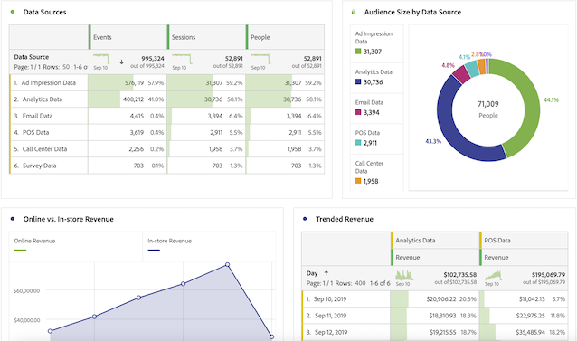

# CJA-gebruikershandleiding voor Adobe Analytics-gebruikers

>[!NOTE]
>
>Deze pagina is in opbouw.

Gefeliciteerd, uw bedrijf begint werk te vinden Customer Journey Analytics! Als gebruiker die bekend is met Adobe Analytics, hebt u al een geweldige start. Als u met Customer Journey Analytics werkt, zult u merken dat er grote verschillen en enkele overeenkomsten zijn. Deze pagina is bedoeld om de dingen uit te leggen die niet zijn gewijzigd, en ook een aantal van de grote verschillen. Wij zullen u ook vertellen hoe u meer informatie over nieuwe concepten kunt krijgen, en verdere stappen om UW klantenreis gemakkelijker en succesvoller te maken.

## Wat niet is gewijzigd

Veel van wat u op de verslaggevende kant kent, is niet veranderd.

* U kunt de kracht van [Analysis Workspace](/help/analysis-workspace/home.md) om uw gegevens te analyseren. De werkruimte werkt hetzelfde als in traditionele Adobe Analytics.
* U hebt ook dezelfde versie van [Adobe Analytics-dashboards](/help/mobile-app/home.md) beschikbaar. Dashboards (ook bekend als Mobile App) werkt hetzelfde als in traditionele Adobe Analytics.
* [Report Builder](/help/report-builder/report-buider-overview.md) heeft een nieuwe interface en loopt nu op PCs, Macs, en de Webversie van Excel.

Wat de rapportage betreft, is het verschil dat je toegang hebt tot veel meer kanaalgegevens om te analyseren. Hier is een voorbeeld van een aantal visualisaties die bronnen van dwars-kanaalgegevens omvatten:

## Nieuwe architectuur

Customer Journey Analytics krijgt zijn gegevens van Adobe Experience Platform. Met Experience Platform kunt u klantgegevens en inhoud van elk systeem of kanaal centraliseren en standaardiseren. Bovendien kunt u door middel van het leren van gegevens en computers het ontwerp en de levering van persoonlijke ervaringen verbeteren.

De gegevens van de klant in het platform worden opgeslagen als datasets, die uit een schema en partijen gegevens bestaan. Zie voor meer informatie over het platform [Overzicht van Adobe Experience Platform-architectuur](https://experienceleague.adobe.com/docs/platform-learn/tutorials/intro-to-platform/basic-architecture.html?lang=en).

Uw CJA-beheerder heeft [verbindingen](/help/connections/create-connection.md) naar gegevenssets in Platform. Ze hebben toen gebouwd [gegevensweergaven](/help/data-views/data-views.md) binnen die verbindingen. Beschouw gegevensweergaven als vergelijkbaar met virtuele rapportsuites. Gegevensweergaven vormen de basis voor rapportage in Customer Journey Analytics. Het concept van een rapportsuite bestaat niet meer.

## Nieuwe concepten en terminologie

Verschillende functies in CJA zijn in vergelijking met traditionele Adobe Analytics hernoemd en opnieuw ontworpen om aan de industrienormen te voldoen. Sommige bijgewerkte terminologie omvat segmenten, virtuele rapportsuites, classificaties, klantenattributen, en containernamen. Vertrouwde concepten zoals eVars en props bestaan niet meer, samen met de beperkingen die ze opleggen.

## Geen eVars en props meer

[!UICONTROL eVars], [!UICONTROL props], en [!UICONTROL events] in de traditionele Adobe Analytics-zin niet meer bestaan in [!UICONTROL Customer Journey Analytics]. U hebt onbeperkte schema-elementen (afmetingen, metriek, lijstvelden). Zo worden alle attributie montages u gebruikte om tijdens het proces van de gegevensinzameling toe te passen nu toegepast bij vraagtijd.

**Wat u moet doen**:

* Verken uzelf met de vele manieren die u kunt

## Segmenten zijn nu &#39;filters&#39;

[!UICONTROL Customer Journey Analytics] gebruikt niet langer eVars, props of gebeurtenissen en gebruikt in plaats daarvan een AEP-schema. Dit betekent dat geen van de bestaande segmenten compatibel is met [!UICONTROL Customer Journey Analytics]. Daarnaast is de naam van &quot;segmenten&quot; gewijzigd in &quot;filters&quot;.

Voorlopig kunt u niet delen/publiceren [!UICONTROL filters] ([!UICONTROL segments]) van [!DNL Customer Journey Analytics] aan Experience Platform verenigde Profiel, of andere toepassingen van de Experience Cloud. Deze functionaliteit wordt momenteel ontwikkeld.

**Wat u moet doen**:

* Als u bestaande Adobe Analytics-segmenten naar Customer Journey Analytics wilt verplaatsen, geeft u de volgende opties weer [deze video](https://experienceleague.adobe.com/docs/customer-journey-analytics-learn/tutorials/moving-adobe-analytics-segments-to-customer-journey-analytics.html?lang=en).
* Anders maakt u de filters opnieuw in Customer Journey Analytics.

## Berekende standaarden

[!UICONTROL Customer Journey Analytics] gebruikt niet langer eVars, props of gebeurtenissen en gebruikt in plaats daarvan een AEP-schema. Dit betekent dat geen van de bestaande berekende meetwaarden compatibel is met [!UICONTROL Customer Journey Analytics].

**Wat u moet doen**:

* Als u berekende maateenheden van Adobe Analytics wilt verplaatsen naar Customer Journey Analytics, kunt u de weergave [deze video](https://experienceleague.adobe.com/docs/customer-journey-analytics-learn/tutorials/moving-your-calculated-metrics-from-adobe-analytics-to-customer-journey-analytics.html?lang=en).
* Anders maakt u de berekende metriek opnieuw in Customer Journey Analytics.

## Virtuele rapportsuites zijn nu &#39;gegevensweergaven&#39;

De meningen van gegevens nemen het concept virtuele rapportsuites zoals zij vandaag bestaan en breiden het tot uit [extra controles van de gegevens toelaten](/help/data-views/create-dataview.md) beschikbaar gesteld door verbindingen. Dit maakt timezone en zittingsonderbreking uit intervallen configureerbaar. U kunt kenmerken en vervalwaarden ook dynamisch toepassen op afzonderlijke dimensies. Deze worden met terugwerkende kracht toegepast op alle gegevens.

**Wat u moet doen**:

* U ziet dat in Workspace de rapportsuite-kiezer die u nu gebruikt, u de mogelijkheid biedt een keuze te maken uit de gegevensweergaven die uw beheerder met u heeft gedeeld:

   

* U vertrouwd maken met de vele [gebruik gevallen rond gegevensweergaven](/help/data-views/data-views-usecases.md).

## Gegevens uit meerdere rapporten

Bestaande implementaties van meerdere gegevenssets kunnen in Experience Platform worden gecombineerd. De verbindingen en gegevensmeningen die op deze gegevensreeksen gebaseerd zijn kunnen gegevens combineren die eerder in afzonderlijke rapportreeksen bestonden.

**Wat u moet doen**:

## Instellingen voor sessie en variabelerepersistentie

[!UICONTROL Customer Journey Analytics] past al deze instellingen tijdens het rapport toe en deze instellingen bevinden zich nu in [gegevensweergaven](help/data-views/component-settings/persistence.md). De wijzigingen in deze instellingen zijn nu retroactief en u kunt meerdere versies gebruiken door meerdere gegevensweergaven te gebruiken.

**Wat u moet doen**:

## Classificaties zijn nu &#39;Gegevensbestanden opzoeken&#39;

## Klantkenmerken zijn nu &#39;Profielgegevenssets&#39;

## De naam van containers is gewijzigd

U geeft een container op voor [elke gegevensweergave die u maakt](https://experienceleague.adobe.com/docs/analytics-platform/using/cja-dataviews/create-dataview.html?lang=en#containers).
* **Handcontainers zijn nu &#39;Event&#39;-containers**. De [!UICONTROL Person] container bevat elke sessie en gebeurtenis voor bezoekers binnen de opgegeven tijdsperiode.
* **Bezoek containers zijn nu &#39;Sessie&#39;-containers**. De [!UICONTROL Session] Met container kunt u paginainteracties, campagnes of conversies voor een specifieke sessie identificeren.
* **Bezoekerscontainers zijn nu [!UICONTROL Person] containers**. De [!UICONTROL Person] container bevat elke sessie en gebeurtenis voor bezoekers binnen de opgegeven tijdsperiode.

**Wat u moet doen**:

U kunt de naam van elke container aanpassen aan de behoeften van uw organisatie.

## `Uniques Exceeded` beperkingen

[!UICONTROL Customer Journey Analytics] heeft geen unieke waardebeperkingen, dus hoeft u zich daar geen zorgen over te maken!
