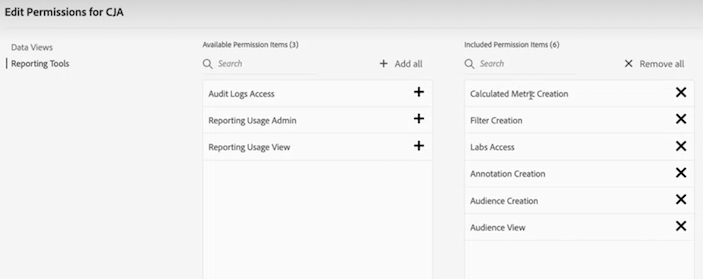

# CJA Access Control

Customer Journey Analytics (CJA) wordt bepaald door drie toegangsniveaus of drie rollen: De rol van Admin van het product, de rol van Admin van het Profiel van het Product, en gebruiker-vlakke toegang. In dit onderwerp worden deze rollen gedetailleerder beschreven.

Bovendien bespreken wij meer korrelige manieren om toegang, zoals de kromming van de Werkruimte en rij-niveau evenals waarde-vlakke toegangsbeheer te beperken.

## De rol Productbeheerder

Productbeheerders hebben machtigingen om alle taken uit te voeren die nodig zijn in CJA. U moet als productbeheerder aan de **Customer Journey Analytics-productprofiel** in de [Admin Console](https://adminconsole.adobe.com/enterprise/) krachtens [!UICONTROL Customer Journey Analytics] > [!UICONTROL Admins] tab > [!UICONTROL Add Admin]. Aan productbeheerders worden de volgende machtigingen verleend:

* Verbindingen of gegevensweergaven maken/bijwerken/verwijderen
* Werk/schrap projecten, filters, berekende metriek, publiek, annotaties of filters bij die door andere gebruikers worden gecreeerd
* Werkruimteprojecten delen met alle gebruikers

Het alleen in Customer Journey Analytics beheren van een product is niet voldoende om een [verbinding](/help/connections/overview.md). Om een verbinding aan een dataset van de Experience Platform tot stand te brengen, hebt u ook de toestemmingen van het Experience Platform nodig. U moet specifiek deel uitmaken van een **Productprofiel Experience Platform** dat u de volgende toestemmingen geeft:

* Gegevensmodellering: Schema&#39;s weergeven, schema&#39;s beheren
* Gegevensbeheer: Datasets weergeven, Gegevens beheren
* Gegevensinname: Bronnen beheren
* Identiteitsnaamruimten weergeven

Voor meer informatie over de toestemmingen van het Experience Platform, zie [Toegangsbeheer in Adobe Experience Platform](https://experienceleague.adobe.com/docs/experience-platform/access-control/home.html).

## Beheerdersrol productprofiel

Een productprofiel is een set machtigingen. Beheerders van productprofielen kunnen

* Afzonderlijke productprofielen maken en beheren, zoals nieuwe gebruikers toevoegen of gebruikersgroepen en de bijbehorende productprofielen beheren.

* Bewerk in CJA de gegevensweergaven die deel uitmaken van een productprofiel dat ze beheren. Ze kunnen geen nieuwe gegevensweergaven maken.

## Toegang op gebruikersniveau

Gebruikers in Customer Journey Analytics kunnen geen gegevensweergaven of verbindingen maken, bewerken of weergeven. De gebruikers kunnen filters, projecten, publiek, en berekende metriek met speciale toestemmingen in de Admin Console tot stand brengen.

## Workspace-projectcursus

Een ander niveau van toegangsbeheer kan op het de rapportniveau van de Werkruimte worden gebruikt. U kunt de toegang tot specifieke componenten voor bepaalde gebruikers beperken. Voor meer informatie over hoe te om componenten (afmetingen, metriek, segmenten, datumwaaiers) op het het projectniveau van de Werkruimte te beperken, en hoe de kromming aan gegevensmeningen gebonden is, zie [Cursieve projecten](/help/analysis-workspace/curate-share/curate.md).

## Toegang verlenen tot individuele metriek of dimensies

U kunt geen toestemmingen op individuele metriek of dimensies in Customer Journey Analytics verlenen of ontkennen zoals u in traditionele Adobe Analytics kunt. Metriek en afmetingen kunnen worden gewijzigd in [gegevensweergaven](/help/data-views/data-views.md) en zijn derhalve onderhevig aan wijzigingen in CJA. Als u ze wijzigt, wordt de rapportage ook met terugwerkende kracht gewijzigd.

## Gebruik hoofdletters

Hier zijn een paar gebruiksgevallen die illustreren hoe de toegangscontrole in real-life scenario&#39;s kan worden gebruikt.

### Toegang van derden

Een derde waarmee uw bedrijf samenwerkt, heeft een teamlead waarmee u productprofielbeheer kunt maken. Deze beheerder kan vervolgens gebruikers in zijn team toevoegen aan dit productprofiel. Deze beheerder kan toegang geven tot specifieke gegevensweergaven en andere gebruikers toevoegen aan dit productprofiel. Zij kunnen die gegevensmeningen ook wijzigen waarover zij controle hebben om de behoeften van hun team te passen.

### Toegangsbeheer op rijniveau

Laten we zeggen dat u gebruikers slechts vanaf één dag toegang wilt geven tot gegevens. Hieronder wordt beschreven hoe u de toegang tot die specifieke rijen beperkt:

1. Een filter maken in CJA waar **[!UICONTROL Day]** is gelijk aan de datum u hen gegevenstoegang tot wilt hebben.
1. In [!UICONTROL Data views] > [!UICONTROL Settings], voegt u dat filter toe aan de gegevensweergave.
1. Sla de gegevensweergave op en past het filter automatisch toe op de gegevensset. Alle rijen die niet in de filterdefinitie passen, worden nu automatisch uitgesloten van de bewerkte gegevensweergave.
1. Maak een nieuw productprofiel in de Admin Console, voeg er gebruikers aan toe en beperk de toegang tot deze gegevensweergave.

### Toegangsbeheer op waardeniveau

Gebruikers die toegang hebben tot een gegevensweergave, kunnen alleen werken met de cijfers en afmetingen die de beheerder in deze gegevensweergave heeft opgenomen. Beheerders kunnen de opdracht [Functionaliteit opnemen/uitsluiten](/help/data-views/component-settings/include-exclude-values.md) in gegevensweergaven waarin u bijvoorbeeld bepaalde waarden van dimensies wilt uitsluiten van een gegevensweergave.

Hier volgt een voorbeeld van de gezondheidszorg: Stel dat u een metrische waarde met de naam &quot;Hypertensie&quot; maakt in een gegevensweergave, op basis van een gegevensset die deze gegevens bevat. Het feit dat het een metrische waarde is, zou je in staat stellen de totale waarde van deze metrische waarde te zien, maar niet de individuele patiënten die eronder vallen.

## CJA-machtigingen in Admin Console

De **[!UICONTROL Permissions]** is onderdeel van elk productprofiel in [Admin Console](https://adminconsole.adobe.com/enterprise/). U kunt gebruikers toevoegen aan specifieke productprofielen. Vervolgens wijst u rechten toe aan specifieke gegevensweergaven en geeft u op welke machtigingen de gebruikers in een productprofiel hebben. Hier zijn de CJA-specifieke toestemmingen:

| Machtiging | Definitie |
| --- | --- |
| **[!UICONTROL Data Views]** | Als u schakelt **[!UICONTROL Auto-Include]** tot **[!UICONTROL On]** Gebruikers die deel uitmaken van dit productprofiel, kunnen alle bestaande en nieuwe gegevensweergaven bekijken. Als deze instelling is ingesteld op **[!UICONTROL Off]**, kunt u specifieke gegevensweergaven selecteren waartoe gebruikers toegang hebben. |
| **[!UICONTROL Reporting Tools]**: |  |
| **[!UICONTROL Audit Logs Access]** | Momenteel [auditlogboeken](https://adobe.io/cja-apis/docs/endpoints/auditlogs/) zijn alleen beschikbaar via de API. Deze toestemming dwingt de toestemmingscontrole op API en een aanstaande controle logboeken UI af. |
| **[!UICONTROL Reporting Usage Admin]** | Laat gebruikers om het even welk rapport bekijken en schrappen dat in hun bedrijf loopt. (De rapportfunctionaliteit voor gebruik wordt nog niet vrijgegeven.) |
| **[!UICONTROL Reporting Usage View]** | Hiermee kunnen gebruikers alle gelijktijdige rapportageaanvragen bekijken. (De rapportfunctionaliteit voor gebruik wordt nog niet vrijgegeven.) |
| **[!UICONTROL Calculated Metrics Creation]** | Gebruikers kunnen [berekende meetwaarden](/help/components/calc-metrics/calc-metr-overview.md). |
| **[!UICONTROL Filter Creation]** | Gebruikers kunnen [filters](/help/components/filters/filters-overview.md). |
| **[!UICONTROL Labs Access]** | Gebruikers kunnen toegang krijgen tot de [Labs](/help/labs/labs.md) in CJA. |
| **[!UICONTROL Annotation Creation]** | Gebruikers kunnen [annotaties](/help/components/annotations/overview.md). |
| **[!UICONTROL Audience Creation]** | Gebruikers kunnen [publiek](/help/components/audiences/audiences-overview.md). |
| **[!UICONTROL Audience View]** | Hiermee kunnen gebruikers de weergave [publiek](/help/components/audiences/audiences-overview.md). |

{style=&quot;table-layout:auto&quot;}
