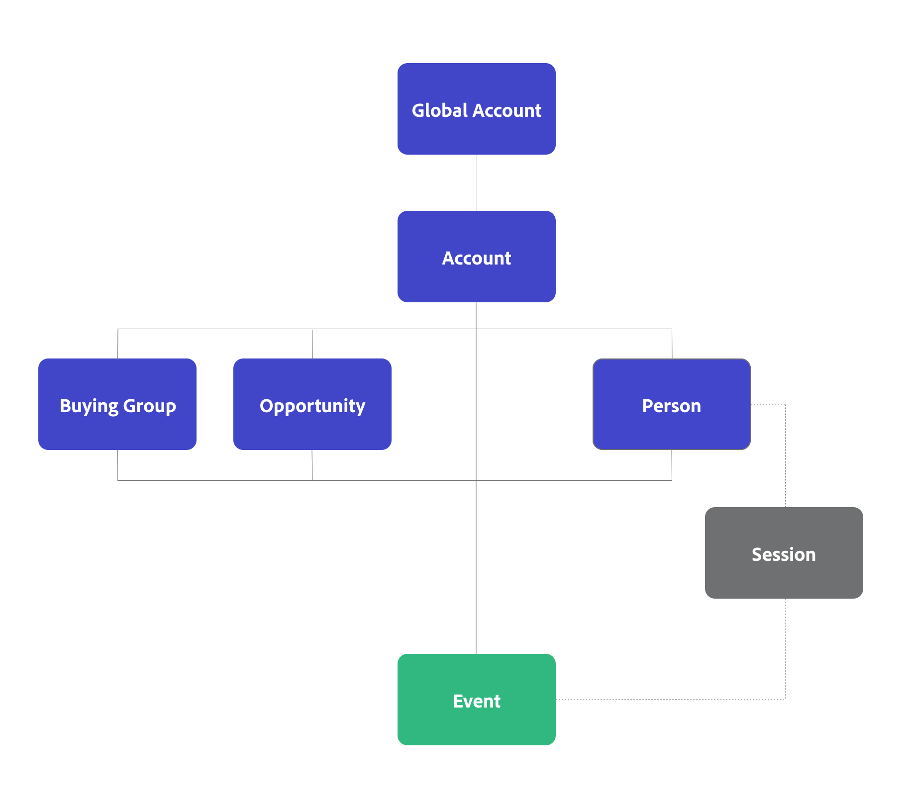

# B2B edition-concepten en -functies

{{draft-b2b}}

Dit artikel verklaart concepten zoals verbindingen, herkenningstekens, containers, en datasets, algemeen gebruikt in Customer Journey Analytics. En hoe de Customer Journey Analytics B2B edition extra functies toevoegt aan deze concepten.

## Verbindingen en id&#39;s

In Customer Journey Analytics kiest u een gemeenschappelijke id, ook wel Persoon-id genoemd, waarmee u uw gebeurtenisgegevens kunt verbinden met andere gegevenssets, zoals profielgegevensset en opzoekgegevenssets. Dit type verbinding wordt een op persoon gebaseerde verbinding genoemd die op persoon-gebaseerde rapportering en analyse vergemakkelijkt.

In Customer Journey Analytics B2B edition kunt u kiezen tussen een persoonlijke verbinding of een verbinding op basis van een account. Een op account gebaseerde verbinding vergemakkelijkt rapportage en analyse op basis van account.

* Voor een op persoon gebaseerde verbinding selecteert u Person als primaire id. U kunt dan uw verbinding, gegevensmening en werkruimteprojecten voor op persoon-gebaseerde rapportering vormen en opstelling.
* Voor een verbinding op basis van een account selecteert u Account als primaire id. Vervolgens kunt u desgewenst extra containers toevoegen voor Global Account, Buying Group en Opportunity. Afhankelijk van of u een Global Account toevoegt of niet, is uw primaire id een account-id of een algemene account-id.

## Containers

In Customer Journey Analytics-containers worden gegenereerd als onderdeel van de configuratie van een verbinding en gegevensweergave. Containers slaan alleen id&#39;s op om het snel en uitvoerbaar uitvoeren van functies zoals segmentatie, storingen en meer te vergemakkelijken.

### Standaardcontainers

Customer Journey Analytics is gebouwd rond het concept van drie containers: Persoon, Zitting, en Gebeurtenis. Tijdens een configuratie, worden deze containers impliciet geproduceerd.

U kunt opnieuw bepalen hoe deze containers worden genoemd wanneer u een gegevensmening vormt maar de hiërarchie en de verhoudingen tussen de containers wordt vooraf bepaald. De container van de Zitting wordt geproduceerd gebaseerd op hoe u een zitting in de [ montages van de Zitting ](/help/data-views/session-settings.md) in uw gegevensmening bepaalt.

{zoomable="yes"}

### B2B-containers

In Customer Journey Analytics B2B edition wordt een container Account toegevoegd aan de lijst met gegenereerde containers. En u hebt de optie om de generatie van extra containers, zoals Globale Rekening, het Kopen Groep, en Kans te vormen.

De hiërarchie en de relaties tussen de containers zijn vooraf bepaald. Opportunity, Buying Group en Person zijn alle containers op hetzelfde niveau van de container van de account. In die hiërarchie wordt de container van de Zitting tussen de container van de Persoon en de container van de Gebeurtenis geproduceerd gebaseerd op hoe u een zitting in de [ montages van de Zitting ](/help/data-views/session-settings.md) in uw gegevensmening bepaalt. Er worden momenteel geen extra sessiecontainers gegenereerd en ondersteund, bijvoorbeeld tussen de container Account en de container Event. Zie de onderstaande tabel voor een beschrijving en het basisgebruik van de B2B-containers.

{zoomable="yes"}

| B2B-container | Beschrijving   Basis gebruiksgeval |
|---|---|
| Account | Een bedrijf dat een klant of potentiële klant van uw zaken is. De onderneming zou een dochteronderneming of een afdeling van een grotere organisatie kunnen zijn. Account vertegenwoordigt de organisatie waarnaar u verkoopt en die u wilt bijhouden op organisatieniveau. |
| Globale account (optioneel) | De belangrijkste moedermaatschappij van een groep verbonden ondernemingen. Een global account heeft geen moedermaatschappij, maar kan dochterondernemingen of afdelingen hebben die tot de global account behoren. Wanneer u de globale container van de Rekening hebt gevormd in uw verbinding, zou een rekening die geen ouder of geen dochterondernemingen heeft op zowel het rekeningsgebied als globaal rekeningsgebied moeten worden vermeld. |
| Opportunity (optioneel) | Een verzameling producten en diensten die samen worden verkocht. Een kans bestond vaak uit verschillende fasen in de verkoopcyclus tot de sluiting van de verkoop.  u zou gegevens gebruiken om de opportuniteitsvooruitgang door de verkooptrechter te meten. Bijvoorbeeld een rapport dat details over de hoogste kansen verstrekt die zich van fase 3 aan fase 4 bewogen. |
| Groep voor kopen (optioneel) | Een verzameling personen binnen een organisatie die betrokken is bij het besluitvormingsproces voor de aankoop van een product of dienst.   u zou het kopen groepsgegevens gebruiken om het kopen groepen door campagnebeheer te volgen. Stel bijvoorbeeld dat u een publiekssegment van belangrijke inkoopgroepen maakt.  U wilt waarschijnlijk een zoekopdracht vanuit de inkoopgroep naar profielgegevens, zodat u gegevens over de personen in een inkoopgroep kunt melden. |
| Persoon | Een individu, dat vaak door een uniek e-mailadres wordt geïdentificeerd dat met het bedrijf in wisselwerking heeft gestaan.   u zou de profielgegevens gebruiken om mensen te identificeren die voor een rekening werken. Bijvoorbeeld: richt alle mensen bij een rekening die zich voor een conferentie hebben aangemeld. |

>[!IMPORTANT]
>
>* Als u **** de Globale container van de Rekening in een op rekening-gebaseerde verbinding hebt toegelaten, zou elk verslag in uw gebeurtenisdatasets een identiteitskaart van de Rekening en Globale identiteitskaart van de Rekening moeten bevatten. Als dat niet het geval is, wordt de record overgeslagen.
>* Als u **** niet de Globale container van de Rekening in een op rekening-gebaseerde verbinding hebt toegelaten, zou elk verslag in uw gebeurtenisdatasets een identiteitskaart van de Rekening moeten bevatten. Als dat niet het geval is, wordt de record overgeslagen.

## Gegevenssets

Wanneer u [ datasetmontages ](/help/connections/create-connection.md#dataset-settings) voor uw op rekening-gebaseerde verbinding in Customer Journey Analytics B2B edition vormt, hangen de opties beschikbaar voor sommige montages van het [ datasettype ](/help/connections/create-connection.md#dataset-types) af. U moet bijvoorbeeld:

* Specificeer herkenningstekens voor elk van de containers die u voor uw gebeurtenisdatasets hebt gevormd.
* Definieer een accountveld of algemeen accountveld voor uw profielgegevenssets.
* Bepaal sleutels en hoe te om deze sleutels (door container van gebied) voor raadplegingsdatasets aan te passen.

## Afstemmen op container of veld

U kunt voor elke raadplegingsdataset bepalen, of u de dataset door gebied of door container aanpast.

### Afstemmen op container

Als een recorddataset een gelijke door container gebruikt, wordt de recorddataset behandeld als een type van profieldataset en als dataset van het Profiel in het gebruikersinterface. De gelijke van het gebruik door container op datasets die uw gevormde containers steunen. Bijvoorbeeld een gegevensset voor inkoopgroep.

### Overeenkomst per veld

Als een recorddataset een gelijke door gebied gebruikt, wordt de recorddataset behandeld als type van raadplegingsdataset en als dataset van de Opzoekopdracht in het gebruikersinterface. De gelijke van het gebruik door gebied op datasets die extra details door raadpleging bijvoorbeeld, een dataset van het Lid van de Lijst van de Marketing, of een dataset van de Details van het Product steunen.

## Rapport over op personen en rekeningen gebaseerde gegevens

Als u op persoon-gebaseerde containers (en persoonsidentiteiten) en op rekening-gebaseerde containers (en rekeningsidentiteiten) wilt rapporteren, zou u twee afzonderlijke verbinding binnen Customer Journey Analytics moeten opzetten. Bij één verbinding selecteert u Persoon als primaire id en bij één verbinding selecteert u Account als primaire id. Customer Journey Analytics biedt geen ondersteuning voor persoonlijke en op account gebaseerde rapportage vanuit één containerhiërarchie.

