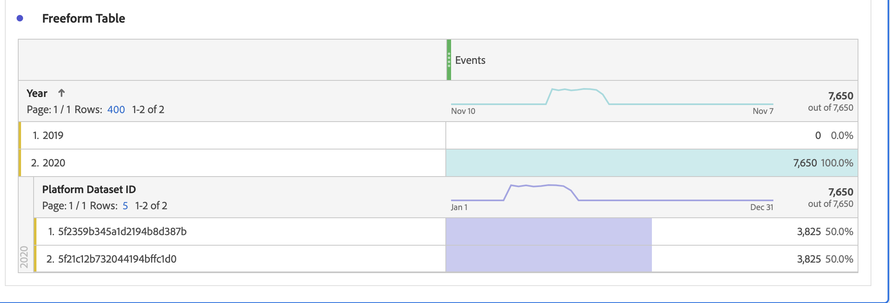

# Veelgestelde vragen

[!UICONTROL Customer Journey Analytics] (CJA) is ons product van de volgende generatie. Hieronder volgen antwoorden op veelgestelde vragen over CJA. Voor meer informatie raadpleegt u [Ondersteuning voor Customer Journey Analytics-functies](/help/getting-started/aa-vs-cja/cja-aa.md).

## 1. Vereisten {#prerequisites}

| Vraag | Antwoord |
| --- | --- |
| Moet ik [!UICONTROL Private Device Graph] of [!UICONTROL Device Coop] for [!UICONTROL Customer Journey Analytics]? | Nee, [!UICONTROL Private Device Graph] of [!UICONTROL Device Coop] niet vereist zijn voor [!UICONTROL Customer Journey Analytics]. Ze worden zelfs nog niet ondersteund. |
| Moet ik [!UICONTROL Experience Cloud ID] (ECID) voor [!UICONTROL Customer Journey Analytics]? | Nee, [!UICONTROL Customer Journey Analytics] steunt om het even welke identiteitskaart in een dataset, of dat is [!UICONTROL ECID] of een andere id die u kiest. |
| Wat moet ik doen als ik mijn gegevens moet extraheren, transformeren, laden? [!UICONTROL Customer Journey Analytics]? | Customer Journey Analytics omvat [Gegevensprep](https://experienceleague.adobe.com/docs/experience-platform/data-prep/api/overview.html) mogelijkheden om u te helpen uw gegevens om te zetten voordat u deze in het gegevenspMeer van Adobe Experience Platform plaatst. Als u ETL nodig hebt nadat de gegevens al zijn ingevoerd, [Adobe Experience Platform Query Service](https://experienceleague.adobe.com/docs/platform-learn/tutorials/queries/understanding-query-service.html#queries) bevat een aantal beperkte opties, hoewel er wellicht extra kosten mee gemoeid zijn. |

{style=&quot;table-layout:auto&quot;}

## 2. Gegevens vastleggen (Kanaaloverschrijdende analyse) {#stitching}

| Vraag | Antwoord |
| --- | --- |
| Kan [!UICONTROL Customer Journey Analytics] &quot;aansluiten&quot; op verschillende apparaten of op verschillende gegevenssets? | Ja. [!UICONTROL Customer Journey Analytics] heeft een verstikkende oplossing die [Kanaaloverschrijdende analyse](https://experienceleague.adobe.com/docs/analytics-platform/using/cja-connections/cca/overview.html) (CCA). Het laat u de persoonsidentiteitskaart van een dataset re-key, die een naadloze combinatie veelvoudige datasets toelaat. |
| Wordt het stitching van anoniem gedrag aan voor authentiek verklaard gedrag gesteund? | Ja. [Kanaaloverschrijdende analyse](https://experienceleague.adobe.com/docs/analytics-platform/using/cja-connections/cca/overview.html) kijkt naar gebruikersgegevens van zowel voor authentiek verklaarde als niet voor authentiek verklaarde zittingen om een vastgemaakte identiteitskaart te produceren. |
| Hoe werkt &#39;replay&#39; in CCA? | CCA &quot;replay&quot;gegevens die op unieke herkenningstekens worden gebaseerd het heeft geleerd. Bij opnieuw afspelen worden nieuwe apparaten aan de verbinding vastgezet. [Meer informatie](https://experienceleague.adobe.com/docs/analytics-platform/using/cja-connections/cca/replay.html#step-1%3A-live-stitching) |
| Hoe werkt het stitching van historische gegevens (backfill) in CCA? | Wanneer deze optie voor het eerst is ingeschakeld, biedt Adobe een back-up van opgeslagen gegevens die teruggaat tot het begin van de vorige maand (tot 60 dagen). Om deze backfill te kunnen uitvoeren, moet de tijdelijke id bestaan in de niet-opgeslagen gegevens die veel terug in de tijd zijn. [Meer informatie](https://experienceleague.adobe.com/docs/analytics-platform/using/cja-connections/cca/overview.html#enable-cross-channel-analytics) |
| Wat is het verwachte gedrag voor records met niet-opgeslagen profielgegevens? | **Voorbeeldscenario**: U sluit zich aan bij 2 datasets in een verbinding CJA door te gebruiken `CRMid` als de persoon-id. Een ervan is een webgebeurtenisdataset met `CRMid` in alle records. De andere dataset is een reeks van het het profielgegevens van CRM. 40% van de gegevensset CRM heeft `CRMid` aanwezig in de de gebeurtenisgegevensreeks van het Web. De andere 60% is niet aanwezig in de de gebeurtenisdataset van het Web - verschijnen deze verslagen in rapportering in Analysis Workspace?
 **Antwoord**: Profielrijen waaraan geen gebeurtenissen zijn gekoppeld, worden opgeslagen in CJA. U kunt ze echter pas in Analysis Workspace bekijken als er een gebeurtenis met die id wordt weergegeven. |

{style=&quot;table-layout:auto&quot;}

## 3. Gegevens ophalen in [!UICONTROL Customer Journey Analytics] {#ingest}

| Vraag | Antwoord |
| --- | --- |
| Kan ik gegevens combineren van verschillende [!UICONTROL Adobe Experience Platform] sandboxen in één [!UICONTROL Customer Journey Analytics] verbinding? | Nee, u hebt geen toegang tot gegevens in verschillende sandboxen. U kunt alleen gegevenssets combineren die zich binnen dezelfde sandbox bevinden. [Meer informatie](https://experienceleague.adobe.com/docs/analytics-platform/using/cja-connections/create-connection.html#select-sandbox-and-datasets) |
| Hoe kan ik online gegevens verbinden met offline gegevens in [!UICONTROL Customer Journey Analytics]? | Zolang de persoonidentiteitskaart tussen datasets aanpast, [!UICONTROL Customer Journey Analytics] kan filters, attributie, stroom, fallout, enz. verbinden over datasets. |
| Hoe kan ik mijn offline gegevens overbrengen naar [!UICONTROL Customer Journey Analytics]? | Met uw recht op Customer Journey Analytics kunt u gegevens in het Experience Platform invoeren. U kunt vervolgens verbindingen maken met die gegevens en gegevensweergaven in [!UICONTROL Customer Journey Analytics], voor rapportage in Analysis Workspace. Het team voor gegevens aan boord van het Experience Platform kan u, indien nodig, aanbevelingen of advies geven. |
| Hoe krijg ik [!UICONTROL Adobe Analytics] gegevens in [!UICONTROL Customer Journey Analytics]? | [!UICONTROL Adobe Analytics] gegevens kunnen via de [Adobe Analytics Source Connector](https://experienceleague.adobe.com/docs/experience-platform/sources/connectors/adobe-applications/analytics.html). Meeste [!UICONTROL Adobe Analytics] velden worden overgebracht in XDM-indeling, maar andere velden zijn nog niet beschikbaar. |
| Hoe lang duurt het om datasetelementen in een gegevensmening samen te stellen? | Een paar uur om te beginnen en een paar dagen om een back-up te maken van de laatste 13 maanden van gegevens. |
| Is het noodzakelijk om PII gegevens te brengen om verbindingen tussen de gegevens te vestigen? | Nr, kunt u om het even welke identiteitskaart, met inbegrip van een knoeiboel van een klant identiteitskaart gebruiken, die geen PII is. |
| Wat zijn de grenzen voor het opnemen voorbij of toekomstige data/tijdstempels in CJA gebeurtenisdatasets? | <ul><li>Met betrekking tot eerdere datums/tijdstempels: Gebeurtenisgegevens tot 10 jaar oud.</li><li>Met betrekking tot toekomstige datums/tijdstempels: Gebeurtenisgegevens (voorspellend) tot 1 maand in de toekomst.</li></ul> |

{style=&quot;table-layout:auto&quot;}

## 4. Latentieoverwegingen {#latency}

>[!NOTE]
>Er is geen vaste gegevensgrootte in CJA en dus kan Adobe zich niet vastleggen op een standaardinnametijd. We werken actief aan het verkleinen van deze latentie door nieuwe updates en optimalisatie van inname.

| Vraag | Antwoord |
| --- | --- |
| Wat is de verwachte latentie voor [!UICONTROL Customer Journey Analytics] op [!UICONTROL Adobe Experience Platform]? | <ul><li>Live gegevens of gebeurtenissen: Verwerkt en opgenomen binnen 90 minuten, zodra gegevens beschikbaar zijn in AEP. (Batchgrootte > 50 miljoen rijen: langer dan 90 minuten.)</li><li>Kleine backfills - Bijvoorbeeld, een raadplegingsdataset van 10 miljoen rijen: binnen 7 dagen<li>Grote backfills, bijvoorbeeld 500 miljard rijen: 30 dagen</li></ul> |

## 5. Rolvenster instellen voor [!UICONTROL Connection] gegevensbewaring {#data-retention}

>[!IMPORTANT]
>Neem contact op met de klantenservice of uw Adobe-accountmanager om deze instelling te laten implementeren. Deze is nog niet beschikbaar via de gebruikersinterface van CJA.

Met deze instelling kunt u CJA-gegevensbewaring definiëren als een schuifvenster in maanden (3 maanden, 6 maanden, enz.), bij een [!UICONTROL connection] niveau (niet op een [!UICONTROL dataset] niveau). Het bewaren van gegevens is gebaseerd op de tijdstempels van de gebeurtenisdataset en is slechts op gebeurtenisdatasets van toepassing. Er bestaat geen instelling voor gegevensbehoud voor profiel- of opzoekgegevenssets omdat er geen relevante tijdstempels zijn.

Het belangrijkste voordeel is dat u alleen gegevens opslaat of rapporteert die van toepassing zijn en nuttig zijn, en oudere gegevens verwijdert die niet meer nuttig zijn. Het helpt u onder uw contractgrenzen te blijven en vermindert het risico van overleeftijdskosten.

## 6. Implicaties van het verwijderen van gegevenscomponenten {#deletion}

Wat het schrappen van gegevens betreft, gaat het om zes soorten componenten: zandbak, schema, dataset, verbinding, gegevensmening, en het project van de Werkruimte. Hier zijn enkele mogelijke scenario&#39;s voor het verwijderen van een van deze componenten:

| Als u... | Dit gebeurt... |
| --- | --- |
| Een sandbox verwijderen in [!UICONTROL Adobe Experience Platform] | Als u een sandbox verwijdert, wordt de gegevensstroom naar alle [!UICONTROL Customer Journey Analytics] verbindingen met gegevenssets in die sandbox. Momenteel [!UICONTROL Connections] in CJA gekoppeld aan de verwijderde sandbox wordt niet automatisch verwijderd. |
| Schema&#39;s verwijderen in [!UICONTROL Adobe Experience Platform], maar niet de dataset(s) die aan dit schema zijn gekoppeld | [!UICONTROL Adobe Experience Platform] het schrappen van [!UICONTROL schemas] die een of meer [!UICONTROL datasets] geassocieerd met hen. Nochtans, kan Admin met de aangewezen reeks rechten de datasets eerst schrappen en dan het schema schrappen. |
| Een gegevensset verwijderen in [!UICONTROL Adobe Experience Platform] gegevensmeer | Het schrappen van een dataset in het gegevensmeer van AEP zal gegevensstroom van die dataset aan om het even welke Verbindingen van CJA tegenhouden die die dataset omvatten. Om het even welke gegevens van die dataset worden automatisch geschrapt van bijbehorende Verbindingen CJA. |
| Een gegevensset verwijderen in [!UICONTROL Customer Journey Analytics] | Neem contact op met uw accountmanager van Adobe om het verwijderen van een gegevensset binnen een verbinding die is opgeslagen, in beweging te zetten. |
| Een batch verwijderen uit een dataset (in [!UICONTROL Adobe Experience Platform]) | Als een partij uit een [!UICONTROL Adobe Experience Platform] dataset, zal de zelfde partij uit om het even welke Verbindingen worden verwijderd CJA die die specifieke partij bevatten.  CJA is op de hoogte gesteld van het verwijderen van partijen in [!UICONTROL Adobe Experience Platform]. |
| Een batch verwijderen **tijdens de inname** in [!UICONTROL Customer Journey Analytics] | Als er slechts één partij in de dataset is, zullen geen gegevens of gedeeltelijke gegevens van die partij in verschijnen [!UICONTROL Customer Journey Analytics]. De inname wordt teruggedraaid. Als, bijvoorbeeld, er 5 partijen in de dataset zijn en 3 van hen reeds zijn opgenomen toen de dataset werd geschrapt, zullen de gegevens van die 3 partijen in verschijnen [!UICONTROL Customer Journey Analytics]. |
| Een verbinding verwijderen in [!UICONTROL Customer Journey Analytics] | Een foutbericht geeft aan dat:<ul><li>De gegevensweergaven die voor de verwijderde verbinding zijn gemaakt, werken niet meer.</li><li> Op dezelfde manier zullen om het even welke projecten van de Werkruimte die van gegevensmeningen in de geschrapte verbinding afhangen ophouden werkend.</li></ul> |
| Een gegevensweergave verwijderen in [!UICONTROL Customer Journey Analytics] | Een foutenmelding zal erop wijzen dat om het even welke projecten van de Werkruimte die van deze geschrapte gegevensmening afhangen niet meer werkend zullen zijn. |

## 7. Overwegingen bij het samenvoegen van rapportsuites in CJA {#merge-reportsuite}

Als u van plan bent Adobe Analytics-gegevens in te nemen via de [Adobe Analytics-bronaansluiting](https://experienceleague.adobe.com/docs/experience-platform/sources/connectors/adobe-applications/analytics.html)Houd rekening met deze vertakkingen bij het samenvoegen van twee of meer Adobe Analytics-rapportreeksen.

| Probleem | Overwegingen |
| --- | --- |
| Variabelen | Variabelen zoals [!UICONTROL eVars] mag niet in een andere dan de rapporteereeksen worden uitgelijnd. eVar 1 in rapportsuite 1 verwijst bijvoorbeeld naar **[!UICONTROL Page]**. In rapportsuite 2 kan eVar1 verwijzen naar **[!UICONTROL Internal Campaign]**, hetgeen leidt tot gemengde en onjuiste rapportage. |
| [!UICONTROL Sessions] en [!UICONTROL People] aantal | Ze worden gededupliceerd door de rapportsuites. Hierdoor komen aantallen mogelijk niet overeen. |
| Metrische deduplicatie | Hiermee dupliceert u instanties van een metrische waarde (bijvoorbeeld [!UICONTROL Orders]) als meerdere rijen dezelfde transactie-id hebben (bijvoorbeeld [!UICONTROL Purchase ID]). Hiermee voorkomt u dat belangrijke meetgegevens te veel worden geteld. Dientengevolge, metriek als [!UICONTROL Orders] mag niet worden opgeteld bij hele rapportopties. |
| Valuta | Valutaconversie wordt nog niet ondersteund in CJA. Als de rapportsuites u probeert samen te voegen verschillende basisvaluta&#39;s gebruiken, kunnen de problemen zich voordoen. |
| [!UICONTROL Persistence] | [Persistentie](../data-views/component-settings/persistence.md) breidt zich over rapportseries uit, die gevolgen hebben [!UICONTROL filters], [!UICONTROL attribution], enzovoort. Het is mogelijk dat getallen niet correct worden opgeteld. |
| [!UICONTROL Classifications] | [!UICONTROL Classifications] niet automatisch gededupliceerd worden bij het samenvoegen van rapportsuites. Wanneer u meerdere classificatiebestanden in één bestand combineert [!UICONTROL lookup] in de gegevensset, kunnen er problemen optreden. |

## 8. Traditioneel [!UICONTROL Adobe Analytics] componenten

| Vraag | Antwoord |
| --- | --- |
| Kan ik delen/publiceren [!UICONTROL filters] ([!UICONTROL segments]) van [!DNL Customer Journey Analytics] aan Experience Platform Verenigd Profiel, of andere toepassingen van Experience Cloud? | Nog niet, maar we werken actief aan het leveren van deze capaciteit. |
| Wat is er gebeurd met mijn oude [!UICONTROL eVar] instellen? | [!UICONTROL eVars], [!UICONTROL props], en [!UICONTROL events] in de traditionele Adobe Analytics-zin niet meer bestaan in [!UICONTROL Customer Journey Analytics]. U hebt onbeperkte schema-elementen (afmetingen, metriek, lijstvelden). Zo worden alle attributie montages u gebruikte om tijdens het proces van de gegevensinzameling toe te passen nu toegepast bij vraagtijd. |
| Waar zijn al mijn zitting en veranderlijke persistentie montages nu? | [!UICONTROL Customer Journey Analytics] Hiermee past u al deze instellingen toe tijdens de rapporttijd. Deze instellingen worden nu live weergegeven in de gegevensweergave. De wijzigingen in deze instellingen zijn nu retroactief en u kunt meerdere versies gebruiken door meerdere gegevensweergaven te gebruiken! |
| Wat gebeurt er met onze bestaande segmenten/berekende maatstaven? | [!UICONTROL Customer Journey Analytics] gebruikt niet langer eVars, props of gebeurtenissen en gebruikt in plaats daarvan een AEP-schema. Dit betekent dat geen van de bestaande segmenten of statistische gegevens compatibel zijn met [!UICONTROL Customer Journey Analytics]. |
| Hoe werkt [!UICONTROL Customer Journey Analytics] handgreep `Uniques Exceeded` beperkingen? | [!UICONTROL Customer Journey Analytics] heeft geen unieke waardebeperkingen, dus hoeft u zich daar geen zorgen over te maken! |
| Als ik een bestaande [!DNL Data Workbench] klant, kan ik naar [!UICONTROL Customer Journey Analytics] nu? | Het hangt af van uw gebruikscase. Werk met uw Adobe-accountteam. Je huidige gebruikscase is mogelijk al geschikt voor Customer Journey Analytics! |

{style=&quot;table-layout:auto&quot;}

## 9. De verbindingsgrootte schatten {#estimate-size}

Mogelijk moet u weten hoeveel rijen gegevens u momenteel hebt in [!UICONTROL Customer Journey Analytics]. Ga als volgt te werk om een accuraat overzicht te krijgen van het gebruik van de records (gegevensrijen) met gebeurtenisgegevens van uw organisatie **voor elk van de verbindingen die door uw organisatie worden gecreeerd**.

1. In [!UICONTROL Customer Journey Analytics]klikt u op de knop **[!UICONTROL Connections]** tab.

   U kunt nu een lijst met al uw huidige verbindingen zien.

1. Klik op elke naam van de verbinding om deze weer te geven.

1. Voeg de **[!UICONTROL Records of event data available]** voor alle gemaakte verbindingen. (Afhankelijk van de grootte van de verbinding kan het even duren voordat het nummer wordt weergegeven.)

   

1. Als u een som van alle rijen met gebeurtenisgegevens hebt, zoekt u de machtiging &quot;Rijen van gegevens&quot; op in het Customer Journey Analytics-contract dat uw bedrijf met Adobe heeft ondertekend.

   Dit geeft u het maximumaantal rijen van gegevens die in de Orde van de Verkoop worden geautoriseerd. Als het aantal rijen gegevens dat uit Stap 3 is voortgekomen groter is dan dit aantal, gaat u over.

1. U kunt deze situatie op verschillende manieren verhelpen:

   * Wijzig uw [instellingen voor gegevensbehoud](https://experienceleague.adobe.com/docs/analytics-platform/using/cja-connections/manage-connections.html#set-rolling-window-for-connection-data-retention).
   * [Ongebruikte verbindingen verwijderen](https://experienceleague.adobe.com/docs/analytics-platform/using/cja-overview/cja-faq.html#implications-of-deleting-data-components).
   * [Een gegevensset verwijderen in AEP](https://experienceleague.adobe.com/docs/analytics-platform/using/cja-overview/cja-faq.html#implications-of-deleting-data-components).
   * Neem contact op met de accountmanager van de Adobe om een licentie voor extra capaciteit te verkrijgen.

## 10 Over gebruiksoverschrijdingen {#overage}

De gebruikslimieten worden regelmatig gecontroleerd en afgedwongen door Adobe. &quot;Rijen van gegevens&quot;: de dagelijkse gemiddelde rijen van gegevens die beschikbaar zijn voor analyse binnen Customer Journey Analytics.

Stel bijvoorbeeld dat uw contract u recht geeft op één miljoen rijen met gegevens. Stel dat u op dag 1 van het gebruik van Customer Journey Analytics twee miljoen rijen gegevens uploadt. Op dag 2, schrapt u 1 miljoen rijen en houdt uw gebruik bij dat gecommitteerde maximum (d.w.z., één miljoen rij gegevens) voor de rest van uw Termijn van de Vergunning. Afhankelijk van uw contractvoorwaarden, kunt u nog steeds geproreerde overgebruikskosten voor dag 1 maken, aangezien u uw licentierechten voor &quot;rijen met gegevens&quot; hebt overschreden.

## 11. Verschillen in onderzoeksgegevens {#discrepancies}

In sommige gevallen, kunt u opmerken dat het totale aantal gebeurtenissen die door uw verbinding worden opgenomen verschillend is dan het aantal rijen in de dataset in [!UICONTROL Adobe Experience Platform]. In dit voorbeeld heeft de dataset &quot;B2B Impression&quot; 7650 rijen, maar de dataset bevat 3830 rijen in [!UICONTROL Adobe Experience Platform]. Er zijn verschillende redenen waarom er verschillen kunnen optreden en de volgende stappen kunnen worden uitgevoerd om een diagnose te stellen:

1. Verdeel deze dimensie door **[!UICONTROL Platform Dataset ID]** en u zult twee datasets met de zelfde grootte maar verschillend opmerken **[!UICONTROL Platform Dataset IDs]**. Elke dataset heeft 3825 verslagen. Dat betekent [!UICONTROL Customer Journey Analytics] 5 records genegeerd wegens ontbrekende persoon-id&#39;s of ontbrekende tijdstempels:

   

1. Als we inchecken [!UICONTROL Adobe Experience Platform], is er geen dataset met ID &quot;5f21c12b732044194bffc1d0&quot;, vandaar dat iemand deze specifieke dataset van schrapte [!UICONTROL Adobe Experience Platform] wanneer de eerste verbinding werd gemaakt. Later werd het opnieuw toegevoegd aan Customer Journey Analytics, maar een ander [!UICONTROL Platform Dataset ID] is gegenereerd door [!UICONTROL Adobe Experience Platform].

Meer informatie over de [implicaties van gegevensset en het schrappen van verbindingen](https://experienceleague.adobe.com/docs/analytics-platform/using/cja-overview/cja-faq.html#implications-of-deleting-data-components) in [!UICONTROL Customer Journey Analytics] en [!UICONTROL Adobe Experience Platform].
