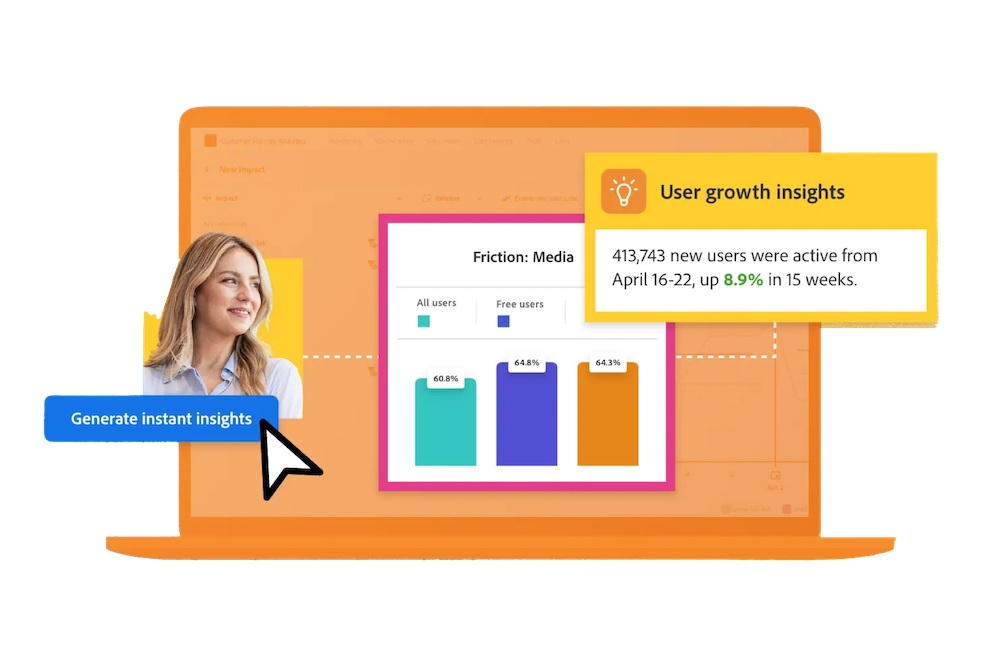

# Handleiding voor Customer Journey Analytics

Deze handleiding voor technische documentatie biedt zelfhulp voor Customer Journey Analytics. Met Customer Journey Analytics kunt u uw klantgegevens vanuit elk kanaal dat u kiest (zowel online als offline) naar Adobe Experience Platform overbrengen. Analyseer deze gegevens op dezelfde manier als je bestaande digitale gegevens met Analysis Workspace vandaag.

Met Customer Journey Analytics kunt u bepalen hoe u online en offline gegevens in Analysis Workspace verbindt met een gemeenschappelijke klant-id, zodat u kenmerken, filters, stroom, fallout enz. kunt uitvoeren. van uw klantgegevens.

## Wat is nieuw?

Bekijk een glimp van de nieuwste verbeteringen in het product en de documentatie van de Customer Journey Analytics! Voor een uitgebreide lijst met functies, verbeteringen en oplossingen raadpleegt u de gedetailleerde [Opmerkingen bij de release](../release-notes/latest.md). Ga naar [pagina met documentupdates](../release-notes/doc-changes.md) om up-to-date te blijven met de meest recente wijzigingen.

>[!BEGINTABS]

>[!TAB AI-assistent]

De Medewerker van AI is een conversatie ervaring die artsen toestaat om taken in een snel tempo uit te voeren - of zijn begrip concepten, het oplossen van problemenproblemen, of het zoeken door informatie. Het stelt ook niet-deskundigen in staat om deskundig taken uit te voeren en verhoogt de algemene kwaliteit van het werk.

>[!TAB Op grafiek gebaseerde stitching]

Door op grafiek-gebaseerde het stitching, kunt u de identiteitsgrafiek van de Dienst van de Identiteit van het Experience Platform gebruiken om een betere mening van de klantenreis te krijgen door: <ul><li>Gegevenssets samenvoegen met verschillende id&#39;s zonder dat er aanvullende gegevens moeten worden opgehaald, getransformeerd en geladen om één id te weerspiegelen.</li> <li>Verbetering van de dekking van de preferente of gouden identiteit voor één gegevensset door identiteiten over gegevensreeksen te delen;</li><li>Profielen die in Real-time Customer Data Platform en Journey Optimizer zijn gemaakt, worden uitgelijnd op personen in Customer Journey Analytics.</li></ul>

>[!TAB B2B-zoekopdrachten]

Als deel van het vormen van een verbinding, kunt u datasets voor specifieke B2B raadplegingsschema&#39;s omzetten om op persoon-gebaseerde raadplegingen op B2B- gegevens beter te steunen.

>[!TAB Afgeleide velden]

Nieuwe afgeleide veldfuncties (Math, Volgende of Vorige, Samenvatten) en extra functiesjablonen (zoals Bounces, Friendly Dataset Name, Holiday Season, Monthly Goals, Simple Bot Detection, enzovoort) zijn nu beschikbaar.

>[!TAB BI-extensie*]

De uitbreiding van BI laat SQL toegang tot de gegevensmeningen toe die u in Customer Journey Analytics hebt bepaald. U kunt uw favoriete hulpmiddel van BI nu gebruiken om rapportering en dashboards tot stand te brengen die op de zelfde gegevensmeningen die de gebruikers van de Customer Journey Analytics met hun projecten van Analysis Workspace gebruiken.

*_U moet het Select-pakket of hoger hebben om de BI-extensie te kunnen gebruiken._*

<!--
>[!TAB Improved Audience Publising] 

Audiences that are published from Customer Journey Analytics are now available in the new **Audiences** section in Adobe Experience Platform. Audiences are now available in Experience Platform seconds after they are published from Customer Journey Analytics. Improved sorting and filter options in Experience Platform for Customer Journey Analytics audiences. 

-->

>[!TAB Voorspelling]

Prognosering is een Analysis Workspace-functie voor het voorspellen van een standaard of berekende metrische waarde met een ondersteunde tijdgranulariteit (uur, dag, week, maand en jaar). Prognosering is alleen beschikbaar voor aan tijdreeksen gerelateerde gegevens.

>[!TAB Nieuwe documentatie]

De nieuwe documentatiesecties zijn nu beschikbaar op:<ul><li>Een upgrade uitvoeren van Adobe Analytics naar Customer Journey Analytics.</li><li>Gebruiksscenario&#39;s voor gegevensuitvoer en de vereiste Experience Platform- en klantenreisfuncties. </li></ul>Selecteren **[!UICONTROL Learn more]** voor deze en andere documentatieupdates.

>[!ENDTABS]

## Beginnen met de basisbeginselen

Begin met het lezen van het materiaal in de koppelingen hieronder om uzelf vertrouwd te maken met de mogelijkheden en functies van de Customer Journey Analytics.

<table style="table-layout:fixed">
  <tr style="border: 0;">
    <td>
    
    
<strong>Meer dan alleen online gegevens</strong> Leer hoe Customer Journey Analytics zich verhoudt tot Adobe Analytics, welke functies worden gedeeld en hoe u uw analysegegevens kunt gebruiken.

    </td>
    <td>
    
    
<strong>Gegevens opnemen en gebruiken</strong> Leer over de opties die u gegevens in Experience Platform moet opnemen en het voor analyse en rapportering in Customer Journey Analytics moet gebruiken.

    </td>
    <td>
    
    
<strong>Analyse met instructies</strong> Leer hoe u workflows kunt gebruiken om gegevens en inzichten over de productervaring van uw klant te verkrijgen. Product Analytics door middel van geleide analyse...
    

    </td>
    <td>
    
    
<strong>Analysis Workspace</strong> Met Analysis Workspace kunt u basisanalyses en geavanceerde analyses uitvoeren, zoals diagrammen voor toewijzing, doorloop en uitval, dimensiescheidingen.

    </td>
  </tr>
  <tr style="border: 0;">
    <td align="center"></td>
    <td align="center"></td>
    <td align="center"></td>
    <td align="center"></td>
    </tr>
</table>

## Documentatie verkennen

Begrijp hoe de Customer Journey Analytics met Adobe Analytics vergelijkt. En hoe u uw gegevens in de oplossing kunt krijgen en deze gegevens en de daaruit voortvloeiende analyse en rapporten kunt voorbereiden, bekijken, analyseren en democratiseren.

<table style="table-layout:fixed">
  <tr style="border: 0;">
    <td>
       
      <strong>Vergelijken met Adobe Analytics</strong> <a href="/help/getting-started/aa-vs-cja/overview.md">Overzicht</a> - <a href="/help/getting-started/aa-to-cja.md">Evolutie</a> - <a href="/help/getting-started/aa-vs-cja/aa-data-in-cja.md">Adobe Analytics-gegevens gebruiken</a> - <a href="/help/getting-started/aa-vs-cja/cja-aa.md">Functieondersteuning</a> - <a href="/help/getting-started/aa-vs-cja/terminology.md">Terminologie</a> - <a href="/help/getting-started/aa-vs-cja/data-processing-comparisons.md">Gegevensverwerking</a>
    </td>
    <td>
       
      <strong>Verbindingen</strong> <a href="/help/connections/overview.md">Overzicht</a> - <a href="/help/connections/create-connection.md">Maken</a> - <a href="/help/connections/manage-connections.md">Beheren</a> - <a href="/help/stitching/overview.md">Stiksel</a> - <a href="/help/connections/combined-dataset.md">Gecombineerde gegevenssets voor gebeurtenissen</a> - <a href="/help/connections/standard-lookups.md">Standaardzoekopdrachten</a>
    </td>
     <td>
       
      <strong>Gegevensweergaven</strong> <a href="/help/data-views/data-views.md">Overzicht</a> - <a href="/help/data-views/create-dataview.md">Maken of bewerken</a> - <a href="/help/data-views/session-settings.md">Sessieinstellingen</a> - <a href="/help/data-views/derived-fields/derived-fields.md">Afgeleide velden</a> - <a href="/help/data-views/component-reference.md">Componentverwijzing</a>
    </td>

</tr>
  <tr style="border: 0;">
    <td>
       
      <strong>Workspace-projecten</strong> <a href="/help/analysis-workspace/home.md">Analysis Workspace</a> - <a href="/help/analysis-workspace/perform-basic-analysis.md">Basis</a> &amp; <a href="/help/analysis-workspace/perform-adv-analysis.md">Geavanceerde analyse</a> - <a href="/help/analysis-workspace/build-workspace-project/freeform-overview.md">Projecten</a> - <a href="/help/analysis-workspace/visualizations/freeform-analysis-visualizations.md">Visualisaties</a> - <a href="/help/analysis-workspace/c-panels/freeform-panel.md">Deelvensters</a>
    </td>
    <td>
       
      <strong>Analyse met instructies</strong> <a href="/help/guided-analysis/overview.md">Overzicht</a> - <a href="/help/guided-analysis/types/active.md">Gebruikersgroei</a> - <a href="/help/guided-analysis/types/usage.md">Trends</a> - <a href="/help/guided-analysis/types/friction.md">Trechter</a> - <a href="/help/guided-analysis/types/release.md">Gevolgen</a> - <a href="/help/guided-analysis/industry-use-cases.md">Industriële gebruiksgevallen</a>
    </td>
    <td>
       
      <strong>Delen, exporteren en integreren</strong> <a href="/help/analysis-workspace/curate-share/share-projects.md">Projecten</a> - <a href="/help/mobile-app/home.md">Analysedashboards</a> - <a href="/help/report-builder/report-buider-overview.md">Report Builder</a>  - <a href="/help/integrations/overview.md">Integraties</a>
    </td>
  </tr>
</table>

## Aanvullende bronnen

<table style="table-layout:fixed"><tr style="border: 0;">
<td><strong>Customer Journey Analytics</strong> 
<a href="https://experienceleague.adobe.com/en/docs/customer-journey-analytics-learn/tutorials/overview" target="_blank">Tutorials</a> - <a href="https://helpx.adobe.com/legal/product-descriptions/customer-journey-analytics.html" target="_blank">Productbeschrijving Customer Journey Analytics</a> - <a href="https://helpx.adobe.com/legal/product-descriptions/adobe-analytics-addon-customer-journey-analytics.html" target="_blank">Adobe Analytics (Customer Journey Analytics add-on) productbeschrijving</a> - <a href="https://developer.adobe.com/cja-apis/docs/" target="_blank">Customer Journey Analytics-API's</a> - <a href="/help/ai-assistant.md">AI-assistent</a>
</td>
<td><strong>Gegevensinname</strong> <a href="/help/data-ingestion/data-ingestion.md">Overzicht</a> - <a href="/help/data-ingestion/analytics.md">Analyse</a> - <a href="/help/data-ingestion/aepwebsdk.md">Web SDK</a> - <a href="/help/data-ingestion/aepmobilesdk.md">Mobile SDK</a> - <a href="/help/data-ingestion/batch.md">Batch</a> - <a href="/help/data-ingestion/streaming.md">Streaming</a> - <a href="/help/data-ingestion/sources.md">Bronnen</a> - <a href="/help/data-ingestion/serverapi.md">Server-API</a>
</td>
</tr>
</table>

<table style="table-layout:auto" class="tablelayout-is-fixed"><tbody><tr style="border: 0;"><td></td><td>
<b>Blijf op de hoogte, draag bij aan de gemeenschap en verhoog uw Customer Journey Analytics ervaring!</b> Bezoek de Adobe Analytics-gemeenschap om de functionaliteit met collega's te bespreken. <a href="https://experienceleaguecommunities.adobe.com/t5/adobe-analytics/ct-p/adobe-analytics-community">Word vandaag lid van de gemeenschap!</a></td></tr></tbody></table>
