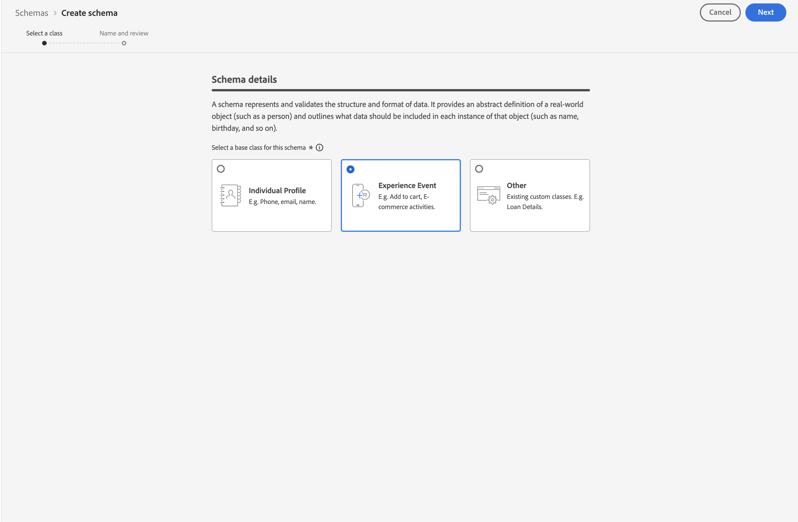

# Een XDM-schema maken voor gebruik met Customer Journey Analytics

>[!NOTE]
>
>Deze documentatie zou na de voltooiing van [ Adobe Analytics aan de verbeteringsvragenlijst van de Customer Journey Analytics ](https://gigazelle.github.io/cja-ttv/) moeten worden gebruikt.
> 
>Voer de stappen op deze pagina pas uit nadat u alle vorige stappen hebt uitgevoerd die dynamisch voor uw organisatie zijn gegenereerd.
>
>Nadat u de stappen op deze pagina voltooit, ga na de verbeteringsstappen voort die dynamisch voor uw organisatie van [ Adobe Analytics aan de verbeteringsvragenlijst van de Customer Journey Analytics ](https://gigazelle.github.io/cja-ttv/) werden geproduceerd.

>[!IMPORTANT]
>
>Voordat u begint met het maken van uw XDM-schema, werkt u samen met uw gegevensteam en andere belanghebbenden in uw hele organisatie om het ideale schemaontwerp van uw organisatie voor Customer Journey Analytics en de andere Adobe Experience Platform-toepassingen die u gebruikt, te identificeren. Voor meer informatie, zie [ architect uw schema voor gebruik met Customer Journey Analytics ](/help/getting-started/cja-upgrade/cja-upgrade-schema-architect.md).

Adobe raadt u aan een XDM-schema (Experience Data Model) te maken bij de upgrade naar Customer Journey Analytics. Een XDM-schema maakt een gestroomlijnd schema mogelijk dat is afgestemd op de behoeften van uw organisatie en de specifieke platformtoepassingen die u gebruikt. Wanneer veranderingen in het schema worden vereist, moet u niet door duizenden ongebruikte gebieden bewegen om het gebied te vinden dat het bijwerken vereist.

## Het schema maken

Het XDM-schema dat u definieert, vertegenwoordigt het model van de gegevens die u in Adobe Experience Platform verzamelt.

Een schema maken:

<!-- Should we single source this instead of duplicate it? The following steps were copied from: /help/data-ingestion/aepwebsdk.md-->

1. In Adobe Experience Platform selecteert u in de linkertrack **[!UICONTROL Schemas]** within [!UICONTROL DATA MANAGEMENT] .

1. Selecteer **[!UICONTROL Create schema]** .

1. In Uitgezocht een klassenstap van de Create schematovenaar:

   1. Selecteer **[!UICONTROL Experience Event]** .

      

      >[!INFO]
      >
      >    Een schema van de Gebeurtenis van de Ervaring wordt gebruikt om het _gedrag_ van een profiel (als scènenaam, drukknop te modelleren om aan wagentje toe te voegen). Een individueel schema van het Profiel wordt gebruikt om de profiel _attributen_ (zoals naam, e-mail, geslacht) te modelleren.

   1. Selecteer **[!UICONTROL Next]** .

1. In het gedeelte [!UICONTROL Name and review step] van de wizard [!UICONTROL Create schema] :

   1. Voer een **[!UICONTROL Schema display name]** in voor uw schema en (optioneel) een **[!UICONTROL Description]** .

      

   1. Selecteer **[!UICONTROL Finish]** .

1. Op het tabblad Structuur van het voorbeeldschema:

   1. Selecteer **[!UICONTROL + Add]** in [!UICONTROL Field groups] .

       toe

      Veldgroepen zijn herbruikbare verzamelingen van objecten en kenmerken waarmee u het schema eenvoudig kunt uitbreiden.

   1. Selecteer in het dialoogvenster [!UICONTROL Add fields groups] de veldgroep **[!UICONTROL AEP Web SDK ExperienceEvent]** in de lijst.

      

      U kunt de voorvertoningsknop selecteren om een voorvertoning weer te geven van de velden die deel uitmaken van deze veldgroep, bijvoorbeeld `web > webPageDetails > name` .

      

      Selecteer **[!UICONTROL Back]** om de voorvertoning te sluiten.

   1. Selecteer **[!UICONTROL Add field groups]** .

1. Selecteer **[!UICONTROL +]** naast de naam van het schema in het deelvenster [!UICONTROL Structure] .

   

1. Typ in het deelvenster [!UICONTROL Field Properties] `Identification` als de naam, **[!UICONTROL Identification]** als de [!UICONTROL Display name] , selecteer **[!UICONTROL Object]** als de [!UICONTROL Type] en selecteer **[!UICONTROL ExperienceEvent Core v2.1]** als de [!UICONTROL Field Group] .

   >[!NOTE]
   >
   >Als die veldgroep niet beschikbaar is, zoekt u naar een andere veldgroep met identiteitsvelden. Of [ creeer een nieuwe gebiedsgroep ](https://experienceleague.adobe.com/docs/experience-platform/xdm/ui/resources/field-groups.html) en [ voeg nieuwe identiteitsgebieden ](https://experienceleague.adobe.com/docs/experience-platform/xdm/ui/fields/identity.html#define-a-identity-field) (als `ecid`, `crmId`, en anderen toe u) aan de gebiedsgroep nodig hebt en selecteer die nieuwe gebiedsgroep.

   

   Het identificatieobject voegt id-mogelijkheden toe aan uw schema. In uw geval wilt u profielen identificeren die uw site bezoeken met de Experience Cloud-id en het e-mailadres. Er zijn vele andere eigenschappen beschikbaar om de identificatie van uw persoon te volgen (bijvoorbeeld klant identiteitskaart, loyalty identiteitskaart).

   Selecteer **[!UICONTROL Apply]** om dit object aan uw schema toe te voegen.

1. Selecteer het veld **[!UICONTROL ecid]** in het identificatieobject dat u net hebt toegevoegd en selecteer **[!UICONTROL Identity]** en **[!UICONTROL Primary Identity]** en **[!UICONTROL ECID]** in de lijst [!UICONTROL Identity namespace] in het rechterdeelvenster.

   

   U geeft de Experience Cloud Identity op als de primaire identiteit die de Adobe Experience Platform Identity-service kan gebruiken om het gedrag van profielen te combineren (aan te sluiten) met dezelfde ECID.

   Selecteer **[!UICONTROL Apply]** . U ziet dat er een vingerafdrukpictogram wordt weergegeven in het ecid-kenmerk.

1. Selecteer het veld **[!UICONTROL email]** in het identificatieobject dat u net hebt toegevoegd en selecteer **[!UICONTROL Identity]** en **[!UICONTROL Email]** in de lijst [!UICONTROL Identity namespace] in het deelvenster [!UICONTROL Field Properties] .

   

   U geeft het e-mailadres op als een andere identiteit die de Adobe Experience Platform Identity-service kan gebruiken om het gedrag van profielen te combineren (naaien).

   Selecteer **[!UICONTROL Apply]** . U ziet dat er een vingerafdrukpictogram wordt weergegeven in het e-mailkenmerk.

   Selecteer **[!UICONTROL Save]** .

1. Selecteer het hoofdelement van het schema met de naam van het schema en selecteer vervolgens de **[!UICONTROL Profile]** switch.

   U wordt gevraagd het schema in te schakelen voor het profiel. Zodra toegelaten, wanneer het gegeven in datasets wordt opgenomen die op dit schema worden gebaseerd, worden die gegevens samengevoegd in het Real-Time Profiel van de Klant.

   Zie [ het schema voor gebruik in het Profiel van de Klant in real time ](https://experienceleague.adobe.com/docs/experience-platform/xdm/tutorials/create-schema-ui.html#profile) voor meer informatie toelaten.

   >[!IMPORTANT]
   >
   >    Nadat u een schema hebt opgeslagen dat is ingeschakeld voor profiel, kan het niet meer worden uitgeschakeld voor profiel.

    toe

1. Selecteer **[!UICONTROL Save]** om het schema op te slaan.

   U hebt een minimumschema gemaakt dat de gegevens modelleert die u van uw website kunt vastleggen. Met het schema kunnen profielen worden geïdentificeerd aan de hand van de identiteit en het e-mailadres van het Experience Cloud. Door het schema voor profiel in te schakelen, zorgt u ervoor dat gegevens die vanaf uw website zijn vastgelegd, worden toegevoegd aan het realtime-klantprofiel.

   Naast gedragsgegevens kunt u ook profielkenmerkgegevens van uw site vastleggen (bijvoorbeeld gegevens over profielen die zijn geabonneerd op een nieuwsbrief).

   Als u deze profielgegevens wilt vastleggen, doet u het volgende:

   * Maak een schema op basis van de klasse Individueel profiel XDM.

   * Voeg de het gebiedsgroep van de Kern van het Profiel v2 aan het schema toe.

   * Voeg een identificatieobject toe op basis van de veldgroep Profile Core v2.

   * Experience Cloud-id definiëren als primaire id en e-mailadres als id.

   * Het schema inschakelen voor profiel

   Zie [ schema&#39;s in UI ](https://experienceleague.adobe.com/docs/experience-platform/xdm/ui/resources/schemas.html) voor meer informatie creëren en uitgeven bij het toevoegen van en het verwijderen van gebiedsgroepen en individuele gebieden aan een schema.

1. Ga na de verbeteringsstappen verder die dynamisch voor uw organisatie van [ Adobe Analytics aan de verbeteringsvragenlijst van de Customer Journey Analytics ](https://gigazelle.github.io/cja-ttv/) werden geproduceerd.

