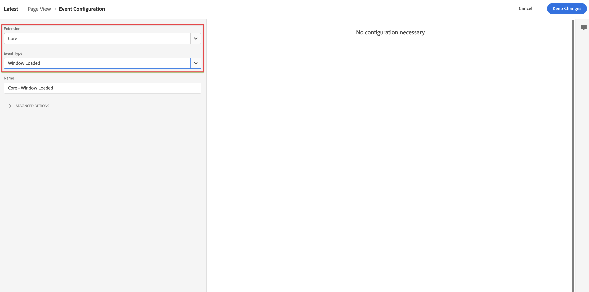

# XDM-logica voor gegevensverzameling toevoegen aan uw tag {#upgrade-tag-xdm}

<!-- markdownlint-disable MD034 -->

>[!CONTEXTUALHELP]
>id="cja-upgrade-tag-xdm"
>title="XDM-logica voor gegevensverzameling toevoegen aan uw tag"
>abstract="Als de ladertag op uw site is geïnstalleerd, kunt u regels en gegevenselementen toevoegen om een XDM-object te vullen dat naar de Adobe wordt verzonden. Adobe raadt u aan een document voor het ontwerp van een oplossing te onderhouden om te controleren hoe uw tags zijn geconfigureerd.   Deze stap is veel werk, aangezien het vestiging alle logica van Analytics voor uw bezit impliceert. Verwacht een maand of langer te wijden om de correcte markeringsregels te vestigen, hen te testen, en hen op uw plaats op te stellen."

<!-- markdownlint-enable MD034 -->

>[!NOTE]
> 
>Voer de stappen op deze pagina pas uit nadat u alle vorige upgradestappen hebt uitgevoerd. U kunt de [ geadviseerde verbeteringsstappen ](/help/getting-started/cja-upgrade/cja-upgrade-recommendations.md#recommended-upgrade-steps-for-most-organizations) volgen, of u kunt de verbeteringsstappen volgen die dynamisch voor uw organisatie met [ Adobe Analytics aan de verbeteringsvragenlijst van de Customer Journey Analytics ](https://gigazelle.github.io/cja-ttv/) werden geproduceerd.
>
>Nadat u de stappen op deze pagina hebt uitgevoerd, gaat u door met het volgen van de aanbevolen upgradestappen of de dynamisch gegenereerde upgradestappen.

Na [ het creëren van de markering en het toevoegen van de uitbreiding van SDK van het Web ](/help/getting-started/cja-upgrade/cja-upgrade-tag-property.md), moet u het met gegevenselementen en regels vormen, volgens hoe u uw plaats wilt volgen en gegevens verzenden naar Adobe Experience Platform. Nadat u gegevenselementen en regels voor uw markering vormt, kunt u het bouwen en publiceren.

## Gegevenselementen configureren

Gegevenselementen zijn de bouwstenen voor uw gegevenswoordenboek (of gegevenskaart). Gebruik gegevenselementen om gegevens te verzamelen, te organiseren en te leveren over marketing- en advertentietechnologie. U stelt gegevenselementen in uw tag in die worden gelezen van uw gegevenslaag en die kunnen worden gebruikt om gegevens naar Adobe Experience Platform te verzenden. (Voor meer informatie over gegevenselementen, zie [ elementen van Gegevens ](https://experienceleague.adobe.com/en/docs/experience-platform/tags/ui/data-elements) in de Documentatie van Markeringen.)

De volgende secties beschrijven voorgestelde gegevenselementen en andere gemeenschappelijke gegevenselementen die u kunt vormen.

Er zijn verschillende soorten gegevenselementen. Twee gemeenschappelijke gegevenselementen die u zou kunnen willen vormen zijn: één die de paginanaam vangt die de personen op uw plaats bekijken, en een andere die Experience Cloud identiteitskaart van elke persoon vangt die uw plaats bezoekt.

Nadat u deze twee gegevenselementen vormt, kunt u extra gegevenselementen voor de specifieke gegevens vormen u wilt vangen.

Tot slot nadat u al uw gewenste gegevenselementen bepaalt, moet u de gegevenselementen aan het [ schema toewijzen u ](/help/getting-started/cja-upgrade/cja-upgrade-schema-create.md) vroeger creeerde. Hiertoe definieert u een XDM-gegevenselement dat een representatie van uw XDM-schema biedt.

<!-- Assigning data elements to an XDM object. All of the available XDM objects are based on the schema -->

### Voorgestelde gegevenselementen maken

De volgende secties beschrijven hoe te om gemeenschappelijke gegevenselementen tot stand te brengen die op de meeste organisaties van toepassing zijn.

#### Gegevenselement paginanaam

Een gemeenschappelijk gegevenselement dat op de meeste organisaties van toepassing is is een gegevenselement dat de paginanaam vangt die de personen bekijken.

Een gegevenselement voor de paginanaam maken:

1. Meld u aan bij experience.adobe.com met uw Adobe ID-referenties.

1. Ga in Adobe Experience Platform naar **[!UICONTROL Data Collection]** > **[!UICONTROL Tags]** .

1. Selecteer op de pagina **[!UICONTROL Tag Properties]** de zojuist gemaakte tag in de lijst met eigenschappen om deze te openen.

1. Selecteer **[!UICONTROL Data Elements]** in het linkerspoor.

1. Selecteer **[!UICONTROL Add Data Element]** .

1. Geef in het dialoogvenster **[!UICONTROL Create Data Element]** de volgende informatie op:

   * **[!UICONTROL Name]**: De naam van het gegevenselement. Bijvoorbeeld `Page Name` .

   * **[!UICONTROL Extension]**: selecteer **[!UICONTROL Core]** in de lijst.

   * **[!UICONTROL Data Element Type]**: selecteer **[!UICONTROL Page Info]** in de lijst.

   * **[!UICONTROL Attribute]**: selecteer **[!UICONTROL Title]** in de lijst.

     

     U had ook de waarde van een variabele in uw gegevenslaag kunnen gebruiken, bijvoorbeeld `pageName` en het gegevenstype [!UICONTROL JavaScript Variable] voor gegevenselementen om het gegevenselement te definiëren.

     

1. Selecteer **[!UICONTROL Save]** .

   U wilt nu opstelling een gegevenselement van verwijzingen voorzien van Experience Cloud identiteitskaart die automatisch door SDK van het Web van Adobe Experience Platform en beschikbaar door de uitbreiding van de Dienst van identiteitskaart van het Experience Cloud wordt verstrekt.

1. Ga met [ ECID gegevenselement ](#ecid-data-element) verder.

#### ECID-gegevenselement

Een gemeenschappelijk gegevenselement dat op de meeste organisaties van toepassing is is een gegevenselement dat Experience Cloud identiteitskaart van elke persoon vangt die uw plaats bezoekt.

Een ECID-gegevenselement maken:

1. Meld u aan bij experience.adobe.com met uw Adobe ID-referenties.

1. Ga in Adobe Experience Platform naar **[!UICONTROL Data Collection]** > **[!UICONTROL Tags]** .

1. Selecteer de nieuwe tag in de lijst met [!UICONTROL Tag Properties] om deze te openen.

1. (Voorwaardelijk) Installeer de uitbreiding van de Dienst van identiteitskaart van het Experience Cloud als het niet reeds geïnstalleerd is:

   1. Selecteer **[!UICONTROL Extensions]** in het linkerspoor.

   1. Het tabblad **[!UICONTROL Installed]** is standaard geselecteerd. Als de **[!UICONTROL Experience Cloud ID Service]** -tegel wordt weergegeven, gaat u verder met Stap 5.

   1. Als de **[!UICONTROL Experience Cloud ID Service]** -tegel niet in de lijst staat, selecteert u de tab **[!UICONTROL Catalog]** .

   1. Zoek in het zoekveld naar **[!UICONTROL Experience Cloud ID Service]** en selecteer vervolgens de tegel wanneer deze wordt weergegeven

   1. Selecteer **[!UICONTROL Install]** > **[!UICONTROL Save]** .

1. Selecteer **[!UICONTROL Data Elements]** in het linkerspoor.

1. Selecteer **[!UICONTROL Add Data Element]** .

1. Geef in het dialoogvenster **[!UICONTROL Create Data Element]** de volgende informatie op:

   * **[!UICONTROL Name]**: De naam van het gegevenselement. Bijvoorbeeld `ECID` .

   * **[!UICONTROL Extension]**: selecteer **[!UICONTROL Experience Cloud ID Service]** in de lijst.

   * **[!UICONTROL Data Element Type]**: selecteer **[!UICONTROL ECID]** in de lijst.

     

1. Selecteer **[!UICONTROL Save]** .

1. Ga met [ verder creeer extra gegevenselementen ](#create-additional-data-elements).

### Aanvullende gegevenselementen maken

Maak een gegevenselement voor elk type gegevens dat u wilt verzamelen. Gebruik het zelfde proces dat in [ wordt beschreven het gegevenselement van de Naam van de Pagina ](#page-name-data-element) en [ ECID gegevenselement ](#ecid-data-element) om elk extra gegevenselement tot stand te brengen.

De gegevenselementen die u creeert zouden een correlerend gebied in uw schema moeten hebben.

De gemeenschappelijke gegevenselementen variëren afhankelijk van industrie en bedrijfsvereisten. Overweeg de volgende gemeenschappelijke gegevenselementen, die door industrie worden georganiseerd:

**Detailhandel gegevenselementen**

* Producten

* Extra winkelwagentjes

* Afbeeldingen

**Financiële gegevenselementen**

* Transactie-id

* Transactiedatum

* Servicetype

**de gegevenselementen van de Gezondheidszorg**

* Provider-id

* Bezoekdatum

* Type behandeling

Nadat u alle gegevenselementen creeert die door uw organisatie voor uw implementatie worden vereist, ga met [ XDM objecten gegevenselement ](#xdm-object-data-element) verder.

### XDM-objectgegevenselement

Tot slot wilt u nu om het even welk gegevenselement in kaart brengen dat u aan het [ schema creeerde u ](/help/getting-started/cja-upgrade/cja-upgrade-schema-create.md) vroeger creeerde. Hiertoe definieert u een XDM-objectelement dat een representatie van uw XDM-schema biedt.

Een XDM-objectelement definiëren:

1. Meld u aan bij experience.adobe.com met uw Adobe ID-referenties.

1. Ga in Adobe Experience Platform naar **[!UICONTROL Data Collection]** > **[!UICONTROL Tags]** .

1. Selecteer de nieuwe tag in de lijst met [!UICONTROL Tag Properties] om deze te openen.

1. Selecteer **[!UICONTROL Data Elements]** in het linkerspoor.

1. Selecteer **[!UICONTROL Add Data Element]** .

1. Geef in het dialoogvenster **[!UICONTROL Create Data Element]** de volgende informatie op:

   * **[!UICONTROL Name]**: De naam van het gegevenselement. Bijvoorbeeld `XDM - Page View` .

   * **[!UICONTROL Extension]**: selecteer **[!UICONTROL Adobe Experience Platform Web SDK]** in de lijst.

   * **[!UICONTROL Data Element Type]**: selecteer **[!UICONTROL XDM Object]** in de lijst.

   * **[!UICONTROL Sandbox]**: selecteer de sandbox in de lijst.

   * **[!UICONTROL Schema]**: selecteer het schema in de lijst.

1. Wijs het kenmerk `identification > core > ecid`, dat in uw schema is gedefinieerd, toe aan het gegevenselement ECID. Selecteer het cilinderpictogram om het ECID-gegevenselement gemakkelijk te kiezen in de lijst met gegevenselementen.

   

   

1. Wijs het kenmerk `web > webPageDetails > name`, dat in uw schema is gedefinieerd, toe aan het gegevenselement Paginanaam.

   

1. Selecteer **[!UICONTROL Save]** .

1. Ga met [ verder vormen regels ](#configure-rules).

## **vorm regels**

Tags in Adobe Experience Platform volgen een op regels gebaseerd systeem. Zij zoeken gebruikersinteractie en bijbehorende gegevens. Wanneer aan de criteria die in uw regels worden geschetst wordt voldaan, teweegbrengt de regel de uitbreiding, het manuscript, of cliënt-zijcode in werking u identificeerde. U kunt regels gebruiken om gegevens (zoals een voorwerp XDM) naar Adobe Experience Platform te verzenden gebruikend de uitbreiding van SDK van het Web van Adobe Experience Platform.

Een regel definiëren:

>[!NOTE]
>
>De volgende stappen zijn een voorbeeld van het definiëren van een regel die XDM-gegevens met waarden uit andere gegevenselementen naar Adobe Experience Platform verzendt.
>
>U kunt regels op verschillende manieren in uw tag gebruiken om variabelen te bewerken (met behulp van uw gegevenselementen).
>
>Zie [ Regels ](https://experienceleague.adobe.com/docs/experience-platform/tags/ui/rules.html) voor meer informatie.

1. Meld u aan bij experience.adobe.com met uw Adobe ID-referenties.

1. Ga in Adobe Experience Platform naar **[!UICONTROL Data Collection]** > **[!UICONTROL Tags]** .

1. Selecteer de nieuwe tag in de lijst met [!UICONTROL Tag Properties] om deze te openen.

1. Selecteer **[!UICONTROL Rules]** in het linkerspoor.

1. Selecteer **[!UICONTROL Add Rule]** .

1. Geef in het dialoogvenster **[!UICONTROL Create Rule]** de volgende informatie op:

   * **[!UICONTROL Name]**: De naam van de regel. Bijvoorbeeld `Page View` .

   * **[!UICONTROL Events]**: Selecteer **[!UICONTROL + Add]** . Geef vervolgens in het dialoogvenster **[!UICONTROL Event Configuration]** de volgende informatie op. Selecteer **[!UICONTROL Keep Changes]** wanneer u klaar bent.

      * **[!UICONTROL Extension]**: selecteer **[!UICONTROL Core]** in de lijst.

      * **[!UICONTROL Event Type]**: selecteer **[!UICONTROL Window Loaded]** in de lijst.

        

   * **[!UICONTROL Actions]**: Selecteer **[!UICONTROL + Add]** . Geef vervolgens in het dialoogvenster [!UICONTROL Action Configuration] de volgende informatie op. Selecteer **[!UICONTROL Keep Changes]** wanneer u klaar bent.

      * **[!UICONTROL Extension]**: selecteer **[!UICONTROL Adobe Experience Platform Web SDK]** in de lijst.

      * **[!UICONTROL Action Type]**: selecteer **[!UICONTROL Send event]** in de lijst.

      * **[!UICONTROL Type]**: selecteer **[!UICONTROL Web Webpagedetails Page Views]** in de lijst.

      * **[!UICONTROL XDM data]**: Selecteer het cilinderpictogram en selecteer vervolgens **[!UICONTROL XDM - Page View]** in de lijst met gegevenselementen.

        

        Uw regel moet er als volgt uitzien:

        

1. Selecteer **[!UICONTROL Save]** .

1. Herhaal dit proces voor elke regel die u aan uw site wilt toevoegen.

   Voor meer informatie over regels, zie [ Regels ](https://experienceleague.adobe.com/en/docs/experience-platform/tags/ui/rules) in de Documentatie van Markeringen.

1. Ga met [ verder bouw en publiceer uw markering ](#build-and-publish-your-tag).

## Uw tag maken en publiceren

Nadat u gegevenselementen en regels hebt gedefinieerd, moet u de tag maken en publiceren. Wanneer u een bibliotheek maakt, moet u deze toewijzen aan een omgeving. De uitbreidingen, de regels, en de gegevenselementen van de bouwstijl worden dan gecompileerd en in het toegewezen milieu geplaatst. Elke omgeving bevat een unieke insluitcode waarmee u de toegewezen build in uw site kunt integreren.

Adobe Experience Platform-tags ondersteunen eenvoudige tot complexe publicatieworkflows die geschikt zijn voor uw implementatie van Adobe Experience Platform Web SDK. Zie [ het Publiceren overzicht ](https://experienceleague.adobe.com/docs/experience-platform/tags/publish/overview.html) voor meer informatie.

Om uw markering te bouwen en te publiceren:

1. Meld u aan bij experience.adobe.com met uw Adobe ID-referenties.

1. Ga in Adobe Experience Platform naar **[!UICONTROL Data Collection]** > **[!UICONTROL Tags]** .

1. Selecteer de nieuwe tag in de lijst met [!UICONTROL Tag Properties] om deze te openen.

1. Selecteer **[!UICONTROL Publishing Flow]** in het linkerspoor.

1. Selecteer **[!UICONTROL Add Library]** .

1. Geef in het dialoogvenster **[!UICONTROL Create Library]** de volgende informatie op:

   * **[!UICONTROL Name]**: De naam van de bibliotheek.

   * **[!UICONTROL Environment]**: selecteer **[!UICONTROL Development (development)]** in de lijst.

1. Selecteer **[!UICONTROL + Add All Changed Resources]** .

   

1. Selecteer **[!UICONTROL Save & Build to Development]** .

   Uw tag wordt opgeslagen en gemaakt voor uw ontwikkelomgeving. Een groene stip geeft aan dat uw tag met succes is opgebouwd in uw ontwikkelomgeving.

1. U kunt **[!UICONTROL ...]** selecteren om de bibliotheek opnieuw samen te stellen of de bibliotheek naar een testomgeving of productieomgeving te verplaatsen.

   
