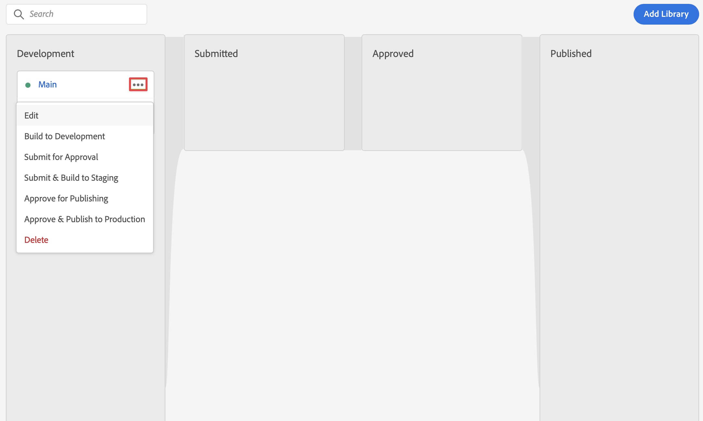

# De Markeringen van het gebruik om SDK van het Web voor Customer Journey Analytics uit te voeren

>[!NOTE]
> 
>Voer de stappen op deze pagina pas uit nadat u alle vorige upgradestappen hebt uitgevoerd. U kunt de [ geadviseerde verbeteringsstappen ](/help/getting-started/cja-upgrade/cja-upgrade-recommendations.md#recommended-upgrade-steps-for-most-organizations) volgen, of u kunt de verbeteringsstappen volgen die dynamisch voor uw organisatie met [ Adobe Analytics aan de verbeteringsvragenlijst van de Customer Journey Analytics ](https://gigazelle.github.io/cja-ttv/) werden geproduceerd.
>
>Nadat u de stappen op deze pagina hebt uitgevoerd, gaat u door met het volgen van de aanbevolen upgradestappen of de dynamisch gegenereerde upgradestappen.

Met de functie Codes in Adobe Experience Platform kunt u code op uw site implementeren om gegevens te verzamelen. Met deze oplossing voor tagbeheer kunt u code naast andere coderingsvereisten implementeren. Tags bieden naadloze integratie met Adobe Experience Platform via de Adobe Experience Platform Web SDK-extensie.

## Uw tag maken

1. Selecteer in de gebruikersinterface van Adobe Experience Platform de optie **[!UICONTROL Tags]** within [!UICONTROL DATA COLLECTION] in het linkerspoor.

2. Selecteer **[!UICONTROL New Property]** .

   Geef de tag een naam, selecteer **[!UICONTROL Web]** en voer een domeinnaam in. Selecteer **[!UICONTROL Save]** om door te gaan.

   

## Uw tag configureren

Nadat u de tag hebt gemaakt, moet u deze configureren met de juiste extensies en gegevenselementen en -regels configureren op basis van de manier waarop u uw site wilt bijhouden en gegevens naar Adobe Experience Platform wilt verzenden.

Selecteer de nieuwe tag in de lijst met [!UICONTROL Tag Properties] om deze te openen.


### **Uitbreidingen**

Om ervoor te zorgen dat u gegevens naar Adobe Experience Platform kunt verzenden (via uw gegevensstroom), voegt u de extensie Web SDK van het platform Adobe toe aan uw tag.

U kunt als volgt de extensie Adobe Experience Platform Web SDK maken en configureren:

1. Selecteer **[!UICONTROL Extensions]** in het linkerspoor.

1. Selecteer **[!UICONTROL Catalog]** in de bovenste balk.

1. Zoek naar of blader naar de extensie van Adobe Experience Platform Web SDK en selecteer **[!UICONTROL Install]** om de extensie te installeren.

   

1. Selecteer de sandbox en de eerder gemaakte gegevensstroom voor de [!UICONTROL Production Environment] en (optioneel) [!UICONTROL Staging Environment] en [!UICONTROL Development Environment] .

   

   Selecteer **[!UICONTROL Save]** .

Zie [ de uitbreiding van SDK van het Web van Adobe Experience Platform ](https://experienceleague.adobe.com/docs/experience-platform/tags/extensions/client/web-sdk/web-sdk-extension-configuration.html) voor meer informatie vormen.

De SDK van het Web omvat [!UICONTROL Adobe Experience Cloud ID Service] native, zodat te hoeven u niet om de de dienstuitbreiding van identiteitskaart aan uw markering toe te voegen.

### **Elementen van Gegevens**

Gegevenselementen zijn de bouwstenen voor uw gegevenswoordenboek (of gegevenskaart). Gebruik gegevenselementen om gegevens te verzamelen, te organiseren en te leveren over marketing- en advertentietechnologie. U stelt gegevenselementen in uw tag in die worden gelezen van uw gegevenslaag en die kunnen worden gebruikt om gegevens naar Adobe Experience Platform te verzenden.

Er zijn verschillende typen gegevenselementen. U stelt eerst een gegevenselement in om de paginanaam vast te leggen die personen op uw site bekijken.

Een gegevenselement voor de paginanaam definiëren:

1. Selecteer **[!UICONTROL Data Elements]** in het linkerspoor.

2. Selecteer **[!UICONTROL Add Data Element]** .

3. In het dialoogvenster [!UICONTROL Create Data Element] :

   - Geef uw gegevenselement een naam, bijvoorbeeld `Page Name` .

   - Selecteer **[!UICONTROL Core]** in de lijst [!UICONTROL Extension] .

   - Selecteer **[!UICONTROL Page Info]** in de lijst [!UICONTROL Data Element Type] .

   - Selecteer **[!UICONTROL Title]** in de lijst [!UICONTROL Attribute] .

     

     U had ook de waarde van een variabele in uw gegevenslaag kunnen gebruiken, bijvoorbeeld `pageName` en het gegevenstype [!UICONTROL JavaScript Variable] voor gegevenselementen om het gegevenselement te definiëren.

     

   - Selecteer **[!UICONTROL Save]** .

U wilt nu opstelling een gegevenselement van verwijzingen voorzien van Experience Cloud identiteitskaart die automatisch door het Web SDK van Adobe Experience Platform en beschikbaar door de uitbreiding van de Dienst van identiteitskaart van het Experience Cloud wordt verstrekt.

Een ECID-gegevenselement definiëren:

1. Selecteer **[!UICONTROL Data Elements]** in het linkerspoor.

2. Selecteer **[!UICONTROL Add Data Element]** .

3. In het dialoogvenster [!UICONTROL Create Data Element] :

   - Geef uw gegevenselement een naam, bijvoorbeeld `ECID` .

   - Selecteer **[!UICONTROL Experience Cloud ID Service]** in de lijst [!UICONTROL Extension] .

   - Selecteer **[!UICONTROL ECID]** in de lijst [!UICONTROL Data Element Type] .

     

   - Selecteer **[!UICONTROL Save]** .

Tot slot wilt u nu om het even welke specifieke gegevenselementen aan het schema in kaart brengen u vroeger bepaalde. U definieert een ander gegevenselement dat een representatie van uw XDM-schema biedt.

Een XDM-objectelement definiëren:

1. Selecteer **[!UICONTROL Data Elements]** in het linkerspoor.

2. Selecteer **[!UICONTROL Add Data Element]** .

3. In het dialoogvenster [!UICONTROL Create Data Element] :

   - Geef uw gegevenselement een naam, bijvoorbeeld `XDM - Page View` .

   - Selecteer **[!UICONTROL Adobe Experience Platform Web SDK]** in de lijst [!UICONTROL Extension] .

   - Selecteer **[!UICONTROL XDM Object]** in de lijst [!UICONTROL Data Element Type] .

   - Selecteer de sandbox in de lijst [!UICONTROL Sandbox] .

   - Selecteer het schema in de lijst [!UICONTROL Schema] .

   - Wijs het kenmerk `identification > core > ecid`, dat in uw schema is gedefinieerd, toe aan het gegevenselement ECID. Selecteer het cilinderpictogram om het ECID-gegevenselement gemakkelijk te kiezen in de lijst met gegevenselementen.

     

     


   - Wijs het kenmerk `web > webPageDetails > name`, dat in uw schema is gedefinieerd, toe aan het gegevenselement Paginanaam.

     

   - Selecteer **[!UICONTROL Save]** .


### **Regels**

Tags in Adobe Experience Platform volgen een op regels gebaseerd systeem. Zij zoeken gebruikersinteractie en bijbehorende gegevens. Wanneer aan de criteria die in uw regels worden geschetst wordt voldaan, teweegbrengt de regel de uitbreiding, het manuscript, of cliënt-zijcode in werking u identificeerde. U kunt regels gebruiken om gegevens (zoals een voorwerp XDM) naar Adobe Experience Platform te verzenden gebruikend de uitbreiding van SDK van het Web van Adobe Experience Platform.

Een regel definiëren:

1. Selecteer **[!UICONTROL Rules]** in het linkerspoor.

1. Selecteer **[!UICONTROL Create New Rule]** .

1. In het dialoogvenster [!UICONTROL Create Rule] :

   - Geef de regel een naam, bijvoorbeeld `Page View` .

   - Selecteer **[!UICONTROL + Add]** onder [!UICONTROL Events] .

   - In het dialoogvenster [!UICONTROL Event Configuration] :

      - Selecteer **[!UICONTROL Core]** in de lijst [!UICONTROL Extension] .

      - Selecteer **[!UICONTROL Window Loaded]** in de lijst [!UICONTROL Event Type] .

        

      - Selecteer **[!UICONTROL Keep Changes]** .


   - Selecteer **[!UICONTROL + Add]** onder [!UICONTROL Actions] .

   - In het dialoogvenster [!UICONTROL Action Configuration] :

      - Selecteer **[!UICONTROL Adobe Experience Platform Web SDK]** in de lijst [!UICONTROL Extension] .

      - Selecteer **[!UICONTROL Send Event]** in de lijst [!UICONTROL Action Type] .

      - Selecteer **[!UICONTROL web.webpagedetails.pageViews]** in de lijst [!UICONTROL Type] .

      - Selecteer het cilinderpictogram naast [!UICONTROL XDM data] en selecteer **[!UICONTROL XDM - Page View]** in de lijst met gegevenselementen.

     

      - Selecteer **[!UICONTROL Keep Changes]** .

   - Uw regel moet er als volgt uitzien:

     

1. Selecteer **[!UICONTROL Save]** .

Het bovenstaande is slechts een voorbeeld van het definiëren van een regel die XDM-gegevens met waarden uit andere gegevenselementen naar Adobe Experience Platform verzendt.

U kunt regels op verschillende manieren in uw tag gebruiken om variabelen te bewerken (met behulp van uw gegevenselementen).

Zie [ Regels ](https://experienceleague.adobe.com/docs/experience-platform/tags/ui/rules.html) voor meer informatie.

## Uw tag maken en Publish

Nadat u gegevenselementen en regels hebt gedefinieerd, moet u de tag maken en publiceren. Wanneer u een bibliotheek maakt, moet u deze toewijzen aan een omgeving. De uitbreidingen, de regels, en de gegevenselementen van de bouwstijl worden dan gecompileerd en in het toegewezen milieu geplaatst. Elke omgeving bevat een unieke insluitcode waarmee u de toegewezen build in uw site kunt integreren.

Om uw markering te bouwen en te publiceren:

1. Selecteer **[!UICONTROL Publishing Flow]** in het linkerspoor.

2. Selecteer **[!UICONTROL Select a working library]** , gevolgd door **[!UICONTROL Add Library…]** .

3. In het dialoogvenster [!UICONTROL Create Library] :

   - Geef de bibliotheek een naam.

   - Selecteer **[!UICONTROL Development (development)]** in de lijst [!UICONTROL Environment] .

   - Selecteer **[!UICONTROL + Add All Changed Resources]** .

     

   - Selecteer **[!UICONTROL Save & Build to Development]** .

   Uw tag wordt opgeslagen en gebouwd voor uw ontwikkelomgeving. Een groene stip geeft aan dat uw tag met succes is opgebouwd in uw ontwikkelomgeving.

4. U kunt **[!UICONTROL ...]** selecteren om de bibliotheek opnieuw samen te stellen of de bibliotheek naar een testomgeving of productieomgeving te verplaatsen.

   

Adobe Experience Platform-tags ondersteunen eenvoudige tot complexe publicatieworkflows die geschikt zijn voor uw implementatie van de Adobe Experience Platform Web SDK.

Zie [ het Publiceren overzicht ](https://experienceleague.adobe.com/docs/experience-platform/tags/publish/overview.html) voor meer informatie.


## De tagcode ophalen

Tot slot moet u de tag installeren op de website die u wilt bijhouden. Dit houdt in dat code in de kopteksttag van de sjabloon van uw website wordt geplaatst.

De code ophalen die naar de tag verwijst:

1. Selecteer **[!UICONTROL Environments]** in het linkerspoor.

1. Selecteer de juiste installatieknop in de lijst met omgevingen.

   Selecteer in het dialoogvenster [!UICONTROL Web Install Instructions] de knop Kopiëren naast de scriptcode die als volgt moet worden gelezen:

   ```
   <script src="https://assets.adobedtm.com/2a518741ab24/.../launch-...-development.min.js" async></script>>
   ```

   

1. Selecteer **[!UICONTROL Close]** .

   In plaats van de code voor het ontwikkelmilieu, zou u een ander milieu (het opvoeren, productie) kunnen selecteren die op waar wordt gebaseerd u in het opstellen van het Web SDK van Adobe Experience Platform bent.

   Zie [ Milieu&#39;s ](https://experienceleague.adobe.com/docs/experience-platform/tags/publish/environments/environments.html?) voor meer informatie.

1. Ga na de [ geadviseerde verbeteringsstappen ](/help/getting-started/cja-upgrade/cja-upgrade-recommendations.md#recommended-upgrade-steps-for-most-organizations) of [ dynamisch geproduceerde verbeteringsstappen ](https://gigazelle.github.io/cja-ttv/) verder.
