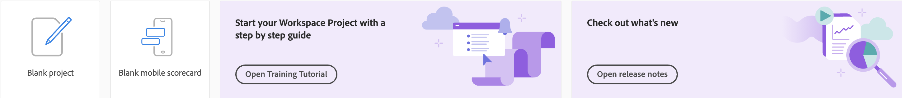

# Customer Journey Analytics-landingspagina

De landingspagina voor Customer Journey Analytics is voorzien van een startpagina voor projectmanagers en een leergedeelte om u te helpen efficiënter aan de slag te gaan.

>[!VIDEO](https://video.tv.adobe.com/v/334278/?quality=12)

## De openingspagina openen {#access-landing}

Nadat u zich bij Adobe Experience Cloud en Customer Journey Analytics hebt aangemeld, schakelt u het [!UICONTROL New landing page - Beta] schakelknop in de linkerbenedenhoek. De toegang tot de knevelknoop is gebruikersspecifiek per organisatie, niet bedrijfspecifiek.

U kunt

* Breid uit [!UICONTROL Projects] op volledig scherm. Klik op het hamburger-menupictogram om de tabel uit te vouwen. Deze actie zal de linker-spoorlusjes doen ineenstorten.
* Pas de kolombreedte aan door het kolomscheidingsteken te slepen.
* Vastgezette items opnieuw ordenen. Als u vastgezette items omhoog en omlaag wilt verplaatsen, klikt u op de ellips naast het vastgezette item en selecteert u **[!UICONTROL Move up]** of **[!UICONTROL Move down]**.

## Navigeren door de [!UICONTROL Projects] tab {#navigate-projects}

[!UICONTROL Projects] dient als [!UICONTROL Workspace] homepage. Alle Workspace-projecten worden hier weergegeven, inclusief Mobiele scorecards. **[!UICONTROL Projects]** Dit zijn dingen die u hebt gebouwd of die iemand anders met u heeft gebouwd en gedeeld. [!UICONTROL Projects] verwijst ook naar lege projecten en lege mobiele scorecards.

>[!NOTE]
>
>Verschillende van de volgende instellingen blijven bestaan (worden onthouden) tijdens de gehele sessie en tijdens verschillende sessies. Voorbeelden: Op welk tabblad u klikt, welke filters zijn geselecteerd, welke kolommen zijn geselecteerd en in welke richting de kolommen worden gesorteerd. De zoekresultaten worden echter niet voortgezet.

| UI-element | Definitie |
| --- | --- |
| ... Meer | Laat u [!UICONTROL View Tutorials], en [Gebruikersvoorkeuren bewerken](/help/analyze/analysis-workspace/user-preferences.md). |
| **[!UICONTROL Create new]** modal is back | Wanneer u op **[!UICONTROL Create new]** in Workspace hebt u opnieuw de keuze tussen een [!UICONTROL Blank project] en [!UICONTROL Blank mobile scorecard]. U kunt ook kiezen uit sjablonen die uw bedrijf heeft gemaakt. |
| [!UICONTROL Show less/more] | Hiermee schakelt u tussen het niet weergeven en weergeven van de banner:  |
| [!UICONTROL Blank project] | Hiermee maakt u een lege waarde [Werkruimteproject](https://experienceleague.adobe.com/docs/analytics/analyze/analysis-workspace/home.html?lang=en) zodat u kunt vullen. |
| [!UICONTROL Blank mobile scorecard] | Hiermee maakt u een lege waarde [mobiele scorecard](https://experienceleague.adobe.com/docs/analytics/analyze/mobapp/curator.html?lang=en) zodat u kunt vullen. |
| [!UICONTROL Open Training Tutorial] | Hiermee opent u de zelfstudie Workspace-training die nieuwe gebruikers stapsgewijs begeleidt bij het ontwikkelen van een project. |
| [!UICONTROL Open release notes] | Hiermee opent u de nieuwste Adobe Experience Cloud-releaseopmerkingen. |
| Filterpictogram | U kunt filteren op tags, rapportsuites, eigenaars, typen en andere filters (Mijne, Gedeeld met mij, Favorieten en Goedgekeurd) |
| Zoekbalk | De zoekopdracht bevat nu alle kolommen in de tabel. |
| Selectievak | Wanneer u op dit vak naast een of meer projecten klikt, worden de projectbeheeracties weergegeven die u kunt uitvoeren: Verwijderen, labelen, Vastzetten, Goedkeuren, Delen, Naam wijzigen, Kopiëren en Exporteren naar CSV. U hebt mogelijk geen machtigingen om al deze handelingen uit te voeren. |
| [!UICONTROL Favorites] | Als u een project bevoordeelt, wordt er een ster achter geplaatst en wordt het als een favoriet gemarkeerd waarop u kunt filteren. |
| [!UICONTROL Name] | De naam van het project. |
| Info (i), pictogram | Als u op het pictogram Info klikt, wordt de volgende informatie over dit project weergegeven: Type, de Rol van het Project, Eigenaar, Beschrijving, en wie het met wordt gedeeld. Het geeft ook aan wie kan [bewerken of dupliceren](https://experienceleague.adobe.com/docs/analytics-platform/analysis-workspace/curate-share/share-projects.html) dit project. |
| Ovaal (...) | Wanneer u op de ellips naast een project klikt, worden de projectbeheeracties weergegeven die u kunt uitvoeren: Verwijderen, labelen, Vastzetten, Goedkeuren, Delen, Naam wijzigen, Kopiëren en Exporteren naar CSV. Mogelijk hebt u geen machtigingen om al deze handelingen uit te voeren. |
| [!UICONTROL Type] | Geeft aan of dit type een Workspace-project of een Mobile-scorecard is. |
| [!UICONTROL Tags] | U kunt rapporten labelen om deze in groepen te ordenen. |
| [!UICONTROL Project Role] | De rollen van het project verwijzen naar of u de projecteigenaar bent, en of u toestemmingen hebt om het project uit te geven of te dupliceren. |
| [!UICONTROL Data View] | Tabellen en visualisaties in een deelvenster leiden gegevens af van de gegevensweergave die rechtsboven in het deelvenster is geselecteerd. In de gegevensweergave wordt ook bepaald welke componenten beschikbaar zijn in de linkertrack. Binnen een project, kunt u één of vele gegevensmeningen gebruiken, afhankelijk van uw gevallen van het analysegebruik. De lijst met gegevensweergaven wordt gesorteerd op relevantie. Adobe definieert relevantie op basis van hoe recent en vaak de gegevensweergave is gebruikt door de huidige gebruiker en hoe vaak de gegevensweergave wordt gebruikt binnen de organisatie. |
| [!UICONTROL Owner] | De persoon die het project heeft gemaakt. |
| [!UICONTROL Shared with] | Met wie is dit project gedeeld. |
| [!UICONTROL Last Modified] | Toen dit project voor het laatst werd gewijzigd. |
| [!UICONTROL Last opened] | Toen dit project voor het laatst door u werd geopend. |
| [!UICONTROL Scheduled] | Instellen op [!UICONTROL On] wanneer een project gepland is of **[!UICONTROL Off]** wanneer dat niet het geval is. Klik op de knop **[!UICONTROL On]** de verbinding laat u informatie over het geplande project zien. U kunt ook [de projectplanning bewerken](/help/analyze/analysis-workspace/curate-share/t-schedule-report.md) als u de eigenaar van het project bent. |
| [!UICONTROL Project ID] | Projectidentiteitskaart kan voor het zuiveren projecten worden gebruikt. |
| [!UICONTROL Longest Date Range] | De langere datumwaaiers verhogen projectingewikkeldheid en kunnen verwerking en ladingstijden verhogen. |
| [!UICONTROL Number of Queries] | Een hoger aantal projectvragen verhoogt projectingewikkeldheid en kan verwerking en ladingstijden verhogen. |
| Tabelpictogram aanpassen | (Rechtsboven) Als u kolommen wilt toevoegen aan of verwijderen uit de lijst met projecten, kunt u dit doen door ze te selecteren of te deselecteren. |
| &lt; (Terug) | Deze knoop in een project van de Werkruimte neemt u terug naar uw meest recente het landen paginaconfiguratie. De paginasonfiguratie die u had toen u de openingspagina verliet, zal aanhouden wanneer u terugkeert. |

## Navigeren op het tabblad Leren {#navigate-learning}

De pagina Leren bevat praktische videolessen en zelfstudies, plus koppelingen naar documentatie.

* De [!UICONTROL Workspace Fundamentals] Rondleiding neemt u rechtstreeks naar de werkruimte en doorloopt u de schermindeling Werkruimte en waar u de meest voorkomende acties kunt vinden of uitvoeren. Deze rondleiding kan ook op elk gewenst moment rechtstreeks in Workspace worden gestart via de pop-up voor de knopinfo in de koptekst van het deelvenster.
* Als u op een video/tour klikt, wordt een **[!UICONTROL Viewed]** tag. Met deze tag kunt u de voortgang van de leerinhoud volgen. U kunt op het label klikken en het verdwijnt, voor het geval u de inhoud nog niet hebt voltooid.
* De **[!UICONTROL Learn more]** op de modaal video gaat u naar een Adobe Experience League-documentatiepagina met meer Help-inhoud die betrekking heeft op de video die u net hebt bekeken.  **[!UICONTROL View more videos]** Hiermee gaat u naar de volledige Analysis Workspace YouTube-afspeellijst.

## Veelgestelde vragen over bestemmingspagina {#landing-faq}

| Vraag | Antwoord |
| --- | --- |
| Is er een maximum aantal projecten dat ik kan vastzetten? | Nee, er is geen limiet voor het aantal projecten dat u kunt vastzetten. |
| Kunnen beheerders deze bestemmingspagina voor hun gebruikers aanwijzen? | Nee, beheerders kunnen de landingspagina niet aanwijzen namens gebruikers. Individuele gebruikers moeten de schakeloptie zelf inschakelen. |