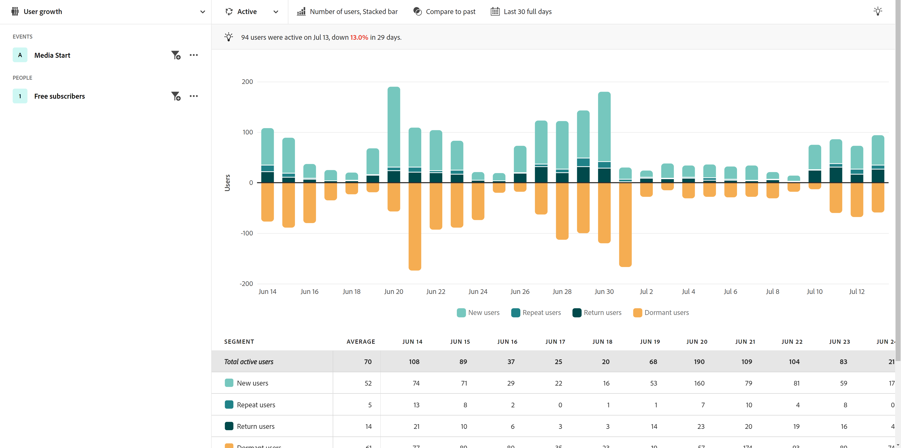

# Industriële gebruiksgevallen

Deze pagina bevat enkele illustratieve voorbeelden van productteams in verschillende bedrijfstakken die met behulp van geleide analyses kunnen werken.

+++**Detailhandel**

| Hoofdletters gebruiken | Voorbeeld | Gevolgen | Analyse |
| --- | --- | --- | --- |
| **Optimize mobiele het winkelen app** | Veel klanten hebben de mobiele app van een organisatie gedownload, maar zijn nooit teruggekomen. Het bedrijf vindt dat klanten het alleen voor de oorspronkelijke aanbieding gebruiken. Ze hebben die slapende klanten opnieuw in dienst genomen. | **verhoog LTV van mobiele gebruikers.** Bepaal en vergroot het gebruik van apps om een &#39;gelukkigere weg&#39;-gebruikerservaring te ontwikkelen. | [ Actieve mening van de gebruikersgroei ](types/active.md) [ Netto de groeimening ](types/net-growth.md) |
| **kwantificeer effect van nieuwe controleeigenschappen** | Een supermarkt test hun weg naar online winkelen. Ze meten snel de impact van nieuwe uitcheckfuncties, zoals productaanbevelingen of inhaalbewerkingen. | **de omzettingspercentages van de verhoging.** De impact van het bedrijf meten in plaats van alleen het gebruik van functies. | [ het effect van de Versie mening ](types/release.md) [ Eerste gebruiksmening ](types/first-use.md) |
| **Verminder lidmaatschapshoofd** | Een organisatie ontdekt wrijvingspunten in de klantenreizen die klanten veroorzaken om te draaien. Hierdoor kunnen ze lidmaatschapsprogramma&#39;s beoordelen en het gedrag van risicopatieleden analyseren. | **Verminder karton.** Methoden identificeren om clientrelaties te bevorderen en te onderhouden om misbruik te voorkomen en het aantal fouten te beperken. | [ Actieve mening van de gebruikersgroei ](types/active.md) [ de mening van de Wrijving ](types/friction.md) |
| **vinden inefficiënte verkoopreizen** | Een organisatie ontdekt inefficiënties in de reis van in-store verkooppartners waar zij van klanten worden getrokken. Zij passen hun proces aan, wat klanten een prettigere in-store het winkelen ervaring geeft. | **verbeter verkoopreactie.** Minder inefficiënte processen, wat resulteert in verbeterde interne reizen en een positieve klantervaring. | [ de mening van de Wrijving ](types/friction.md) |

{style="table-layout:auto"}

{style="border:1px solid gray"}

{style="border:1px solid gray"}

+++

+++**Financiële diensten**

| Hoofdletters gebruiken | Voorbeeld | Gevolgen | Analyse |
| --- | --- | --- | --- |
| **kwantificeer effect van nieuwe eigenschappen** | Een financiële instelling voert bankoverschrijvingen uit met Zelle en wil de impact van de nieuwe functie op het voltooien van overschrijvingen begrijpen. De geleide analyse staat hen toe om te zien hoe de klanten reageren zodat het marketing team het kan uitrollen. | **de omzettingspercentages van de verhoging.** Het effect van nieuwe functies op overdrachtsconversies meten. | [ het effect van de Versie mening ](types/release.md) [ Eerste gebruiksmening ](types/first-use.md) |
| **Defecteer vraag het centrum** | De geleide analyse onthult dat het vijf-stap mobiele claimproces van een organisatie vraag in hun callcenter drijft. Ze maken een publiek en sturen een e-mail naar die klanten om hun ervaring beter te begrijpen. | **isoleer wrijving in de ervaring.** Verbeter &quot;gelukkige weg&quot;reizen en verminder vraag. | ](types/friction.md) [ de trendmening van de 1} Wrijving van de wrijving {](types/conversion-trends.md)[ |
| **Verminder klantenkring** | Een organisatie leert dat klanten die zich maandelijks aanmelden bij de mobiele app voor het bankwezen, hun klanten langer houden. Met behulp van een analyse met instructies kunnen ze bepalen wie het risico loopt te klonen en een terugwinningsstrategie ontwikkelen. | **Verminder karton.** Klanten op hetzelfde niveau houden en tegelijk nieuwe klanten aanschaffen. | [ Actieve mening van de gebruikersgroei ](types/active.md) [ Netto de groeimening ](types/net-growth.md) |
| **adviseer nieuwe eigenschappen** | Een organisatie merkt op dat digitale intrekkingen de afgelopen maanden zijn afgenomen. Het aantal oproepen aan een financieel adviseur is toegenomen. Met behulp van een analyse met instructies kan de organisatie prioriteit geven aan optimalisatie van digitale processen met behulp van een stuurcomité. | **creeer een gegeven-gedreven roadmap.** Gebruik gegevens om optimalisaties te plannen en te implementeren. | [ de trendmening van het Gebruik ](types/usage.md) |

{style="table-layout:auto"}

{style="border:1px solid gray"}

{style="border:1px solid gray"}

{style="border:1px solid gray"}

+++

+++**Reizen en Ziekenhuis**

| Hoofdletters gebruiken | Voorbeeld | Gevolgen | Analyse |
| --- | --- | --- | --- |
| **Kwanteer effect van nieuwe het boeken stroomeigenschappen** | Een organisatie gebruikt geleide analyse om snel het effect van een nieuwe eigenschap van de boekingsstap op omzettingspercentages te bekijken. Ze identificeren het deel van de ervaring met de grootste winst. | **de boekingstarieven van de verhoging.** De impact van het bedrijf meten in plaats van alleen het gebruik van functies. | [ het effect van de Versie mening ](types/release.md) [ mening van de Wrijving ](types/friction.md) |
| **optimaliseer mobiele app ervaring** | Een organisatie begrijpt maandelijks actieve gebruikers van apps snel en gemakkelijk in de loop van de tijd en identificeert positieve gevolgen door versie. | **verhoog MAUs.** Bepaal en vergroot het gebruik van apps, wat overeenkomt met het geluk van klanten. | [ Actieve mening van de gebruikersgroei ](types/active.md) [ Netto de groeimening ](types/net-growth.md) |
| **de wrijving van de Vondst in mobiele controle-binnen stroom** | Door te zien waar mensen succesvol zijn of wegvallen van het verwachte mobiele incheckproces kan een organisatie eenvoudig gebieden identificeren voor optimalisatie van de ervaring. | **Verhoog CSAT en verminder IROPs.** Als u wrijving verwijdert, wordt de &#39;dag van de reis&#39; vloeiender. | ](types/friction.md) [ de trendmening van de 1} Wrijving van de wrijving {](types/conversion-trends.md)[ |
| **Defecteer vraag het centrum** | Het zien van gebruikerservaring in een trechtermening toont een gebruiker waar de bezoekers wrijving raken, die tot het dure volume van het vraagcentrum leidt. De volgende stappen waarop u zich wilt concentreren, zijn duidelijk. | **Verminder vraag-centrum gebruik.** Krijg meer &#39;gelukkige weg&#39; gebruikerservaring en verminder dure vraag. | ](types/friction.md) [ de trendmening van de 1} Wrijving van de wrijving {](types/conversion-trends.md)[ |

{style="table-layout:auto"}

{style="border:1px solid gray"}

{style="border:1px solid gray"}

{style="border:1px solid gray"}

+++

+++**Media en Entertainment**

| Hoofdletters gebruiken | Voorbeeld | Gevolgen | Analyse |
| --- | --- | --- | --- |
| **Kwanteer effect van nieuwe shows of reeksen** | Een streamingservice kan het effect op het viewerschap analyseren nadat gebruikers een nieuwe show of serie hebben bekeken en beter begrijpen welke inhoud hierop reageert. | **de kijker van de verhoging.** Zoek naar inhoud die de grootste invloed heeft op het viewerschap. | [ Eerste gebruiksmening ](types/first-use.md) |
| **identificeer kinnerrisico** | Een organisatie ziet een hoge omzet van klanten die zich aanmelden voor hun platform om een seizoensgebeurtenis te bekijken en onmiddellijk na afloop van de gebeurtenis te annuleren. Door deze gebruikers snel te identificeren, kunnen ze aanbevelingen weergeven die klanten de mogelijkheid geven betrokken te blijven bij het platform. | **behoud gelukkige abonnees.** Zoek inhoud die een groeisegment activeert om tussenbeide te komen met aanbevelingen. | [ Actieve mening van de gebruikersgroei ](types/active.md) [ Netto de groeimening ](types/net-growth.md) |
| **vind kansen voor upsell** | Een essentieel onderdeel van de inkomstengroei van een organisatie is het begrijpen van wat in-app aanbiedingen het meest aantrekkelijk zijn voor fans terwijl ze zich in het stadion bevinden. Met een analyse met instructies kunnen ze precies zien welke aanbiedingen het meest effectief zijn. | **verhoog nevenopbrengst.** Begrijp de invloed van aanbiedingen in de app op het aantrekken van koopgedrag. | ](types/first-use.md) [ de mening van de 1} Wrijving van de gebruiksmening ](types/friction.md)[ |
| **optimaliseer dwars-apparatenervaring** | Een organisatie wil analyseren hoe de abonnees met veelvoudige apparaten/apps interactie aangaan. Dankzij deze kennis kunnen ze de consumptiepatronen van content begrijpen en bepalen waar ze zich het best op kunnen richten. | **Personaliseer de ervaring.** Begrijp welke inhoud het beste met abonnees op elk apparaat resoneert. | [ de trendmening van het Gebruik ](types/usage.md) |
| **Defecteer vraag het centrum** | Een organisatie gebruikt geleide analyse om een kwestie te identificeren met de automatische afhandeling werkt niet, die gefrustreerde klanten ertoe bracht om hun steuncentrum te roepen om hun plan te annuleren. | **vermindert steunvraag.** Maak een betere klantervaring en verlaag de aanroepen naar de klantenservice. | ](types/friction.md) [ de trendmening van de 1} Wrijving van de wrijving {](types/conversion-trends.md)[ |

{style="table-layout:auto"}

{style="border:1px solid gray"}

{style="border:1px solid gray"}

{style="border:1px solid gray"}

+++

+++**Gezondheidszorg**

| Hoofdletters gebruiken | Voorbeeld | Gevolgen | Analyse |
| --- | --- | --- | --- |
| **verbeter de resultaten van de patiëntengezondheid** | Een organisatie beschikt over de gegevens om haar inspanningen op groei te richten. Voordat ze een geleide analyse gebruikten, hadden ze geen duidelijk inzicht in hoeveel leden van het wellntieplan per week er gewoon mee ophouden het te gebruiken. | **Verminder artsenbezoeken.** Snel gesignaleerde slapende gebruikers voor een nieuwe betrokkenheid. | [ Actieve de groeimeningen van de gebruikersgroei ](types/active.md) |
| **verbeter geduldervaring** | De zichtbaarheid van het aantal patiënten dat contact opneemt met callcenters voor een eenvoudig wachtwoord heeft de passie van een analist voor laserfocus vernieuwd om zijn patiëntervaring te verbeteren. | **Verlaag de algemene kosten om te dienen.** Maak een betere patiëntenervaring en verlaag de aanroepen naar patiëntenservices. | [ de trendweergave van het Gebruik ](types/usage.md) [ de mening van de Wrijving ](types/friction.md) |
| **identificeer herhaling kanaalacties door segment** | Een organisatie wil begrijpen hoe de actieve in aanmerking komende leden van Medicare met hun plangebruik zijn om specifieke overseinen aan hen in hun digitale producten te verstrekken. De inzichten die zijn opgedaan met behulp van geleide analyses helpen de marketing effectiever te maken. | **Personaliseer de inschrijvingskeuzen van de Geneesmiddelen.** Vergelijk gemeenschappelijke opeenvolgende acties door mijn actiefste planleden. | [ de mening van de Wrijving ](types/friction.md) [ Actieve mening van de gebruikersgroei ](types/active.md) |
| **Behoud hoogste industrieteletterdheid** | De analysebronnen voor een organisatie worden op tijd vastgezet. De geleide analyse staat de organisatie toe om de gegevens van het productgebruik snel te krijgen nodig voor leiderschapsupdate vraag. | **Verminder analist werkbelasting.** Sneller antwoorden ophalen. Een aanvaardbare rapportage wanneer dit het meest cruciaal is. | [ Geleide analyse ](overview.md) |

{style="table-layout:auto"}

{style="border:1px solid gray"}

+++

+++**Hoog Tech en B2B**

| Hoofdletters gebruiken | Voorbeeld | Gevolgen | Analyse |
| --- | --- | --- | --- |
| **kwantificeer effect van nieuwe eigenschappen** | Een organisatie kan uptik in gebruik op een nieuwe producteigenschap analyseren en bepalen welke segmenten het best werken. Deze analyse helpt hen om voorrang te geven aan waar te om middelen uit te geven om gebruikersbetrokkenheid te maximaliseren en zijn partnerschap met marketing te versterken. | **gegevens-gedreven prioriteitstelling.** Besluiten nemen over het toewijzen van bronnen. | [ het effect van de Versie mening ](types/release.md) [ Eerste gebruiksmening ](types/first-use.md) |
| **identificeer rollen die het product** ondergebruiken | Een organisatie ontwerpt een product voor gebruik door ingenieurs, productmanagers, en marketing. Uit een analyse met instructies bleek dat productmanagers en marketeers het bijna dagelijks gebruiken, maar dat het technisch personeel het grotendeels niet heeft overgenomen. | **de productgoedkeuring van de Groei.** Bepaal snel op verschillende manieren het gedrag van gebruikers. | [ Actieve mening van de gebruikersgroei ](types/active.md) [ Netto de groeimening ](types/net-growth.md) |
| **verwijdert wrijvingspunten in het omzettingsproces** | Door een inkoopordernummer in te voeren in de koopstroom voorkomt u dat gebruikers die liever een creditcard gebruiken, hun bestellingen voltooien. Conversies namen toe wanneer dat veld optioneel werd gemaakt. | **verbeter klantenervaring.** Verminder potentiële kurk. | ](types/friction.md) [ de trendmening van de 1} Wrijving van de wrijving {](types/conversion-trends.md)[ |
| **ontgrendel zelf-dient analyse** | Toegang tot inzichten is een uitdaging en sommige gebruikers binnen een organisatie zijn niet opgeleid voor analyse. Met een analyse met instructies kunnen ze antwoorden krijgen en dezelfde gegevens gebruiken die de rest van de organisatie gebruikt. Dit leidt tot sterkere partnerschappen en maakt echte gegevensgestuurde beslissingen mogelijk. | **nauwere partnerschappen over de org.** Productmanagers toegang geven tot eerder opgeslagen gegevens. | [ Geleide analyse ](overview.md) |

{style="table-layout:auto"}

{style="border:1px solid gray"}

+++
