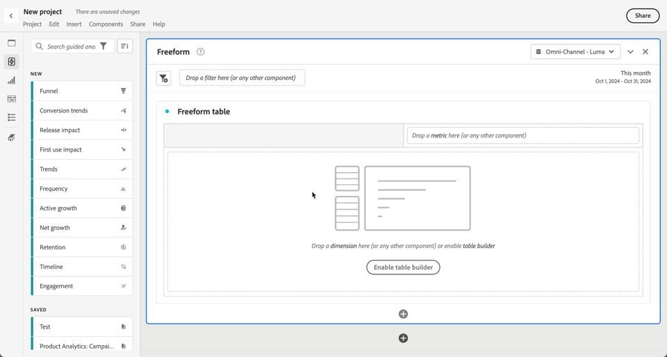

# Overzicht van geleide analyse

Met een analyse met instructies kunnen gebruikers, van marketing tot product tot analisten, zelf hoogwaardige gegevens en inzichten bedienen over de reis van de klant via geleide workflows, gebaseerd op de kanaalgegevens van de Customer Journey Analytics. Gelijkaardig aan Analysis Workspace en Mobiele scorecards, Geleide analyse gebruikt gegevens van de mening van a [ Gegevens ](/help/data-views/data-views.md), die verwijzingen gegevens in Adobe Experience Platform door a [ Verbinding ](../connections/overview.md). Veel rapporten die zijn gemaakt in de analyse met instructies kunnen naadloos worden overgedragen naar Analysis Workspace voor aanvullend onderzoek.

De volgende analyses met instructies zijn beschikbaar:

| Pictogram | Analyse | Beschrijving |
| :----:|--- | --- |
|  | [ Actieve groei ](types/active-growth.md) | Identificeer wie nieuw, behouden, terugkeren, of slapend is. |
|  | [ trends van de Omzetting ](types/conversion-trends.md) | Wijzigingen in conversietarieven bijhouden in de loop van de tijd. |
|  | [Engagement](types/engagement.md) | Begrijp de breedte en diepte van eigenschapbetrokkenheid. |
|  | [ Eerste gebruikeffect ](types/first-use-impact.md) | Meet het effect van het gebruik van de eerste functie op sleutelindicatoren. |
|  | [ Frequentie ](types/frequency.md) | Meet de betrokkenheid per gebruiksfrequentie. |
|  | [ Trechter ](types/funnel.md) | Vergelijk de conversiesnelheden tussen de stappen. |
|  | [ Netto groei ](types/net-growth.md) | Wint of verliest u gebruikers? |
|  | [ effect van de Versie ](types/release-impact.md) | Vergelijk de prestaties in gelijke perioden vóór en na de release. |
|  | [ Behoud ](types/retention.md) | Meet de doorlopende retourgewoonten van uw gebruikers. |
|  | [ Chronologie ](types/timeline.md) | Verken patronen in sessieactiviteiten. |
|  | [ Trends ](types/trends.md) | Meet de betrokkenheid van de gebruiker in de loop van de tijd. |

## Toegang

U hebt toegang tot de analyse met instructies op de startpagina van de Customer Journey Analytics.

1. Selecteer **[!UICONTROL Guided analysis]** van de homepage, die u rechtstreeks aan de [ analyse van Trends ](types/trends.md) neemt.

   {style="border:1px solid gray"}

1. Selecteer **[!UICONTROL Create new]** om de verschillende weergaveopties weer te geven en een ander beginpunt voor de analyse te kiezen.

   {style="border:1px solid gray"}

U kunt ook de analyse met instructies openen vanuit een Analysis Workspace-project.

1. Selecteer **[!UICONTROL Blank project]** op de startpagina om een leeg Workspace-project te maken.

   {style="border:1px solid gray"}

1. Selecteer  **[!UICONTROL Guided Analysis]** in het linkerspoor.

   {style="border:1px solid gray"}

1. Sleep een nieuwe analyse naar het Workspace-canvas en selecteer vervolgens **[!UICONTROL Create]** om de gewenste analyse te genereren (bijvoorbeeld: **[!UICONTROL Create Trends]** ). U kunt ook een bestaande analyse naar het Workspace-canvas slepen vanuit de sectie **[!UICONTROL Saved]** .

   

## Interface

De interface voor Analyse met instructies volgt een vraag- en antwoordindeling. Vorm uw vraag in vraagspoor, dan krijg een antwoord met een geschreven inzicht, grafiek, en lijst. Vervolgens kunt u de volgende vraag stellen met analyses en visualisatie-instellingen.

De geleide analyse gebruikt de volgende elementen UI:

| Interfacevoorvertoning | UI-element | Beschrijving |
| --- | --- | --- |
| {style="border:1px solid gray"} | **[!UICONTROL Query rail]** | Vorm uw *vraag* door de gewenste componenten (gebeurtenissen, eigenschappen, en segmenten) te selecteren die omhoog een analyse maken. De volgende opties zijn beschikbaar voor alle analyses, met extra instellingen per weergave. <ul><li>**Mening**: Selecteer van de opties om aan een nieuwe analyse over te schakelen. Uw vraagselecties worden gehandhaafd binnen de toegestane grenzen voor de nieuwe analyse.</li><li>**Gebeurtenissen**: De gebeurtenissen die u wilt meten. Elke analyse dwingt verschillende grenzen aan het aantal gebeurtenissen af die u kunt vormen.  Gebeurtenissen krijgen soms het label **[!UICONTROL Start and return events]**, **[!UICONTROL Steps]** of **[!UICONTROL Key indicators]** . De gebeurtenissen worden geïdentificeerd in de analyse gebruikend 1, 2,..   Uitgezochte  **[!UICONTROL Add an event]** om nieuwe gebeurtenissen toe te voegen.</li><li>**[!UICONTROL Factors]**: Indien beschikbaar kunt u factoren opgeven, zoals de datum sinds en de eerste keer dat de gebeurtenis plaatsvindt.</li><li>**die als** wordt geteld: De tellende methode die u op de geselecteerde gebeurtenissen wilt toepassen. Selecteer een optie in het vervolgkeuzemenu.</li><li>**Segmenten**: De segmenten die u wilt meten. Elke analyse dwingt verschillende grenzen aan het aantal segmenten af die u kunt vormen. De segmenten worden geïdentificeerd in de analyse gebruikend A, B,..   Uitgezochte  **[!UICONTROL Add a segment]** om nieuwe segmenten toe te voegen.</li><li>**[!UICONTROL Breakdown]**: Indien beschikbaar, de uitsplitsing die u wilt toepassen op de analyse.</li></ul>Op sommige van de montages, is de extra configuratie beschikbaar.<ul><li>**Filters**: De Filter van het gebruik  om gebeurtenissen of segmenten door specifieke afmetingen te versmallen. Wanneer een afmeting is geselecteerd, zijn zowel de standaardfiltercriteria (zoals **[!UICONTROL Equals]** , **[!UICONTROL Contains]** of **[!UICONTROL Ends with]** ) als de bovenste 1000-afmetingswaarden beschikbaar.  Uitgezochte  om extra filters toe te voegen.  Uitgezochte  om een filter te verwijderen.</li><li>**Meer acties**: Gebruik  om acties, als<ul><li> anders **[!UICONTROL Rename]**: om een gebeurtenis of een segment anders te noemen.</li><li> **[!UICONTROL Duplicate]**: om een gebeurtenis of een segment te dupliceren.</li><li> **[!UICONTROL Remove]**: om een gebeurtenis, een segment of een mislukking te verwijderen.</li><li> **[!UICONTROL Edit segment]** uit: om een segment in de [ bouwer van de Filter uit te geven ](/help/components/filters/filter-builder.md).</li><li> **[!UICONTROL Add to favorites]**: om het segment aan de lijst van favoriete filters in de [ manager van de Filter ](/help/components/filters/manage-filters.md) toe te voegen.</li><li> **[!UICONTROL Save as]**: om het segment als nieuwe component te bewaren. In het dialoogvenster **[!UICONTROL Save segments to components]** kunt u een segmentnaam en een beschrijving opgeven. U kunt  selecteren om het nieuwe segment als favoriet te merken. Selecteer **[!UICONTROL Save]** om het segment op te slaan als een nieuw filter.</li><li> **[!UICONTROL Link start and return events]**.: om begin te verbinden en gebeurtenissen in a [ Behoud ](types/retention.md) analyse terug te keren.</li><li> **[!UICONTROL Unlink start and return events]**: om begin en terugkeergebeurtenissen in a [ Behoud ](types/retention.md) analyse los te maken.</li></ul></li></ul> |
| {style="border:1px solid gray"} | **[!UICONTROL Chart]** | Een visualisatie van de geretourneerde gegevens op basis van uw invoer van de queryregels en -instellingen. Welke visualisatie u ziet hangt van de mening en de montages boven de grafiek af. Het diagram bevat ook: <ul><li>**Knopinfo**: Beweeg over om het even welk punt van grafiekgegevens om tooltip met meer informatie bloot te stellen.</li><li>**Legend**: Beweeg over de reeks van de grafieklegenda om definities te bekijken waar beschikbaar, nadruk op die reeks, en tijdelijk andere reeksen te verbergen. Selecteer een reeks in de legenda om de reeks te verbergen.</li><li>**Annotaties**: Toepasselijke [ annotaties ](../components/annotations/overview.md) zijn zichtbaar tussen de visualisatie en de legenda. Het wordt getoond als pictogram van de a  in de gevormde kleur van de annotatie. Analyseert die gegevens in tijd tonen plaats het  onder de gevormde datum of datumwaaier. Analyseert die geen gegevens in tijd tonen tonen toont het  in de lagere juiste hoek van de grafiek.</li><li>**Uitgezochte acties**: Maak de volgende beschikbare acties bloot door om het even welk gegevenspunt te selecteren. De opties omvatten **sparen segment**.</li></ul> |
| {style="border:1px solid gray"} | **[!UICONTROL Table]** | Een tabelweergave van de geretourneerde gegevens op basis van uw invoer van de queryregels en -instellingen. Rijen in de tabel die ter referentie gebeurtenis (1, 2, ...) en segment-id&#39;s (A, B, ...) gebruiken. De kolommen in de tabel zijn afhankelijk van de analyse boven het diagram. De tabel bevat ook voor elke rij: <ul><li>**Uitgezochte acties**: Wissel  om een grafiekreeks voor een rij te verbergen of bloot te stellen. Selecteer  voor extra acties. De opties omvatten **sparen segment**.</li></ul> |
| {style="border:1px solid gray"} | **[!UICONTROL Visualization settings]** | Opties boven het diagram waarmee u de volgende vraag kunt stellen en aanpassen hoe het diagram en de tabel worden geretourneerd. De volgende opties zijn beschikbaar voor alle analyses, met extra instellingen per analyse. <ul><li> **de montages van de Grafiek**: Beoordeel wat uw grafiek en lijstvertoning. Welke opties beschikbaar zijn, is afhankelijk van de geselecteerde analyse.</li><li> **de montages van de Bedekking**: Voeg een bedekking toe. Welke opties beschikbaar zijn, is afhankelijk van de geselecteerde analyse.</li><li> **[!UICONTROL Bucket settings]**: Auto emmertje of pas de montages van de douaneemmer op de gegevens toe. Welke opties beschikbaar zijn, is afhankelijk van de geselecteerde analyse.<li> **[!UICONTROL Compare settings]**: Vergelijk gegevens met een specifieke datumwaaier. Welke opties beschikbaar zijn, is afhankelijk van de geselecteerde analyse.</li><li> **[!UICONTROL Display settings]**: Selecteer hoe te om de gegevens te tonen. Welke opties beschikbaar zijn, is afhankelijk van de geselecteerde analyse.<li> **waaier van de Datum**: Een kalenderplukker die u toestaat om de datumwaaier van de analyse te bepalen. U kunt ook een interval selecteren voor uitgevoerde analyses, zoals dagelijks, wekelijks of maandelijks.</li><li> **Inzichten**: Contextuele inzichten afhankelijk van de analyse die u bekijkt. Deze inzichten geven opmerkingen voor de huidige analyse. Als er meerdere inzichten beschikbaar zijn, kunt u deze weergeven met de pijlen aan de rechterkant. U kunt de zichtbaarheid van dit vak in- en uitschakelen met het gloeilamppictogram rechtsboven.</li></ul> |
| {style="border:1px solid gray"} | **[!UICONTROL Menu]** Beschikbaar in een project van de Geleide analyse | Opdrachten in de rechterbovenhoek van een analyseproject met instructies die overkoepelende acties voor uw analyse bieden.<ul><li> ***Naam van gegevensmening***: Verander de gegevensmening die de analyse gebruikt. Wanneer u de gegevensmening verandert, veranderen de beschikbare componenten in vraagspoor ook.</li><li> **verbinding van het Exemplaar**: Kopieert een verbinding aan de analyse aan uw klembord. U wordt gevraagd op te slaan voordat u gaat delen.</li><li>**Aandeel**: Opent het delen modaal, met verdere opties voor het delen aan individuele gebruikers of groepen. U kunt een analyse met andere gebruikers delen, of een verbinding produceren om met iedereen te delen.</li><li>**sparen**: Slaat de analyse op. Als u een nieuwe analyse opslaat, wordt het dialoogvenster **[!UICONTROL Save analysis]** weergegeven waarin u een naam en beschrijving kunt opgeven. Nadat u een **[!UICONTROL Analysis saved]** -dialoogvenster hebt opgeslagen, kunt u uw analyse delen.</li><li> **[!UICONTROL Add to Workspace]**: toont beschikbare projecten van Workspace die u deze analyse kunt toevoegen aan. Als u een Workspace-project selecteert, wordt dat Workspace-project op een nieuw tabblad geopend en wordt de analyse onder aan het project toegevoegd.</li></ul>Selecteer  voor meer acties, als:<ul><li>**[!UICONTROL Save as]**: slaat de analyse los van de huidige analyse op en maakt een kopie. Er wordt een dialoogvenster weergegeven waarin u een nieuwe naam en beschrijving kunt opgeven.</li><li>**[!UICONTROL Export to Workspace]**: maakt de huidige query voor analyse met instructies in Analysis Workspace opnieuw. Het Workspace-project wordt op een nieuw tabblad gemaakt, zodat onderbreking wordt voorkomen tijdens het werken in de analyse met instructies. Het is een kopie van de analyse en blijft na opening niet synchroon met de oorspronkelijke analyse. Gebruik dit bevel wanneer u aan uw analyst team wilt afleveren, of dieper in de gegevens duiken dan wat de analyse toestaat.</li><li>**[!UICONTROL Copy chart to clipboard]**: kopieert de diagramafbeelding naar het klembord, zodat deze in andere toepassingen kan worden geplakt. De queryrail en -tabel worden niet in de afbeelding opgenomen.</li><li>**[!UICONTROL Download PNG]** : hiermee downloadt u de diagramafbeelding als een `.png` . De queryrail en -tabel worden niet in de afbeelding opgenomen.</li><li>**[!UICONTROL Download CSV]** : downloadt de tabelgegevens als een `.csv` . De queryrail en -grafiek worden niet in het bestand opgenomen.</li></ul> |
| {style="border:1px solid gray"} | ** Beschikbaar 1} Menu in een Geleide analyse visualisatie in de werkruimte van de Analyse.** | Opdrachten in een Begeleide analyse visualisatie in de werkruimte van de Analyse.<ul><li> **[!UICONTROL Chart]**: om slechts de grafiek van de analyse te tonen.</li><li> **[!UICONTROL Table]**: om slechts de lijst van de analyse te tonen.</li><li> **[!UICONTROL All]**: om grafiek en lijst van de analyse te tonen.</li><li> **[!UICONTROL Edit]** uit: om de configuratie van de analyse uit te geven</li><li> **[!UICONTROL *waaier van de Datum *]**: om de datumwaaier voor de analyse te vormen.</li></ul> |

## Inrichting

Analyses met instructies worden als volgt in pakketten Customers Journey Analytics opgenomen:

| Pakket | Beschikbare analyses |
| --- | --- |
| [!UICONTROL Customer Journey Analytics add-ons] | Actieve groei, Conversietrends, Frequentie, Trechter, Netto groei, Behoud, Trends |
| [!UICONTROL Customer Journey Analytics Foundation] | Trends |
| [!UICONTROL Customer Journey Analytics Select] | De meningen van de stichting + Actieve groei, de tendensen van de Omzetting, Frequentie, Trechter, Netto groei, Behoud |
| [!UICONTROL Customer Journey Analytics Prime] | Weergaven selecteren + Betrokkenheid, impact eerste gebruik, impact release, tijdlijn |
| [!UICONTROL Customer Journey Analytics Ultimate] | Prime-weergaven |

{style="table-layout:auto"}

Beheerders van productprofielen kunnen toegang tot de analyse met instructies in de Adobe Admin Console toevoegen of verwijderen.

1. Login aan [ Adobe Admin Console ](https://adminconsole.adobe.com).
1. Selecteer **[!UICONTROL Customer Journey Analytics]** in de lijst met producten.
1. Selecteer het gewenste productprofiel voor de machtigingen die u wilt bewerken.
1. Selecteer de tab **[!UICONTROL Permissions]** en klik vervolgens op **[!UICONTROL Edit]** onder [!UICONTROL Reporting Tools] .
1. Selecteer  naast **[!UICONTROL Guided Analysis Access]** in de lijst van [!UICONTROL Available Permission Items], die het aan de lijst van [!UICONTROL Included Permission Items] toevoegt.
1. Selecteer **[!UICONTROL Save]** .

Zie [ het niveautoegang van de Gebruiker ](/help/technotes/access-control.md#user-level-access) voor meer informatie.

>[!TIP]
>
>Sommige beheerders schakelen de analyse met instructies liever in en schakelen Analysis Workspace voor nieuwe gebruikers uit om te Customers Journey Analytics. Als deze gebruikers klaar zijn met het product en uw organisatorische gegevens, kunt u vervolgens toegang tot Analysis Workspace inschakelen.
