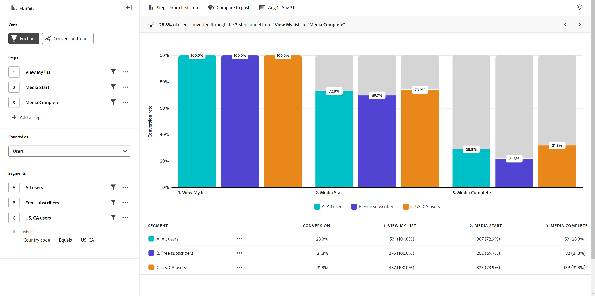
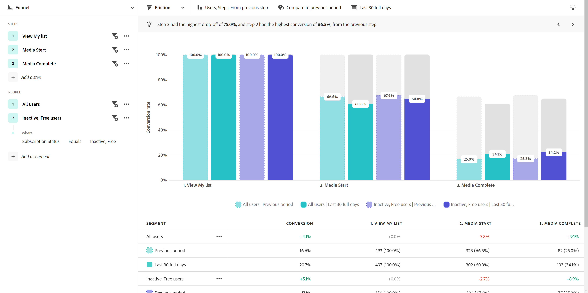

# Wrijvingsweergave

{{release-limited-testing}}

De **Wrijving** de mening verstrekt een visuele vertegenwoordiging van een kritieke gebruikersreis in uw product. De horizontale as vertegenwoordigt elke stap die een gebruiker moet doorgeven. De verticale as vertegenwoordigt het percentage gebruikers of zittingen bij elke stap. Alle stappen moeten in uiteindelijke volgorde worden uitgevoerd, maar kunnen op elk moment binnen het rapportagevenster plaatsvinden.

## Gebruik hoofdletters

U kunt onder andere de volgende gevallen gebruiken voor dit weergavetype:

* **Conversieanalyse**: U kunt omzettingen in elke fase van de trechter analyseren. Door het aantal gebruikers te volgen die van één stap aan volgende overgaan, kunt u knelpunten identificeren die ongebruikelijke of ongewenste omzettingspercentages hebben. Deze informatie is nuttig om te begrijpen waar u uw product voor directe resultaten kunt verbeteren.
* **Optimalisatie aan boord**: Optimaliseer het aan boord gaan van uw product proces door gebruikersgedrag rond zeer belangrijke gebeurtenissen te onderzoeken. U kunt aangeven met welke stappen gebruikers worstelen of niet.
* **Aanpassing en betrokkenheid van functies**: Begrijp hoe de gebruikers met specifieke eigenschappen in uw product in wisselwerking staan. Door de progressie van gebruikers door eigenschap-verwante stappen te analyseren, kunt u de tarieven van de eigenschapadoptie beoordelen en gebieden identificeren waar de gebruikers bepaalde eigenschappen zouden kunnen verlaten of ondergebruiken. U kunt deze informatie dan gebruiken om zich op eigenschapverbeteringen te concentreren om adoptiecijfers te verhogen.
* **Campagneevaluatie**: De doeltreffendheid van marketingcampagnes meten. U kunt een segment maken dat zich richt op gebruikers die een bepaalde campagne hebben aangeraakt, en hun omzettingsproces vergelijken met andere campagnes of binnen uw product in het algemeen.

## Query-rail

Met de queryrail kunt u de volgende componenten configureren:

* **Stappen**: De aanraakpunten voor gebeurtenissen die u wilt bijhouden. Elke balk in het diagram vertegenwoordigt een stap. U kunt maximaal tien stappen opnemen.
* **Mensen**: De segmenten die u wilt vergelijken de trechter over. Elk segment dat is geselecteerd, splitst elke stap in meerdere balken. Elke kleur vertegenwoordigt een ander segment. U kunt maximaal drie segmenten opnemen.

## Diagraminstellingen

De wrijvingsweergave biedt de volgende diagraminstellingen, die kunnen worden aangepast in het menu boven het diagram:

* **Metrisch**: Het bereik dat u op de trechter wilt toepassen. U kunt onder andere sessies en gebruikers kiezen. Door sessies te selecteren, moeten alle stappen binnen dezelfde sessie plaatsvinden om te worden geteld. Door gebruikers te selecteren, moeten alle stappen binnen het rapporteringsvenster gebeuren dat wordt geselecteerd om worden geteld.
* **Type diagram**: Het type visualisatie dat u wilt gebruiken. U kunt kiezen uit Stappen.
* **Conversie van**: Hiermee bepaalt u de percentageberekening van stap tot stap. U kunt onder andere de conversie uit de eerste of vorige stap berekenen.

## Tijdvergelijking toepassen

{{apply-time-comparison}}

## Datumbereik

Het gewenste datumbereik voor de analyse. Deze instelling bestaat uit twee componenten:

* **Interval**: De granulariteit voor de datum waarop u de getrineerde gegevens wilt weergeven. Deze instelling heeft geen invloed op niet-trendweergaven, zoals Wrijving.
* **Datum**: De begin- en einddatum. Voorinstellingen voor het verschuivende datumbereik en eerder opgeslagen aangepaste bereiken zijn voor uw gemak beschikbaar, maar u kunt ook de kalenderkiezer gebruiken om een vast datumbereik te kiezen.
