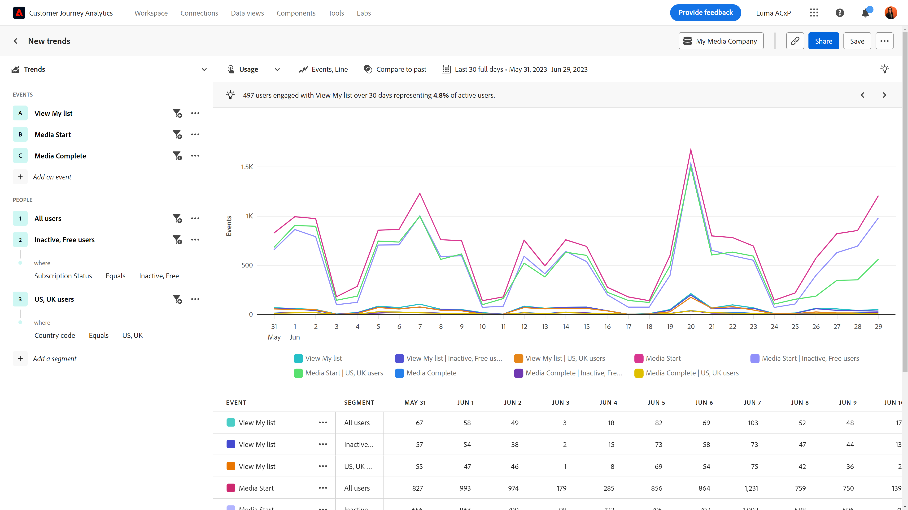

# Gebruik

{{release-limited-testing}}

De **Gebruik** weergavetype biedt een waardevol inzicht in de prestaties van uw product of het gedrag van uw gebruikers in de loop der tijd. De horizontale as van dit rapport is altijd een tijdgranulariteit, terwijl de verticale as uw gewenste gebeurtenissen meet. U kunt onder andere de volgende gevallen gebruiken voor dit weergavetype:

* **Productprestaties evalueren**: Met trends kunt u de algemene prestaties van uw product gedurende een bepaalde periode beoordelen. Door metriek zoals gebruikersbetrokkenheid, conversietarieven, of opbrengst te analyseren, kunt u identificeren als de prestaties van uw product verbeteren, stagneren, of verminderen.
* **Aanpassing van functies**: De tendensen staan u toe om te begrijpen hoe de gebruikers nieuwe eigenschappen of updates goedkeuren die u vrijgeeft. U kunt bepalen welke functies populair zijn en welke functies moeten worden verbeterd. Met deze informatie kunt u gegevensgestuurde beslissingen maken over de functies waarmee u prioriteiten kunt stellen bij uw ontwikkelingsinspanningen.
* **Gebruikersgedrag**: De tendensen kunnen inzicht in gebruikersgedrag in tijd verstrekken. Door specifieke acties te onderzoeken die de gebruikers nemen, kunt u patronen identificeren waar de gebruikers zouden kunnen wegvallen. U kunt inzichten van dit weergavetype combineren met [Wrijving](friction.md) voor nog meer inzicht in gedrag.
* **A/B-tests en -experimenten**: Als u A/B tests binnen uw product in werking stelt, kunt u Trends gebruiken om te meten welke tests in tijd het meest succesvol zijn.

## Query-rail

Met de queryrail kunt u de volgende componenten configureren:

* **Gebeurtenissen**: De gebeurtenissen die u in uw rapport wilt meten. Elke hier geselecteerde gebeurtenis wordt, afhankelijk van het diagramtype, voorgesteld als een gekleurde lijn of een set balken. Aan de tabel wordt een rij toegevoegd die de trended-gebeurtenis vertegenwoordigt. U kunt maximaal vijf gebeurtenissen opnemen.
* **Mensen**: De segmenten die u in uw rapport wilt meten. Elk segment dat u hier selecteert, verdubbelt het aantal regels in het diagram en de rijen in de tabel. Elke set gebeurtenissen wordt voor elk segment weergegeven. U kunt maximaal vijf segmenten opnemen.

## Diagraminstellingen

De tendensen bieden de volgende grafiekmontages aan. U kunt de diagraminstellingen aanpassen in het menu tussen het weergavetype en de kalenderkiezer.

* **Metrisch**: De metrische waarde die u wilt meten. U kunt onder andere gebeurtenissen, sessies, gebruikers, gebeurtenissen per sessie en gebeurtenissen per gebruiker kiezen.
* **Type diagram**: Het type visualisatie dat u wilt gebruiken. Dit menu bevat de opties Lijn, Staaf, Gestapelde balk en Gestapeld gebied.

## Tijdvergelijking toepassen

{{apply-time-comparison}}

## Datumbereik

Hiermee stelt u het gewenste datumbereik in. Deze instelling bestaat uit twee belangrijke onderdelen:

* **Interval**: De granulariteit voor de datum waarin u gegevens wilt weergeven. Mogelijke geldige opties zijn Uur, Dagelijks, Wekelijks, Maandelijks en Driemaandelijks. Hetzelfde datumbereik kan verschillende intervallen hebben die het aantal gegevenspunten in het diagram en het aantal kolommen in de tabel beïnvloeden. Bijvoorbeeld, zou het bekijken van een analyse die drie dagen met dagelijkse granulariteit overspant slechts drie gegevenspunten tonen, terwijl een analyse die drie dagen met uurgranulariteit overspant 72 gegevenspunten zou tonen.
* **Datum**: De begin- en einddatum. Voorinstellingen voor datumbereik zijn beschikbaar voor uw gemak of u kunt de kalenderkiezer gebruiken om de exacte gewenste datum in te stellen.
