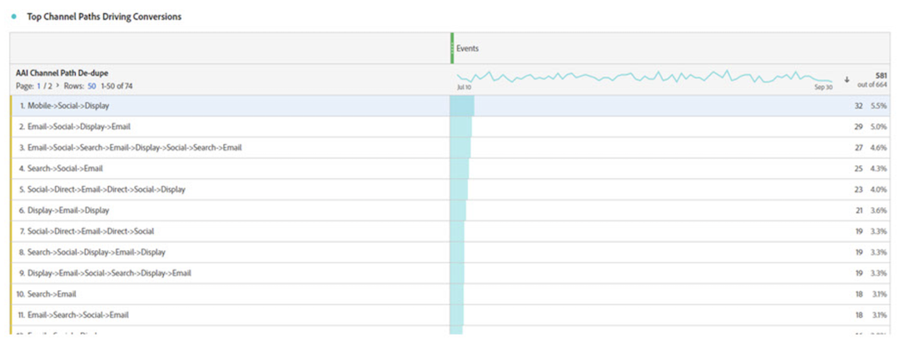
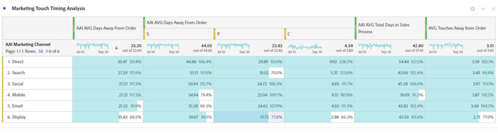

# Attribution AI integreren met CJA

>[!NOTE]
>
>Deze functionaliteit wordt op 25 mei 2022 gepubliceerd.

[Attribution AI](https://experienceleague.adobe.com/docs/experience-platform/intelligent-services/attribution-ai/overview.html?lang=en), als onderdeel van Adobe Experience Platform Intelligent Services, is een multi-channel, algoritmische attributiedienst die de invloed en de incrementele impact van klanteninteractie tegen gespecificeerde resultaten berekent. Met Attribution AI kunnen marketers marketing- en advertentiekosten meten en optimaliseren door de impact van elke individuele interactie van de klant in elke fase van de klantentransmissie te begrijpen.

Attribution AI ondersteunt twee scores: algoritmisch en op regel gebaseerd. Algoritmische scores omvatten incrementele en beïnvloede scores.

* **Betrokken scores** 100 % van het conversiekrediet wordt verdeeld over de afzetkanalen .
* **Incrementele scores** in de eerste plaats rekening houden met een basislijn voor omzetting die u zelfs zonder marketing zou hebben bereikt. Deze basislijn hangt van AI observaties van patronen, seizoensgebondenheid, etc., toe te schrijven aan bestaande merkerkenning, loyaliteit, en woord van mond. De resterende kredieten worden verdeeld over de afzetkanalen.

Op regels gebaseerde scores omvatten [!UICONTROL First touch], [!UICONTROL Last touch], [!UICONTROL Linear], [!UICONTROL U-shaped], en [!UICONTROL Time-Decay]. Attribution AI steunt 3 schema&#39;s van het Experience Platform: Experience Event, Adobe Analytics en Consumer Experience Event.

Attribution AI integreert met Customer Journey Analytics (CJA) voor zover de Attribution AI modellen tegen gegevens in werking stelt en dan CJA de output van die modellen als gegevensreeks invoert, die dan met de rest van uw CJA gegevensreeksen kan worden geïntegreerd. Attribution AI-toegelaten datasets kunnen dan in gegevensmeningen en rapportering in CJA worden gebruikt.

## Workflow

Sommige stappen worden uitgevoerd in Adobe Experience Platform voordat wordt gewerkt met de uitvoer in CJA. De uitvoer bestaat uit een gegevensset met een toegepast Attribution AI-model.

### Stap 1: Een Attribution AI-instantie maken

Maak in Experience Platform een Attribution AI-instantie door gegevens te selecteren en toe te wijzen, gebeurtenissen te definiëren en uw gegevens op te leiden, zoals beschreven [hier](https://experienceleague.adobe.com/docs/experience-platform/intelligent-services/attribution-ai/user-guide.html).

### Stap 2: Een CJA-verbinding met gegevenssets van Attribution AI instellen

In CJA kunt u nu [een of meer verbindingen maken](/help/connections/create-connection.md) op gegevenssets van Experience Platforms die van instrumenten zijn voorzien voor Attribution AI. Deze datasets worden weergegeven met het voorvoegsel &quot;Attribution AI Scores&quot;, zoals hier wordt getoond:

### Stap 3: Gegevensweergaven maken op basis van deze verbindingen

In CJA: [een of meer gegevensweergaven maken](/help/data-views/create-dataview.md) die de Attribution AI XDM-velden bevatten. (Zou hier geweldig zijn om een screenshot te maken.)

### Stap 4: AAI-gegevens rapporteren in CJA Workspace

In een project van de Werkruimte van CJA, kunt u metriek zoals &quot;Orders van AAI&quot;trekken, en dimensies zoals &quot;Naam van de Campagne AAI&quot; of &quot;Kanaal van de Marketing van AAI&quot;, bijvoorbeeld.

**Orders met beïnvloede en incrementele scores**

Hier zien we een Workspace-project met AAI-gegevens die orders met beïnvloede en incrementele scores weergeven. Bouw neer aan om het even welke afmeting om attributie te begrijpen door: campagne, productgroep, gebruikerssegment, geografie, enzovoort.

**Kanaalinteractie**

Begrijp kanaalinteractie om te zien welk kanaal het meest effectief met andere kanalen kan worden gebruikt:

**Bovenste paden naar conversie**

In deze tabel worden de belangrijkste paden naar conversie (gededupliceerd) weergegeven die u helpen bij het ontwerpen en optimaliseren van aanraakpunten:

**Tijd leiden naar conversie**

Hier zien we de aanlooptijd naar conversie wanneer een aanraakpunt in de mix zit. Het helpt bij het optimaliseren van doorlooptijd:

## Nieuwe CJA-metriek

| Metrisch | Beschrijving |
| --- | --- |
| [!UICONTROL Acquisition Rate] | Voor elk kanaal, onder de omzettingswegen het aanraakte, is het percentage van het kanaal de Starter. |
| [!UICONTROL Player rate] | Voor elk kanaal, onder de omzettingswegen het aanraakte, is het percentage van het kanaal een Speler. |
| [!UICONTROL Closer rate] | Voor elk kanaal, onder de omzettingswegen het aanraakte, is het percentage van het kanaal dichter. |
| [!UICONTROL AAI AVG Days Away from Order] | Voor elk kanaal, het gemiddelde aantal dagen sinds de orde. |
| [!UICONTROL AAI AVG Total Days in Sales Process] | Voor elk kanaal, het gemiddelde totale dagen van de omzettingswegen het aanraakte. |
| [!UICONTROL AVG Touches Away From Order] | Voor elk kanaal raakt het gemiddelde van orde weg. |

{style=&quot;table-layout:auto&quot;}

## Verschillen tussen Attribution AI en Attribution IQ

Wanneer moet u dus Attribution AI-gegevens gebruiken in plaats van [Attribution IQ](/help/analysis-workspace/attribution/overview.md), een native CJA-mogelijkheid? In deze tabel worden enkele verschillen in functionaliteit weergegeven:

| Functionaliteit | Attribution AI | Attribution IQ |
| --- | --- | --- |
| Heeft fractionele toewijzing | Ja | Nee |
| Hiermee kunnen gebruikers het model aanpassen | Ja | Ja |
| Kenmerken via kanalen (Opmerking: AAI gebruikt niet de gegevens die in CJA zijn opgeslagen.) | Ja | Ja |
| Inclusief incrementele en beïnvloede scores | Ja | Nee |
| Werken met ML | Ja | Ja |
| Modellering van ML met voorspellingen | Ja | Nee |

{style=&quot;table-layout:auto&quot;}
