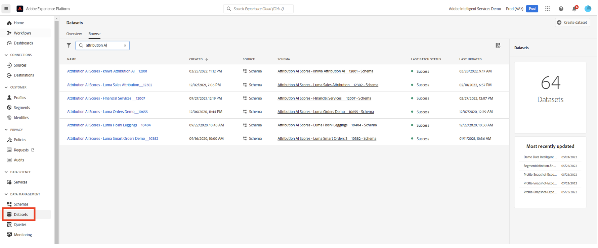

# Attribution AI integreren met CJA

[Attribution AI](https://experienceleague.adobe.com/docs/experience-platform/intelligent-services/attribution-ai/overview.html?lang=en), als onderdeel van Adobe Experience Platform Intelligent Services, is een multi-channel, algoritmische attributiedienst die de invloed en de incrementele impact van klanteninteractie tegen gespecificeerde resultaten berekent. Met Attribution AI kunnen marketers marketing- en advertentiekosten meten en optimaliseren door de impact van elke individuele interactie van de klant in elke fase van de klantentransmissie te begrijpen.

Attribution AI ondersteunt twee scores: algoritmisch en op regel gebaseerd. Algoritmische scores omvatten incrementele en beïnvloede scores. Op regels gebaseerde scores zijn onder andere First touch, Last touch, Linear, U-shaped en Time-Decay. Attribution AI steunt 3 schema&#39;s van het Experience Platform: Experience Event, Adobe Analytics en Consumer Experience Event.

Attribution AI integreert met Customer Journey Analytics (CJA) voor zover de Attribution AI modellen tegen gegevens in werking stelt en dan CJA de output van die modellen als gegevensreeks invoert, die dan met de rest van uw CJA gegevensreeksen kan worden geïntegreerd. Attribution AI-toegelaten datasets kunnen dan in gegevensmeningen en rapportering in CJA worden gebruikt.

## Workflow

Sommige stappen worden uitgevoerd in Adobe Experience Platform voordat wordt gewerkt met de uitvoer in CJA.

### Stap 1: Attribution AI-scores downloaden

Download in Adobe Experience Platform de Attribution AI-scores die worden beschreven [hier](https://experienceleague.adobe.com/docs/experience-platform/intelligent-services/attribution-ai/getting-started.html?lang=en#downloading-attribution-ai-scores).

### Stap 2: Een Attribution AI-instantie maken

Maak in Experience Platform een Attribution AI-instantie door gegevens te selecteren en toe te wijzen, gebeurtenissen te definiëren en uw gegevens op te leiden, zoals beschreven [hier](https://experienceleague.adobe.com/docs/experience-platform/intelligent-services/attribution-ai/user-guide.html).

### Stap 3: Een CJA-verbinding met gegevenssets van Attribution AI instellen

In CJA kunt u nu [een of meer verbindingen maken](/help/connections/create-connection.md) op gegevenssets van Experience Platforms die van instrumenten zijn voorzien voor Attribution AI. Deze datasets worden weergegeven met het voorvoegsel &quot;Attribution AI Scores&quot;, zoals hier wordt getoond:

### Stap 4: Gegevensweergaven maken op basis van deze verbindingen

In CJA:

## Verschillen tussen Attribution AI en Attribution IQ

Wanneer moet u dus Attribution AI-gegevens gebruiken in plaats van [Attribution IQ](/help/analysis-workspace/attribution/overview.md), een native CJA-mogelijkheid? In deze tabel worden enkele verschillen in functionaliteit weergegeven:

| Functionaliteit | Attribution AI | Attribution IQ |
| --- | --- | --- |
| Heeft fractionele toewijzing | Ja | Nee |
| Hiermee kunnen gebruikers het model aanpassen | Nee | Ja |
| Kenmerken via kanalen (Opmerking: AAI gebruikt niet de gegevens die in CJA zijn opgeslagen.) | Ja | Ja |
| Inclusief incrementele en beïnvloede scores | Ja | Nee |
| Werken met ML | Ja | Ja |
| Modellering van ML met voorspellingen | Ja | Nee |

{style=&quot;table-layout:auto&quot;}
