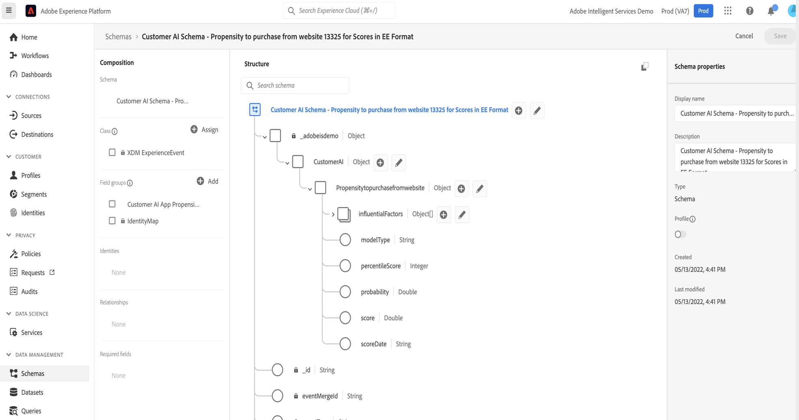

# Integreer Customer AI met CJA

>[!NOTE]
>
>Deze pagina is in opbouw.

[Customer AI](https://experienceleague.adobe.com/docs/experience-platform/intelligent-services/customer-ai/overview.html?lang=en), als onderdeel van Adobe Experience Platform Intelligent Services, biedt marketers de kracht om klantprognoses op individueel niveau te genereren.

Met behulp van invloedrijke factoren kan de AI van de Klant u vertellen wat een klant waarschijnlijk zal doen en waarom. Bovendien kunnen marketers profiteren van de voorspellingen en inzichten van de klant van AI om de ervaringen van klanten aan te passen door de meest geschikte aanbiedingen en berichten te bedienen.

De AI van de Klant werkt door één van de volgende datasets te analyseren om de scores van de kromme of van de omzettingsdichtheid te voorspellen:

* Adobe Analytics-gegevens via de gegevensbronaansluiting Analytics
* Adobe Audience Manager-gegevens via de Audience Manager-bronaansluiting
* Gegevensset Experience Event (EE)
* Gegevensset met consumentenervaringen (CEE)

De AI van de Klant integreert met Customer Journey Analytics (CJA) voor zover de Klant AI-Toegelaten datasets in gegevensmeningen en rapportering in CJA kunnen worden gebruikt.

## Workflow

Sommige stappen worden uitgevoerd in Adobe Experience Platform voordat wordt gewerkt met de uitvoer in CJA.

### Stap 1: AI-scores van klanten downloaden

Het downloaden van AI-scores van klanten gebeurt via een combinatie van API-aanroepen van Experience Platforms, zoals beschreven [hier](https://experienceleague.adobe.com/docs/experience-platform/intelligent-services/customer-ai/getting-started.html?lang=en#downloading-customer-ai-scores).

### Stap 2: Invoer en uitvoer van AI van klanten definiëren

Dit proces wordt beschreven in het dialoogvenster [Invoer en uitvoer in AI van de Klant](https://experienceleague.adobe.com/docs/experience-platform/intelligent-services/customer-ai/input-output.html?lang=en) documentatie.

### Stap 3: Een Customer AI-instantie configureren

Nadat u de gegevens hebt voorbereid en al uw gegevens en schema&#39;s hebt geïnstalleerd, begint u met het volgende: [Een AI-instantie van een klant configureren](https://experienceleague.adobe.com/docs/experience-platform/intelligent-services/customer-ai/user-guide/configure.html?lang=en) hulplijn.

### Stap 4: Een CJA-verbinding met AI-gegevenssets van klanten instellen

In CJA kunt u nu [een of meer verbindingen maken](/help/connections/create-connection.md) op gegevenssets van het Experience Platform die van instrumenten zijn voorzien voor AI van de Klant. Deze gegevenssets worden weergegeven met het voorvoegsel &quot;Klantenreferentie AI-scores&quot;, zoals hieronder wordt getoond:

Elke voorspelling, zoals &quot;Waarschijnlijkheid om rekening&quot;te bevorderen is aan één dataset gelijk.

Hier is een voorbeeld van een schema XDM dat CJA als deel van een bestaande of nieuwe dataset zou opnemen:

(Merk op dat het voorbeeld een profieldataset is; de zelfde reeks schemavoorwerp zou deel van een dataset van de Gebeurtenis van de Ervaring uitmaken die CJA zou grijpen. De dataset van de Gebeurtenis van de Ervaring zou timestamps als scoredatum omvatten.) Elke klant die in dit model een score heeft behaald, heeft een scoreDate, enzovoort. geassocieerd met hen.

### Stap 5: Gegevensweergaven maken op basis van deze verbindingen

In CJA kunt u nu doorgaan om gegevensweergaven te maken met de afmetingen die zijn geïntroduceerd als onderdeel van de verbinding die u hebt gemaakt.