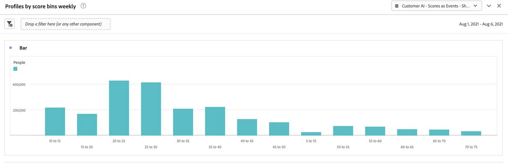

# Integreer Customer AI met CJA

>[!NOTE]
>
>Deze functionaliteit wordt op 25 mei 2022 gepubliceerd.

[Customer AI](https://experienceleague.adobe.com/docs/experience-platform/intelligent-services/customer-ai/overview.html?lang=en), als onderdeel van Adobe Experience Platform Intelligent Services, biedt marketers de kracht om klantprognoses op individueel niveau te genereren.

Met behulp van invloedrijke factoren kan de AI van de Klant u vertellen wat een klant waarschijnlijk zal doen en waarom. Bovendien kunnen marketers profiteren van de voorspellingen en inzichten van de klant van AI om de ervaringen van klanten aan te passen door de meest geschikte aanbiedingen en berichten te bedienen.

AI van de Klant baseert zich op individuele gedragsgegevens en profielgegevens voor het rangschikken van eigenschappen. De AI van de Klant is flexibel in die zin dat het in veelvoudige gegevensbronnen, met inbegrip van Adobe Analytics, Adobe Audience Manager, de gegevens van de Gebeurtenis van de Consumentenervaring en de gegevens van de Gebeurtenis van de Ervaring kan nemen. Als u de AEP-gegevensconnector gebruikt om Adobe Audience Manager- en Adobe Analytics-gegevens in te voeren, neemt het model automatisch de standaardgebeurtenistypen op om het model te trainen en te scoren. Als u uw eigen dataset van de Gebeurtenis van de Ervaring zonder standaardgebeurtenistypen brengt, zullen om het even welke relevante gebieden als douanegebeurtenissen of profielattributen moeten worden in kaart gebracht als u het in het model wilt gebruiken. Dit kan worden gedaan in de configuratiestap van AI van de Klant. &#x200B;

De AI van de Klant integreert met Customer Journey Analytics (CJA) voor zover de Klant AI-Toegelaten datasets in gegevensmeningen en rapportering in CJA kunnen worden gebruikt. Met deze integratie kunt u

* **Volgheidscores bijhouden voor een gebruikerssegment in de loop van de tijd**. Voorbeeld van gebruik: Hoe groot is de kans dat een hotelklant een showticket koopt op de concertlocatie van het hotel?
* **Analyseren welke succesgebeurtenissen of kenmerken zijn gekoppeld aan propensiteitsscores**. &#x200B;Voorbeeld van gebruik: Ik wil de attributen of succesgebeurtenissen begrijpen verbonden aan aandrijvingsscores.
* **Volg de ingangsstroom voor klantenneiging over verschillende het scoren looppas**. Voorbeeld van gebruik: Ik zou graag mensen willen begrijpen die aanvankelijk gebruikers met een lage dichtheid waren en die na verloop van tijd gebruikers met een hoge dichtheid werden. &#x200B;
* **Kijk naar de verdeling van de neiging**. Hoofdlettergebruik: Ik zou graag de verdeling van de nevenscores voor mijn segmenten willen begrijpen. &#x200B;Voorbeeld: een detailhandelaar wil een specifieke promotie voor $50 van een product in werking stellen.  Ze willen misschien slechts een zeer beperkte promotie uitvoeren vanwege de begroting, enz. Zij analyseren de gegevens en besluiten slechts de hoogste 80%+ &#x200B; van hun klanten te richten.
* **Kijk naar de neiging om in de loop der tijd een actie voor een bepaald cohort uit te voeren**. Hoofdlettergebruik: Ik wil graag een specifieke cohort bijhouden in de loop van de tijd. Dit is vergelijkbaar met het eerste voorbeeld, maar u kunt een specifieke cohort in de loop van de tijd bijhouden. &#x200B; Voorbeeld van ziekenhuisopname: Een markator kan hun bronzen laag in vergelijking met hun zilveren laag volgen, of zilveren laag tegenover hun gouden laag in de loop van de tijd. Dan zien ze de neiging van elke cohort om het hotel in de loop van de tijd te boeken. &#x200B;

## Workflow

Sommige stappen worden uitgevoerd in Adobe Experience Platform voordat wordt gewerkt met de uitvoer in CJA.

### Stap 1: Een Customer AI-instantie configureren

Nadat u de gegevens hebt voorbereid en al uw gegevens en schema&#39;s hebt geïnstalleerd, begint u met het volgende: [Een AI-instantie van een klant configureren](https://experienceleague.adobe.com/docs/experience-platform/intelligent-services/customer-ai/user-guide/configure.html?lang=en) hulplijn.

### Stap 2: Een CJA-verbinding met AI-gegevenssets van klanten instellen

In CJA kunt u nu [een of meer verbindingen maken](/help/connections/create-connection.md) op gegevenssets van het Experience Platform die van instrumenten zijn voorzien voor AI van de Klant. Elke voorspelling, zoals &quot;Waarschijnlijkheid om rekening te bevorderen&quot;, vergelijkt met één dataset. Deze gegevenssets worden weergegeven met het voorvoegsel &quot;Klantenreferentie AI-scores&quot;, zoals hieronder wordt getoond:

Hier is een voorbeeld van een schema XDM dat CJA als deel van een bestaande of nieuwe dataset zou opnemen:

(Merk op dat het voorbeeld een profieldataset is; de zelfde reeks schemavoorwerp zou deel van een dataset van de Gebeurtenis van de Ervaring uitmaken die CJA zou grijpen. De dataset van de Gebeurtenis van de Ervaring zou timestamps als scoredatum omvatten.) Elke klant die in dit model een score heeft behaald, heeft een scoreDate, enzovoort. geassocieerd met hen.

### Stap 3: Gegevensweergaven maken op basis van deze verbindingen

In CJA kunt u nu doorgaan naar [gegevensweergaven maken](/help/data-views/create-dataview.md) met de dimensies (zoals score, scoredatum, waarschijnlijkheid, enzovoort) en metriek die zijn ingevoerd als onderdeel van de verbinding die u hebt gemaakt.

### Stap 4: Rapport over CAI-scores in werkruimte

In de Werkruimte van CJA, kunt u een nieuw project en trekkracht in visualisaties nu tot stand brengen.

Hier is een voorbeeld van een project van de Werkruimte met de gegevens van CAI die de tendensiteitsscores voor een segment van gebruikers in tijd, in &#x200B; een gestapeld staafdiagram trends:

Hier volgt een tabel met redencodes waarom een segment een &#x200B; met een hoge of lage dichtheid heeft:

Dit stroomdiagram toont de ingangsstroom voor klantenneiging over verschillende het scoren looppas &#x200B;:

In dit staafdiagram wordt de verdeling van &#x200B; voor de dichtheid getoond:

In dit Venn-diagram ziet u de nevenoverlappingen in verschillende scoring-reeksen:

