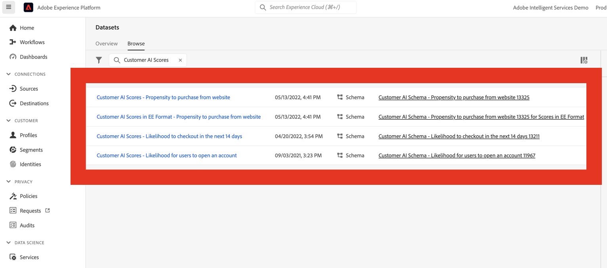

# AI-gegevens van de klant integreren

{{release-limited-testing}}

[ AI van de Klant ](https://experienceleague.adobe.com/docs/experience-platform/intelligent-services/customer-ai/overview.html), als deel van de Intelligente Diensten van Adobe Experience Platform, verstrekt marketers de macht om klantenvoorspellingen op het individuele niveau te produceren.

Met behulp van invloedrijke factoren kan de AI van de Klant u vertellen wat een klant waarschijnlijk zal doen en waarom. Bovendien kunnen marketers profiteren van de voorspellingen en inzichten van de klant van AI om de ervaringen van klanten aan te passen door de meest geschikte aanbiedingen en berichten te bedienen.

AI van de Klant baseert zich op individuele gedragsgegevens en profielgegevens voor het rangschikken van eigenschappen. De AI van de Klant is flexibel in die zin dat het in veelvoudige gegevensbronnen, met inbegrip van Adobe Analytics, Adobe Audience Manager, de gegevens van de Gebeurtenis van de Consumentenervaring en de gegevens van de Gebeurtenis van de Ervaring kan nemen. Als u de bronschakelaar van het Experience Platform gebruikt om Adobe Audience Manager en Adobe Analytics gegevens in te brengen, neemt het model automatisch de standaardgebeurtenistypen op om het model te trainen en te scoren. Als u uw eigen dataset van de Gebeurtenis van de Ervaring zonder standaardgebeurtenistypen brengt, zullen om het even welke relevante gebieden als douanegebeurtenissen of profielattributen moeten worden in kaart gebracht als u het in het model wilt gebruiken. Dit kan worden gedaan in de configuratiestap van AI van de Klant in Experience Platform.

De AI van de klant kan met de Customer Journey Analytics integreren voor zover de door de AI van de Klant ingeschakelde datasets kunnen worden gebruikt in gegevensweergaven en rapportage in Customer Journey Analytics. U kunt:

* **de bezitsscores van het Spoor voor een segment van gebruikers in tijd**.
   * Gebruiksscenario: begrijp hoe waarschijnlijk klanten in een bepaald segment zijn dat ze moeten converteren.
   * Voorbeeld: een markator in een hotelketen wil begrijpen hoe waarschijnlijk het is dat een hotelklant een showticket koopt op de concertlocatie van het hotel.
* **analyseert welke succesgebeurtenissen of attributen met aandrijvingsscores** worden geassocieerd.
   * Gebruik hoofdletters/kleine letters: begrip van de kenmerken of succesgebeurtenissen die zijn gekoppeld aan propensiteitsscores.
   * Voorbeeld: een marketer in een hotelketen wil begrijpen hoe aankopen van showtickets op de concertlocatie van een hotel gekoppeld zijn aan nevenscores.
* **volg de ingangsstroom voor klantenneiging over verschillende het scoren looppas**.
   * Gebruiksscenario: Begrijp mensen die aanvankelijk gebruikers met een lage dichtheid waren en in de loop der tijd gebruikers met een hoge dichtheid werden.
   * Voorbeeld: een marketer in een hotelketen wil begrijpen welke hotelklanten aanvankelijk werden geïdentificeerd als klanten met een lage neiging om een showticket te kopen, maar in de loop der tijd werden klanten met een hoge neiging om een showticket te kopen.
* **bekijk de distributie van neiging**.
   * Gebruik hoofdletters/kleine letters: begrip voor de spreiding van de scores voor de dichtheid om nauwkeuriger te zijn bij het definiëren van segmenten.
   * Voorbeeld: een detailhandelaar wil een specifieke promotie voor $50 van een product in werking stellen. Ze willen misschien slechts een zeer beperkte promotie uitvoeren vanwege de begroting, enzovoort. Zij analyseren de gegevens en besluiten slechts de top 80%+ van hun klanten te richten.
* **bekijk de neiging om een actie voor een bepaalde cohort in tijd** te verwezenlijken.
   * Hoofdlettergebruik: houd een specifieke code in de loop van de tijd bij.
   * Voorbeeld: een markator in een hotelketen wil hun bronzen laag volgen ten opzichte van hun zilveren laag, of een zilveren laag ten opzichte van hun gouden laag, in de loop van de tijd. Ze zien de neiging van elke cohort om het hotel in de loop van de tijd te boeken.

Voer de volgende stappen uit om AI-gegevens van de klant daadwerkelijk te integreren met Customer Journey Analytics:

>[!NOTE]
>
>Sommige stappen worden uitgevoerd in Adobe Experience Platform voordat de uitvoer in Customer Journey Analytics wordt uitgevoerd.

## Stap 1: Een AI-instantie van een klant configureren

Zodra u uw gegevens hebt voorbereid en al uw geloofsbrieven en schema&#39;s op zijn plaats hebt, begin door [ te volgen vormt een Instantie van de Klant AI ](https://experienceleague.adobe.com/docs/experience-platform/intelligent-services/customer-ai/user-guide/configure.html) gids in Adobe Experience Platform.

## Stap 2: Opstelling een verbinding van de Customer Journey Analytics aan de datasets van AI van de Klant

In Customer Journey Analytics, kunt u één of meerdere verbindingen ](/help/connections/create-connection.md) aan Experience Platform datasets nu tot stand brengen die voor Klant AI van instrumenten zijn voorzien. [ Elke voorspelling, zoals &quot;Waarschijnlijkheid om rekening te bevorderen&quot;, vergelijkt met één dataset. Deze datasets worden weergegeven met het voorvoegsel &quot;Customer AI Scores in EE Format - name_of_application&quot;.

>[!IMPORTANT]
>
>Elke AI-instantie van de Klant heeft twee uitvoergegevenssets als de schakeloptie is ingeschakeld om scores voor Customer Journey Analytics tijdens de configuratie in Stap 1 in te schakelen. Eén uitvoergegevensset wordt weergegeven in de indeling Profile XDM en één in de indeling Experience Event XDM.

Hier is een voorbeeld van een schema XDM dat de Customer Journey Analytics als deel van een bestaande of nieuwe dataset zou opnemen:

(Merk op dat het voorbeeld een profieldataset is; de zelfde reeks schemavoorwerp zou deel van een dataset van de Gebeurtenis van de Ervaring uitmaken die de Customer Journey Analytics zou grijpen. De dataset van de Gebeurtenis van de Ervaring zou timestamps als scoredatum omvatten.) Elke klant die in dit model een score heeft behaald, heeft een scoreDate, enzovoort. geassocieerd met hen.

## Stap 3: Creeer gegevensmeningen die op deze verbindingen worden gebaseerd

In Customer Journey Analytics, kunt u nu te werk gaan [ gegevensmeningen ](/help/data-views/create-dataview.md) met de dimensies (zoals score, scoredatum, waarschijnlijkheid, etc.) en metriek tot stand brengen die als deel van de verbinding werden gebracht u gevestigd.

## Stap 4: Rapport over CAI-scores in Workspace

Maak in Customer Journey Analytics Workspace een nieuw project en trek de visualisaties over.

### Scherptediepte van trend

Hier is een voorbeeld van een Workspace-project met CAI-gegevens dat de populatiescore voor een segment van gebruikers in de loop van de tijd in &#x200B; gestapelde staafdiagram trends:

### Tabel met redencodes

Hier volgt een tabel met redencodes waarom een segment een &#x200B; met een hoge of lage dichtheid heeft:

### Invoerstroom voor klantgevoeligheid

Dit stroomdiagram toont de ingangsstroom voor klantenneiging over verschillende het scoren looppas &#x200B;:

### Verdeling van de dichtheid

In dit staafdiagram wordt de verdeling van &#x200B; voor de dichtheid getoond:

### Propensiteit overlapt

In dit Venn-diagram ziet u de nevenoverlappingen in verschillende scoring-reeksen:

