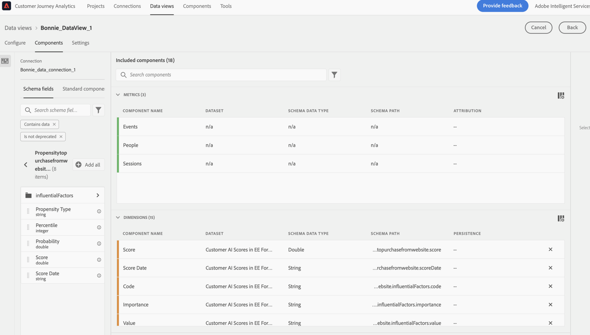
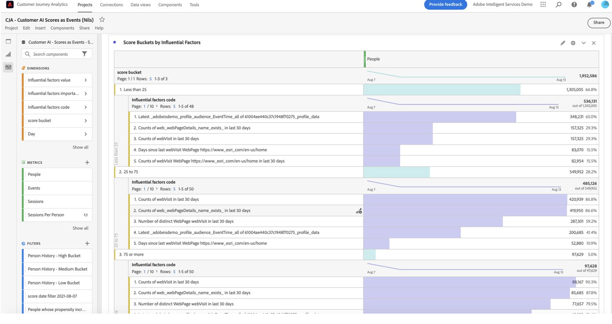

# AI-gegevens van klanten integreren met Adobe Customer Journey Analytics

{{release-limited-testing}}

[Customer AI](https://experienceleague.adobe.com/docs/experience-platform/intelligent-services/customer-ai/overview.html?lang=en), als onderdeel van Adobe Experience Platform Intelligent Services, biedt marketers de kracht om klantprognoses op individueel niveau te genereren.

Met behulp van invloedrijke factoren kan de AI van de Klant u vertellen wat een klant waarschijnlijk zal doen en waarom. Bovendien kunnen marketers profiteren van de voorspellingen en inzichten van de klant van AI om de ervaringen van klanten aan te passen door de meest geschikte aanbiedingen en berichten te bedienen.

AI van de Klant baseert zich op individuele gedragsgegevens en profielgegevens voor het rangschikken van eigenschappen. De AI van de Klant is flexibel in die zin dat het in veelvoudige gegevensbronnen, met inbegrip van Adobe Analytics, Adobe Audience Manager, de gegevens van de Gebeurtenis van de Consumentenervaring en de gegevens van de Gebeurtenis van de Ervaring kan nemen. Als u de bronschakelaar van het Experience Platform gebruikt om Adobe Audience Manager en Adobe Analytics gegevens in te brengen, neemt het model automatisch de standaardgebeurtenistypen op om het model te trainen en te scoren. Als u uw eigen dataset van de Gebeurtenis van de Ervaring zonder standaardgebeurtenistypen brengt, zullen om het even welke relevante gebieden als douanegebeurtenissen of profielattributen moeten worden in kaart gebracht als u het in het model wilt gebruiken. Dit kan worden gedaan in de configuratiestap van AI van de Klant in Experience Platform.

De AI van de klant kan met Customer Journey Analytics integreren voor zover de door de AI van de klant ingeschakelde gegevenssets kunnen worden gebruikt in gegevensweergaven en rapportage in Customer Journey Analytics. U kunt:

* **Volgheidscores bijhouden voor een gebruikerssegment in de loop van de tijd**.
   * Hoofdlettergebruik: Begrijp de waarschijnlijkheid dat klanten in een specifiek segment zich zullen omzetten.
   * Voorbeeld: Een marketeer in een hotelketen wil begrijpen hoe waarschijnlijk het is dat een hotelklant een showticket koopt op de concertlocatie van het hotel.
* **Analyseren welke succesgebeurtenissen of kenmerken zijn gekoppeld aan propensiteitsscores**.
   * Hoofdlettergebruik: Begrijp de attributen of succesgebeurtenissen verbonden aan aandrijvingsscores.
   * Voorbeeld: Een marketeer in een hotelketen wil begrijpen hoe aankopen van showtickets op de concertlocatie van een hotel gekoppeld zijn aan nevenscores.
* **Volg de ingangsstroom voor klantenneiging over verschillende het scoren looppas**.
   * Hoofdlettergebruik: Begrijp mensen die aanvankelijk gebruikers met een lage neiging waren en, in de loop der tijd, gebruikers met een hoge neiging werden.
   * Voorbeeld: Een marktmaker in een hotelketen wil begrijpen welke hotelklanten aanvankelijk als klanten met lage neiging werden geïdentificeerd om een showkaartje te kopen, maar in de loop der tijd werden klanten met hoge neiging om een showkaartje te kopen.
* **Kijk naar de verdeling van de neiging**.
   * Hoofdlettergebruik: Begrijp de verdeling van de aandrijvingsscores nauwkeuriger in het bepalen van segmenten.
   * Voorbeeld: Een detailhandelaar wil een specifieke promotie voor $50 van een product in werking stellen. Ze willen misschien slechts een zeer beperkte promotie uitvoeren vanwege de begroting, enzovoort. Zij analyseren de gegevens en besluiten slechts de top 80%+ van hun klanten te richten.
* **Kijk naar de neiging om in de loop der tijd een actie voor een bepaald cohort uit te voeren**.
   * Hoofdlettergebruik: Een specifieke cohort bijhouden in de loop van de tijd.
   * Voorbeeld: Een marketeter in een hotelketen wil hun bronzen laag in plaats van hun zilveren laag volgen, of zilveren laag tegenover hun gouden laag, in de loop van de tijd. Ze zien de neiging van elke cohort om het hotel in de loop van de tijd te boeken.

Voer de volgende stappen uit om AI-gegevens van de klant daadwerkelijk met Customer Journey Analytics te integreren:

>[!NOTE]
>
>Sommige stappen worden uitgevoerd in Adobe Experience Platform voordat wordt gewerkt met de uitvoer in Customer Journey Analytics.

## Stap 1: Een Customer AI-instantie configureren

Nadat u de gegevens hebt voorbereid en al uw gegevens en schema&#39;s hebt geïnstalleerd, begint u met het volgende: [Een AI-instantie van een klant configureren](https://experienceleague.adobe.com/docs/experience-platform/intelligent-services/customer-ai/user-guide/configure.html?lang=en) in Adobe Experience Platform.

## Stap 2: Een Customer Journey Analytics-verbinding met de AI-gegevenssets van de klant instellen

In Customer Journey Analytics kunt u nu [een of meer verbindingen maken](/help/connections/create-connection.md) op gegevenssets van het Experience Platform die van instrumenten zijn voorzien voor AI van de Klant. Elke voorspelling, zoals &quot;Waarschijnlijkheid om rekening te bevorderen&quot;, vergelijkt met één dataset. Deze datasets worden weergegeven met het voorvoegsel &quot;Customer AI Scores in EE Format - name_of_application&quot;.

>[!IMPORTANT]
>
>Elke AI-instantie van de Klant heeft twee uitvoergegevenssets als de schakeloptie is ingeschakeld om scores voor Customer Journey Analytics tijdens de configuratie in Stap 1 in te schakelen. Eén uitvoergegevensset wordt weergegeven in de indeling Profile XDM en één in de indeling Experience Event XDM.

Hier is een voorbeeld van een schema XDM dat Customer Journey Analytics als deel van een bestaande of nieuwe dataset zou opnemen:

(Merk op dat het voorbeeld een profieldataset is; dezelfde set schemaobjecten maakt deel uit van een Experience Event-gegevensset die Customer Journey Analytics zou vastleggen. De dataset van de Gebeurtenis van de Ervaring zou timestamps als scoredatum omvatten.) Elke klant die in dit model een score heeft behaald, heeft een scoreDate, enzovoort. geassocieerd met hen.

## Stap 3: Gegevensweergaven maken op basis van deze verbindingen

In Customer Journey Analytics kunt u nu doorgaan naar [gegevensweergaven maken](/help/data-views/create-dataview.md) met de dimensies (zoals score, scoredatum, waarschijnlijkheid, enzovoort) en metriek die zijn ingevoerd als onderdeel van de verbinding die u hebt gemaakt.

## Stap 4: Rapport over CAI-scores in werkruimte

In de Werkruimte van de Customer Journey Analytics, creeer een nieuw project en trek in visualisaties.

### Scherptediepte

Hier is een voorbeeld van een project van de Werkruimte met de gegevens van CAI die de tendensiteitsscores voor een segment van gebruikers in tijd, in &#x200B; een gestapeld staafdiagram trends:

### Tabel met redencodes

Hier volgt een tabel met redencodes waarom een segment een &#x200B; met een hoge of lage dichtheid heeft:

### Invoerstroom voor klantgevoeligheid

Dit stroomdiagram toont de ingangsstroom voor klantenneiging over verschillende het scoren looppas &#x200B;:

### Verdeling van de dichtheidsscores

In dit staafdiagram wordt de verdeling van &#x200B; voor de dichtheid getoond:

### Propensiteit overlapt

In dit Venn-diagram ziet u de nevenoverlappingen in verschillende scoring-reeksen:

