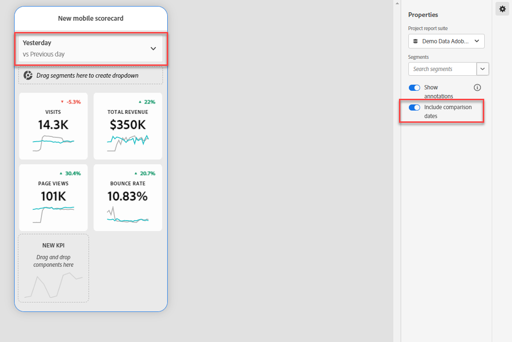

# Een mobiele scorecard maken {#create-a-mobile-scorecard}

<!-- markdownlint-disable MD034 -->

>[!CONTEXTUALHELP]
>id="cja_mobilescorecard_annotations"
>title="Annotaties"
>abstract="Annotaties kunnen worden gemaakt in de componentenbeheer van een werkruimteproject."

<!-- markdownlint-enable MD034 -->

De volgende informatie instrueert curatoren van Customer Journey Analytics gegevens over hoe te om dashboards voor uitvoerende gebruikers te vormen en te presenteren. Om met te beginnen, kunt u de de bouwervideo bekijken van de dashboards van Analytics:

>[!VIDEO](https://video.tv.adobe.com/v/343458)

>[!NOTE]
>
>Er zijn beeldschermafbeeldingen van analysescorecard voor deze pagina gemaakt vanuit de gebruikersinterface van Adobe Analytics, niet vanuit de Customer Journey Analytics. De gebruikersinterface is bijna identiek.

Een scorecard van Analytics toont zeer belangrijke gegevensvisualisaties voor uitvoerende gebruikers in een tegellay-out, zoals hieronder getoond:

Als curator van dit scorecard, kunt u de scorecard bouwer gebruiken om te vormen welke tegels op scorecard voor uw uitvoerende consument verschijnen. U configureert ook hoe de gedetailleerde weergaven, of de onderverdelingen, kunnen worden aangepast wanneer op de tegels wordt getikt. De scorecard bouwerinterface wordt hieronder getoond:

Om scorecard tot stand te brengen, moet u het volgende doen:

1. Open de sjabloon [!UICONTROL Blank Mobile Scorecard] .
2. Vorm scorecard met gegevens en bewaar het.

## Toegang krijgen tot de sjabloon [!UICONTROL Blank Mobile Scorecard] {#template}

U kunt tot het [!UICONTROL Blank Mobile Scorecard] malplaatje of toegang hebben door een nieuw project te creëren, of van het menu van Hulpmiddelen.

### Een nieuw project maken {#create}

1. Open Customer Journey Analytics en klik op de tab **[!UICONTROL Workspace]** .
1. Klik op **[!UICONTROL Create project]** en selecteer de **[!UICONTROL Blank mobile scorecard]** -projectsjabloon.
1. Klik op **[!UICONTROL Create]**.

### Menu Gereedschappen

1. Selecteer **[!UICONTROL Analytics dashboards (Mobile App)]** in het menu **[!UICONTROL Tools]** .
1. Klik op **[!UICONTROL Create new scorecard]** in het volgende scherm.

## Vorm scorecard met gegevens en bewaar het {#configure}

Om het scorecardmalplaatje uit te voeren:

1. Geef onder **[!UICONTROL Properties]** (in de rechterrails) een **[!UICONTROL Project data view]** op waaruit u gegevens wilt gebruiken.

   

1. Als u een nieuwe tegel aan uw scorecard wilt toevoegen, sleept u een metrische waarde uit het linkerdeelvenster en zet u deze neer in de **[!UICONTROL Drag and Drop Metrics Here]** -zone. U kunt ook een metrische waarde tussen twee tegels invoegen met behulp van een vergelijkbare workflow.

   

1. Van elke tegel, kunt u tot een gedetailleerde mening toegang hebben die extra informatie over metrisch, zoals hoogste punten voor een lijst van verwante afmetingen toont.

## Afmetingen of metingen toevoegen {#dimsmetrics}

Als u een gerelateerde afmeting aan een metrische waarde wilt toevoegen, sleept u een afmeting uit het linkerdeelvenster en zet u deze op een tegel neer.

U kunt bijvoorbeeld de juiste afmetingen (zoals **[!DNL Marketing Channel]** in dit voorbeeld) toevoegen aan de **[!UICONTROL Unique Visitors]** -meting door deze naar de tegel te slepen. Uitsplitsingen naar Dimensionen worden weergegeven onder de sectie [!UICONTROL Drill Ins] (uitsplitsing) van de tegelspecifieke sectie **[!UICONTROL Properties]** . U kunt meerdere afmetingen aan elke tegel toevoegen.

## Filters toepassen {#filters}

Als u filters wilt toepassen op afzonderlijke tegels, sleept u een filter (segmenten zijn filters in Customer Journey Analytics) uit het linkerdeelvenster en zet u het rechtstreeks boven op de tegel neer.

Als u het filter op alle tegels in de scorecard wilt toepassen, laat vallen de tegel bovenop de scorecard. U kunt ook filters toepassen door filters te selecteren in het filtermenu onder de datumbereiken. U [ vormt en past filters voor uw scorecards ](https://experienceleague.adobe.com/docs/analytics-learn/tutorials/analysis-workspace/using-panels/using-drop-down-filters.html) toe de zelfde manier u in Customer Journey Analytics Workspace zou.

## Datumbereiken toevoegen {#dates}

U kunt combinaties van datumbereiken toevoegen en verwijderen die u in uw scorecard kunt selecteren door de vervolgkeuzelijst met datumbereiken te selecteren.

Elke nieuwe scorecard begint met 6 datumwaaiercombinaties die zich op de gegevens van vandaag en gisteren concentreren. U kunt overbodige datumbereiken verwijderen door op de x te klikken of u kunt elke datumbereikcombinatie bewerken door op het potlood te klikken.

Als u een primaire datum wilt maken of wijzigen, gebruikt u de vervolgkeuzelijst om een van de beschikbare datumbereiken te selecteren of sleept u een datumcomponent van de rechterrail naar de neerzetzone.

 benadrukt

Als u een vergelijkingsdatum wilt maken, kunt u een keuze maken uit handige voorinstellingen voor algemene tijdvergelijkingen in het keuzemenu. U kunt ook een datumcomponent slepen en neerzetten vanaf de rechterrail.

Als het gewenste datumbereik nog niet is gemaakt, kunt u een nieuw datumbereik maken door op het kalenderpictogram te klikken.

Hiermee gaat u naar de builder van het datumbereik waar u een nieuwe component voor het datumbereik kunt maken en opslaan.

### Vergelijkingsdatumbereiken tonen of verbergen {#show-comparison-dates}

Om de waaiers van de vergelijkingsdatum te omvatten, knevel **omvatten vergelijkingsdata** plaatsen.

Het plaatsen is *op* door gebrek. Wissel het aan *weg* als u geen vergelijkingsdata wilt bekijken.

 benadrukt

## Visualisaties toepassen {#viz}

De dashboards van de Analyse bieden vier visualisaties die u groot inzicht in afmetingspunten en metriek geven. Schakel over naar een andere visualisatie door de [!UICONTROL chart type] van de tegel [!UICONTROL Properties] te wijzigen. Selecteer gewoon de rechtertegel en wijzig vervolgens het diagramtype.

U kunt ook op het pictogram [!UICONTROL Visualizations] in de linkertrack klikken en de rechtervisualisatie naar de tegel slepen:

### [!UICONTROL Summary Number]

Gebruik de Summiere visualisatie van het Aantal om een groot aantal te benadrukken dat in een project belangrijk is.

 benadrukt

### [!UICONTROL Donut]

Net als bij een cirkeldiagram toont deze visualisatie gegevens als delen van een geheel. Gebruik een donutgrafiek wanneer het vergelijken van percentages van een totaal. U wilt bijvoorbeeld zien welk platform heeft bijgedragen aan het totale aantal unieke personen:

### [!UICONTROL Line]

De visualisatie van de Lijn vertegenwoordigt metriek gebruikend een lijn om te tonen hoe de waarden over een periode veranderen. Een lijngrafiek toont afmetingen in tijd maar werkt met om het even welke visualisatie. U visualiseert de dimensie van de productcategorie in dit voorbeeld.

### [!UICONTROL Horizontal Bar]

Deze visualisatie toont horizontale balken die verschillende waarden over een of meer meeteenheden vertegenwoordigen. Als u bijvoorbeeld gemakkelijk wilt zien wat uw beste producten zijn, gebruikt u [!UICONTROL Horizontal Bar] voor visualisatie van uw voorkeur.

## Naamscorecards {#name}

Als u de scorecard een naam wilt geven, klikt u op de naamruimte linksboven in het scherm en typt u de nieuwe naam.

### Dimensie-item [!UICONTROL Unspecified] verwijderen {#remove-dims}

Als u [!UICONTROL Unspecified] dimensie-items uit uw gegevens wilt verwijderen, gaat u als volgt te werk:

1. Selecteer de juiste tegel.
1. Selecteer onder **[!UICONTROL Drill ins]** in het rechterspoor de pijl naar rechts naast het dimensie-item waarvan u **[!UICONTROL Unspecified]** -items wilt verwijderen.

   

1. Klik op het pictogram naast **[!UICONTROL Unspecified]** om niet-opgegeven gegevens uit de rapportage te verwijderen. (U kunt ook elk ander dimensie-item verwijderen.)

## Eigenschappen van tegels weergeven en configureren {#tiles}

Wanneer u op een tegel klikt in de scorecard builder, geeft de rechterrails de eigenschappen en kenmerken weer die aan die tegel en de bijbehorende dia met details zijn gekoppeld. In dit spoor, kunt u een nieuwe **Titel** voor de tegel verstrekken en alternatief de tegel vormen door filters toe te passen. Segmenten zijn filters in Customer Journey Analytics.

## Gedetailleerde dia&#39;s weergeven {#view-detail-slides}

Wanneer u op tegels klikt, wordt in een dynamisch pop-upvenster weergegeven hoe de detaildia er uitziet voor de uitvoerende gebruiker in de app. U kunt dimensies toevoegen om uw gegevens naar behoefte op te splitsen. Als een afmeting niet is toegepast, zal de afbraakafmeting **uur** of **dagen**, afhankelijk van de standaarddatumwaaier zijn.

De onderbrekingen verfijnen uw analyse door metriek door afmetingspunten zoals het volgende te verdelen:

* Unieke metrische bezoekers, uitgesplitst naar advertentieplatform (AMO-id)
* Bezoeken uitgesplitst naar productcategorie (detailhandel)
* Totaal ontvangsten uitgesplitst naar productnaam

Elke dimensie die aan de tegel wordt toegevoegd, wordt weergegeven in een vervolgkeuzelijst in de gedetailleerde weergave van de app. De uitvoerende gebruiker kan dan uit de opties kiezen die in de drop-down lijst worden vermeld.

## Detaildia&#39;s aanpassen {#customize-detail-slide}

Met aangepaste dia&#39;s kunt u zich nog meer richten op de informatie die u deelt met uw publiek.

>[!VIDEO](https://video.tv.adobe.com/v/3410002)

U kunt de lay-out voor elke detaildia wijzigen en tekst toevoegen om beter te verklaren wat de eindgebruiker in de gegevens kan zien. U kunt het grafiektype ook veranderen gebruikend het drop-down menu.

### De dialay-out wijzigen

Wijzig de dialay-out om de nadruk op de belangrijkste informatie te leggen. U kunt bijvoorbeeld de lay-out zodanig wijzigen dat alleen een grafiek of alleen een tabel wordt weergegeven. Als u de dialay-out wilt wijzigen, selecteert u een van de vooraf ontworpen indelingen.

U kunt de dialay-out ook veranderen door visualiseringscomponenten van de linkerspoorstaaf op het canvas te slepen en te laten vallen. Elke detaildia kan slechts twee visualisaties tegelijk bevatten.

### Beschrijvende tekst toevoegen aan een dia

U kunt tekst toevoegen om betekenisvolle informatie te verstrekken over wat in de grafieken of nuances over de gegevens bevat.

Als u tekst wilt toevoegen aan een detaildia, selecteert u een lay-out waarin het `T` -symbool wordt weergegeven of sleept u de component voor tekstvisualisatie naar de linkertrack. De teksteditor wordt automatisch geopend wanneer u een nieuwe tekstvisualisatie toevoegt of een dialay-out met tekst kiest. De teksteditor bevat alle standaardopties voor de opmaak van de tekst. U kunt tekststijlen toepassen, zoals alinea&#39;s, koppen en subkoppen, en vette en cursieve lettertypen toepassen. U kunt tekst uitvullen, lijsten met opsommingstekens en nummers toevoegen en koppelingen toevoegen. Wanneer u klaar bent met bewerken, selecteert u de knop Minimaliseren in de rechterbovenhoek van de teksteditor om deze te sluiten. Als u de tekst die u al hebt toegevoegd wilt bewerken, selecteert u het potloodpictogram om de teksteditor opnieuw te openen.

## Componenten verwijderen {#remove}

Op dezelfde manier om een component te verwijderen die op volledige scorecard wordt toegepast, klik overal op scorecard buiten de tegels en verwijder het door **x** te klikken die verschijnt wanneer u over de component, zoals hieronder voor **getoond Eerste Bezoek van de Tijd** toont:

## Gegevensartikelen maken {#create-data-story}

Een gegevensverhaal is een inzameling van ondersteunende gegevenspunten, bedrijfscontext, en verwante metriek die rond een centraal thema of metrisch wordt gebouwd.

Bijvoorbeeld, als u zich op Webverkeer concentreert, kan uw belangrijkste metrisch bezoeken zijn, maar u kunt ook in nieuwe personen, unieke personen geinteresseerd zijn, en u kunt gegevens willen zien uitgesplitst door Web-pagina of door welk apparatentype het verkeer uit komt. Met gegevensartikelen in mobiele scorecardprojecten kunt u uw belangrijkste metriek vooraan en centraal plaatsen en het hele verhaal achter de metriek vertellen met meerdere detaildia&#39;s.

Bekijk de video voor meer informatie over het maken van gegevensverhalen in mobiele scorecardprojecten in Analysis Workspace.

>[!VIDEO](https://video.tv.adobe.com/v/3416392/?quality=12&learn=on)

**om een gegevensverhaal** te creëren {#data-story-create}

Bouw uw gegevensverhaal door veelvoudige detaildia&#39;s aan een tegel toe te voegen.

1. Begin met een mobiel scorecardproject.
1. Selecteer een tegel waarvan u een artikel wilt maken.
   
   {width=".50%"}
1. Voeg dia&#39;s toe om uw gegevensverhaal te bouwen. De eerste dia wordt standaard gegenereerd.
Als u nieuwe dia&#39;s wilt toevoegen, houdt u de muisaanwijzer boven een dia of klikt u op een dia en selecteert u een van de beschikbare opties:
   * Tik op + om een nieuwe dia te maken.
   * Tik op het dubbele pictogram om de bestaande dia te dupliceren.
1. Als u een lege dia maakt, sleept u componenten vanuit de linkerrail en zet u de component neer. U kunt ook een lay-out kiezen om de dia automatisch te vullen met de gegevens uit de tegel.
   
Tik op het prullenbakpictogram om een dia te verwijderen.

### Een gegevensartikel aanpassen {#customize-data-story}

Met gegevensartikelen kunt u alles aanpassen, zodat u informatie kunt delen die u wilt delen en alles kunt uitsluiten wat u niet nodig hebt. U kunt tegels en afzonderlijke dia&#39;s aanpassen om filters toe te voegen, onderverdelingen weer te geven, de lay-out te wijzigen en de visualisatie te wijzigen.

**om tegels** aan te passen

1. Tik op een tegel. De geselecteerde tegel krijgt een blauwe omtrek en de eigenschappen Naast elkaar staan in het rechterdeelvenster.
1. Wijzig de titel, het diagramtype en andere tegelopties.
1. Sleep een component naar de tegel.
   
Wanneer u een component, zoals een visualisatie, naar een tegel sleept, wordt de component toegepast op alle dia&#39;s met gegevensartikelen.
1. Als u een wijziging alleen op de titel wilt toepassen, houdt u Shift ingedrukt om de wijziging toe te passen.
   

>[!NOTE]
>Dia&#39;s nemen componenten van de tegel over, maar tegels nemen geen componenten van dia&#39;s over.

**om individuele dia&#39;s** aan te passen

U kunt de visualisatie voor afzonderlijke dia&#39;s in een gegevensartikel wijzigen. U kunt bijvoorbeeld een horizontale balk wijzigen in een donutgrafiek voor een bepaalde dia. U kunt ook de lay-out wijzigen. Zie [ detaildia&#39;s ](#customize-detail-slide) aanpassen.

### Een gegevensartikel voorvertonen {#preview-data-story}

Nadat u een gegevensverhaal creeert, gebruik de **knoop van de Voorproef** om met een gegevensverhaal te bekijken en in wisselwerking te staan alsof u een toepassingsgebruiker was. Voor informatie over het voorvertonen van uw gegevensverhaal, zie [ Voorproef een scorecard ](#preview)

### Navigeren tussen tegels en dia&#39;s {#navigate-tiles-slides}

Op de navigatiebalk worden pictogrammen weergegeven die aangeven wat er op elke dia staat. Met de navigatiebalk kunt u gemakkelijk naar een bepaalde dia navigeren als u veel dia&#39;s hebt.

Tik op de navigatiebalk om te schakelen tussen de tegel en de dia&#39;s.

{width="45%"}

U kunt ook heen en weer navigeren met de pijlen op het toetsenbord of door een component te selecteren en deze links of rechts van het scherm te houden om te schuiven.

## Voorvertoning scorecards {#preview}

U kunt voorvertonen hoe de scorecard eruitziet en functioneert zodra deze is gepubliceerd in de Adobe Analytics-app voor dashboards.

1. Klik op **[!UICONTROL Preview]** in de rechterbovenhoek van het scherm.

   

1. Als u wilt zien hoe de scorecard er op verschillende apparaten uitziet, selecteert u een apparaat in de vervolgkeuzelijst [!UICONTROL Device preview] .

   

1. Als u met de voorvertoning wilt werken, kunt u:

   * Klik met de linkermuisknop om tikken op het telefoonscherm te simuleren.

   * Gebruik de schuiffunctie van uw computer om met uw vinger naar het telefoonscherm te schuiven.

   * Klik en houd vast om het drukken en het houden van uw vinger op het telefoonscherm te simuleren. Dit is handig voor interactie met de visualisaties in de gedetailleerde weergave.

## Scorecards delen {#share}

De scorecard delen met een Executive-gebruiker:

1. Klik op het menu **[!UICONTROL Share]** en selecteer **[!UICONTROL Share scorecard]** .

1. Vul in het **[!UICONTROL Share Mobile Scorecard]** -formulier de velden in met:

   * De naam van de scorecard opgeven
   * Een beschrijving van de scorecard
   * Relatieve tags toevoegen
   * Het specificeren van de ontvangers voor scorecard

1. Klik op **[!UICONTROL Share]**.

Nadat u een scorecard hebt gedeeld, kunnen uw ontvangers tot het op hun dashboards van Analytics toegang hebben. Als u verdere veranderingen in scorecard in de scorecard bouwer aanbrengt, zullen zij automatisch in gedeelde scorecard worden bijgewerkt. De uitvoerende gebruikers zullen dan de veranderingen zien nadat het scorecard op hun app verfrist.

Als u de scorecard bijwerkt door nieuwe componenten toe te voegen, kunt u de scorecard opnieuw willen delen (en de optie **[!UICONTROL Share embedded components]** controleren) om ervoor te zorgen dat uw uitvoerende gebruikers toegang tot deze veranderingen hebben.

### Schrappingskaarten delen met behulp van een deelbare koppeling

Met een deelbare koppeling kunt u eenvoudig een scorecard delen in een e-mail-, document- of tekstbericht-app. Met de link shareable kunnen ontvangers de scorecard openen op hun bureaublad of in de mobiele app dashboards. Dankzij de deelbare diepe koppeling is het nog eenvoudiger om projecten te delen en de betrokkenheid bij uw belanghebbenden te versterken.

Een scorecard delen met behulp van een shareable-koppeling

1. Klik op het menu **[!UICONTROL Share]** en selecteer **[!UICONTROL Share scorecard]** .

   

1. Kopieer de koppeling en plak deze in een e-mail-, document- of IM-app.

   Wanneer een ontvanger een bureaubladtoepassing of browser gebruikt om de koppeling te openen, wordt het mobiele scorecard-project geopend in Workspace.

   Wanneer een ontvanger de koppeling op een mobiel apparaat opent, wordt de scorecard rechtstreeks geopend in de Adobe Analytics-dashboardapp.

   Als een ontvanger de mobiele app niet heeft gedownload, wordt hij of zij verwezen naar de app-aanbieding in de App Store of Google Play Store waar hij of zij deze kan downloaden.

