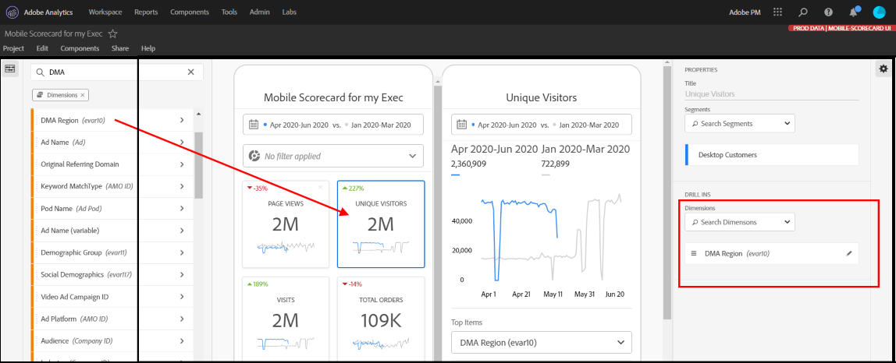

# Curatorhandleiding voor analytische dashboards

De volgende informatie instrueert curatoren van de gegevens van Adobe Analytics over hoe te om dashboards voor uitvoerende gebruikers te vormen en te presenteren. Een video waarin deze informatie wordt getoond, kunt u bekijken in de video Scorecard Builder van het dashboard Analytics:

>[!VIDEO](https://video.tv.adobe.com/v/34544)

## Inleiding

De dashboards van Analytics verstrekken om het even welk tijd, overal inzichten die op uw gegevens van Customer Journey Analytics worden gebaseerd. Met de app kunnen gebruikers mobiele toegang krijgen tot intuïtieve scorecards die u maakt en deelt vanuit de gebruikersinterface van het Customer Journey Analytics-bureaublad. Scorecards zijn een inzameling van zeer belangrijke metriek en andere componenten die in een tegellay-out worden voorgesteld die u voor meer gedetailleerde onderverdelingen en trended rapporten kunt tikken. U kunt Scorecards op maat maken op basis van de gegevens die voor u het belangrijkst zijn. Analytische dashboards worden ondersteund op zowel iOS- als Android-besturingssystemen.

## Meer informatie over deze handleiding

Deze gids is bedoeld om curatoren van Customer Journey Analytics gegevens te helpen Scorecards voor hun uitvoerende gebruikers op dashboards vormen. Curatoren kunnen organisatiebeheerders of personen in andere functies zijn die verantwoordelijk zijn voor het instellen van toepassingsscoreborden, waarmee uitvoerende gebruikers een brede weergave van belangrijke beknopte gegevens snel en eenvoudig op hun eigen mobiele apparaten kunnen bekijken. Hoewel uitvoerende gebruikers de eindgebruiker voor de dashboards van Analytics zijn, zal deze gids gegevenscuratoren helpen om app voor die gebruikers effectief op te zetten.

## Verklarende woordenlijst

In de volgende tabel worden de voorwaarden beschreven voor het begrijpen van het publiek, de functies en de werking van de Customer Journey Analytics-dashboards.

| Term | Definitie |
| --- | --- |
| Consumenten | Executive-gebruiker die belangrijke metriek en inzichten van CJA op een mobiel apparaat bekijkt |
| Curator | De gegevens schrijven mensen voor die binnen CJA inzichten vinden en verspreiden en de Scorecards vormen die door de consument moeten worden bekeken |
| Curation | Het maken of bewerken van een mobiel scorebord met relevante meetgegevens, afmetingen en andere componenten voor de consument |
| Scorecard | Een dashboardweergave met een of meer tegels |
| Tegel | Een rendering voor metrische gegevens in een scorebordweergave |
| Uitsplitsing | Een secundaire weergave die toegankelijk is door te tikken op een tegel in het scorebord. Deze mening breidt metrisch uit die op de tegel wordt getoond en naar keuze rapporten over extra verdelingsafmetingen. |
| Datumbereik | Het primaire datumbereik voor dashboardrapportage |
| Vergelijkingsdatumbereik | Het datumbereik dat wordt vergeleken met het primaire datumbereik |

## Een scorebord maken voor uitvoerende gebruikers

In een scorebord worden de belangrijkste gegevensvisualisaties voor uitvoerende gebruikers naast elkaar weergegeven, zoals hieronder wordt getoond:

Als curator van dit Scorecard, kunt u de Scorecard Bouwer gebruiken om te vormen welke tegels op Scorecard voor uw consument verschijnen. U configureert ook hoe de gedetailleerde weergaven, of de indelingen, kunnen worden aangepast wanneer op de tegels wordt getikt. De interface van de Bouwer Scorecard wordt hieronder getoond:

Als u het scorebord wilt maken, moet u het volgende doen:

1. Open de sjabloon [!UICONTROL Blank Mobile Scorecard].
2. Configureer het scorebord met gegevens en sla het op.

### Toegang krijgen tot de sjabloon [!UICONTROL Blank Mobile Scorecard]

U kunt tot het [!UICONTROL Blank Mobile Scorecard] malplaatje op één van de volgende manieren toegang hebben:

**Een nieuw project maken**

1. Open CJA en klik **[!UICONTROL Workspace]** tabel.
2. Klik **[!UICONTROL Create New Project]** en selecteer **[!UICONTROL Blank Mobile Scorecard]** projectmalplaatje.
3. Klik op **[!UICONTROL Create]**.

**Een project toevoegen**

Klik in het scherm **[!UICONTROL Projects]** onder de tab **[!UICONTROL Components]** op **[!UICONTROL Add]** en selecteer **[!UICONTROL Mobile Scorecard]**.

**Gereedschappen  [!DNL Analytics] gebruiken**

Klik in [!DNL Analytics] op het menu **[!UICONTROL Tools]** en selecteer **[!UICONTROL Analytics dashboards (Mobile App)]**. Klik op de knop **[!UICONTROL Create new scorecard]** in het volgende scherm.

### Het scorebord configureren met gegevens en opslaan

Het scorebordsjabloon implementeren:

1. Geef onder **[!UICONTROL Properties]** (in de rechterrail) een **[!UICONTROL Project report suite]** op waaruit u gegevens wilt gebruiken.

   

1. Als u een nieuwe tegel aan uw scorebord wilt toevoegen, sleept u een metrische waarde uit het linkerdeelvenster en zet u deze neer in de zone **[!UICONTROL Drag and Drop Metrics Here]**. U kunt ook een metrische waarde tussen twee tegels invoegen met behulp van een vergelijkbare workflow.

   

   *Van elke tegel, kunt u tot een gedetailleerde mening toegang hebben die extra informatie over metrisch, zoals hoogste punten voor een lijst van verwante afmetingen toont.*

1. Als u een gerelateerde afmeting aan een metrische waarde wilt toevoegen, sleept u een afmeting uit het linkerdeelvenster en zet u deze op een tegel neer. U kunt bijvoorbeeld de juiste afmetingen (zoals **[!DNL DMA Region]** in dit voorbeeld) toevoegen aan de **[!UICONTROL Unique Visitors]**-meting door deze naar de tegel te slepen en neer te zetten; De afmetingen die u toevoegt, worden weergegeven onder de sectie voor de verdeling van de tegelspecifieke **[!UICONTROL Properties]**. U kunt meerdere afmetingen aan elke tegel toevoegen.

   

   U kunt ook een dimensie aan alle tegels toevoegen door deze op het Scorecard-canvas te neerzetten.

   Wanneer u op een tegel in de Scorecard Builder klikt, toont het rechtse spoor de eigenschappen en de kenmerken verbonden aan die tegel. In deze rail, kunt u nieuwe **[!UICONTROL Title]** voor de tegel verstrekken en anders de tegel vormen door componenten te specificeren in plaats van hen te slepen en te laten vallen van de linkerspoorstaaf.

   Als u op tegels klikt, wordt in een dynamische pop-up ook weergegeven hoe de uitsplitsingsweergave wordt weergegeven voor de uitvoerende gebruiker in de app. Als er geen afmeting op de tegel is toegepast, is de afbraakdimensie **hour** of **days**, afhankelijk van het standaarddatumbereik.

   

   Elke dimensie die aan de tegel wordt toegevoegd, wordt weergegeven in een vervolgkeuzelijst in de gedetailleerde weergave van de app. De uitvoerende gebruiker kan dan uit de opties kiezen die in de drop-down lijst worden vermeld.

1. Als u segmenten op afzonderlijke tegels wilt toepassen, sleept u een segment uit het linkerdeelvenster en zet u het segment direct boven op de tegel neer. Als u het segment op alle tegels in Scorecard wilt toepassen, laat vallen de tegel bovenop scorecard. U kunt ook segmenten toepassen door segmenten te selecteren in het filtermenu onder de datumbereiken. U [configureert en past filters voor uw Scorecards](https://experienceleague.adobe.com/docs/analytics-learn/tutorials/analysis-workspace/using-panels/using-drop-down-filters.html) op dezelfde manier toe als in Adobe Analytics Workspace.

   

1. Op dezelfde manier om een component te verwijderen die op het volledige Scorecard wordt toegepast, klik overal op Scorecard buiten de tegels en verwijder het door **x** te klikken die verschijnt wanneer u over de component, zoals hieronder voor het **[!DNL Mobile Customers]** segment beweegt:

   

1. Onder Scorecard **[!UICONTROL Properties]**, kunt u naar keuze het volgende ook specificeren:

   * A **[!UICONTROL Default date range]**. De hier opgegeven bereiken zijn dezelfde als die welke worden toegepast op de eerste toegang van de gebruiker tot het scorebord in zijn app.

   * A **[!UICONTROL Comparison date range]**

   * Elke **[!UICONTROL Segments]** die op het hele scorebord moet worden toegepast

1. Als u het scorebord een naam wilt geven, klikt u op de naamruimte linksboven in het scherm en typt u de nieuwe naam.

   

## Scorecard delen

U kunt als volgt het scorebord delen met een Executive-gebruiker:

1. Klik op het menu **[!UICONTROL Share]** en selecteer **[!UICONTROL Share scorecard]**.

2. Vul in het **[!UICONTROL Share mobile scorecard]**-formulier de velden met:

   * De naam van het scorebord opgeven
   * Beschrijving van het scorebord
   * Relatieve tags toevoegen
   * De ontvangers voor het scorebord opgeven

3. Klik op **[!UICONTROL Share]**.

Nadat u een scorebord hebt gedeeld, kunnen uw ontvangers tot het op hun dashboards van Analytics toegang hebben. Als u daarna veranderingen in het Scorecard in de Scorecard Bouwer aanbrengt, zullen zij automatisch in het gedeelde Scorecard worden bijgewerkt. De uitvoerende gebruikers zullen dan de veranderingen zien nadat het Scorecard op hun app verfrist.

Als u het Scorecard door nieuwe componenten bij te voegen bijwerkt, kunt u de scorecard opnieuw willen delen (en **[!UICONTROL Share embedded components]** optie) controleren om ervoor te zorgen dat uw uitvoerende gebruikers toegang tot deze veranderingen hebben.

## Uitvoerende gebruikers instellen met de app

In sommige gevallen hebben uitvoerende gebruikers wellicht extra hulp nodig om de app te openen en te gebruiken. Deze sectie verstrekt informatie om u te helpen die hulp verlenen.

### Help uitvoerende gebruikers toegang te krijgen

Om uitvoerende gebruikers te helpen tot uw Scorecards op app toegang hebben, zorg ervoor dat:

* De minimale vereisten voor mobiele besturingssystemen op hun apparaten zijn iOS versie 10 of hoger, of Android versie 4.4 (KitKat) of hoger
* Ze hebben een geldige aanmelding bij Adobe Analytics
* U hebt op de juiste wijze mobiele scoreborden voor hen gemaakt en deze scoreborden met hen gedeeld
* Ze hebben toegang tot Analysis Workspace en de rapportensuite waarop het scorebord is gebaseerd
* Zij hebben toegang tot de Componenten die het Scorecard omvat. U kunt een optie selecteren wanneer u uw scoreborden deelt naar **[!UICONTROL Share embedded components]**.

### Help uitvoerende gebruikers met de app

Zo helpt u uitvoerende gebruikers:

1. Help ze de app te downloaden en installeren. Hiervoor voert u de volgende stappen uit om de toegang uit te breiden tot uw gebruikers, afhankelijk van het feit of ze een iOS- of Android-apparaat gebruiken.

   **Voor uitvoerende gebruikers op iOS:**

   * Klik op de volgende koppeling (deze is ook beschikbaar in Analytics onder **[!UICONTROL Tools]** > **[!UICONTROL Analytics dashboards (Mobile App)]**) en volg de aanwijzingen om de app te downloaden, installeren en openen:

      [iOS-koppeling](https://apple.co/2zXq0aN)
   **Voor uitvoerende gebruikers op Android:**

   * Klik op de volgende koppeling (deze is ook beschikbaar in Analytics onder **[!UICONTROL Tools]** > **[!UICONTROL Analytics dashboards (Mobile App)]**) en volg de aanwijzingen om de app te downloaden, installeren en openen:

      [Android-koppeling](https://bit.ly/2LM38Oo)
   Zodra gedownload en geïnstalleerd, kunnen de uitvoerende gebruikers zich in app aanmelden gebruikend hun bestaande geloofsbrieven van Adobe Analytics; wij ondersteunen zowel Adobe- als Enterprise/Federated-id&#39;s.

   

2. Help hen tot uw Scorecard toegang te hebben. Nadat gebruikers zich bij de toepassing hebben aangemeld, wordt het **[!UICONTROL Choose a company]**-scherm weergegeven. Dit scherm maakt een lijst van de login bedrijven waartot de uitvoerende gebruiker behoort. Om hen te helpen bij de Scorecard:

   * Tik op de naam van het aanmeldingsbedrijf of de Experience Cloud Org die van toepassing is op het scorebord dat u hebt gedeeld. De Scorecard lijst toont dan alle Scorecards die met het uitvoerend onder dat login bedrijf zijn gedeeld.
   * Help ze deze lijst te sorteren op **[!UICONTROL Most recently modified]**, indien van toepassing.
   * Tik op de naam van het scorebord om het weer te geven.

   

   Als de uitvoerende gebruiker zich aanmeldt en een bericht ziet waarin wordt gemeld dat er niets is gedeeld:

   * De uitvoerende gebruiker heeft mogelijk de verkeerde instantie Analytics geselecteerd

   * Het scorebord is mogelijk niet gedeeld met de uitvoerende gebruiker

      

   * Verifieer dat de uitvoerende gebruiker zich in de juiste instantie van Analytics kan aanmelden en dat Scorecard is gedeeld.

3. Leg aan de uitvoerende gebruiker uit hoe de tegels in de Scorecards verschijnen u deelt (het eerste hieronder Scorecard wordt geplaatst op donkere wijze); zie **[!UICONTROL Preferences]** hieronder als u denkt uw uitvoerende gebruiker deze het bekijken opt-on) verkiest:

   

   

   Aanvullende informatie over tegels:

   * De korreligheid van de sparklines is afhankelijk van de lengte van het datumbereik:
      * Op een dag is er een uurtrend
      * Meer dan een dag en minder dan een jaar laten een dagelijkse trend zien
      * Een jaar of langer toont een wekelijkse trend
   * De formule van de percentagewaardeverandering is metrisch totaal (huidige datumwaaier) - metrisch totaal (de waaier van de vergelijkingsdatum) / metrisch totaal (de waaier van de vergelijkingsdatum).
   * U kunt het scherm omlaag trekken om het Scorecard te vernieuwen.

4. Tik op een tegel om te tonen hoe een gedetailleerde uitsplitsing voor de tegel werkt.

   

   * Tik op een willekeurig punt op een dunne lijn om de gegevens weer te geven die aan dat punt op de lijn zijn gekoppeld.

   * Er wordt een tabel opgenomen waarin de aan de tegel toegevoegde afmetingen worden weergegeven. Tik op de pijl omlaag om de afmetingen te selecteren. Als er geen dimensie aan de tegel is toegevoegd, worden de diagramgegevens weergegeven in de tabel.

5. U wijzigt de datumbereiken voor uw scorebord als volgt:

   

   * U kunt de datumbereiken ook op dezelfde manier wijzigen in de bovenstaande uitsplitsingsweergave.

   * Afhankelijk van het interval dat u tikt (**Day**, **Week**, **Month**, of **Year**), zult u twee opties voor datumwaaier-of de huidige tijdspanwijdte of onmiddellijk voorafgaand aan het zien. Tik op een van deze twee opties om het eerste bereik te selecteren. Tik in de lijst **[!UICONTROL COMPARE TO]** op een van de voorgestelde opties om de gegevens van deze tijdsperiode te vergelijken met de eerste datumreeks die u hebt geselecteerd. Tik **[!UICONTROL Done]** rechtsboven op het scherm. De **[!UICONTROL Date Ranges]**- gebieden en de Scorecard tegels worden bijgewerkt met de nieuwe vergelijkingsgegevens van de nieuwe waaiers u selecteerde.

6. Feedback geven op deze app:

   1. Tik op het instellingenpictogram rechtsboven in het toepassingsscherm.
   2. Tik op **[!UICONTROL Settings]** op het scherm **[!UICONTROL Feedback]**.
   3. Tik om de opties voor het geven van feedback weer te geven.

      

7. Tik op de bovenstaande optie **[!UICONTROL Preferences]** om de voorkeuren te wijzigen. Bij de voorkeuren kunt u de biometrische aanmelding inschakelen of de app voor de donkere modus instellen, zoals hieronder wordt weergegeven:

   

**Een fout** rapporteren:

Tik op de optie en kies een subcategorie van de bug. Geef in het formulier voor het melden van een fout uw e-mailadres op in het bovenste veld en uw beschrijving van de fout op in het veld eronder. Er wordt automatisch een schermopname van uw accountgegevens aan het bericht gekoppeld, maar u kunt dit desgewenst verwijderen door op de **X** in de bijlage te tikken. U hebt ook opties voor het opnemen van een scherm, het toevoegen van meer schermafbeeldingen of het bijvoegen van bestanden. Tik op het pictogram van het papieren vlak rechtsboven in het formulier om het rapport te verzenden.

**Een verbetering** voorstellen:

Tik op de optie en kies een subcategorie voor de suggestie. Geef in het aanvraagformulier uw e-mailadres op in het bovenste veld en uw beschrijving van de fout op in het veld eronder. Er wordt automatisch een schermopname van uw accountgegevens aan het bericht gekoppeld, maar u kunt dit desgewenst verwijderen door op de **X** in de bijlage te tikken. U hebt ook opties voor het opnemen van een scherm, het toevoegen van meer schermafbeeldingen of het bijvoegen van bestanden. Tik op het pictogram van het papieren vlak rechtsboven in het formulier om de suggestie te verzenden.

**Een vraag** stellen:

Tik op de optie en geef uw e-mailadres op in het bovenste veld en uw vraag in het veld eronder. Een het schermschot wordt automatisch in bijlage aan het bericht, maar u kunt dit schrappen als u wilt door **X** in het gehechtheidsbeeld te tikken. U hebt ook opties voor het opnemen van een scherm, het toevoegen van meer schermafbeeldingen of het bijvoegen van bestanden. Tik op het pictogram van het papieren vlak rechtsboven in het formulier om de vraag te verzenden.

>[!IMPORTANT]
>
>Vanaf oktober 2020 heeft Adobe geleidelijk een aantal verbeteringen doorgevoerd om de prestaties van de app &quot;Adobe Analytics dashboards&quot; te optimaliseren. Deze verbeteringen richten zich op caching historische gegevens van Analytics die worden gebruikt om scorecards met data (exclusief de huidige dag) te bevolken. Deze gegevens worden maximaal 24 uur in cache geplaatst in een beveiligde Microsoft Azure Public Cloud Storage-account. Neem contact op met uw CSM als u zich wilt afmelden voor deze functies voor prestatieverbetering.
