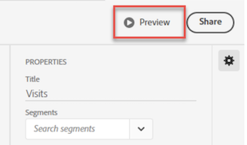

# scorecards beheren

Dit onderwerp instrueert curators van Customer Journey Analytics gegevens over hoe te om scorecard elementen te bekijken en te beheren.

## Eigenschappen van tegels weergeven en configureren {#tiles}

Wanneer u op een tegel klikt in de scorecard builder, geeft de rechterrails de eigenschappen en kenmerken weer die aan die tegel en de bijbehorende dia met details zijn gekoppeld. In deze trein kunt u een nieuwe **Titel** voor de tegel en vormt u de tegel ook door filters toe te passen. Segmenten zijn filters in Customer Journey Analytics.

## Gedetailleerde dia&#39;s weergeven {#view-detail-slides}

Wanneer u op tegels klikt, wordt in een dynamisch pop-upvenster weergegeven hoe de detaildia er uitziet voor de uitvoerende gebruiker in de app. U kunt dimensies toevoegen om uw gegevens naar behoefte op te splitsen. Als er geen dimensie is toegepast, wordt de afbraakdimensie **uur** of **dagen**, afhankelijk van het standaarddatumbereik.

De onderbrekingen verfijnen uw analyse door metriek door afmetingspunten zoals het volgende te verdelen:

* Unieke metrische bezoekers, uitgesplitst naar advertentieplatform (AMO-id)
* Bezoeken uitgesplitst naar productcategorie (detailhandel)
* Totaal ontvangsten uitgesplitst naar productnaam

Elke dimensie die aan de tegel wordt toegevoegd, wordt weergegeven in een vervolgkeuzelijst in de gedetailleerde weergave van de app. De uitvoerende gebruiker kan dan uit de opties kiezen die in de drop-down lijst worden vermeld.

## Detaildia&#39;s aanpassen {#customize-detail-slide}

Met aangepaste dia&#39;s kunt u zich nog meer richten op de informatie die u deelt met uw publiek.

>[!VIDEO](https://video.tv.adobe.com/v/3410002)

U kunt de lay-out voor elke detaildia wijzigen en tekst toevoegen om beter te verklaren wat de eindgebruiker in de gegevens kan zien. U kunt het grafiektype ook veranderen gebruikend het drop-down menu.

### De dialay-out wijzigen

Wijzig de dialay-out om de nadruk op de belangrijkste informatie te leggen. U kunt bijvoorbeeld de lay-out zodanig wijzigen dat alleen een grafiek of alleen een tabel wordt weergegeven. Als u de dialay-out wilt wijzigen, selecteert u een van de vooraf ontworpen indelingen.

U kunt de dialay-out ook veranderen door visualiseringscomponenten van de linkerspoorstaaf op het canvas te slepen en te laten vallen. Elke detaildia kan slechts twee visualisaties tegelijk bevatten.

### Beschrijvende tekst toevoegen aan een dia

U kunt tekst toevoegen om betekenisvolle informatie te verstrekken over wat in de grafieken of nuances over de gegevens bevat.

Als u tekst wilt toevoegen aan een detaildia, selecteert u een lay-out waarin de `T` of sleep de tekstvisualisatiecomponent van de linkerspoorstaaf over. De teksteditor wordt automatisch geopend wanneer u een nieuwe tekstvisualisatie toevoegt of een dialay-out met tekst kiest. De teksteditor bevat alle standaardopties voor de opmaak van de tekst. U kunt tekststijlen toepassen, zoals alinea&#39;s, koppen en subkoppen, en vette en cursieve lettertypen toepassen. U kunt tekst uitvullen, lijsten met opsommingstekens en nummers toevoegen en koppelingen toevoegen. Wanneer u klaar bent met bewerken, selecteert u de knop Minimaliseren in de rechterbovenhoek van de teksteditor om deze te sluiten. Als u de tekst die u al hebt toegevoegd wilt bewerken, selecteert u het potloodpictogram om de teksteditor opnieuw te openen.

## Componenten verwijderen {#remove}

Op dezelfde manier om een component te verwijderen die op volledige scorecard wordt toegepast, klik overal op de scorecard buiten de tegels en verwijder het door het te klikken **x** dat wordt weergegeven wanneer u de muisaanwijzer op de component plaatst, zoals hieronder voor de component **Eerste bezoeken**:

## Gegevensartikelen maken {#create-data-story}

Een gegevensverhaal is een inzameling van ondersteunende gegevenspunten, bedrijfscontext, en verwante metriek die rond een centraal thema of metrisch wordt gebouwd.

Bijvoorbeeld, als u zich op Webverkeer concentreert, kan uw belangrijkste metrisch bezoeken zijn, maar u kunt ook in nieuwe personen, unieke personen geinteresseerd zijn, en u kunt gegevens willen zien uitgesplitst door Web-pagina of door welk apparatentype het verkeer uit komt. Met gegevensartikelen in mobiele scorecardprojecten kunt u uw belangrijkste metriek vooraan en centraal plaatsen en het hele verhaal achter de metriek vertellen met meerdere detaildia&#39;s.

Bekijk de video voor meer informatie over het maken van gegevensverhalen in mobiele scorecardprojecten in Analysis Workspace.

>[!VIDEO](https://video.tv.adobe.com/v/3416392/?quality=12&learn=on)

**Een gegevensartikel maken** {#data-story-create}

Bouw uw gegevensverhaal door veelvoudige detaildia&#39;s aan een tegel toe te voegen.

1. Begin met een mobiel scorecardproject.
1. Selecteer een tegel waarvan u een artikel wilt maken.
   
   {width=".50%"}
1. Voeg dia&#39;s toe om uw gegevensverhaal te bouwen. De eerste dia wordt standaard gegenereerd.
Als u nieuwe dia&#39;s wilt toevoegen, houdt u de muisaanwijzer boven een dia of klikt u op een dia en selecteert u een van de beschikbare opties:
   * Tik op + om een nieuwe dia te maken.
   * Tik op het dubbele pictogram om de bestaande dia te dupliceren.
1. Als u een lege dia maakt, sleept u componenten vanuit de linkerrail en zet u de component neer. U kunt ook een lay-out kiezen om de dia automatisch te vullen met de gegevens uit de tegel.
   
Tik op het prullenbakpictogram om een dia te verwijderen.

### Een gegevensartikel aanpassen {#customize-data-story}

Met gegevensartikelen kunt u alles aanpassen, zodat u informatie kunt delen die u wilt delen en alles kunt uitsluiten wat u niet nodig hebt. U kunt tegels en afzonderlijke dia&#39;s aanpassen om filters toe te voegen, onderverdelingen weer te geven, de lay-out te wijzigen en de visualisatie te wijzigen.

**Tegels aanpassen**

1. Tik op een tegel. De geselecteerde tegel krijgt een blauwe omtrek en de eigenschappen Naast elkaar staan in het rechterdeelvenster.
1. Wijzig de titel, het diagramtype en andere tegelopties.
1. Sleep een component naar de tegel.
   
Wanneer u een component, zoals een visualisatie, naar een tegel sleept, wordt de component toegepast op alle dia&#39;s met gegevensartikelen.
1. Als u een wijziging alleen op de titel wilt toepassen, houdt u Shift ingedrukt om de wijziging toe te passen.
   

>[!NOTE]
>Dia&#39;s nemen componenten van de tegel over, maar tegels nemen geen componenten van dia&#39;s over.

**Afzonderlijke dia&#39;s aanpassen**

U kunt de visualisatie voor afzonderlijke dia&#39;s in een gegevensartikel wijzigen. U kunt bijvoorbeeld een horizontale balk wijzigen in een donutgrafiek voor een bepaalde dia. U kunt ook de lay-out wijzigen. Zie [Detaildia&#39;s aanpassen](#customize-detail-slide).

### Een gegevensartikel voorvertonen {#preview-data-story}

Nadat u een gegevensartikel hebt gemaakt, gebruikt u de opdracht **Voorvertoning** om een gegevensartikel weer te geven en te interageren alsof u een app-gebruiker bent. Voor informatie over het voorvertonen van uw gegevensartikel raadpleegt u [Een voorvertoning van een scorecard weergeven](#preview)

### Navigeren tussen tegels en dia&#39;s {#navigate-tiles-slides}

Op de navigatiebalk worden pictogrammen weergegeven die aangeven wat er op elke dia staat. Met de navigatiebalk kunt u gemakkelijk naar een bepaalde dia navigeren als u veel dia&#39;s hebt.

Tik op de navigatiebalk om te schakelen tussen de tegel en de dia&#39;s.

{width="45%"}

U kunt ook heen en weer navigeren met de pijlen op het toetsenbord of door een component te selecteren en deze links of rechts van het scherm te houden om te schuiven.

## Voorvertoning scorecards {#preview}

U kunt voorvertonen hoe de scorecard eruitziet en functioneert zodra deze is gepubliceerd in de Adobe Analytics-app voor dashboards.

1. Klikken **[!UICONTROL Preview]** in de rechterbovenhoek van het scherm

   

1. Als u wilt zien hoe de scorecard er op verschillende apparaten uitziet, selecteert u een apparaat in het menu [!UICONTROL Device preview] vervolgkeuzelijst.

   

1. Als u met de voorvertoning wilt werken, kunt u:

   * Klik met de linkermuisknop om tikken op het telefoonscherm te simuleren.

   * Gebruik de schuiffunctie van uw computer om met uw vinger naar het telefoonscherm te schuiven.

   * Klik en houd vast om het drukken en het houden van uw vinger op het telefoonscherm te simuleren. Dit is handig voor interactie met de visualisaties in de gedetailleerde weergave.

## Scorecards delen {#share}

De scorecard delen met een Executive-gebruiker:

1. Klik op de knop **[!UICONTROL Share]** en selecteert u **[!UICONTROL Share scorecard]**.

1. In de **[!UICONTROL Share Mobile Scorecard]** de velden invullen met:

   * De naam van de scorecard opgeven
   * Een beschrijving van de scorecard
   * Relatieve tags toevoegen
   * Het specificeren van de ontvangers voor scorecard

1. Klik op **[!UICONTROL Share]**.

Nadat u een scorecard hebt gedeeld, kunnen uw ontvangers tot het op hun dashboards van Analytics toegang hebben. Als u verdere veranderingen in scorecard in de scorecard bouwer aanbrengt, zullen zij automatisch in gedeelde scorecard worden bijgewerkt. De uitvoerende gebruikers zullen dan de veranderingen zien nadat het scorecard op hun app verfrist.

Als u scorecard door nieuwe componenten bij te voegen bijwerkt, kunt u de scorecard opnieuw willen delen (en controle **[!UICONTROL Share embedded components]** ) om ervoor te zorgen dat uw uitvoerende gebruikers toegang tot deze veranderingen hebben.

### Schrappingskaarten delen met behulp van een deelbare koppeling

Met een deelbare koppeling kunt u eenvoudig een scorecard delen in een e-mail-, document- of tekstbericht-app. Met de link shareable kunnen ontvangers de scorecard openen op hun bureaublad of in de mobiele app dashboards. Dankzij de deelbare diepe koppeling is het nog eenvoudiger om projecten te delen en de betrokkenheid bij uw belanghebbenden te versterken.

Een scorecard delen met behulp van een shareable-koppeling

1. Klik op de knop **[!UICONTROL Share]** en selecteert u **[!UICONTROL Share scorecard]**.

   

1. Kopieer de koppeling en plak deze in een e-mail-, document- of IM-app.

   Wanneer een ontvanger een bureaubladtoepassing of browser gebruikt om de koppeling te openen, wordt het mobiele scorecard-project geopend in Workspace.

   Wanneer een ontvanger de koppeling op een mobiel apparaat opent, wordt de scorecard rechtstreeks geopend in de Adobe Analytics-dashboardapp.

   Als een ontvanger de mobiele app niet heeft gedownload, wordt hij of zij verwezen naar de app-aanbieding in de App Store of Google Play Store waar hij of zij deze kan downloaden.

## Verwijderen [!UICONTROL Unspecified] dimensie-item {#remove-dims}

Als u wilt verwijderen [!UICONTROL Unspecified] dimensiepunten van uw gegevens, doe het volgende:

1. Selecteer de juiste tegel.
1. In de rechterspoorweg, onder **[!UICONTROL Drill ins]**, selecteert u de pijl-rechts naast het dimensie-item waarvan **[!UICONTROL Unspecified]** items die u wilt verwijderen.

   

1. Klik op het pictogram naast **[!UICONTROL Unspecified]** om niet-opgegeven gegevens uit de rapportage te verwijderen. (U kunt ook elk ander dimensie-item verwijderen.)

## Intelligente bijschriften weergeven in scorecards {#captions}

Intelligente bijschriften kunnen niet-analisten helpen hun gegevens beter te begrijpen zonder de hulp van analisten. Intelligente bijschriften maken gebruik van geavanceerde Machine Learning en Generative AI om waardevolle natuurlijke taalinzichten voor visualisaties te bieden.

In deze bijschriften worden de belangrijkste statistische inzichten in de gegevens opgepakt en in de natuurlijke taal uitgedrukt, zodat de niet-analist zijn gegevens kan lezen.

Het intelligente bijschrift is beschikbaar voor alle visualisaties in de mobiele app, inclusief Lijn, Donut, Staafdiagram en Samenvattingsnummer.

Om intelligente titels in een mobiele scorecard te bekijken:

1. Klik in een scorecard in een tegel. Klik in dit scorecard bijvoorbeeld in de lijngrafiek onderaan.

   

1. Tik op het blauwe pictogram rechtsboven om de bijschriften te genereren. De bijschriften worden onder de lijngrafiek weergegeven.

   

1. Veeg naar rechts om alle intelligente bijschriften weer te geven.

   Intelligente bijschriften kunnen verwijzen naar spikes, anomalieën, trends, terugval, correlaties en andere verschijnselen.

1. Tik op de zwarte vlag in een bijschrift om een probleem, zoals schadelijke of illegale inhoud, te melden.

   

1. Klik op de X om de **[!UICONTROL Report results]** in.
