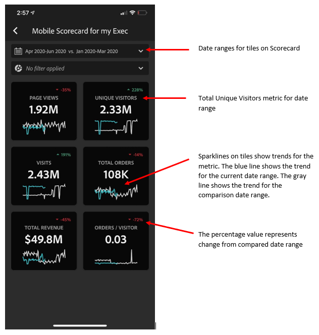

# Uitvoerende gebruikers instellen voor het gebruik van dashboards

In sommige gevallen hebben uitvoerende gebruikers wellicht extra hulp nodig om de app te openen en te gebruiken. Deze sectie verstrekt informatie om curators te helpen die hulp verstrekken.

## Zorg ervoor dat gebruikers van apps toegang hebben tot Adobe Analytics

1. Nieuwe gebruikers instellen in het dialoogvenster [Experience Cloud Admin Console](https://experienceleague.adobe.com/docs/analytics/admin/admin-console/permissions/product-profile.html).

1. Om scorecards te kunnen delen, moet u app gebruikers toestemmingen verlenen om tot scorecard componenten zoals Analysis Workspace, de gegevensmeningen toegang te hebben die scorecards, evenals filters, metriek en dimensies gebaseerd zijn.

## Systeemvereisten voor gebruikers van de app

Om ervoor te zorgen dat de uitvoerende gebruikers toegang tot uw scorecards op app hebben, zorg ervoor dat:

* De minimale mobiele besturingssysteemvereisten op hun apparaten zijn iOS versie 10 of hoger, of Android versie 4.4 (KitKat) of hoger
* Ze hebben een geldige aanmelding bij Customer Journey Analytics.
* U hebt op de juiste wijze mobiele scorecards voor hen gemaakt en deze scorecards met hen gedeeld.
* Zij hebben toegang tot de Componenten die scorecard omvat. Let op: u kunt een optie selecteren wanneer u uw scorecards deelt naar **[!UICONTROL Share embedded components]**.

## Help-managers om app te downloaden en installeren

>[!NOTE]
>
>Hoewel de mobiele app in de App Store de naam Adobe Analytics-dashboard heeft, kan de app ook worden gebruikt met mobiele Customer Journey Analytics-scorecards.

**Voor uitvoerende gebruikers op iOS:**

Klik op de volgende koppeling (deze is ook beschikbaar in Customer Journey Analytics onder **[!UICONTROL Tools]** > **[!UICONTROL Analytics dashboards (mobile opp)]**) en volgt u de aanwijzingen om de app te downloaden, installeren en openen:

`[iOS link](https://apple.co/2zXq0aN)`

**Voor uitvoerende gebruikers op Android:**

Klik op de volgende koppeling (deze is ook beschikbaar in Customer Journey Analytics onder **[!UICONTROL Tools]** > **[!UICONTROL Analytics dashboards (mobile app)]**) en volgt u de aanwijzingen om de app te downloaden, installeren en openen:

`[Android link](https://bit.ly/2LM38Oo)`

Zodra gedownload en geïnstalleerd, kunnen de uitvoerende gebruikers zich in app ondertekenen gebruikend hun bestaande geloofsbrieven van de Customer Journey Analytics; wij ondersteunen zowel Adobe- als Enterprise/Federated-id&#39;s.

## Help managers toegang te krijgen tot uw scorecard

1. Gebruikers met een zelfstudie moeten zich aanmelden bij de app.

   De **[!UICONTROL Choose a company]** wordt weergegeven. Dit scherm maakt een lijst van de login bedrijven waartot de uitvoerende gebruiker behoort.

1. Heb hen tikken de naam van het login bedrijf of Experience Cloud Org die op scorecard van toepassing is u deelde.

   De Scorecard lijst toont dan alle scorecards die met het uitvoerend onder dat login bedrijf zijn gedeeld.

1. Deze lijst laten sorteren op **[!UICONTROL Most recently modified]**, indien van toepassing.

1. Laat ze op de naam van het scorebord tikken om het weer te geven.

   

### Verklaar scorecard UI

Verklaar aan de uitvoerende gebruiker hoe de tegels in de scorecards verschijnen u deelt.

Aanvullende informatie over tegels:

* De korreligheid van de sparklines is afhankelijk van de lengte van het datumbereik:
* Op een dag is er een uurtrend
   * Meer dan een dag en minder dan een jaar laten een dagelijkse trend zien
   * Een jaar of langer toont een wekelijkse trend
   * De formule van de percentagewaardeverandering is metrisch totaal (huidige datumwaaier) - metrisch totaal (de waaier van de vergelijkingsdatum) / metrisch totaal (de waaier van de vergelijkingsdatum).
   * U kunt het scherm omlaag trekken om het Scorecard te vernieuwen.

1. Tik op een tegel om te tonen hoe een gedetailleerde uitsplitsing voor de tegel werkt.

   

   * Tik op een willekeurig punt op een dunne lijn om de gegevens weer te geven die aan dat punt op de lijn zijn gekoppeld.

   * Er wordt een tabel opgenomen waarin de aan de tegel toegevoegde afmetingen worden weergegeven. Tik op de pijl omlaag om de afmetingen te selecteren. Als er geen dimensie aan de tegel is toegevoegd, worden de diagramgegevens weergegeven in de tabel.

1. Als u datumbereiken voor uw scorebord wilt wijzigen, tikt u op de Datumkop en selecteert u de combinatie van het primaire bereik en het vergelijkingsdatumbereik dat u wilt weergeven.

   

## Toepassingsvoorkeuren wijzigen

Tik op de knop **[!UICONTROL Preferences]** hierboven weergegeven. Bij de voorkeuren kunt u de biometrische aanmelding inschakelen of de app voor de donkere modus instellen, zoals hieronder wordt weergegeven:

## Problemen oplossen

Als de uitvoerende gebruiker zich aanmeldt en een bericht ziet waarin wordt gemeld dat er niets is gedeeld:

* De uitvoerende gebruiker kan de verkeerde zandbak van de Customer Journey Analytics hebben geselecteerd, of
* De scorecard is mogelijk niet gedeeld met de uitvoerende gebruiker.

Controleer of de uitvoerende gebruiker zich kan aanmelden bij de juiste Customer Journey Analytics-sandbox en of de scorecard is gedeeld.
