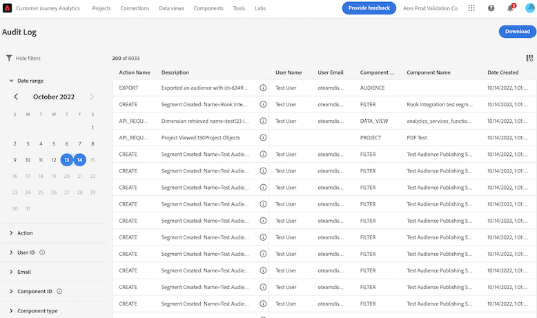

# Controlelogboeken

Om de transparantie en zichtbaarheid van de in het systeem uitgevoerde activiteiten te vergroten, kunt u in Adobe Customer Journey Analytics gebruikersactiviteiten voor verschillende services en mogelijkheden controleren in de vorm van &quot;auditlogs&quot;. Deze logboeken vormen een auditspoor dat kan helpen met het oplossen van problemenkwesties, en uw zaken kunnen effectief voldoen aan het beleid en de regelgevende vereisten van het collectieve gegevensbeheer, zoals de Wet van de Portabiliteit en van de Verantwoording van de Ziekteverzekering (HIPAA).

In wezen vertelt een controlelogboek **wie** uitgevoerd **wat** actie, en **wanneer**. Elke actie die in een logboek wordt geregistreerd bevat meta-gegevens die op het actietype, datum en tijd, e-mailidentiteitskaart van de gebruiker die de actie, en extra attributen relevant voor het actietype uitvoerde.

Dit onderwerp behandelt controlelogboeken in Customer Journey Analytics, met inbegrip van hoe te om hen in UI te bekijken en te beheren.

## Toegang tot auditlogboeken

Wanneer de eigenschap voor uw organisatie wordt toegelaten, worden de controlelogboeken automatisch verzameld aangezien de activiteit voorkomt. U te hoeven niet om logboekinzameling manueel toe te laten.

Als u controlelogboeken wilt weergeven en exporteren, moet u beschikken over **[!UICONTROL Audit Logs Access]** toegangsbeheermachtigingen in Adobe Console. Raadpleeg voor meer informatie over het beheren van individuele machtigingen voor functies van Customers Journey Analytics de [toegangsbeheerdocumentatie](../admin/cja-access-control.md).

## Bekijk het controlelogboek in UI

Navigeer in Customer Journey Analytics naar **[!UICONTROL Tools]** > **[!UICONTROL Audit Logs]**.

Het controlelogboek voor vandaag en gisteren wordt getoond door gebrek.

U kunt selecteren welke kolommen zichtbaar zijn door naar de kolomkiezer rechtsboven te gaan.

## Informatie over afzonderlijke logbestandvermeldingen weergeven

Dubbelklik op de knop Info (i) naast een beschrijving.

De volgende items worden weergegeven:

* **[!UICONTROL Action Name]**: De ondernomen actie. Mogelijke waarden zijn:
   * API_REQUEST
   * GOEDKEUREN
   * MAKEN
   * DELETE
   * BEWERKEN
   * EMBARGO
   * EXPORT
   * ORG_CHANGE
   * VERNIEUWEN
   * DELEN
   * OVERDRACHT
   * ONGOEDKEUREN
   * ONDELEN
* **[!UICONTROL Date Created]**: De datum en het tijdstip waarop de actie is uitgevoerd.
* **[!UICONTROL Description]**: Een samenvatting van de handeling.
* **[!UICONTROL User Name]**: De gebruiker die de handeling heeft uitgevoerd.
* **[!UICONTROL Email]**: Het e-mailadres van de gebruiker die de handeling heeft uitgevoerd.
* **[!UICONTROL Component Name]**: De component waarop de gebruiker actie heeft uitgevoerd.
* **[!UICONTROL Component Type]**: Het type component. Mogelijke waarden zijn:
   * ANNOTATIE
   * AUDICE
   * CALCULATED_METRIC
   * VERBINDING
   * DATA_GROUP
   * DATA_VIEW
   * DATASET_STITCHING
   * DATE_RANGE
   * FEATURE_ACCESS
   * FILTER
   * IMS_ORG
   * MOBIEL
   * PROJECT
   * RAPPORT
   * SCHEDULED_PROJECT
   * GEBRUIKER
   * USER_GROUP
* **[!UICONTROL Component ID]**: De id van de component waarop de gebruiker actie heeft uitgevoerd.
* **[!UICONTROL IMS Org ID]**: De IMS-id van de organisatie, in de vorm van `ABC123@AdobeOrg`.
* **[!UICONTROL Log ID]**: Een unieke id die deze logbestandvermelding identificeert.
* **[!UICONTROL User ID]**: De unieke id die de gebruiker identificeert die de handeling heeft uitgevoerd.
* **[!UICONTROL User Type]**: Het gebruikte verificatietype. Geldige waarden zijn:
   * IMS
   * OKTA

### Controllerlogboeken filteren

Selecteer het trechter-pictogram () om een lijst met filterbesturingselementen weer te geven om de resultaten te beperken. Alleen de laatste 1.000 records worden weergegeven, ongeacht de verschillende geselecteerde filters.

De volgende filters zijn beschikbaar voor controlegebeurtenissen in UI:

| Filter | Beschrijving |
| --- | --- |
| [!UICONTROL Date Range] | U kunt filteren op een ander datumbereik door een andere datum te selecteren of een datumbereik te selecteren door de cursor over meerdere datums te slepen. Standaard is de datum van vandaag en gisteren geselecteerd. |
| [!UICONTROL Action] | Filter op een willekeurige actienaam die hierboven wordt vermeld. |
| [!UICONTROL User ID] | Filter op een specifieke gebruiker op basis van de gebruikersnaam. U kunt de gebruikersnaam vinden door de knop info (i) naast een gebruikersnaam te selecteren. |
| [!UICONTROL Email] | Filter op het e-mailadres van een specifieke gebruiker. U kunt het e-mailbericht vinden door op de knop Info (i) naast een gebruikersnaam te klikken. |
| [!UICONTROL Component ID] | Filter op een specifieke component-id. De gebruikers-id kunt u vinden door de knop info (i) voor een gewenste component te selecteren. |
| [!UICONTROL Component Type] | Filter op elk componenttype dat hierboven wordt vermeld. |

{style="table-layout:auto"}

## Gebeurtenistypen die zijn vastgelegd in auditlogboeken

In de volgende tabel wordt aangegeven op welke handelingen componenttypen worden vastgelegd in auditlogboeken:

| Componenttype | Handelingen |
| --- | --- |
| [!UICONTROL Annotation] | <ul><li>Maken</li><li>Verwijderen</li><li>Bewerken</li></ul> |
| [!UICONTROL Audience] | <ul><li>API_Request</li><li>Maken</li><li>Verwijderen</li><li>Bewerken</li><li>Exporteren</li><li>Vernieuwen</li></ul> |
| [!UICONTROL Calculated Metric] | <ul><li>API_Request</li><li>Maken</li><li>Verwijderen</li><li>Bewerken</li></ul> |
| [!UICONTROL Connection] | <ul><li>API_Request</li><li>Maken</li><li>Verwijderen</li><li>Bewerken</li></ul> |
| [!UICONTROL Data View] | <ul><li>API_Request</li><li>Maken</li><li>Verwijderen</li><li>Bewerken</li></ul> |
| [!UICONTROL Date Range] | <ul><li>API_Request</li><li>Maken</li><li>Verwijderen</li><li>Bewerken</li></ul> |
| [!UICONTROL Filter] | <ul><li>API_Request</li><li>Maken</li><li>Verwijderen</li><li>Bewerken</li></ul> |
| [!UICONTROL IMS Org] | <ul><li>API_Request</li><li>Maken</li><li>Verwijderen</li><li>Bewerken</li></ul> |
| [!UICONTROL Project] | <ul><li>API_Request</li><li>Maken</li><li>Verwijderen</li><li>Bewerken</li></ul> |
| [!UICONTROL Report] | <ul><li>API_Request</li></ul> |
| [!UICONTROL Scheduled Project] | <ul><li>API_Request</li><li>Maken</li><li>Verwijderen</li><li>Bewerken</li></ul> |
| [!UICONTROL User] | <ul><li>API_Request</li><li>Maken</li><li>Verwijderen</li><li>Bewerken</li></ul> |
| [!UICONTROL User Group] | <ul><li>API_Request</li><li>Maken</li><li>Verwijderen</li><li>Bewerken</li></ul> |

{style="table-layout:auto"}

## Auditlogboeken downloaden

U kunt controlelogboeken in CSV of formaten downloaden JSON. Alle toegepaste filters of geselecteerde kolommen worden weergegeven in de gedownloade bestanden.

1. Klikken **[!UICONTROL Download]** rechtsboven in het scherm.
1. Geef de indeling op.
1. Klikken **[!UICONTROL Download]** opnieuw.

## De controlelogboeken beheren in de API

Alle acties die u in UI kunt uitvoeren kunnen ook worden gedaan gebruikend API vraag. Zie de [Referentiedocument voor Customer Journey Analytics-API](https://developer.adobe.com/cja-apis/docs/api/#tag/Audit-Logs) voor meer informatie .
