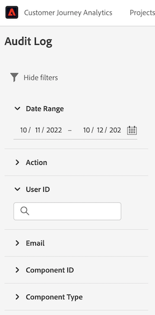

# Controlelogboeken

Om de transparantie en de zichtbaarheid van de in het systeem uitgevoerde activiteiten te vergroten, kunt u met Customer Journey Analytics (CJA) gebruikersactiviteiten voor diverse services en mogelijkheden controleren in de vorm van &quot;auditlogs&quot;. Deze logboeken vormen een auditspoor dat kan helpen met het oplossen van problemenkwesties, en uw zaken kunnen effectief voldoen aan het beleid en de regelgevende vereisten van het collectieve gegevensbeheer, zoals de Wet van de Portabiliteit en van de Verantwoording van de Ziekteverzekering (HIPAA).

In wezen vertelt een controlelogboek **wie** uitgevoerd **wat** actie, en **wanneer**. Elke actie die in een logboek wordt geregistreerd bevat meta-gegevens die op het actietype, datum en tijd, e-mailidentiteitskaart van de gebruiker die de actie, en extra attributen relevant voor het actietype uitvoerde.

Dit onderwerp behandelt controlelogboeken in CJA, met inbegrip van hoe te om hen in UI te bekijken en te beheren.

## Toegang tot auditlogboeken

Wanneer de eigenschap voor uw organisatie wordt toegelaten, worden de controlelogboeken automatisch verzameld aangezien de activiteit voorkomt. U te hoeven niet om logboekinzameling manueel toe te laten.

Als u controlelogboeken wilt weergeven en exporteren, moet u beschikken over de **[!UICONTROL Audit Logs Access]** toegangsbeheermachtigingen in Adobe Console. Raadpleeg voor meer informatie over het beheren van individuele machtigingen voor CJA-functies de [toegangsbeheerdocumentatie](/help/getting-started/cja-access-control.md).

## De controlelogboeken van de mening in UI

Navigeer in CJA naar **[!UICONTROL Tools]** > **[!UICONTROL Audit Logs]**.

Het controlelogboek voor vandaag en gisteren wordt getoond door gebrek.

U kunt selecteren welke kolommen zichtbaar zijn door naar de kolomkiezer rechtsboven te gaan.

## Informatie over afzonderlijke logbestandvermeldingen weergeven

Dubbelklik op de knop Info (i) naast een beschrijving.

De volgende items worden weergegeven:

| Item | Beschrijving |
| --- | --- |
| Naam van handeling | Hier volgt een lijst met mogelijke acties: <ul><li>API_Request</li><li>Goedkeuren</li><li>Maken</li><li>Bewerken</li><li>Exporteren</li><li>Aanmelden_mislukt</li><li>Aanmelden_geslaagd</li><li>Afmelden</li><li>Org_change</li><li>Vernieuwen</li><li>Delen</li><li>Overdracht</li><li>Niet goedkeuren</li><li>Delen opheffen</li></ul> |
| Beschrijving | Een overzicht van de handeling, het componenttype (met id) en andere waarden. |
| Gebruikersnaam | De gebruiker die de actie uitvoert. |
| Componenttype | Mogelijke componenttypen zijn: <ul><li>Aantekening</li><li>Audience</li><li>Berekend metrisch</li><li>Verbinding</li><li>Data_Group</li><li>Gegevens_weergave</li><li>Feature_Access</li><li>Filter</li><li>IMS_Org</li><li>Mobile</li><li>Project</li><li>Rapport</li><li>Scheduled_Project</li><li>Gebruiker</li><li>Gebruiker_Groep</li></ul> |
| IMS Org ID | Een unieke id die aan uw instantie wordt gegeven wanneer u zich voor het eerst aanmeldt bij Adobe Experience Cloud. De notatie moet als volgt zijn: xxx@AdobeOrg. |
| Gebruikers-id | Een unieke id die de gebruiker identificeert die deze handeling heeft uitgevoerd. |
| Gemaakt op | Wanneer deze actie is uitgevoerd. |
| E-mail | Het e-mailadres van de gebruiker die de handeling uitvoert. |
| Component-id | Een unieke id die de component identificeert waarop wordt gehandeld. |
| Logboek-id | Een unieke id die deze logbestandvermelding identificeert. |
| Gebruikerstype | Mogelijke typen zijn: IMS, OKTA |

### Controllerlogboeken filteren

Selecteer het trechter-pictogram () om een lijst met filterbesturingselementen weer te geven om de resultaten te beperken. Alleen de laatste 1.000 records worden weergegeven, ongeacht de verschillende geselecteerde filters.

De volgende filters zijn beschikbaar voor controlegebeurtenissen in UI:

| Filter | Beschrijving |
| --- | --- |
| [!UICONTROL Date Range] | U kunt filteren op een ander datumbereik door een andere datum te selecteren of een datumbereik te selecteren door de cursor over meerdere datums te slepen. Standaard is de datum van vandaag en gisteren geselecteerd. |
| [!UICONTROL Action] | Filter op een of meer van de volgende handelingen: <ul><li>API_Request</li><li>Goedkeuren</li><li>Maken</li><li>Bewerken</li><li>Exporteren</li><li>Aanmelden_mislukt</li><li>Aanmelden_geslaagd</li><li>Afmelden</li><li>Org_change</li><li>Vernieuwen</li><li>Delen</li><li>Overdracht</li><li>Niet goedkeuren</li><li>Delen opheffen</li></ul> |
| [!UICONTROL User ID] | Filter op een specifieke gebruiker op basis van de gebruikersnaam. U kunt de gebruikersnaam vinden door de knop info (i) naast een gebruikersnaam te selecteren. |
| [!UICONTROL Email] | Filter op het e-mailadres van een specifieke gebruiker. U kunt het e-mailbericht vinden door op de knop Info (i) naast een gebruikersnaam te klikken. |
| [!UICONTROL Component ID] | Filter op een specifieke component-id. De gebruikers-id kunt u vinden door de knop info (i) voor een gewenste component te selecteren. |
| [!UICONTROL Component Type] | Filter op een of meer componenttypen: <ul><li>Aantekening</li><li>Publiek</li><li>Berekend metrisch</li><li>Verbinding</li><li>Data_Group</li><li>Gegevens_weergave</li><li>Feature_Access</li><li>Filter</li><li>IMS_Org</li><li>Mobiel</li><li>Project</li><li>Rapport</li><li>Scheduled_Project</li><li>Gebruiker</li><li>Gebruiker_Groep</li></ul> |

{style=&quot;table-layout:auto&quot;}

## Gebeurtenistypen die zijn vastgelegd in auditlogboeken

In de volgende tabel wordt aangegeven op welke handelingen componenttypen worden vastgelegd in auditlogboeken:

| Componenttype | Handelingen |
| --- | --- |
| [!UICONTROL Annotation] | <ul><li>Maken</li><li>Verwijderen</li><li>Bewerken</li></ul> |
| [!UICONTROL Audience] | <ul><li>API_Request</li><li>Maken</li><li>Verwijderen</li><li>Bewerken</li><li>Exporteren</li><li>Vernieuwen</li></ul> |
| [!UICONTROL Calculated Metric] | <ul><li>API_Request</li><li>Maken</li><li>Verwijderen</li><li>Bewerken</li></ul> |
| [!UICONTROL Connection] | <ul><li>API_Request</li><li>Maken</li><li>Verwijderen</li><li>Bewerken</li></ul> |
| [!UICONTROL Data View] | <ul><li>API_Request</li><li>Maken</li><li>Verwijderen</li><li>Bewerken</li></ul> |
| [!UICONTROL Date Range] | <ul><li>API_Request</li><li>Maken</li><li>Verwijderen</li><li>Bewerken</li></ul> |
| [!UICONTROL Filter] | <ul><li>API_Request</li><li>Maken</li><li>Verwijderen</li><li>Bewerken</li></ul> |
| [!UICONTROL IMS Org] | <ul><li>API_Request</li><li>Maken</li><li>Verwijderen</li><li>Bewerken</li></ul> |
| [!UICONTROL Project] | <ul><li>API_Request</li><li>Maken</li><li>Verwijderen</li><li>Bewerken</li></ul> |
| [!UICONTROL Report] | <ul><li>API_Request</li></ul> |
| [!UICONTROL Scheduled Project] | <ul><li>API_Request</li><li>Maken</li><li>Verwijderen</li><li>Bewerken</li></ul> |
| [!UICONTROL User] | <ul><li>API_Request</li><li>Maken</li><li>Verwijderen</li><li>Bewerken</li></ul> |
| [!UICONTROL User Group] | <ul><li>API_Request</li><li>Maken</li><li>Verwijderen</li><li>Bewerken</li></ul> |

{style=&quot;table-layout:auto&quot;}

## Auditlogboeken downloaden

U kunt controlelogboeken in CSV of formaten downloaden JSON. Alle toegepaste filters of geselecteerde kolommen worden weergegeven in de gedownloade bestanden.

1. Klikken **[!UICONTROL Download]** aan de rechterbovenhoek van het scherm.
1. Geef de indeling op.
1. Klikken **[!UICONTROL Download]** opnieuw.

## De controlelogboeken beheren in de API

Alle acties die u in UI kunt uitvoeren kunnen ook worden gedaan gebruikend API vraag. Zie de [CJA API-referentiedocument](https://developer.adobe.com/cja-apis/docs/api/#tag/Audit-Logs) voor meer informatie .