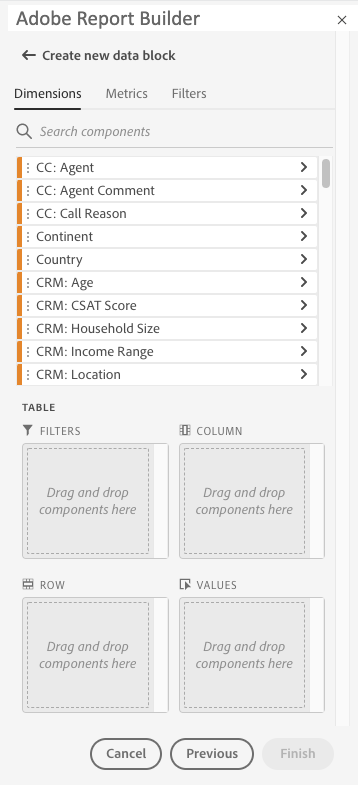

# Een gegevensblok maken

Een *gegevensblok* is de lijst van gegevens die door één enkel gegevensverzoek worden gecreeerd. Een werkboek van Report Builder kan veelvoudige gegevensblokken bevatten. Wanneer u een gegevensblok creeert, vorm eerst het gegevensblok en bouwt dan het gegevensblok.

## Het gegevensblok configureren

Vorm de aanvankelijke parameters van het gegevensblok voor de het blokplaats van Gegevens, de meningen van Gegevens, en een waaier van de Datum.

1. Klik **Gegevensblok maken**.

   

1. Stel de locatie **Gegevensblok** in.

   De optie voor gegevensbloklocatie definieert de werkbladlocatie waar de rapportbuilder de gegevens aan uw werkblad toevoegt.

   Als u de locatie van het gegevensblok wilt opgeven, selecteert u één cel in het werkblad of voert u een celadres in, zoals a3, \\\$a3, a\\$3 of sheet1!a2. De opgegeven cel wordt de linkerbovenhoek van het gegevensblok wanneer de gegevens worden opgehaald.

1. Kies de **Gegevens weergaven**.

   Met de optie Gegevens kunt u een gegevensweergave kiezen in een vervolgkeuzelijst of naar een gegevensweergave verwijzen vanuit een cellocatie.

1. Stel het **Datumbereik** in.

   Met de optie Datumbereik kunt u een datumbereik kiezen. Datumbereiken kunnen vast zijn of doorlopen. Zie &lt;&lt; koppeling naar datumbereik >> voor meer informatie over opties voor gegevensbereik.

1. Klik **Volgende**.

   

   Nadat u het gegevensblok vormt, kunt u afmetingen, metriek, en filters selecteren om uw gegevensblok te bouwen. De tabbladen Dimension, Metriek en Filters worden boven het deelvenster Tabelbouwer weergegeven.
<!--
    
  -->

## Het gegevensblok samenstellen

Om het gegevensblok te bouwen, selecteer rapportcomponenten, en pas dan de lay-out aan.

1. Voeg Dimension, Metriek, en Filters toe.

   Schuif de componentenlijsten of gebruik **search** gebied om van componenten de plaats te bepalen. Sleep componenten naar het deelvenster Tabel of dubbelklik op een componentnaam in de lijst om de component automatisch toe te voegen aan het deelvenster Tabel.

   Dubbelklik op een component om deze toe te voegen aan een standaardsectie van de tabel.

   - Dimension-componenten worden toegevoegd aan de sectie Rij of aan de sectie Kolom als u al een dimensie hebt in de kolommen.
   - De componenten van de datum worden toegevoegd aan de sectie van de Kolom.
   - Filtercomponenten worden toegevoegd aan de sectie Filters.

1. Rangschik de punten in de ruit van de Lijst om de lay-out van uw gegevensblok aan te passen.

   Sleep componenten in het deelvenster Tabel om de volgorde van componenten te wijzigen of klik met de rechtermuisknop op de naam van een component en selecteer een component in het optiemenu.

   Wanneer u componenten aan de lijst toevoegt, wordt een voorproef van het gegevensblok getoond bij de het blokplaats van Gegevens in het aantekenvel. De lay-out van de voorvertoning van gegevensblokken wordt automatisch bijgewerkt wanneer u items in de tabel toevoegt, verplaatst of verwijdert.

   

1. Klik **Voltooien**.

   Er wordt een verwerkingsbericht weergegeven terwijl de analysegegevens worden opgehaald.

   

   Report Builder wint de gegevens terug en toont het voltooide gegevensblok in het aantekenvel.

   
