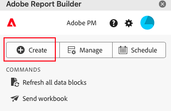
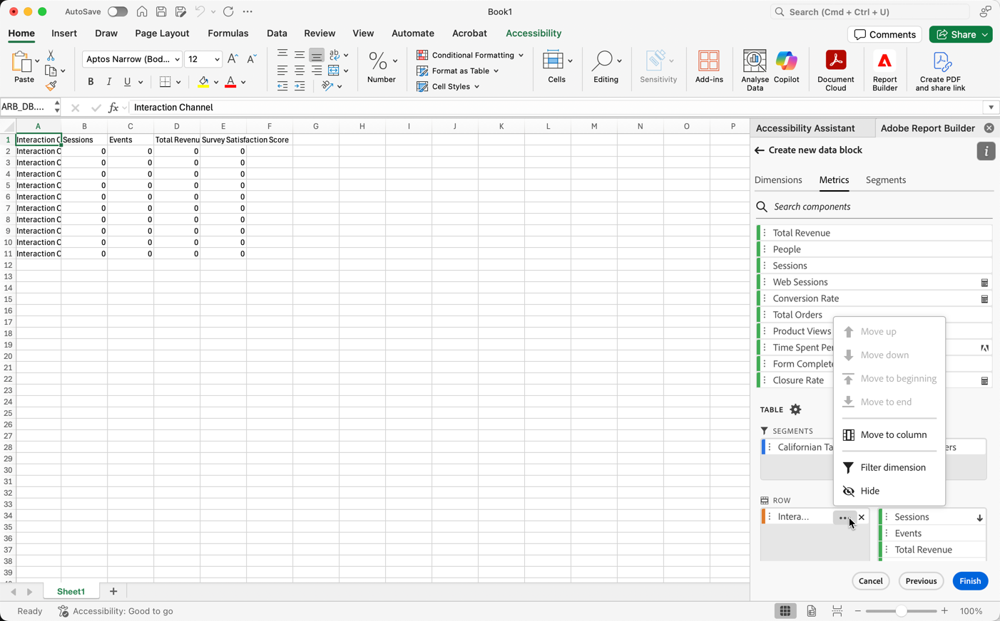

# Een gegevensblok maken

A *gegevensblok* Dit is de tabel met gegevens die worden gemaakt door één gegevensaanvraag. Een werkboek van de Report Builder kan veelvoudige gegevensblokken bevatten. Wanneer u een gegevensblok creeert, vorm eerst het gegevensblok en bouwt dan het gegevensblok.

## Het gegevensblok configureren

Vorm de aanvankelijke parameters van het gegevensblok voor de het blokplaats van Gegevens, de meningen van Gegevens, en een waaier van de Datum.

1. Klikken **Gegevensblok maken**.

   

1. Stel de **Locatie gegevensblok**.

   De optie voor gegevensbloklocatie definieert de werkbladlocatie waar de rapportbuilder de gegevens aan uw werkblad toevoegt.

   Als u de locatie van het gegevensblok wilt opgeven, selecteert u één cel in het werkblad of voert u een celadres in, zoals a3, \\\$a3, a\\$3 of sheet1!a2. De opgegeven cel wordt de linkerbovenhoek van het gegevensblok wanneer de gegevens worden opgehaald.

1. Kies de optie **Gegevensweergaven**.

   Met de optie Gegevens kunt u een gegevensweergave kiezen in een vervolgkeuzelijst of naar een gegevensweergave verwijzen vanuit een cellocatie.

1. Stel de **Datumbereik**.

   Met de optie Datumbereik kunt u een datumbereik kiezen. Datumbereiken kunnen vast zijn of doorlopen. Zie voor informatie over opties voor gegevensbereiken [Een datumbereik selecteren](select-date-range.md).

1. Klikken **Volgende**.

   

   Nadat u het gegevensblok vormt, kunt u afmetingen, metriek, en filters selecteren om uw gegevensblok te bouwen. De tabbladen Dimensionen, Metriek en Filters worden boven het deelvenster Tabelbouwer weergegeven.

## Het gegevensblok samenstellen

Om het gegevensblok te bouwen, selecteer rapportcomponenten, en pas dan de lay-out aan.

1. Voeg Dimensionen, Metriek, en Filters toe.

   Schuif de componentlijsten of gebruik de component **zoeken** veld voor het zoeken van componenten. Sleep componenten naar het deelvenster Tabel of dubbelklik op een componentnaam in de lijst om de component automatisch toe te voegen aan het deelvenster Tabel.

   Dubbelklik op een component om deze toe te voegen aan een standaardsectie van de tabel.

   - De componenten van het Dimension worden toegevoegd aan de sectie van de Rij of aan de sectie van de Kolom als u een afmeting reeds in de kolommen hebt.
   - Datumcomponenten worden toegevoegd aan de sectie Kolom.
   - Filtercomponenten worden toegevoegd aan de sectie Filters.

   **Begindatum als Dimension**

   Stel de begindatum in als een dimensie om de begindatum van uw gegevensblok duidelijk te identificeren. Dit is nuttig als u een regelmatig gepland rapport hebt dat een het rollen datumwaaier heeft of als u een onconventioneel datumwaaier hebt en u van de begindatum moet duidelijk zijn.

   {width="30%"}

1. Rangschik de punten in de ruit van de Lijst om de lay-out van uw gegevensblok aan te passen.

   Sleep componenten in het deelvenster Tabel om de volgorde van componenten te wijzigen of klik met de rechtermuisknop op de naam van een component en selecteer een component in het optiemenu.

   Wanneer u componenten aan de lijst toevoegt, wordt een voorproef van het gegevensblok getoond bij de het blokplaats van Gegevens in het aantekenvel. De lay-out van de voorvertoning van gegevensblokken wordt automatisch bijgewerkt wanneer u items in de tabel toevoegt, verplaatst of verwijdert.

   

   **Rij- en kolomkoppen weergeven of verbergen**

1. Klik op de knop **Tabel** instellingenpictogram.

   {width="35%"}

1. Schakel de optie Rij- en kolomkoppen weergeven in of uit. De kopteksten worden standaard weergegeven.

   **Dimensie-labels en metrische koppen verbergen of weergeven**

1. Klik op het ellipspictogram op de afmetingen of de kolomkoppen om de instellingen weer te geven.

   {width="35%"}

1. Klik op Verbergen of Tonen om de dimensielabels of kolomkoppen in en uit te schakelen. Alle labels worden standaard weergegeven.

1. Klikken **Voltooien**.

   Er wordt een verwerkingsbericht weergegeven terwijl de analysegegevens worden opgehaald.

   

   De Report Builder wint de gegevens terug en toont het voltooide gegevensblok in het aantekenvel.

   
