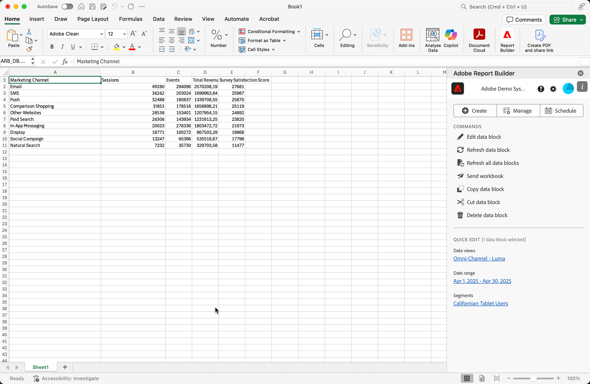

# Een gegevensblok maken

A *gegevensblok* is de lijst van gegevens die door één enkel gegevensverzoek worden gecreeerd. Een werkboek van Report Builder kan veelvoudige gegevensblokken bevatten. Wanneer u een gegevensblok creeert, vorm eerst het gegevensblok en bouwt dan het gegevensblok.

## Het gegevensblok configureren

Vorm de aanvankelijke parameters van het gegevensblok voor de het blokplaats van Gegevens, de meningen van Gegevens, en een waaier van de Datum.

1. Selecteer  **[!UICONTROL Create]**.

   

1. Stel de **[!UICONTROL Data block location]** in.

   De optie voor gegevensbloklocatie definieert de werkbladlocatie waar de rapportbuilder de gegevens aan uw werkblad toevoegt.

   Als u de locatie van het gegevensblok wilt opgeven, selecteert u één cel in het werkblad of voert u een celadres in, zoals `a3` , `\\\$a3` , `a\\\$3` of `sheet1!a2` . De opgegeven cel wordt de linkerbovenhoek van het gegevensblok wanneer de gegevens worden opgehaald.

   Het gebruik  om een het blokplaats van Gegevens van de huidige geselecteerde cel in het blad te kiezen.

1. Kies de **[!UICONTROL Data views]** .

   Met de optie Gegevens kunt u een gegevensweergave kiezen in een vervolgkeuzelijst of naar een gegevensweergave verwijzen vanuit een cellocatie.

   Selecteer  om een gegevensmening van een cel tot stand te brengen.

1. Stel de **[!UICONTROL Date range]** in.

   Met de optie Datumbereik kunt u een datumbereik kiezen. Datumbereiken kunnen vast zijn of doorlopen. Voor informatie over de opties van de datumwaaier, zie [ Selecteer een Waaier van de Datum ](select-date-range.md).

   Selecteer **[!UICONTROL Calendar]** om een gegevenswaaier te plukken gebruikend  of een datumwaaier manueel in te gaan. U kunt desgewenst een voorinstelling kiezen in het keuzemenu Voorinstellingen zoeken.

   Selecteer **[!UICONTROL From Cell]** om een begin- en eindgegevens te definiëren op basis van een cel in het huidige blad.

1. Selecteer **daarna**.

   

   Nadat u het gegevensblok vormt, kunt u afmetingen, metriek, en segmenten selecteren om uw gegevensblok te bouwen. De afmetingen, de Metriek, en de lusjes van Segmenten worden getoond boven de de bouwer van de Lijst ruit.

## Het gegevensblok samenstellen

Om het gegevensblok te bouwen, selecteer rapportcomponenten, en pas dan de lay-out aan.

1. Voeg afmetingen, Metriek, en Segmenten toe.

   Schuif de componentenlijsten of gebruik het **onderzoek** gebied om van componenten de plaats te bepalen. Sleep componenten naar het deelvenster Tabel of dubbelklik op een componentnaam in de lijst om de component automatisch toe te voegen aan het deelvenster Tabel.

   Dubbelklik op een component om de component toe te voegen aan een standaardsectie van de tabel.

   - Dimension-componenten worden toegevoegd aan de sectie Rij of aan de sectie Kolom als u al een dimensie hebt in de kolommen.
   - Datumcomponenten worden toegevoegd aan de sectie Kolom.
   - De componenten van het segment worden toegevoegd aan de sectie van Segmenten.

### Begindatum als Dimension

Stel de begindatum in als een dimensie om de begindatum van uw gegevensblok duidelijk te identificeren. Dit is nuttig als u een regelmatig gepland rapport hebt dat een het rollen datumwaaier heeft of als u een onconventioneel datumwaaier hebt en u van de begindatum moet duidelijk zijn.

1. Rangschik de punten in de ruit van de Lijst om de lay-out van uw gegevensblok aan te passen.

   Sleep componenten in het deelvenster Tabel om de volgorde van componenten te wijzigen of klik met de rechtermuisknop op de naam van een component en selecteer een component in het optiemenu.

   Wanneer u componenten aan de lijst toevoegt, wordt een voorproef van het gegevensblok getoond bij de het blokplaats van Gegevens in het aantekenvel. De lay-out van de voorvertoning van gegevensblokken wordt automatisch bijgewerkt wanneer u items in de tabel toevoegt, verplaatst of verwijdert.

   

### Rij- en kolomkoppen weergeven of verbergen

1. Selecteer het **[!UICONTROL Table]**  montagespictogram.

   

1. Schakel de optie Rij- en kolomkoppen weergeven in of uit. De kopteksten worden standaard weergegeven.

### Dimensie-labels en metrische koppen verbergen of weergeven

Selecteer het pictogram van de ellips op of de afmetingen of de kolomkopballen om de montages te tonen.

1. Selecteer  **[!UICONTROL Hide]** of  **[!UICONTROL Show]** om de afmetingsetiketten of kolomkopballen van een knevel te voorzien. Alle labels worden standaard weergegeven.

1. Selecteer **[!UICONTROL Finish]** .

Er wordt een verwerkingsbericht weergegeven terwijl de analysegegevens worden opgehaald.

Report Builder haalt de gegevens op en geeft het voltooide gegevensblok weer in het werkblad.

