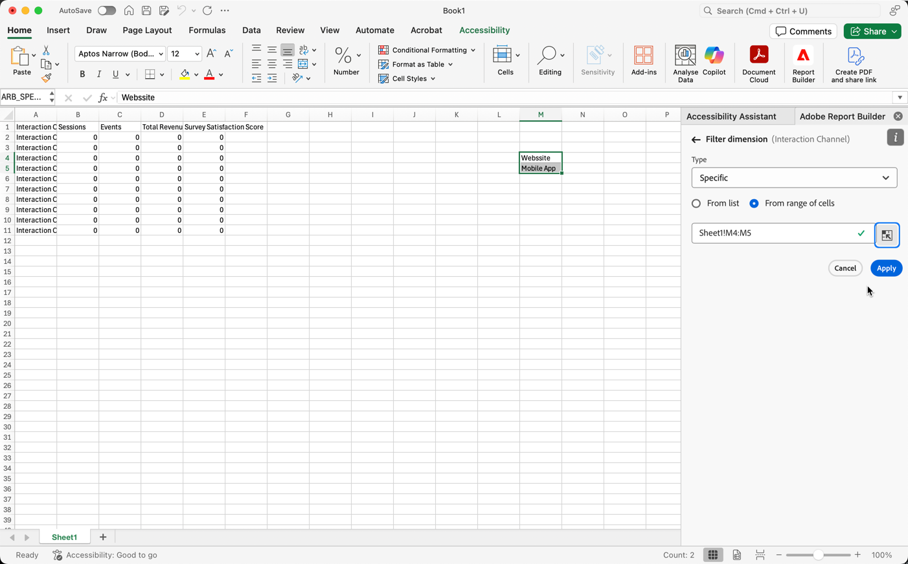
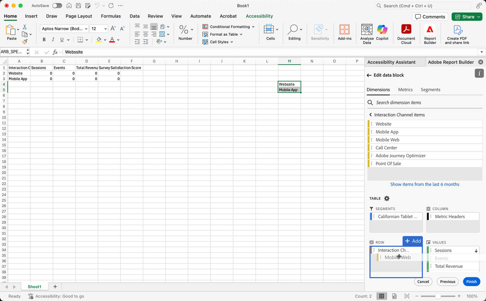

# Filterafmetingen

Door gebrek, keert elk afmetingspunt in de lijst top 10 punten voor die afmeting terug.

Om de afmetingspunten te veranderen die voor elke afmeting worden teruggekeerd:

1. Selecteer een cel in het gegevensblok.

1. Selecteer  **[!UICONTROL Edit data block]** in het **[!UICONTROL Commands]** paneel.

1. Selecteer **[!UICONTROL Next]** om de tab **[!UICONTROL Dimensions]** weer te geven.

1. Selecteer  naast een componentennaam in de lijst.

   {zoomable="yes"}

1. Selecteer **[!UICONTROL Filter dimension]** in het pop-upmenu om het deelvenster **[!UICONTROL Filter dimension]** weer te geven.

1. Selecteer **populairste** of **Specifiek** als **[!UICONTROL Type]**.

   {zoomable="yes"}

1. Selecteer aangewezen die opties op het [ worden gebaseerd gekozen filtertype ](#filter-type).

1. Selecteer **[!UICONTROL Apply]** om het filter toe te voegen.

1. Report Builder geeft een melding weer ter bevestiging van het toegevoegde filter.

Houd de muisaanwijzer boven een dimensie om toegepaste filters weer te geven. De afmetingen met toegepaste filters tonen a  filterpictogram naast de afmetingsnaam.

## Het filter en de sorteervolgorde wijzigen

A  of  verschijnt naast metrisch die wordt gebruikt om het gegevensblok te filtreren en te sorteren. De richting van de pijl geeft aan of de metrische waarde in oplopende of aflopende volgorde wordt gesorteerd.

De sorteervolgorde wijzigen:

- Selecteer  of  naast metrisch om de soortorde van een knevel te voorzien.

U wijzigt als volgt de metrische waarde die wordt gebruikt voor het filteren en sorteren van het gegevensblok:

1. Houd de muisaanwijzer boven de gewenste metrische component in de Tabelbouwer om aanvullende opties weer te geven.

2. Selecteer  voor aangewezen metrisch.

   {zoomable="yes"}

## Filtertype

Er zijn twee manieren om afmetingspunten te filtreren: [ populairste ](#most-popular) en [ Specifieke ](#specific-filtering)

### **[!UICONTROL Most popular]**

Met de optie **[!UICONTROL Most popular]** kunt u dimensie-items dynamisch filteren op basis van metrische waarden. De populairste winst de hoogste gerangschikte afmetingspunten die op metrische waarden worden gebaseerd. Standaard worden de eerste 10 dimensies weergegeven, gesorteerd op de eerste metrische waarde die aan het gegevensblok is toegevoegd.

{zoomable="yes"}

#### Opties voor Pagina en Rijen

Gebruik de velden **[!UICONTROL Page]** en **[!UICONTROL Rows]** om gegevens te verdelen in opeenvolgende groepen of pagina&#39;s. Met deze functie kunt u gerangschikte rijwaarden buiten de bovenste waarden in uw rapport opnemen. En is vooral nuttig om gegevens voorbij de 50.000 rijgrens te trekken.

De standaardwaarde voor Pagina is `1` en voor Rijen is `10` . Deze standaardinstellingen impliceren dat elke pagina 10 rijen gegevens heeft. Pagina 1 retourneert de bovenste 10 items, pagina 2 retourneert de volgende 10 items, enzovoort.

In de onderstaande tabel staan voorbeelden van pagina- en rijwaarden en de resulterende uitvoer.

| Pagina | Rij | Uitvoer |
|------|--------|----------------------|
| 1 | 10 | Meest 10 items |
| 2 | 10 | Punten 11-20 |
| 1 | 100 | Top 100 van items |
| 2 | 100 | Items 101-200 |
| 2 | 50.000 | Items 50.001-100.000 |

In de onderstaande tabel worden de minimum- en maximumwaarden voor pagina en rijen weergegeven.

|       | Minimumwaarden | Maximumwaarden |
|-------|---------------:|---------------:|
| Beginpagina | 1 | 50 miljoen |
| Aantal rijen | 1 | 50.000 |

#### Inclusief &quot;Geen waarde&quot;

In Customer Journey Analytics, verzamelen sommige dimensies a *geen waarde* ingang. Met de instelling **[!UICONTROL Include "No value"]** kunt u deze waarden uitsluiten van rapporten. U kunt bijvoorbeeld een classificatie maken, zoals de classificatie Productnaam op basis van de sleutel Product SKU. Als een specifiek productSKU niet opstelling met zijn specifieke classificatie van de Naam van het Product is geweest, wordt zijn waarde van de Naam van het Product geplaatst aan *Geen waarde*.

**[!UICONTROL Include "No value"]** is standaard geselecteerd. Schakel deze optie uit als u items zonder waarde wilt uitsluiten.

#### Filteren op criteria

U kunt dimensie-items filteren op basis van de vraag of aan alle criteria is voldaan of aan alle criteria is voldaan.

Filtercriteria instellen:

1. Selecteer een operator in de vervolgkeuzelijst met operatoren. Standaard is **[!UICONTROL Contains the phrase]** geselecteerd

   {zoomable="yes"}

1. Voer een zoekterm in.

1. Selecteer  **[!UICONTROL Add row]** om de selectie te bevestigen en een ander criterium punt toe te voegen.

1. Selecteer  om een criterium punt te verwijderen.

U kunt maximaal 10 criteria toevoegen.

### **[!UICONTROL &#x200B; Specific]**

Met de optie **[!UICONTROL Specific]** kunt u een vaste lijst met dimensie-items maken voor elke dimensie. Gebruik het filtertype **[!UICONTROL Specific]** om de exacte afmetingen op te geven die u in het filter wilt opnemen. U kunt items in een lijst of uit een reeks cellen selecteren.

{zoomable="yes"}

#### Van lijst

1. Selecteer de optie **[!UICONTROL From list]** om te zoeken naar dimensie-items en deze te selecteren.

   Wanneer u **van lijst** optie selecteert, wordt de **[!UICONTROL Dimension items]** lijst bevolkt met afmetingspunten die door aantal gebeurtenissen worden bevolen.

   {zoomable="yes"}

1. Ga een onderzoekstermijn in het  in **[!UICONTROL _voeg punt_]** toe om de lijst te zoeken.

1. Als u wilt zoeken naar een item dat niet in de laatste 90 dagen aan gegevens is opgenomen, selecteert u **[!UICONTROL Show items for the last 6 months]** om de zoekopdracht uit te breiden. Wanneer gegevens van de afgelopen 6 maanden zijn geladen, werkt Report Builder de koppeling naar **[!UICONTROL Show items for last 18 months]** bij.

1. Om een punt van de **[!UICONTROL Selected items]** lijst te schrappen, selecteer .

1. Om een punt in de **[!UICONTROL Selected items]** lijst te bewegen, sleep en laat vallen het punt of selecteer  om het contextmenu te tonen en van de verplaatsingsopties te selecteren.

1. Selecteer **[!UICONTROL Apply]** .

Report Builder werkt de lijst bij om het specifieke filter te tonen u toepaste.

#### Uit celbereik

Selecteer **van waaier van cellen** optie om een waaier van cel te kiezen die de lijst van dimensiepunten bevat om aan te passen.

{zoomable="yes"}

Houd rekening met de volgende beperkingen wanneer u een bereik cellen selecteert:

- Het bereik moet ten minste één cel bevatten.
- Het bereik kan niet meer dan 50.000 cellen bevatten.
- Het bereik moet in één ononderbroken rij of kolom staan.

Uw selectie kan lege cellen of cellen met waarden bevatten die niet met een specifiek afmetingspunt aanpassen.

### Snel een dimensie filteren

Een dimensie filteren waarvoor momenteel geen filter wordt toegepast:

1. Selecteer  voor een afmeting. Bijvoorbeeld **[!UICONTROL Interaction channel]** .

1. Selecteer een dimensie-items die u aan het filter wilt toevoegen. Alternatief, selecteer één of meerdere afmetingspunten en sleep en laat vallen de selectie op  **[!UICONTROL Row]** sectie.

   {zoomable="yes"}

