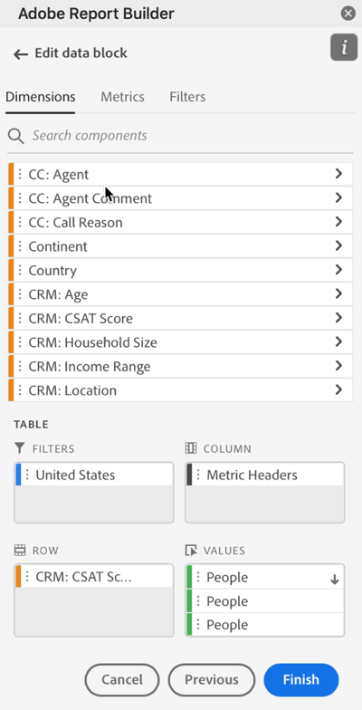

# Dimension filteren

Door gebrek, keert elk afmetingspunt in de lijst top 10 punten voor die afmeting terug.

Om de afmetingspunten te veranderen die voor elke afmeting worden teruggekeerd

1. Selecteer een gegevensblok en klik op Gegevensblok bewerken in het deelvenster OPDRACHTEN.

1. Klik op Volgende om het tabblad Dimension weer te geven.

1. Klik op de knop **...** naast de naam van een component in de tabel.

   

1. Selecteren **Filterdimensie** in het pop-upmenu om de **Filterdimensie** venster.

1. Selecteren **Meest populair** of **Specifiek**.

   

1. Selecteer de gewenste opties op basis van het gekozen filtertype.

1. Klikken **Toepassen** om het filter toe te voegen.

   Report Builder geeft een melding weer ter bevestiging van het toegevoegde filter.

Houd de muisaanwijzer boven een dimensie om toegepaste filters weer te geven. Dimension met toegepaste filters geven een filterpictogram rechts van de naam van de Dimension weer.

## Filtertype

U kunt dimensie-items op twee manieren filteren: Meest populair en specifiek.

## Meest populair

Met de populairste optie kunt u dimensie-items dynamisch filteren op basis van metrische waarden. Het populairste filtreren keert de hoogste gerangschikte afmetingspunten terug die op metrische waarden worden gebaseerd. Standaard worden de eerste 10 dimensies weergegeven, gesorteerd op de eerste metrische waarde die aan het gegevensblok is toegevoegd.

### Opties voor Pagina en Rijen

Gebruik de **Pagina** en **Rijen** velden om gegevens te verdelen in opeenvolgende groepen of pagina&#39;s. Dit staat u toe om gerangschikte rijwaarden buiten de hoogste waarden in uw rapport te trekken. Deze functie is vooral handig voor het ophalen van gegevens boven de limiet van 50.000 rijen.

#### Standaardwaarden voor pagina en rijen

- Pagina = 1
- Rijen = 10

Met de standaardinstellingen Pagina en Rijen geeft u aan dat elke pagina tien rijen gegevens bevat. Pagina 1 retourneert de bovenste 10 items, pagina 2 retourneert de volgende 10 items, enzovoort.

In de onderstaande tabel staan voorbeelden van pagina- en rijwaarden en de resulterende uitvoer.

| Pagina | Rij | Uitvoer |
|------|--------|----------------------|
| 1 | 10 | Meest 10 items |
| 2 | 10 | Punten 11-20 |
| 1 | 100 | Top 100 van items |
| 2 | 100 | Items 101-200 |
| 2 | 50,000 | Items 50.001-100.000 |

#### Minimum- en maximumwaarden

- Beginpagina: Min = 1, Max: 50 miljoen
- Aantal rijen: Min = 1, Max: 50 000

### Inclusief &quot;Geen waarde&quot;

In Customer Journey Analytics, verzamelen sommige dimensies een &quot;geen waarde&quot;ingang. Met dit filter kunt u deze waarden uitsluiten van rapporten. U kunt bijvoorbeeld een classificatie maken, zoals de classificatie Productnaam op basis van de sleutel Product SKU. Als een specifiek product-SKU niet is ingesteld met de specifieke productnaamclassificatie, wordt de waarde van de productnaam ingesteld op &quot;geen waarde&quot;.

Inclusief &quot;**Geen waarde**&quot; is standaard geselecteerd. Schakel deze optie uit als u items zonder waarde wilt uitsluiten.

### Filteren op criteria

U kunt dimensie-items filteren op basis van de vraag of aan alle criteria is voldaan of aan alle criteria is voldaan.

Filtercriteria instellen

1. Selecteer een operator in de vervolgkeuzelijst.

   

1. Voer een waarde in het zoekveld in.

1. Klik op Rij toevoegen om de selectie te bevestigen en nog een item voor criteria toe te voegen.

1. Klik op het pictogram Verwijderen om een item met criteria te verwijderen.

   U kunt maximaal 10 criteria toevoegen.

### Het filter en de sorteervolgorde wijzigen

Er wordt een pijl weergegeven naast de metrische waarde die wordt gebruikt om het gegevensblok te filteren en te sorteren. De richting van de pijl geeft aan of de meting het grootst tot het minst of het minst tot het grootst is gesorteerd.

Als u de sorteerrichting wilt wijzigen, klikt u op de pijl naast de metrische waarde. 

Om metrisch te veranderen die wordt gebruikt om het gegevensblok te filtreren en te sorteren,

1. Houd de muisaanwijzer boven de gewenste metrische component in de Tabelbouwer om aanvullende opties weer te geven.

2. Klik op de pijl op de gewenste metrische waarde. 

   

## Specifieke filtering

Met de optie Specifiek kunt u een vaste lijst met dimensie-items maken voor elke dimensie. Gebruik de **Specifiek** het filtreren type om de nauwkeurige afmetingspunten te specificeren om in uw filter te omvatten. U kunt items in een lijst of uit een reeks cellen selecteren.

### Van lijst

1. Selecteer **Van lijst** om dimensie-items te zoeken en te selecteren.

   Wanneer u **Van lijst** de lijst wordt gevuld met dimensie-items met de meeste gebeurtenissen eerst.

   

   De **Beschikbare objecten** de lijst wordt bevolen van afmetingspunten met de meeste gebeurtenissen aan die met het minste.

1. Voer een zoekterm in het dialoogvenster **Item toevoegen** te doorzoeken in de lijst.

1. Als u wilt zoeken naar een item dat niet in de laatste 90 dagen van de gegevens is opgenomen, klikt u op **Objecten weergeven voor de laatste 6 maanden** om de zoekopdracht uit te breiden.

   

   Nadat gegevens van de afgelopen zes maanden zijn geladen, werkt Report Builder de koppeling naar **Objecten weergeven voor afgelopen 18 maanden**.

1. Selecteer een dimensie-item.

   Geselecteerde dimensie-items worden automatisch toegevoegd aan de **Geselecteerde items** lijst.

   

   Als u een item uit de lijst wilt verwijderen, klikt u op het pictogram Verwijderen om het item uit de lijst te verwijderen.

   Als u een item in de lijst wilt verplaatsen, sleept u het item en zet u het neer of klikt u op ... om het verplaatsingsmenu weer te geven.

   

1. Klikken **Toepassen**

   Report Builder werkt de lijst bij om het specifieke filtreren te tonen u toepaste.

### Uit celbereik

Selecteer **Uit celbereik** kiest u een celbereik dat de lijst bevat met de afmetingen die moeten overeenkomen.

Houd rekening met de volgende beperkingen wanneer u een bereik cellen selecteert:

- Het bereik moet ten minste één cel bevatten.
- Het bereik kan niet meer dan 50.000 cellen bevatten.
- Het bereik moet in één ononderbroken rij of kolom staan.

Uw selectie kan lege cellen of cellen met waarden bevatten die niet met een specifiek afmetingspunt aanpassen.

### Van het lusje van Dimension in de Bouwer van de Lijst

Van de **Dimension** klikt u op het chevron-pictogram naast de naam van een dimensie om de lijst met dimensie-items weer te geven.

U kunt items naar de **Tabel** of dubbelklik op de naam van een item om het toe te voegen aan de **Tabel** bouwer.
