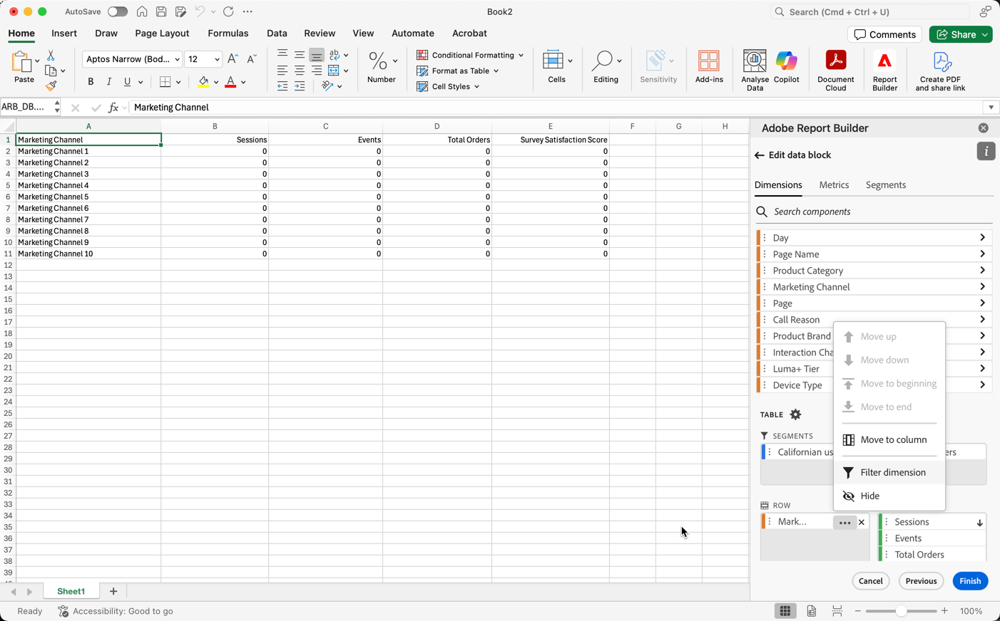

# Filterafmetingen

Door gebrek, keert elk afmetingspunt in de lijst top 10 punten voor die afmeting terug.

Om de afmetingspunten te veranderen die voor elke afmeting worden teruggekeerd

1. Selecteer een gegevensblok en klik op Gegevensblok bewerken in het deelvenster OPDRACHTEN.

1. Selecteer **[!UICONTROL Next]** om het tabblad Dimensies weer te geven.

1. Selecteer  naast een componentennaam in de lijst.

   

1. Selecteer **afmeting van de Filter** in pop-up menu om de **afmeting van de Filter** ruit te tonen.

1. Selecteer **populairste** of **Specifiek**.

   

1. Selecteer de gewenste opties op basis van het gekozen filtertype.

1. Klik **toepassen** om de filter toe te voegen.

   Report Builder geeft een melding weer ter bevestiging van het toegevoegde filter.

Houd de muisaanwijzer boven een dimensie om toegepaste filters weer te geven. De afmetingen met toegepaste filters tonen a  filterpictogram naast de naam van Dimension.

## Het filter en de sorteervolgorde wijzigen

Er wordt een pijl weergegeven naast de metrische waarde die wordt gebruikt om het gegevensblok te filteren en te sorteren. De richting van de pijl geeft aan of de metrische waarde in oplopende of aflopende volgorde wordt gesorteerd.

Als u de sorteerrichting wilt wijzigen, selecteert u de pijl naast de metrische waarde.

Om metrisch te veranderen die wordt gebruikt om het gegevensblok te filtreren en te sorteren,

1. Houd de muisaanwijzer boven de gewenste metrische component in de Tabelbouwer om aanvullende opties weer te geven.

2. Selecteer de pijl op aangewezen metrisch.

   

## Filtertype

Er zijn twee manieren om dimensiepunten te filteren: het populairste en Specifieke.

### Meest populair

Met de populairste optie kunt u dimensie-items dynamisch filteren op basis van metrische waarden. Het populairste filtreren keert de hoogste gerangschikte afmetingspunten terug die op metrische waarden worden gebaseerd. Standaard worden de eerste 10 dimensies weergegeven, gesorteerd op de eerste metrische waarde die aan het gegevensblok is toegevoegd.

**de opties van de Pagina en van Rijen**

Gebruik de **Pagina** en **Rijen** gebieden om gegevens in opeenvolgende groepen of pagina&#39;s te verdelen. Dit staat u toe om gerangschikte rijwaarden buiten de hoogste waarden in uw rapport te trekken. Deze functie is vooral handig voor het ophalen van gegevens boven de limiet van 50.000 rijen.

De standaardwaarde voor Pagina is 1 en voor Rijen is 10. Deze standaardinstellingen impliceren dat elke pagina 10 rijen gegevens heeft. Pagina 1 retourneert de bovenste 10 items, pagina 2 retourneert de volgende 10 items, enzovoort.

In de onderstaande tabel staan voorbeelden van pagina- en rijwaarden en de resulterende uitvoer.

| Pagina | Rij | Uitvoer |
|------|--------|----------------------|
| 1 | 10 | Meest 10 items |
| 2 | 10 | Punten 11-20 |
| 1 | 100 | Top 100 van items |
| 2 | 100 | Items 101-200 |
| 2 | 50.000 | Items 50.001-100.000 |

De minimum- en maximumwaarden zijn:

- Beginpagina: Min = 1, Max: 50 miljoen
- Aantal rijen: Min = 1, Max: 50.000

### Inclusief &quot;Geen waarde&quot;

In Customer Journey Analytics verzamelen sommige dimensies een item &#39;Geen waarde&#39;. Met dit filter kunt u deze waarden uitsluiten van rapporten. U kunt bijvoorbeeld een classificatie maken, zoals de classificatie Productnaam op basis van de sleutel Product SKU. Als een specifiek product-SKU niet is ingesteld met de specifieke productnaamclassificatie, wordt de productnaam ingesteld op &quot;geen waarde&quot;.

**[!UICONTROL Include "No value"]** is standaard geselecteerd. Schakel deze optie uit als u items zonder waarde wilt uitsluiten.

### Filteren op criteria

U kunt dimensie-items filteren op basis van de vraag of aan alle criteria is voldaan of aan alle criteria is voldaan.

Filtercriteria instellen

1. Selecteer een operator in de vervolgkeuzelijst.

   

1. Voer een waarde in het zoekveld in.

1. Selecteer  **[!UICONTROL Add row]** om de selectie te bevestigen en een ander criterium punt toe te voegen.

1. Selecteer  om een criterium punt te verwijderen.

   U kunt maximaal 10 criteria toevoegen.

### Specifieke filtering

Met de optie Specifiek kunt u een vaste lijst met dimensie-items maken voor elke dimensie. Gebruik het **Specifieke** filtrerende type om de nauwkeurige afmetingspunten te specificeren in uw filter te omvatten. U kunt items in een lijst of uit een reeks cellen selecteren.

#### Van lijst

1. Selecteer **van lijst** optie om afmetingspunten te zoeken en te selecteren.

   Wanneer u **van lijst** optie selecteert, is de lijst bevolkt met afmetingspunten met de meeste gebeurtenissen eerst.

   

   De **Beschikbare punten** lijst wordt bevolen van afmetingspunten met de meeste gebeurtenissen aan die met het minst.

1. Ga een onderzoekstermijn op **in voeg punt** gebied toe om de lijst te zoeken.

1. Om naar een punt te zoeken niet inbegrepen in de laatste 90 dagen van gegevens, klik **tonen punten voor de laatste 6 maanden** om het onderzoek uit te breiden.

   

   Na gegevens van de afgelopen 6 maanden laden, werkt Report Builder de verbinding aan **punten voor laatste 18 maanden** bij.

1. Selecteer een dimensie-item.

   De geselecteerde afmetingspunten worden automatisch toegevoegd aan de **Geselecteerde punten** lijst.

   

   Als u een item uit de lijst wilt verwijderen, klikt u op het pictogram Verwijderen om het item uit de lijst te verwijderen.

   Als u een item in de lijst wilt verplaatsen, sleept u het item en zet u het neer of klikt u ... om het verplaatsingsmenu weer te geven.

   

1. Klik **toepassen**

   Report Builder werkt de lijst bij om het specifieke filter te tonen u toepaste.

#### Uit celbereik

Selecteer **van waaier van cellen** optie om een waaier van cel te kiezen die de lijst van dimensiepunten bevatten om aan te passen.

Houd rekening met de volgende beperkingen wanneer u een bereik cellen selecteert:

- Het bereik moet ten minste één cel bevatten.
- Het bereik kan niet meer dan 50.000 cellen bevatten.
- Het bereik moet in één ononderbroken rij of kolom staan.

Uw selectie kan lege cellen of cellen met waarden bevatten die niet met een specifiek afmetingspunt aanpassen.

### Van het lusje van Dimensies in de Bouwer van de Lijst

Van het **lusje van Dimensies**, klik het chevron pictogram naast een afmetingsnaam om de lijst van afmetingspunten te bekijken.

U kunt punten op de **Lijst** slepen en laten vallen of een puntnaam tweemaal klikken om het aan de **Bouwer van de Lijst** toe te voegen.
