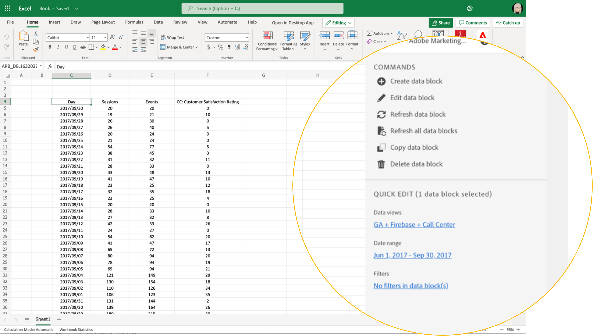

# Report Builder Hub

Gebruik de hub van Report Builder om, gegevensblokken tot stand te brengen bij te werken of te schrappen.

De hub Report Builder bevat de deelvensters OPDRACHTEN en SNEL BEWERKEN.



## Deelvenster OPDRACHTEN

Gebruik het deelvenster OPDRACHTEN voor toegang tot opdrachten die compatibel zijn met de geselecteerde cellen of een vorige handeling.


### Opdrachten

| Weergegeven opdrachten | Beschikbaar als... | Doel |
|------|------------------|--------|
| Gegevensblok maken | Één of meerdere cellen wordt geselecteerd in het werkboek. | Wordt gebruikt om een gegevensblok te maken |
| Gegevensblok bewerken | De geselecteerde cel of het geselecteerde celbereik maakt slechts deel uit van één gegevensblok. | Wordt gebruikt om een gegevensblok te bewerken |
| Gegevensblok vernieuwen | De selectie bevat ten minste één gegevensblok. De opdracht vernieuwt alleen de gegevensblokken in de selectie. | Wordt gebruikt om een of meer gegevensblokken te vernieuwen |
| Alle gegevensblokken vernieuwen | Het werkboek bevat één of meerdere gegevensblokken. | Gebruikt om ALLE gegevensblokken in het werkboek te verfrissen |
| Gegevensblok kopiëren | De geselecteerde cel of het geselecteerde celbereik maakt deel uit van een of meer gegevensblokken. | Wordt gebruikt om een gegevensblok te kopiëren |
| Gegevensblok verwijderen | De geselecteerde cel of het geselecteerde celbereik maakt slechts deel uit van één gegevensblok. | Wordt gebruikt om een gegevensblok te verwijderen |

## Deelvenster SNEL BEWERKEN

Wanneer u een of meer gegevensblokken in een spreadsheet selecteert, geeft Report Builder het deelvenster SNEL BEWERKEN weer. U kunt het deelvenster SNEL BEWERKEN gebruiken om parameters in één gegevensblok te wijzigen of om parameters in meerdere gegevensblokken tegelijk te wijzigen.


De wijzigingen die u hebt aangebracht met de secties Snel bewerken zijn van toepassing op alle geselecteerde gegevensblokken.

### Gegevensweergaven

Gegevensblokken trekken gegevens uit een geselecteerde gegevensweergave. Als er meerdere gegevensblokken zijn geselecteerd in een werkblad en deze gegevens niet uit dezelfde gegevensweergave halen, wordt met de koppeling **Gegevensweergaven** *Multiple* weergegeven.

Wanneer u de gegevensweergave wijzigt, nemen alle gegevensblokken in de selectie de nieuwe gegevensweergave over. Componenten in het gegevensblok komen overeen met de nieuwe gegevensweergave op basis van bijvoorbeeld een id die overeenkomt met ```evars```). Als een component niet in een gegevensblok wordt gevonden, wordt een waarschuwingsbericht getoond en de component wordt verwijderd uit het gegevensblok.

Als u de gegevensweergave wilt wijzigen, selecteert u een nieuwe gegevensweergave in het keuzemenu.


### Datumbereik

**Het datumbereik** geeft het datumbereik voor de geselecteerde gegevensblokken weer. Als er meerdere gegevensblokken met meerdere datumbereiken zijn geselecteerd, wordt met de koppeling **Datumbereik** *Multiple* weergegeven.

### Filters

Met de koppeling **Filters** wordt een overzicht weergegeven van de filters die worden gebruikt door de geselecteerde gegevensblokken. Als er meerdere gegevensblokken zijn geselecteerd met meerdere filters toegepast, wordt met de koppeling **Filters** *Multiple* weergegeven.
