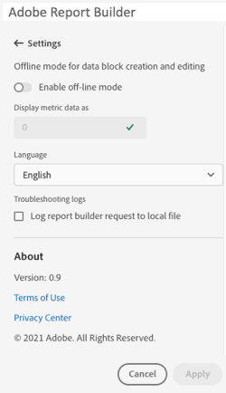

# Report Builder-instellingen

Met het deelvenster **Instellingen** kunt u instellingen op toepassingsniveau configureren, zoals de taal die wordt weergegeven door de gebruikersinterface, of u nu wel of niet wilt werken in de offline modus. De instellingen worden direct toegepast en ingesteld voor alle toekomstige sessies totdat ze worden gewijzigd.

Report Builder-instellingen wijzigen

1. Klik op het pictogram **Instellingen**.

1. Breng wijzigingen aan in de modus Off-line inschakelen, selecteer een taal of schakel de loginstellingen van Problemen oplossen in.

1. Klik **Toepassen**.

   

## Offlinemodus

Bij het maken en bewerken van een gegevensblok in de offline modus worden geen gegevens opgehaald. In plaats daarvan worden simulatiegegevens gebruikt, zodat u snel een gegevensblok kunt maken en bewerken zonder te wachten op het uitvoeren van de aanvraag. Als u weer online bent, vernieuwt de opdracht *Gegevensblok vernieuwen* of *Alle gegevensblokken vernieuwen* de gegevensblokken die u met werkelijke gegevens hebt gemaakt.

Offlinemodus inschakelen

1. Klik op het pictogram **Instellingen**.

1. Selecteer **Offlinemodus inschakelen**.

1. Voer een positief geheel getal in het veld **Metrische gegevens weergeven als**.

1. Klik **Toepassen**.

## Taal

U kunt de taal voor Report Builder UI kiezen. Alle ondersteunde Adobe Analytics-talen zijn beschikbaar.

Om de taal te selecteren die in Report Builder UI wordt gebruikt

1. Klik op Instellingen.

1. Selecteer een taal in het keuzemenu **Taal**.

   

1. Klik **Toepassen.**

## Problemen oplossen

Gebruik de instelling voor probleemoplossing om alle client-/servergegevens te registreren bij een lokaal bestand. Gebruik deze optie om ondersteuningstickets op te lossen.

Om de optie van het Oplossen van problemen toe te laten, selecteer **verzoek van de rapportbouwer van het Logboek aan lokaal dossier**.
