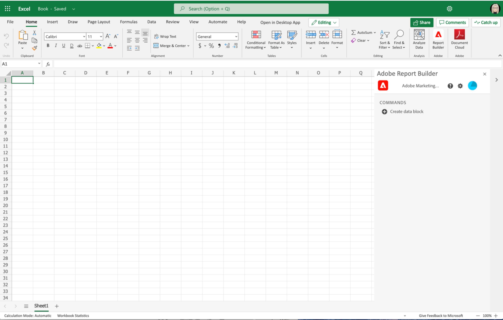

# Report Builder instellen

In dit artikel worden de vereisten beschreven voor het gebruik van Report Builder for Customer Journey Analytics in Microsoft Excel. En hoe te om toe:voegen-binnen te installeren en te opstelling.

## Vereisten

Report Builder for Customer Journey Analytics wordt ondersteund door de volgende besturingssystemen en webbrowsers.

### macOS

- macOS versie 10.x of hoger
- Alle Excel-versies

### Windows

- Windows 10, versie 1904 of hoger
- Excel-versie 2106 of hoger

  Alle gebruikers van Windows Desktop Excel moeten Microsoft Edge Webview2 installeren om toe:voegen-binnen te gebruiken. Installeren:

   1. Ga naar <https://developer.microsoft.com/en-us/microsoft-edge/webview2/> .
   1. Selecteer en download de gewenste versie van **[!UICONTROL Evergreen Standalone Installer]** voor uw platform.
   1. Voer het installatieprogramma uit en volg de installatieaanwijzingen.

### Webkantoor

- Ondersteunt alle browsers en versies.

## Report Builder Excel-invoegtoepassing

Installeer de invoegtoepassing Report Builder Excel als u Report Builder for Customer Journey Analytics wilt gebruiken. Zodra u toe:voegen-binnen Report Builder Excel installeert, kunt u tot Report Builder van binnen een open werkboek van Excel toegang hebben.

### De Report Builder Add-in downloaden en installeren

De Report Builder Add-in downloaden en installeren

1. Start Excel en open een nieuw werkboek.

1. Selecteer **[!UICONTROL Insert]** > **[!UICONTROL Add-ins]** > **[!UICONTROL Get Add-ins]** in het hoofdmenu.

1. Selecteer de tab **[!UICONTROL Store]** in het dialoogvenster Office Add-ins.

1. Zoek naar `Report Builder` en selecteer **[!UICONTROL Add]**.

1. Selecteer **[!UICONTROL Continue]** in het dialoogvenster Licentievoorwaarden en privacybeleid.

Als de tab **[!UICONTROL Store]** niet wordt weergegeven:

1. Selecteer in Excel **[!UICONTROL File]** > **[!UICONTROL Account]** > **[!UICONTROL Manage Settings]** in het hoofdmenu.

1. Schakel het vakje naast **[!UICONTROL Enable optional connected experiences]** in.

1. Start Excel opnieuw.

Als uw organisatie de toegang tot de Microsoft Store blokkeert:

- Vraag uw IT- of beveiligingsteam om goedkeuring voor de Report Builder-add-in. Nadat goedkeuring is verleend, selecteert u in het dialoogvenster Office **[!UICONTROL Add-ins]** het tabblad **[!UICONTROL Admin Managed]** .

  {zoomable="yes"}

Na het installeren van toe:voegen-binnen Report Builder, wordt het  **[!UICONTROL Report Builder]** pictogram getoond in het lint van Excel onder **[!UICONTROL Home]** tabel.

{zoomable="yes"}

## Aanmelden bij Report Builder

Nadat u de Report Builder for Excel-invoegtoepassing voor uw besturingssysteem hebt geïnstalleerd, voert u de volgende stappen uit om u aan te melden bij Report Builder.

1. Open een werkboek van Excel.

1. Selecteer  **[!UICONTROL Report Builder]** om Report Builder te lanceren.

1. Selecteer in de werkbalk Adobe Report Builder de optie **[!UICONTROL Login]** .

   {zoomable="yes"}

1. Voer je Adobe-accountgegevens in. Je accountgegevens moeten overeenkomen met je Customer Journey Analytics-gegevens.

   {zoomable="yes"}

Nadat u zich hebt aangemeld, worden het aanmeldingspictogram en de organisatie boven in het deelvenster weergegeven

## Organisaties wisselen

Wanneer u zich voor het eerst aanmeldt, wordt u aangemeld bij de standaardorganisatie die is toegewezen aan uw profiel of aan de organisatie die u hebt geselecteerd als onderdeel van de aanmeldstroom.

1. Selecteer de naam van de organisatie die wordt weergegeven wanneer u zich aanmeldt.

1. Selecteer een organisatie in de lijst met beschikbare organisaties. Alleen organisaties waartoe u toegang hebt, worden vermeld.

   {zoomable="yes"}

## Afmelden

Afmelden bij Report Builder:

1. Wijzigingen in geopende werkboeken opslaan.

1. Selecteer het avatar pictogram om uw gebruikersprofiel te tonen.

   {zoomable="yes"}

1. Selecteer **[!UICONTROL Sign Out]** .
