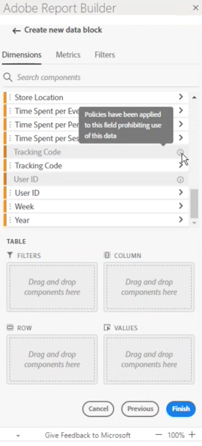

# Beperkte labels in Report Builder

Over het algemeen worden aan gegevensbeheer gerelateerde instellingen in Customer Journey Analytics overgenomen van Adobe Experience Platform. Dankzij de integratie tussen Customer Journey Analytics en Adobe Experience Platform Data Governance kunnen gevoelige gegevens van Customers Journey Analytics worden geëtiketteerd en kan het privacybeleid worden gehandhaafd.

De etiketten en het beleid van de privacy die op datasets werden gecreeerd die door Experience Platform worden verbruikt kunnen in het werkschema van de de gegevensmeningen van de Customer Journey Analytics worden bezocht. Deze labels stoppen of waarschuwen gebruikers die metriek en/of afmetingen van gevoelige velden maken. Voor informatie over datasets, zie [Overzicht van gegevenssets](https://experienceleague.adobe.com/docs/experience-platform/catalog/datasets/overview.html)

Wanneer gegevens uit Customer Journey Analytics worden geëxporteerd (via rapportage, export, API, enz.), worden bovendien waarschuwingen of labels toegevoegd om gebruikers te laten weten dat een rapport gevoelige informatie bevat die op een specifieke manier moet worden behandeld.

Dankzij deze integratie kunt u de compatibiliteit eenvoudiger beheren. Gegevensstewards in uw organisatie kunnen beleid plaatsen om gebruik te beperken. Dientengevolge, kunnen uw gebruikers van de Customer Journey Analytics gegevens betrouwbaarder gebruiken, wetend dat het aan beleid voldoet dat door gegevens eerder wordt bepaald.

Zie voor meer informatie [Customer Journey Analytics en gegevensbeheer](https://experienceleague.adobe.com/docs/analytics-platform/using/cja-privacy/privacy-overview.html)

## Beperkte gegevens weergeven in Report Builder

Er worden twee door de Adobe gedefinieerde beleidsregels weergegeven in de Customer Journey Analytics die van invloed zijn op rapportage, downloaden en delen:

* Beleid voor analyse afdwingen
* Downloadbeleid afdwingen

Componenten die door dit beleid worden beïnvloed, worden grijs weergegeven. Wanneer u de muisaanwijzer boven een component waarop een beleid is toegepast, wordt een notitie weergegeven om het volgende aan te geven: **Het beleid is op dit gebied toegepast waarbij het gebruik van deze gegevens wordt verboden.** Zie voor meer informatie [Labels en beleid](https://experienceleague.adobe.com/docs/analytics-platform/using/cja-dataviews/data-governance.html).

## Rapporten met beperkte gegevens bijwerken

In gevallen waar een gebruiker een rapport van de Report Builder met gegevenselementen creeerde die later worden beperkt, wanneer het rapport wordt verfrist, wordt een foutenmelding getoond.

