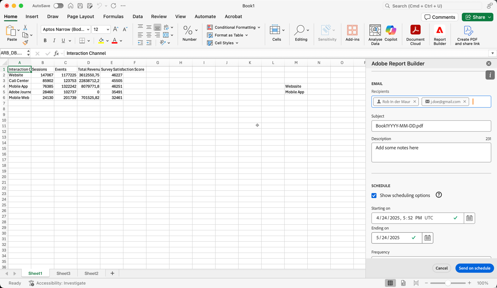

# Workbooks plannen

Nadat u uw werkboek en voltooide uw analyse bewaarde, kunt u uw werkboek met anderen op uw team delen gebruikend de het plannen eigenschap. De planningseigenschap staat u toe om een programma tot stand te brengen dat automatisch de gegevens in het werkboek vernieuwt. En e-mailt het het werkboekdossier van Excel als gehechtheid aan uw gespecificeerd publiek op een specifieke datum en een tijd. Door een schema in te stellen, krijgen ontvangers automatisch regelmatige updates. U kunt de planningseigenschap ook gebruiken om het werkboek eens uit te sturen zonder automatische updates te plannen.

U kunt veelvoudige programma&#39;s voor één enkel werkboek tot stand brengen. Bijvoorbeeld, creeert u twee programma&#39;s om een werkboek naar uw team dagelijks en naar uw manager één keer per week te verzenden.

De planningseigenschap staat u ook aan de bescherming van het opstellingswachtwoord voor een werkboek toe en geeft eerder geplande werkboeken uit.

>[!BEGINSHADEBOX]

Zie  [ Werkboeken van het Programma ](https://video.tv.adobe.com/v/3413079/?quality=12&learn=on){target="_blank"} voor een demo video.

>[!ENDSHADEBOX]

## Een werkboek plannen

Een werkboek plannen:

1. Selecteer **[!UICONTROL Schedule]** in de hub van Report Builder om een programma tot stand te brengen zodat u een dossier van werkboekExcel (.xlsx) aan een individu of een groep kunt automatisch verdelen.

   {zoomable="yes"}

1. Selecteer **[!UICONTROL Schedule Workbook]** of  toe om een nieuw gepland werkboek tot stand te brengen.

   {zoomable="yes"}

   De het plannen ruit toont sommige vooraf bepaalde informatie over het werkboek zoals de werkboeknaam en de laatste datum dat het werkboek werd gewijzigd.

### Bestand

In de sectie **[!UICONTROL File]** geeft u details over het bestandstype, de naam en een wachtwoord op om het bestand te beveiligen.

{zoomable="yes"}

1. Gebruik  om het huidige werkboek te selecteren, als niet reeds geselecteerd.

1. (Optioneel) Voer een **[!UICONTROL File name]** in.

   De naam van het werkboekdossier blijft aan de naam van het werkboek in gebreke maar u kunt de dossiernaam veranderen als u wilt.

1. Selecteer een **[!UICONTROL File type]** .

   * **[!UICONTROL Excel]**
   * **[!UICONTROL PDF]**
   * **[!UICONTROL CSV]**

   Wanneer u **[!UICONTROL CSV]** selecteert, houd er rekening mee dat het geplande werkboek als postgehechtheid wordt verzonden. Sommige e-mailbeheerders van bedrijven kunnen e-mailberichten blokkeren met ZIP-bijlagen. U ziet een waarschuwing op basis hiervan.

1. (Optioneel) Selecteer **[!UICONTROL Append time-stamp to file name]** .

   U kunt een timestamp aan het dossier toevoegen - noem om de datum te identificeren het werkboek werd bijgewerkt. Een timestamp is nuttig om te zien welke versie van een werkboek op een specifieke datum werd verzonden. Als deze optie is geselecteerd, kunt u kiezen tussen:

   * **[!UICONTROL ISO Date format]** . Dit betekent dat `YYYY-MM-DD` aan de bestandsnaam wordt toegevoegd.
   * **[!UICONTROL ISO Date format + time stamp]** . Dit betekent dat `YYYY-MM-DD_HH-MM-SS` aan de bestandsnaam wordt toegevoegd.

<!-- Does no longer seem to be an option? 
1. (Optional) Select **.zip compression** to compress the file and set up password protection on the file.

    When you make this selection, you're prompted to enter a password to open the file. This is helpful if you have concerns about data security and you want to password protect the workbook. Protecting the file with a password requires you to select **.zip compression**. The password must be at least 8 characters and contain a number and a special character.

    {zoomable="yes"}{width="55%"}
-->

1. Voer een wachtwoord in **[!UICONTROL Password protect the workbook]** in. Voor een geldig wachtwoord zijn ten minste 8 tekens nodig, een getal en een speciaal teken. Selecteer  om het wachtwoord en  te tonen om het wachtwoord (gebrek) te verbergen.

### E-mail

In de sectie **[!UICONTROL Email]** geeft u de ontvangers, het onderwerp en de beschrijving van de e-mail op.

{zoomable="yes"}

1. Ga **Ontvangers** in. U kunt de naam invoeren van een persoon die in uw organisatie wordt herkend. U kunt ook een e-mailadres invoeren van een persoon die zich buiten uw organisatie bevindt.

1. Ga het **Onderwerp** van e-mail en een beschrijving voor uw ontvangers in. Het onderwerp blijft aan de naam van het werkboekdossier in gebreke maar u kunt het onderwerp wijzigen indien nodig. U kunt details in de beschrijvingssectie toevoegen.

1. U kunt desgewenst een beschrijving invoeren in het tekstgebied **[!UICONTROL Description]** .

### Schema

In de **[!UICONTROL Schedule]** sectie, kunt u het programma bepalen om de e-mails met het werkboek naar uw ontvangers te verzenden.

{zoomable="yes"}

1. Selecteer **[!UICONTROL Show scheduling options]** om een schema te definiëren.

1. Voer een begindatum in in **[!UICONTROL Starting on]** . Alternatief, selecteer  om een begindatum van de kalender te kiezen.

1. Voer een einddatum in in **[!UICONTROL Ending on]** . Alternatief, selecteer  om een einddatum van de kalender te kiezen.

1. Selecteer een **[!UICONTROL Frequency]** . Afhankelijk van de geselecteerde frequentie, hebt u extra opties. Zie onderstaande tabel.

   | Frequentie | Opties |
   |---|---|
   | **[!UICONTROL Send hourly]** | Voer een waarde in voor **[!UICONTROL Send every number of hours]** . |
   | **[!UICONTROL Send daily]** | Selecteer een **[!UICONTROL Daily frequency]**: **[!UICONTROL Send every day]**, **[!UICONTROL Send every weekday]** of **[!UICONTROL Custom frequency]** .  Als u **[!UICONTROL Custom frequency]** selecteert, ga een waarde voor **[!UICONTROL Send every number of days]** in. |
   | **[!UICONTROL Send weekly]** | Voer een waarde in voor **[!UICONTROL Send every number of weeks]** . Selecteer een **[!UICONTROL Day of week]** . |
   | **[!UICONTROL Send monthly by day of the week]** | Selecteer een **[!UICONTROL Day of week]** en een **[!UICONTROL Week of month]** . |
   | **[!UICONTROL Send monthly by day of the month]** | Selecteer een waarde in **[!UICONTROL Send on this day of the month]** . |
   | **[!UICONTROL Send yearly by day of the month]** | Selecteer een **[!UICONTROL Day of week]** , selecteer een **[!UICONTROL Week of month]** en selecteer een **[!UICONTROL Monthly of year]** . |
   | **[!UICONTROL Send yearly by specific date]** | Selecteer een **[!UICONTROL Month of year]** en selecteer een waarde in **[!UICONTROL Send on this day of the month]** . |

### Verzenden

Om het werkboek te verzenden:

* Als u geen schema gebruikend **[!UICONTROL Show scheduling options]** hebt bepaald, uitgezocht **[!UICONTROL Send now]** om het werkboek per e-mail onmiddellijk te verzenden.
* Als u een programma gebruikend **[!UICONTROL Show scheduling options]** hebt bepaald, uitgezocht **[!UICONTROL Send on schedule]** om het werkboek door e-mail te verzenden gebruikend het programma u bepaalde.

In beide gevallen ziet u een bevestigingstoets onder aan de Report Builder-hub.

Als u het verzenden van het werkboek wilt annuleren, selecteert u **[!UICONTROL Cancel]** .

## Geplande werkboeken weergeven en beheren

U kunt alle geplande werkboeken weergeven en beheren op het tabblad **[!UICONTROL Workbooks]** .

1. Selecteren **[!UICONTROL Schedule]** in de Report Builder-hub

1. Selecteer de tab **[!UICONTROL Workbooks]** . U ziet een lijst van alle geplande werkboeken.

   {zoomable="yes"}

   U kunt over het pictogram bewegen om het statuut van een gepland werkboek te zien.

   Het gebruik  aan onderzoek naar specifieke geplande werkboeken.
Gebruik  om te bepalen welke kolommen te tonen.

1. Selecteer een of meer werkboeken.

   {zoomable="yes"}

   De volgende opties zijn beschikbaar:

   | Optie | Beschrijving |
   |---|---|
   |  uit | Bewerk het schema voor een geselecteerd werkboek. |
   |  | De geschiedenis van geselecteerde werkboeken weergeven. |
   |  | Onderbreek het schema van geselecteerde werkboeken. |
   |  | Hervat het schema van geselecteerde werkboeken. |
   |  | Download het geselecteerde werkboek in een nieuw werkboek. |
   |  | Verwijder het schema van geselecteerde werkboeken. |

## Geschiedenis en status van geplande werkboeken

U kunt de geschiedenis en status van geplande werkboeken weergeven op het tabblad **[!UICONTROL History]** .

1. Selecteer **[!UICONTROL Schedule]** in de hub van Report Builder.

1. Selecteer de tab **[!UICONTROL History]** . U ziet een lijst van alle geplande werkboeken.

   {zoomable="yes"}

   Het gebruik  aan onderzoek naar specifieke werkboeken in de lijst.
Gebruik  om te bepalen welke kolommen te tonen.

   Op het tabblad **[!UICONTROL History]** kunt u de status van elke geplande taak controleren. Een afzonderlijke rij documenteert de statusverandering voor elke geplande taak.

   * A  wijst erop dat het werkboek met succes werd verzonden.
   * A  wijst erop dat een fout voorkwam.

Alternatief, kunt u  voor één of meerdere geselecteerde werkboeken op het **[!UICONTROL Workbooks]** lusje selecteren. Deze actie toont het **[!UICONTROL History]** lusje met een lijst door uw selectie wordt gefiltreerd die. Selecteer  om een filter te verwijderen.
