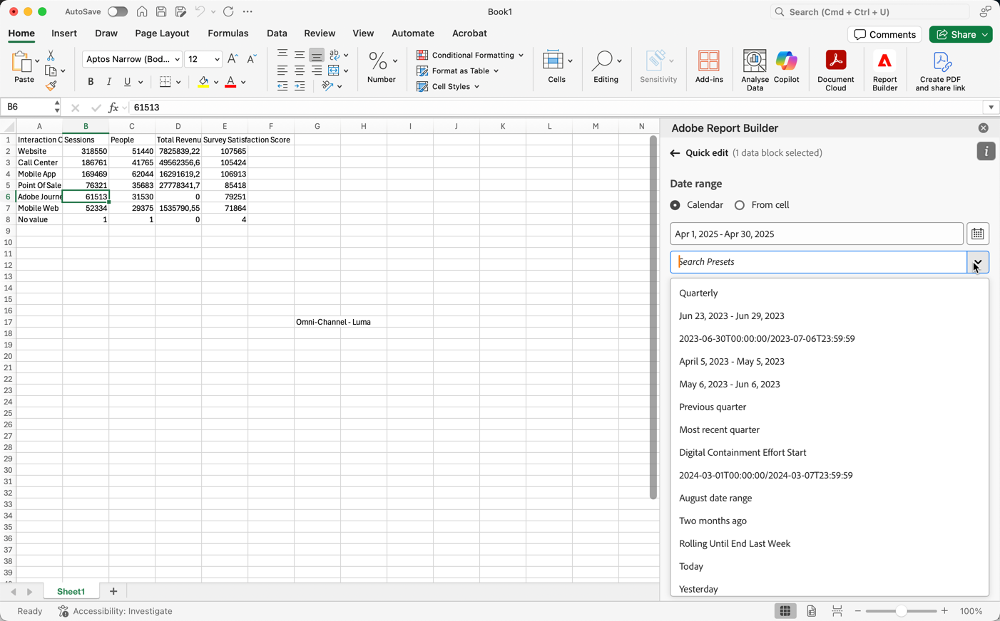

# Een datumbereik selecteren

Het datumbereik van een bestaand gegevensblok wijzigen:

- Selecteer **[!UICONTROL Edit a data block]** of
- Selecteer de koppeling **[!UICONTROL Date range]** in **[!UICONTROL Quick edit]** .

Gebruik de volgende opties om een datumbereik voor een gegevensblok te wijzigen.

## Kalender

Met de optie **[!UICONTROL Calendar]** kunt u statische of verschuivende datums maken met behulp van de volgende opties:

### Datumbereik

In het veld Datumbereik wordt het huidige datumbereik voor de gegevensblokaanvraag weergegeven. U kunt data direct ingaan of  gebruiken om een datumwaaier te specificeren.

{zoomable="yes"}

### Voorinstellingen

Selecteer een voorinstelling in het keuzemenu met voorinstellingen. U kunt ook tekst invoeren om naar voorinstellingen te zoeken.

{zoomable="yes"}

Het keuzemenu met voorinstellingen bevat een standaardset vooraf ingestelde datumbereiken en componenten voor het datumbereik voor een gegevensweergave die u hebt opgeslagen of een gegevensweergave die met u is gedeeld.

### Roldatums

Roldatums definiëren:

{zoomable="yes"}

1. Selecteer **[!UICONTROL Use rolling dates]** om de logica voor een roldatumdefinitie te bepalen. U kunt de tekst tussen haakjes selecteren (bijvoorbeeld **[!UICONTROL fixed start - rolling daily]** ) om het deelvenster uit te breiden en details voor **[!UICONTROL Start]** en **[!UICONTROL End]** op te geven.

1. Selecteer **[!UICONTROL Start of]**, **[!UICONTROL End of]** of **[!UICONTROL Fixed day]** .

   - Wanneer u **[!UICONTROL Start of]** of **[!UICONTROL End of]** hebt geselecteerd, kunt u een volledige expressie maken. Bijvoorbeeld: **[!UICONTROL End of]** **[!UICONTROL current year]** **[!UICONTROL plus]** `1` **[!UICONTROL day]** . Kies de juiste waarde voor elk afzonderlijk deel van de expressie.

      - Selecteer een waarde voor de huidige. Bijvoorbeeld **[!UICONTROL current year]** .
      - Selecteer een waarde voor een optionele extra berekening. Bijvoorbeeld **[!UICONTROL plus]** .
      - Geef een waarde op wanneer u een extra berekening hebt opgegeven. Bijvoorbeeld `1` .
      - Wanneer u een extra berekening hebt opgegeven, selecteert u de periode die u voor de berekening wilt gebruiken. Bijvoorbeeld **[!UICONTROL day]** .

   - Wanneer u **[!UICONTROL Fixed Day]** hebt geselecteerd, geeft u een vaste dag op of gebruikt u de kiezer om een dag te selecteren.

1. Selecteer **[!UICONTROL hide]** om de details voor het rollen datumberekening te verbergen.

### Aangepaste expressies

Met de optie voor aangepaste expressies kunt u het datumbereik wijzigen door een aangepaste expressie te maken of een rekenkundige formule in te voeren.

{zoomable="yes"}

1. Selecteer **[!UICONTROL Use rolling dates]**.

1. Selecteer **[!UICONTROL Use custom expression]**.

   Wanneer u **[!UICONTROL Use custom expression]** selecteert, worden de standaardbesturingselementen voor het schuifdatumbereik uitgeschakeld.

1. Ga a [&#x200B; douaneuitdrukking &#x200B;](#create-a-custom-expression) in.

1. Gebruik **[!UICONTROL Date preview]** om het resulterende datumbereik te verifiëren.

#### Een aangepaste expressie maken

1. Ga a [&#x200B; datumverwijzing &#x200B;](#date-references) in.

1. Voeg een facultatieve [&#x200B; datumexploitant &#x200B;](#date-operators) toe om de datum naar het verleden of de toekomst te bewegen.

U kunt een aangepaste expressie invoeren die meerdere operatoren bevat, zoals `tm-11m-1d` .

#### Datumverwijzingen

In de volgende tabel staan voorbeelden van datumverwijzingen.

| Datumverwijzing | Type | Beschrijving |
|----------------|--------------|----------------------------|
| `1/1/10` | Statische datum | Ingevoerd in ISO-datumnotatie |
| `td` | Roldatum | Begin van huidige dag |
| `tw` | Roldatum | Begin van huidige week |
| `tm` | Roldatum | Begin van huidige maand |
| `tq` | Roldatum | Begin van het lopende kwartaal |
| `ty` | Roldatum | Begin van het lopende jaar |

#### Datumoperatoren

In de volgende tabel worden voorbeelden van datumoperatoren weergegeven.

| Datumoperator | Eenheid | Beschrijving |
|----------------|---------|--------------------|
| `+6d` | Dag | 6 dagen toevoegen aan de datumreferentie |
| `+1w` | Week | Eén volledige week toevoegen aan de Date Reference |
| `-2m` | Maand | 2 volledige maanden aftrekken van de datumreferentie |
| `-4q` | Kwart | Vier kwartalen aftrekken van de datumreferentie |
| -`1y` | Jaar | Eén jaar aftrekken van de datumreferentie |

#### Datumexpressies

In de volgende tabel staan voorbeelden van datumexpressies.

| Datumuitdrukking | Betekenis |
|-----------------|--------------------------------------|
| `td` | Vandaag |
| `td-1w` | Eerste dag van vorige week |
| `tm-1d` | Laatste dag van vorige maand |
| `td-52w` | Dezelfde dag, 52 weken geleden |
| `tm-11m-1d` | Laatste dag van dezelfde maand vorig jaar |
| `"2020-09-06"` | Specifieke datum, 9 september 2020 |

## Datumbereik van cel

Het datumbereik kan worden opgegeven in werkbladcellen. Kies met de optie **[!UICONTROL Date range from cell]** de begin- en einddatum van het gegevensblok in de geselecteerde cellen. Wanneer u de **[!UICONTROL From cell]** optie selecteert, toont het paneel **[!UICONTROL From]** en **[!UICONTROL To]** gebieden waar u een celplaats kunt ingaan of  gebruiken om de huidige geselecteerde cel te kiezen.

{zoomable="yes"}

## Vandaag uitsluiten

Selecteer **[!UICONTROL Exclude today]** om vandaag uit te sluiten van een geselecteerd datumbereik. De huidige dag is uitgesloten van alle modi die worden gebruikt om een datumbereik te definiëren: kalender, roldatums of aangepaste expressies.

## Geldige datumbereiken

In de volgende lijst worden geldige datumbereikindelingen beschreven.

- De begin- en einddatum moeten de volgende notatie hebben: JJJJ-MM-DD

- De begindatum moet eerder zijn dan de einddatum. Beide datums kunnen op de toekomst worden ingesteld.

- Wanneer u roldatums gebruikt, moet de begindatum vandaag of in het verleden zijn. Als **[!UICONTROL Exclude today]** is geselecteerd, moet de begindag zich in het verleden bevinden.

- U kunt een statisch datumbereik maken dat is ingesteld voor de toekomst. Het kan bijvoorbeeld nodig zijn een datum in te stellen voor een marketingcampagne die volgende week wordt gestart. Deze optie leidt tot een werkboek controle voor een campagne vooruit.

## Het datumbereik wijzigen

U kunt het datumbereik van een bestaand gegevensblok bewerken.

1. Selecteer een cel in het gegevensblok.

- Selecteer **[!UICONTROL Edit data block]** in het deelvenster **[!UICONTROL Commands]** , of
- Selecteer de koppeling **[!UICONTROL Date range]** in het deelvenster **[!UICONTROL Quick edit]** .

1. Wijzig het datumbereik met een van de beschikbare opties voor datumselectie.

1. Selecteer **[!UICONTROL Apply]**.

Report Builder past het nieuwe datumbereik toe op alle gegevensblokken in de selectie.
