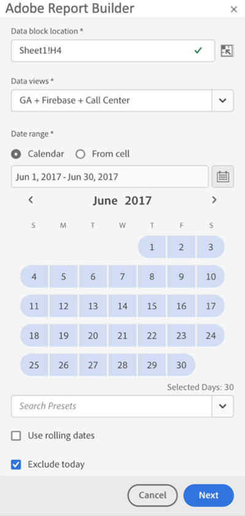

# Een datumbereik selecteren

Als u het datumbereik van een bestaand gegevensblok wilt wijzigen, selecteert u Een gegevensblok bewerken of gebruikt u het deelvenster SNEL BEWERKEN.

Gebruik de volgende opties om een datumbereik voor een gegevensblok te wijzigen.

**Kalender**

Met de kalender kunt u statische of roldatums maken met behulp van de volgende opties:

- Datumbereik
- Kalender
- Vervolgkeuzemenu Voorinstelling
- Modus Roldatum
- Expressies aanpassen


**Uit cel**

Met de optie Van cel kunt u verwijzen naar datums die zijn ingevoerd in werkbladcellen.

U kunt vandaag uitsluiten voor elk geselecteerd datumbereik.


## De kalender gebruiken

Wanneer u **Calendar** gebruikt, toont het gebied van de datumwaaier de huidige datumwaaier voor het verzoek van het gegevensblok. U kunt datums rechtstreeks invoeren in het datumbereikveld of een optie voor het selecteren van gegevensbereiken gebruiken.

### Datumbereik

Datums rechtstreeks invoeren in het veld Datumbereik

1. Klik op het veld voor het datumbereik naast het kalenderpictogram.

1. Voer de begin- en einddatum voor het datumbereik in.

### Kalender

Datums selecteren met de kalender

1. Klik op het kalenderpictogram om een maandkalender weer te geven.

1. Klik op een begindatum.

1. Klik op een einddatum.

Als u een datumbereik in omgekeerde volgorde wilt instellen, klikt u eerst op de einddatum en vervolgens op de begindatum.



### Vervolgkeuzelijst Voorinstelling

Het keuzemenu met voorinstellingen bevat een standaardset vooraf ingestelde datumbereiken en componenten voor het datumbereik voor een gegevensweergave die u hebt opgeslagen of een gegevensweergave die met u is gedeeld.

### Doorlopende datums

Met de optie voor roldatums kunt u een datumbereik selecteren met roldatums.

1. Selecteer **Roldatums gebruiken**.

1. Selecteer een roluitdrukking voor uw begin en of einddatum.

   

   **Begin van** — Hiermee kunt u het begin van een dag, week, maand, kwartaal of jaar selecteren.

   **Einde van**  - Hiermee kunt u het einde van een dag, week, maand, kwartaal of jaar selecteren.

   **Vaste dag**  - Hiermee kunt u een begin- of einddatum herstellen terwijl de andere datum wordt verschoven.

1. Kies dag, week, maand, kwartaal of jaar als de rolperiode.

   

1. Voeg dagen, weken, maanden, kwartalen of jaren toe of trek deze af vanaf de roldatum.

   

1. Klik op Volgende om het gegevensbereik te definiëren.

   Gebruik de datumvoorvertoning om te bevestigen dat het resulterende datumbereik het gewenste bereik is.

### Aangepaste expressies

Met de optie voor aangepaste expressies kunt u het datumbereik wijzigen door een aangepaste expressie te maken of een rekenkundige formule in te voeren.

1. Selecteer **Roldatums gebruiken**.

1. Selecteer **Aangepaste expressie gebruiken**.

   Als u de optie **Aangepaste expressie gebruiken** selecteert, worden de standaardbesturingselementen voor het schuifdatumbereik uitgeschakeld.

   

1. Voer een aangepaste expressie in.

   Zie **Datumexpressies** voor een voorbeeldlijst met aangepaste expressies.

1. Gebruik de datumvoorvertoning om te controleren of het resulterende datumbereik het gewenste bereik is.

#### Een aangepaste expressie maken

1. Voer een **Datumreferentie** in.

1. Voeg **Datumoperatoren** toe om de datum naar het verleden of de toekomst te verplaatsen.

U kunt een aangepaste datumexpressie invoeren die meerdere operatoren bevat, zoals ```tm-11m-1d```.

#### Datumverwijzingen

In de volgende tabel staan voorbeelden van datumverwijzingen.

| Datumverwijzing | Type | Beschrijving |
|----------------|--------------|----------------------------|
| 01-01-10 | Statische datum | Ingevoerd in ISO-datumnotatie |
| td | Roldatum | Begin van huidige dag |
| tw | Roldatum | Begin van huidige week |
| tm | Roldatum | Begin van huidige maand |
| tq | Roldatum | Begin van het lopende kwartaal |
| ty | Roldatum | Begin van het lopende jaar |

#### Datumoperatoren

In de volgende tabel worden voorbeelden van datumoperatoren weergegeven.

| Datumoperatoren | Eenheid | Beschrijving |
|----------------|---------|--------------------|
| +6d | Dag | 6 dagen toevoegen aan de datumreferentie |
| +1w | Week | Eén volledige week toevoegen aan de Date Reference |
| -2 m | Maand | 2 volledige maanden aftrekken van de datumreferentie |
| -4q | Kwart | Vier kwartalen aftrekken van de datumreferentie |
| -1 y | Jaar | Eén jaar aftrekken van de datumreferentie |

#### Datumexpressies

In de volgende tabel staan voorbeelden van datumexpressies.

| Datumuitdrukking | Betekenis |
|-----------------|--------------------------------------|
| td-1w | Eerste dag van vorige week |
| tm-1d | Laatste dag van vorige maand |
| td-52w | Dezelfde dag, 52 weken geleden |
| tm-11m-1d | Laatste dag van dezelfde maand vorig jaar |
| &quot;2020-09-06&quot; | 9 september 2020 |

## Datumbereik van cel

Het datumbereik kan worden opgegeven in werkbladcellen. Met de optie **Datumbereik van cel** kunt u de begin- en einddatum van het gegevensblok kiezen uit geselecteerde cellen. Als u de optie **Van cel** selecteert, worden in het deelvenster **Van** en **Naar** velden weergegeven waar u een cellocatie kunt invoeren.


## Vandaag uitsluiten

Kies de optie **Vandaag uitsluiten** om vandaag uit te sluiten van een geselecteerd datumbereik. Als u vandaag kiest voor opname, worden mogelijk onvolledige gegevens gebruikt voor vandaag.

Als deze optie is geselecteerd, sluit u de huidige dag uit van alle modi voor datumbereik, zoals kalender, roldatums of aangepaste expressies.****

## Geldige datumbereiken

In de volgende lijst worden geldige datumbereikindelingen beschreven.

- De begin- en einddatum moeten de volgende notatie hebben: YYYY-MM-DD

- De begindatum moet eerder zijn dan of gelijk zijn aan de einddatum. Beide datums kunnen op de toekomst worden ingesteld.

- Wanneer u roldatums gebruikt, moet de begindatum vandaag of in het verleden zijn. Het moet in het verleden zijn als **Vandaag uitsluiten** wordt gecontroleerd.

- U kunt een statisch datumbereik maken dat is ingesteld voor de toekomst. Het kan bijvoorbeeld nodig zijn een datum in te stellen voor een marketingcampagne die volgende week wordt gestart. Deze optie leidt tot een werkboek controle voor een campagne vooruit.

## Het datumbereik wijzigen

U kunt het datumbereik van een bestaand gegevensblok bewerken door Gegevensblok bewerken te selecteren in het deelvenster OPDRACHTEN of door de koppeling voor het datumbereik te selecteren in het deelvenster SNEL BEWERKEN.

**Gegevensblok**  bewerken: hiermee kunt u meerdere gegevensblokparameters bewerken, inclusief datumbereik, voor één gegevensblok.

**Snel bewerken: Datumbereik** : hiermee kunt u het datumbereik van een of meer gegevensblokken bewerken.

Het datumbereik bewerken via het deelvenster SNEL BEWERKEN

1. Selecteer cellen in een of meer gegevensblokken in een werkblad.

1. Klik op de koppeling **Datumbereik** in het deelvenster SNEL BEWERKEN.

1. Selecteer het datumbereik met een van de opties voor datumselectie.

1. Klik **Toepassen**.


Report Builder past het nieuwe datumbereik toe op alle gegevensblokken in de selectie.
