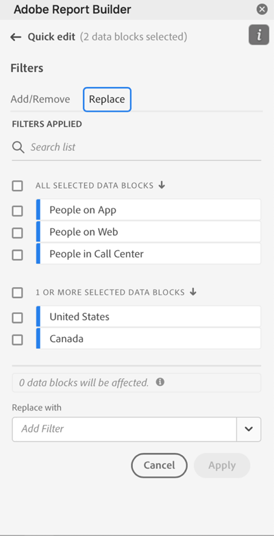

# Werken met filters in Report Builder

U kunt filters toepassen wanneer u een nieuw gegevensblok maakt of wanneer u de optie **Gegevensblok bewerken** in het deelvenster OPDRACHTEN.

## Filters toepassen op een gegevensblok

Als u een filter op het volledige gegevensblok wilt toepassen, dubbelklikt u op een filter of sleept u filters uit de lijst met componenten naar de sectie Filters van de tabel.

## Filters toepassen op individuele metriek

Als u filters wilt toepassen op afzonderlijke maateenheden, sleept u een filter naar een metrische waarde in de tabel. U kunt ook op de knop **...** pictogram rechts van metrisch in de ruit van de Lijst en selecteer dan **Metrisch filter**. Als u toegepaste filters wilt weergeven, plaatst u de muisaanwijzer boven of selecteert u een metrische waarde in het deelvenster Tabel. Metrische gegevens met toegepaste filters geven een filterpictogram weer.

<!--  -->

## Filters voor snel bewerken

Met het deelvenster Snel bewerken kunt u filters voor bestaande gegevensblokken toevoegen, verwijderen of vervangen.

Wanneer u een reeks cellen in het werkblad selecteert, wordt de **Filters** in het deelvenster Snel bewerken wordt een overzicht weergegeven van de filters die worden gebruikt door de gegevensblokken in die selectie.

Filters bewerken met het deelvenster Snel bewerken

1. Selecteer een bereik cellen uit een of meerdere gegevensblokken.

   

1. Klik op de koppeling Filters om het deelvenster Snel bewerken - Filters te starten.

   

### Een filter toevoegen of verwijderen

U kunt filters toevoegen of verwijderen met de opties Toevoegen/Verwijderen.

1. Selecteer **Toevoegen/verwijderen** in het deelvenster Quick edit-filters.

   Alle filters die op de geselecteerde gegevensblokken worden toegepast, worden vermeld in het deelvenster Quick Edit-filters. Filters die op alle gegevensblokken in de selectie zijn toegepast, worden onder de **Toegepast op alle geselecteerde gegevensblokken** kop. Filters die op enkele maar niet alle gegevensblokken zijn toegepast, worden vermeld onder de **Toegepast op 1 of meer geselecteerde gegevensblokken** kop.

   Wanneer de geselecteerde gegevensblokken meerdere filters bevatten, kunt u naar specifieke filters zoeken met de opdracht **Filter toevoegen** zoekveld.

   

1. Filters toevoegen door filters te selecteren in het menu **Filter toevoegen** vervolgkeuzelijst.

   De lijst met doorzoekbare filters bevat alle filters die toegankelijk zijn voor de gegevensweergaven die aanwezig zijn in een of meer van de geselecteerde gegevensblokken, en alle filters die algemeen beschikbaar zijn in de organisatie.

   Wanneer u een filter toevoegt, wordt het filter toegepast op alle gegevensblokken in de selectie.

1. Als u filters wilt verwijderen, klikt u op het verwijderpictogram **x** rechts van filters in het dialoogvenster **Toegepaste filters** lijst.

1. Klikken **Toepassen** om de wijzigingen op te slaan en terug te keren naar het hubdeelvenster.

   Report Builder geeft een bericht weer ter bevestiging van de wijzigingen van het toegepaste filter.

### Een filter vervangen

U kunt een bestaand filter vervangen door een ander filter om te wijzigen hoe de gegevens worden gefilterd.

1. Selecteer **Vervangen** in het deelvenster Quick edit-filters.

   

1. Gebruik de **Zoeklijst** zoekveld om specifieke filters te zoeken.

1. Kies een of meer filters die u wilt vervangen.

1. Zoek een of meer filters in het veld Vervangen door.

   Als u een filter selecteert, wordt dit toegevoegd aan de **Vervangen door**... lijst.

   

1. Klikken **Toepassen**.

   Report Builder werkt de lijst met filters bij om de vervanging te weerspiegelen.
